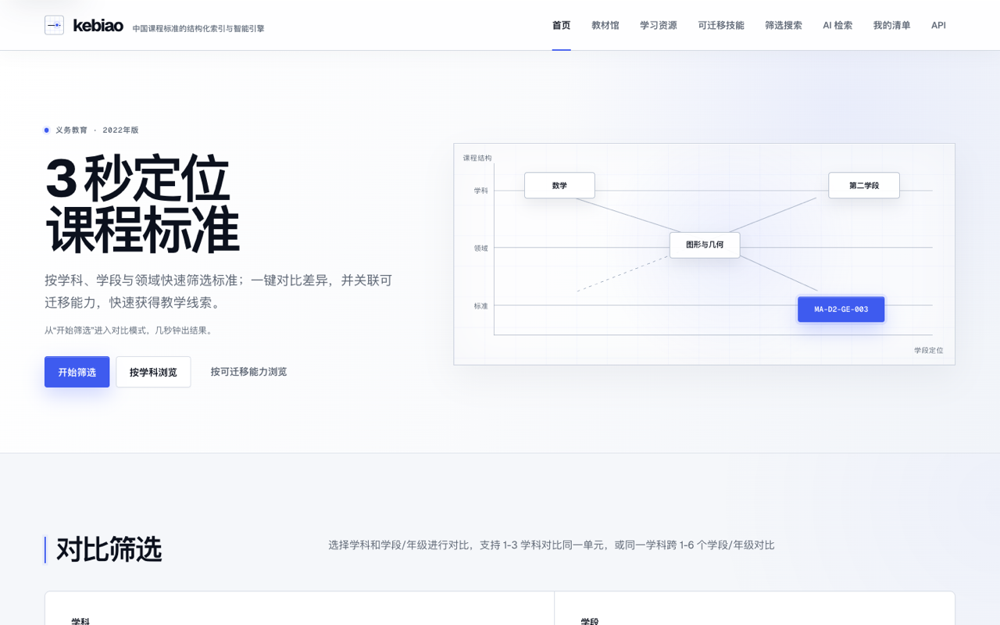
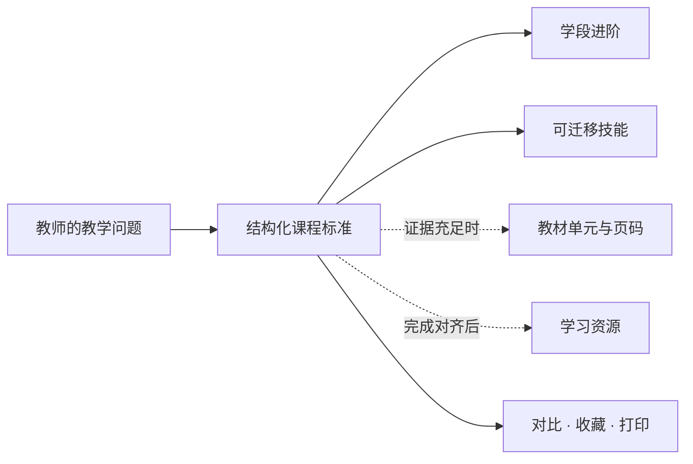
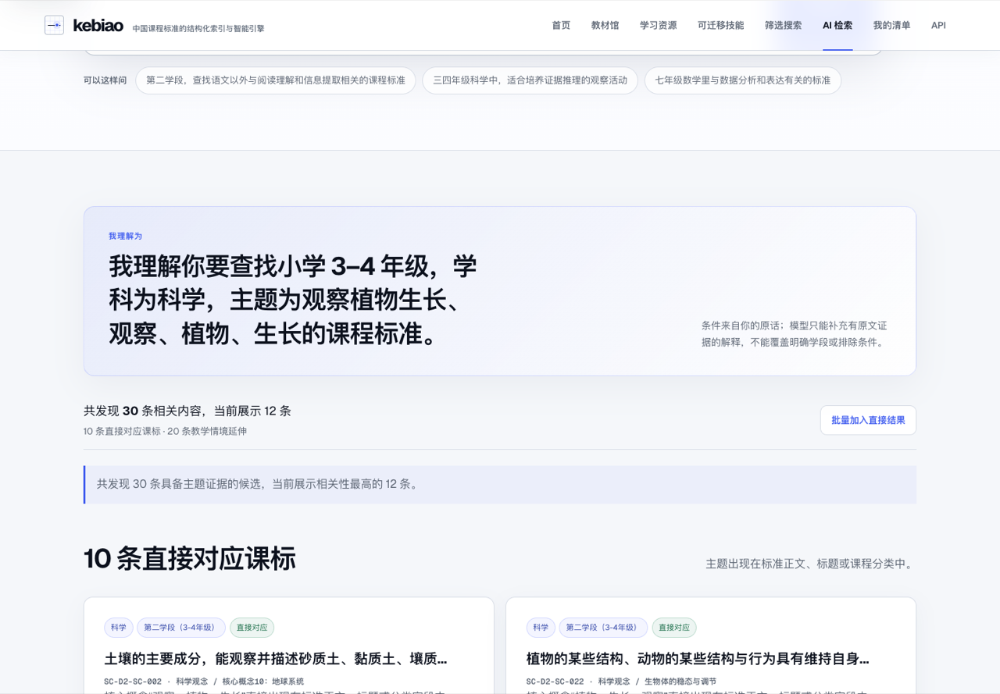
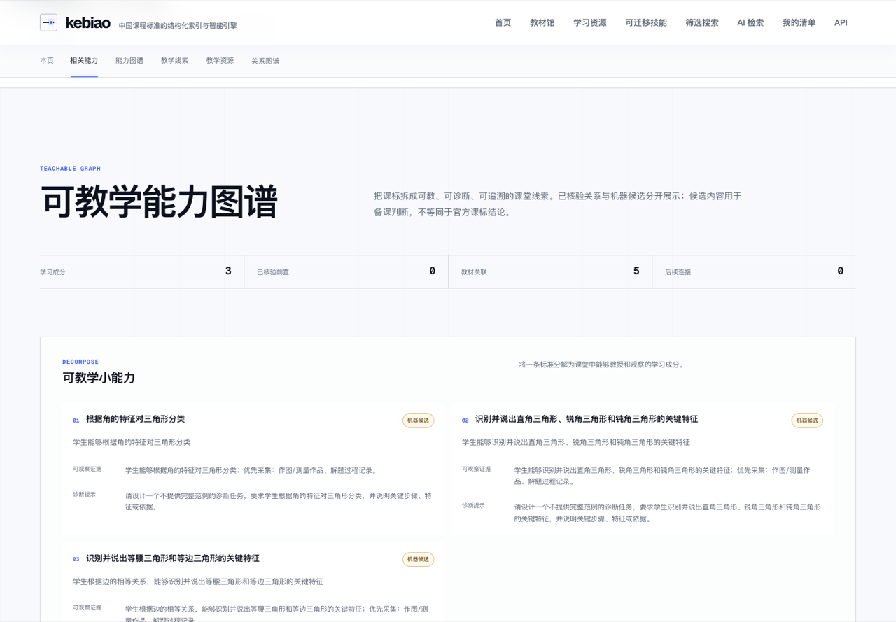
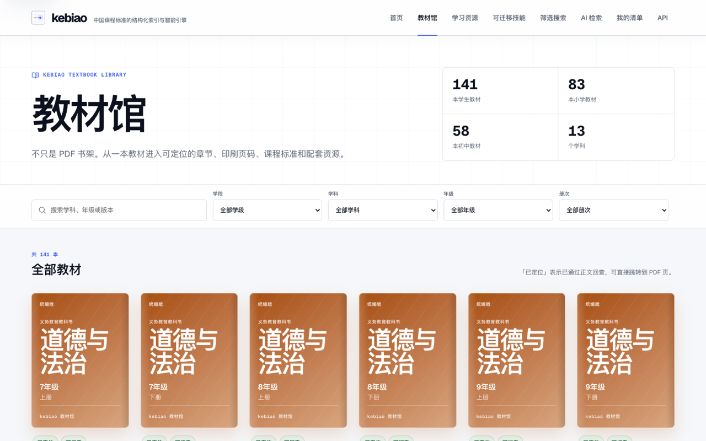
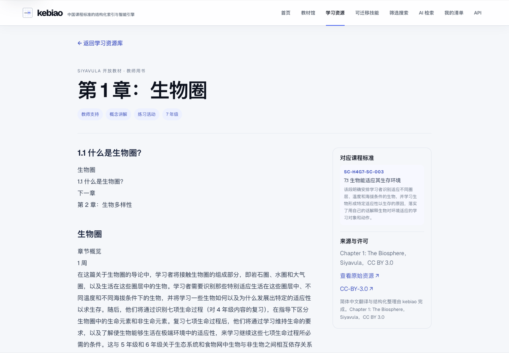

<p align="center">
  <a href="https://www.kebiao.org/">
    
  </a>
</p>

<h1 align="center">kebiao</h1>

<p align="center"><strong>让课程标准更容易找、更容易懂、更容易用于教学。</strong></p>
<p align="center">中国课程标准的结构化索引与智能引擎</p>
<p align="center"><sub>A structured, source-aware index and engine for China's 2022 compulsory-education curriculum standards.</sub></p>

<p align="center">
  <a href="https://www.kebiao.org/"><strong>在线使用</strong></a> ·
  <a href="https://www.kebiao.org/smart-search">用教学语言查课标</a> ·
  <a href="https://www.kebiao.org/feedback">反馈与共建</a>
</p>

<p align="center">
  <a href="https://github.com/NBrangerF/curriculum-standards-breakdown/actions/workflows/quality-gates.yml"></a>
  <a href="./public/data/data_version.json"></a>
  <a href="./public/data/manifest.json"></a>
  <a href="https://www.kebiao.org/skills"></a>
</p>

<p align="center">
  <a href="https://www.kebiao.org/">
    
  </a>
</p>

## 课程标准不该只停留在 PDF 里

为了找到一句课程标准，不必先在几十甚至几百页 PDF 里做“资料考古”。kebiao 将《义务教育课程方案和课程标准（2022 年版）》整理成可搜索、可筛选、可对比、可收藏的结构化索引，帮助教师快速找到对应标准，并看清来源、教材线索和审核状态。

备课时，老师真正需要解决的，往往不是“文件在哪里”，而是：

- 这节课对应哪些课程标准？
- 同一主题在不同年级如何递进，在不同学科有什么差异？
- 这条标准落在哪本教材、哪个单元，能用什么学习材料？
- 一份教学计划覆盖了什么，哪些匹配还需要我确认？

kebiao 以课程标准为主轴，把分散在文档、教材、资源和教学计划里的线索组织到同一条检索与复核路径中。目标很直接：让老师少花时间找依据，多花时间设计教学活动与评价。

## 你可以用 kebiao 做什么

| 当你需要…… | 可以这样做 |
| --- | --- |
| 快速找到相关课标 | 按学科、学段和可迁移技能[筛选课标](https://www.kebiao.org/search)，结果可按领域展开；也可以直接[用教学语言检索](https://www.kebiao.org/smart-search)主题和关键词。 |
| 比较学科与学段差异 | [并列对比](https://www.kebiao.org/#compare-filter) 1–3 个学科的同一学段，或同一学科跨 1–6 个学段/年级的变化。 |
| 理解一条标准的前后联系 | 在[标准详情](https://www.kebiao.org/standards/MA-D2-GE-003)中查看能力拆解、课程进阶、相邻标准和关系图谱，并查看前置关系候选及其核验状态。 |
| 对照教材与课标 | 在[教材馆](https://www.kebiao.org/textbooks)浏览 141 册小学与初中教材索引；对已完成正文回查的目录，可定位到具体 PDF 页。 |
| 找到可用的学习材料 | [浏览简体中文学习资源](https://www.kebiao.org/learning-resources)，在详情页查看来源、许可与已有的课标关联证据。 |
| 整理自己的备课线索 | 把标准保存在当前浏览器的[清单](https://www.kebiao.org/collections)中，导入或导出 JSON，并生成适合打印的版本。 |
| 复核教学计划与课标的关系 | 在[预览工作台](https://www.kebiao.org/alignment-workbench)中完成“解析 → 人工复核 → 候选匹配 → 覆盖分析 → 周计划草案”。 |

## 从一条课标，看见更多教学线索



教材与资源关联可能由机器生成。页面会按数据可用情况展示证据片段、等级、生成方法或许可信息，仍需教师复核；学习资源当前没有人工发布门。

## 产品实拍

| 用教学语言查课标 | 拆解一条标准的可教学能力 |
| --- | --- |
| [](https://www.kebiao.org/smart-search) | [](https://www.kebiao.org/standards/MA-D2-GE-003) |
| **自然语言检索**：先解释系统理解的学段、学科与主题，再返回带命中证据的候选标准。 | **能力图谱**：把标准拆成可教、可观察的学习成分，同时显示候选关系与核验状态。 |

| 从教材进入课标 | 从课标找到学习资源 |
| --- | --- |
| [](https://www.kebiao.org/textbooks) | [](https://www.kebiao.org/learning-resources) |
| **教材馆**：对具备相应数据的教材展示章节、印刷页码、课标关系和配套资源；其余明确标注处理状态。 | **学习资源**：汇集简体中文资源，在详情页保留来源、许可与已有的关联证据。 |

## 可信，首先意味着把边界写清楚

- **来源可追溯。** 课程标准数据以教育部发布的[《义务教育课程方案和课程标准（2022 年版）》](https://www.moe.gov.cn/srcsite/A26/s8001/202204/t20220420_619921.html)为基础；数据版本、来源引用、置信度、质量标记和审核状态随记录保存。
- **原文与整理内容分层。** 课标文本、项目编辑整理的教学提示、规则生成字段和机器候选拥有各自的来源标记，不把建议包装成官方结论。
- **关系有证据等级。** 前置关系候选及其核验状态、教材范围关联、单元证据和页码证据分别返回，不用一个模糊的“相关”掩盖差异。当前数据中尚无专家核验的前置关系。
- **AI 只帮助理解和检索。** AI 只把你的描述整理为学科、学段、主题和排除条件；课程标准、编码、来源和命中证据仍来自当前数据版本。模型不可用时，系统仍会按规则完成检索。
- **教师保留最终判断。** 教学计划对齐结果始终是候选；只有教师明确接受的标准才会进入覆盖分析和周计划草案。

> [!IMPORTANT]
> kebiao 是独立的结构化整理与教学研究工具，不是教育主管部门发布的官方产品。用于正式教学、评价或政策判断时，请回到对应课程标准官方文本复核。

进一步阅读：[数据可信度修复报告](./docs/DATA_TRUST_REMEDIATION_REPORT.md) · [可教学能力图谱契约](./docs/data/TEACHABLE_CAPABILITY_GRAPH_CONTRACT.md) · [知识图谱审核协议](./docs/data/KNOWLEDGE_GRAPH_REVIEW_PROTOCOL.md) · [教材正文—课标自动关联契约](./docs/data/AUTOMATED_TEXTBOOK_STANDARD_ALIGNMENT.md)

## 当前数据范围

| 维度 | 当前公开数据 |
| --- | --- |
| 课程标准 | 2,025 条结构化条目 |
| 学科 | 艺术、语文、英语、信息科技、劳动、数学、道德与法治、体育、科学 |
| 学段/年级 | H1（1–2 年级）、H2（3–4 年级）、H3（5–6 年级）、H4G7（7 年级）、H4G8（8 年级）、H4G9（9 年级） |
| 可迁移技能 | 7 类：批判性思维与问题解决；创造力与创新；学习者能动性与自我导向学习；协作；沟通；数字、信息与媒体素养；全球公民与伦理责任 |
| 教材索引 | 141 册学生教材：小学 83 册、初中 58 册，覆盖 13 个教材学科分类 |
| 数据版本 | [`2026.07.18-capability-graph-v1`](./public/data/data_version.json) |

这些数字描述的是当前项目数据集，不代表对所有国家课程文件、教材版本或教学资源的完整收录。可复现统计见 [`public/data/manifest.json`](./public/data/manifest.json)、[`public/data/textbooks/manifest.json`](./public/data/textbooks/manifest.json) 和 [`public/data/quality/trust_report.json`](./public/data/quality/trust_report.json)。

## 一起把它做成老师真正会用的工具

如果你在备课时遇到一条难找、难懂或明显拆解不准确的标准，请直接告诉我们。真实的课堂问题，比泛泛的“很好用”更能帮助 kebiao 改进。

这个项目需要的不只是代码，也需要一线经验。教师、师范生、教研工作者和教育产品开发者都可以参与：

- 指出标准文本、分类、学段或来源标记中的具体问题；
- 提供真实的备课与教研任务，帮助改进检索和对比方式；
- 复核候选关系、教学线索、教材定位和学习资源；
- 建议更贴近课堂的功能、表达与无障碍体验；
- 修复问题、补充测试或完善文档。

[提交产品反馈](https://www.kebiao.org/feedback) · [报告 GitHub 问题](https://github.com/NBrangerF/curriculum-standards-breakdown/issues/new) · [联系与合作](https://www.kebiao.org/contact)

如果 kebiao 帮你少翻了几页文件，欢迎点一个 Star，或把它分享给身边的老师。

## 给开发者与教育产品团队

同一套公开数据与 API 契约服务 Web、TypeScript client 和可复用 Skill；API 的查询与计划逻辑集中在课程核心包。你可以只使用在线 API，也可以在本地运行完整项目。

### 本地运行

建议使用 Node.js 22 和 npm。完整体验需要同时启动 API 与 Web：

```bash
git clone https://github.com/NBrangerF/curriculum-standards-breakdown.git
cd curriculum-standards-breakdown
npm ci

# 终端 A：API，默认 http://localhost:8787
npm run api:dev

# 终端 B：Web，默认 http://localhost:3000
npm run dev
```

浏览器打开 [http://localhost:3000](http://localhost:3000)。没有配置模型密钥时，检索与计划解析会使用确定性回退；教材 PDF 阅读还需要已登记的本地文件或对象存储，教材目录和详情仍可浏览。

### 第一次 API 调用

公开字段可匿名读取：

```bash
curl -s -X POST https://www.kebiao.org/api/v1/standards/search \
  -H 'content-type: application/json' \
  -d '{"subjects":["science"],"keyword":"植物","limit":3}'
```

- [中文 API 文档](https://www.kebiao.org/api/v1/docs)
- [OpenAPI YAML](https://www.kebiao.org/api/v1/openapi.yaml)
- [TypeScript client](./packages/curriculum-client)
- [课程核心包](./packages/curriculum-core)
- [GitHub / Agent Skill](./skills/github/zhenzheng-keyong-kebiao-skill)

### 代码地图

```text
src/                         Web 界面、交互与数据加载
apps/api/                    课程智能 API
packages/curriculum-core/    查询、匹配、覆盖与排课核心逻辑
packages/curriculum-client/  TypeScript API client
public/data/                 面向 Web 与匿名 API 的公开投影
data/internal/               规范化数据源与发布输入
skills/                      可复用的课程标准助手 Skill
docs/                        方法、契约、运维与审核文档
tests/                       API、数据与端到端测试
```

结构化方法与工程说明：[当前拆解方法](./docs/CURRICULUM_STANDARD_BREAKDOWN_METHOD_CURRENT.md) · [教材自动关联契约](./docs/data/AUTOMATED_TEXTBOOK_STANDARD_ALIGNMENT.md) · [LLM 语义关联管道](./docs/data/LLM_TEXTBOOK_STANDARD_ALIGNMENT_PIPELINE.md) · [学习资源数据说明](./docs/data/learning-resources.md)

### 质量检查

```bash
npm run typecheck       # Core、client、API 与 Vercel 类型检查
npm run test:api        # API、Core、client 与数据质量门
npm run eval:matching   # 教学计划匹配评估
npm run test:ui         # E2E 与无障碍测试（需 Playwright 浏览器）
npm run build           # 完整数据审计与生产构建
```

`npm run build` 会重建并审计多类公开数据，可能更新生成文件；请在准备完整发布验证时运行，而不是把它当作轻量检查。

Pull request 与 `main` 分支推送会运行 [Quality gates](https://github.com/NBrangerF/curriculum-standards-breakdown/actions/workflows/quality-gates.yml)；生产部署成功后会运行 [API smoke test](https://github.com/NBrangerF/curriculum-standards-breakdown/actions/workflows/post-deployment-smoke.yml)。

## 数据来源、版权与使用说明

- 课程标准来源于教育部发布的[《义务教育课程方案和课程标准（2022 年版）》](https://www.moe.gov.cn/srcsite/A26/s8001/202204/t20220420_619921.html)，相关文本权利归原权利方所有。
- 学习资源的来源与许可见各资源详情；教材仅作为索引和受控阅读入口，不代表授予转载或再分发权。第三方前端依赖见[第三方说明](./docs/legal/THIRD_PARTY_NOTICES.md)。
- 本仓库目前尚未附独立的根级 `LICENSE` 文件。公开可访问不等于自动授予代码或项目原创数据的复用权；如需复用，请先通过[联系页面](https://www.kebiao.org/contact)确认。
- 本项目提供的是结构化整理、检索与研究辅助，不能替代官方文件、专业课程判断或教师审核。

---

<p align="center"><strong>少翻几页文件，把更多时间留给课堂。</strong></p>
