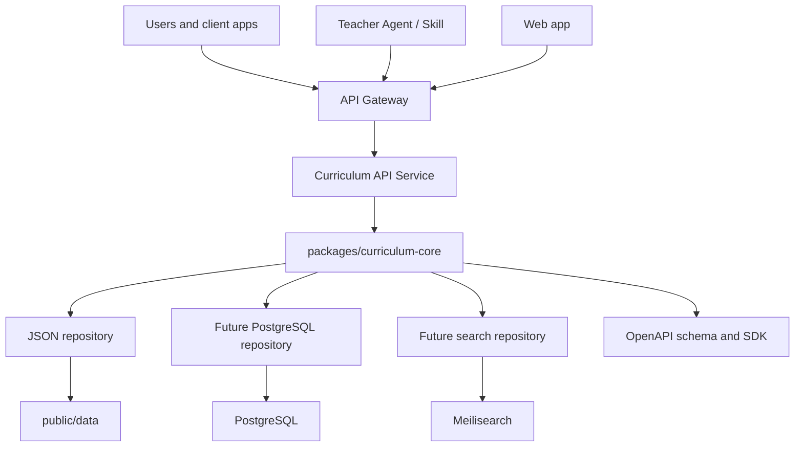

# Curriculum Intelligence API Project Plan

更新时间：2026-07-10
仓库路径：`curriculum-standards-breakdown`
当前执行状态：Phase 0-2 已落地；Phase 3 的 API key / rate limit / OpenAPI 契约 / production-first OpenAPI UI / TypeScript client / Vercel 配置 / structured logging / file-backed metrics MVP / Meilisearch adapter / API quickstart / automated smoke tests 已落地；Phase 4 Graph API 已落地；Phase 5 Agent API 已完成 deterministic MVP，并加入数据版本绑定、跨九学科的 plan-to-standards evaluation baseline；正式域名为 `https://www.kebiao.org`。

本文档基于当前 insight、`docs/API_DATA_STRUCTURE_PREP.md`、`skills/github/zhenzheng-keyong-kebiao-skill` 以及当前仓库结构，规划如何把课标罗盘从“课程标准查询网站”升级为：

**Curriculum Intelligence Infrastructure**

面向 AI 教学工具、教师平台、课程设计系统和教育 SaaS 的课程标准智能基础设施。

核心判断：当前项目已经不只是 2025 条 standards 的静态数据集。它已经具备学科 taxonomy、grade progression、transferable skills、H4G 年级化推理、source alignment、textbook evidence、teaching tips、assessment evidence 等关系型知识层。因此，API 项目的目标不是“提供标准文本查询”，而是提供“标准数据 -> 标准关系 -> 课程设计智能能力”的可复用接口。

## 1. 产品定位

### 1.1 不推荐定位

不要把项目定位为：

- Standards API
- 课程标准查询 API
- 课标文本数据库
- 更好的课标网站后端

这些定位太薄，价值主要停留在搜索和展示。

### 1.2 推荐定位

推荐定位：

**Curriculum Intelligence API**

英文一句话：

> The API layer for building curriculum-aware education products.

中文一句话：

> 面向 AI 教学工具、教师平台、课程设计系统的课程标准智能基础设施。

### 1.3 三层产品价值

| Layer | 名称 | 价值 | 典型用户 |
| --- | --- | --- | --- |
| Layer 1 | Curriculum Data API | 稳定查询标准、学科、领域、学段、技能标签 | 教育 SaaS、教研平台、AI 教师助手 |
| Layer 2 | Curriculum Graph API | 查询标准之间的 progression、skill、evidence、taxonomy 关系 | AI lesson planner、教材编排、教师培训系统 |
| Layer 3 | Curriculum Agent API | 解析教学计划、匹配标准、分析覆盖、生成进度表和课程建议 | AI 备课工具、学校教研系统、Agent/Skill |

第一阶段只做 Layer 1，并为 Layer 2 留好字段和路径。不要一开始就把 Agent 生成、数据库、商业化、搜索引擎全部塞进 MVP。

## 2. 当前资产

当前 API 化的基础已经比较扎实：

- 正式数据源：`public/data/by_subject/*.json`
- 主索引：`public/data/manifest.json`
- 查询索引：`public/data/indexes/code_to_subject.json`
- 技能反查索引：`public/data/indexes/skill_to_subjects.json`
- 学科统计索引：`public/data/indexes/subject_stats.json`
- 学科 metadata：`public/data/subjects_meta.json`
- 技能 metadata：`public/data/skills_meta.json`
- 前端规范化逻辑：`src/data/schema.js`
- 前端查询逻辑：`src/data/dataLoader.js`
- URL filter 逻辑：`src/data/query.js`
- API 数据准备文档：`docs/API_DATA_STRUCTURE_PREP.md`
- Skill 原型：`skills/github/zhenzheng-keyong-kebiao-skill`
- Core runtime：`packages/curriculum-core`
- API service：`apps/api`
- OpenAPI 契约：`docs/api/openapi.yaml`
- TypeScript client：`packages/curriculum-client`
- Vercel deployment：`vercel.json`, `api/v1/[...path].ts`, `docs/DEPLOYMENT_VERCEL.md`
- API 数据版本：`public/data/data_version.json`
- JSON 质量门：`scripts/validate-public-json.js`

当前数据快照以 `docs/API_DATA_STRUCTURE_PREP.md` 为准：

- standards 总数：2025
- 学科数：9
- transferable skills：7
- manifest 字段数：141
- H4G progression group：390
- H4G7/H4G8/H4G9 各 390 条

当前已实现的 API 能力：

- Layer 1 Data API：`/meta`, `/data-version`, `/subjects`, `/skills`, `/standards/{code}`, `/standards/search`, `/standards/batch`
- Layer 2 Graph API：`/subjects/{subject_slug}/domains`, `/standards/{code}/progression`, `/standards/{code}/neighbors`, `/standards/{code}/evidence`, `/standards/compare`
- Layer 3 Agent API deterministic MVP：`/plans/parse`, `/plans/validate`, `/matching/plan-to-standards`, `/coverage/analyze`, `/schedules/weekly`
- Access governance：匿名/developer/partner/admin tier、`x-api-key`、基础内存 rate limit、字段级 fieldset access control
- Integration surface：`/api/v1/docs`, `/api/v1/openapi.yaml`, `@curriculum/client`, `docs/API_QUICKSTART.md`, `npm run smoke:api`
- Observability MVP：`CURRICULUM_ENABLE_REQUEST_LOGS=true` 时输出结构化请求日志；`CURRICULUM_METRICS_FILE` 可启用 NDJSON file-backed metrics；`/api/v1/metrics` admin-only 返回内存与持久化摘要
- Search adapter：`packages/curriculum-core/src/meilisearch.ts`, `scripts/index-meilisearch.ts`
- Matching eval：`packages/curriculum-core/test/fixtures/plan-matching-fixtures.json`, `scripts/evaluate-plan-matching.ts`, `docs/evals/PLAN_TO_STANDARDS_EVALUATION.md`
- 验证：core tests、client tests、API contract tests、matching eval、TypeScript typecheck、OpenAPI YAML parse check

## 3. 设计原则

### 3.1 One Curriculum Engine, Multiple Interfaces

核心原则：

**One curriculum engine, multiple interfaces.**

也就是：

- Web 调用同一套 core。
- API 调用同一套 core。
- Skill/Agent 调用同一套 core 或同一套 API。
- 后续 CLI、SDK、MCP server 也复用同一套 schema 和 query logic。

避免出现：

- Web 对 `TS1` 的匹配规则是一套。
- API 对 `TS1.x` 的匹配规则又是一套。
- Skill 再写第三套匹配逻辑。

### 3.2 真实标准优先

所有标准 code 和标准正文必须来自数据源或 API。不能因为 planning/generation 需要而生成不存在的 code。

### 3.3 原文、证据、建议分离

API 响应必须能区分：

- 课程标准展示文本：`standard`
- 来源原文或 source anchor：`source_standard_original`
- 教材证据：`textbook_evidence_ids`, `textbook_unit_evidence_ids`
- 匹配理由：`rationale`, `matched_fields`
- 基于课标生成的教学建议：`practice`, `teaching_tip`
- 基于课标生成的评价建议：`assessment_evidence_type`

### 3.4 Field Level Access Control

当前数据里有大量候选、审阅、置信度、source alignment、overlap score、issue flags。这些不能默认开放。

API 必须有字段级访问控制：

| Fieldset | 用户 | 内容 |
| --- | --- | --- |
| `public` | 默认公开 | 标准、学科、学段、领域、教学建议、评价证据、TS 标签 |
| `source` | 研究者、内部产品 | source 原文、source section、source scope |
| `evidence` | 研究者、教研系统 | 年级归属、progression、教材证据 ID |
| `textbook` | 高级用户、内部产品 | 完整教材证据对象，体积较大 |
| `admin` | 内部 | candidate id、review status、overlap score、issue flags |

### 3.5 JSON First, Database Later

当前只有 2025 条 standards，JSON 足够。第一阶段不要引入 PostgreSQL。先用 `public/data` 作为 source of truth，通过 core package 抽象 repository 接口。

后续扩展路径：

1. JSON file repository
2. PostgreSQL repository
3. Search engine repository
4. Knowledge graph or graph projection

### 3.6 OpenAPI First

不要先写大量后端代码。推荐流程：

1. 固化 data schema。
2. 设计 `openapi.yaml`。
3. 用 mock server 验证 API 体验。
4. 再实现 Hono/Fastify API。
5. 生成 SDK 和文档。

## 4. 目标架构



### 4.1 Monorepo 目标结构

建议逐步迁移为：

```text
curriculum-standards-breakdown/
  apps/
    web/
    api/
  packages/
    curriculum-core/
    curriculum-client/
  public/
    data/
  scripts/
    data/
    grade7_9/
    textbooks/
  docs/
    api/
  skills/
    github/
    skill-hub/
```

第一阶段可以不强制移动 `src/` 到 `apps/web/`，但新 API 与 core package 建议按目标结构创建，避免继续扩大根目录应用耦合。

### 4.2 Layer 边界

| Layer | 目录 | 责任 | 禁止 |
| --- | --- | --- | --- |
| Data production | `scripts/grade7_9`, `scripts/textbooks` | 生成、审阅、发布数据 | 不作为 runtime API 依赖 |
| Data source | `public/data` | API source of truth | 不读取旧 export 快照作为主数据 |
| Core engine | `packages/curriculum-core` | schema、normalize、filter、fieldset、matching | 不依赖 HTTP、React、Vercel |
| API service | `apps/api` | HTTP route、auth、rate limit、OpenAPI、response envelope | 不重写业务查询逻辑 |
| Web app | `src` 或 `apps/web` | UI、浏览、收藏、打印 | 不维护独立查询规则 |
| Skill/Agent | `skills/*` | 教师任务、Agent 调用 | 不内置过期数据，不编造 code |

## 5. 技术路线

### 5.1 推荐 API framework

第一选择：**Hono + TypeScript**

原因：

- 极轻量。
- TypeScript 原生。
- 适合 Vercel/Cloudflare/Edge。
- 和当前 Vite/React 项目技术栈一致。
- 易于共享 Zod schema、OpenAPI schema、SDK 类型。

候选结构：

```text
apps/api/
  src/
    index.ts
    routes/
      meta.ts
      subjects.ts
      skills.ts
      standards.ts
      graph.ts
    middleware/
      request-id.ts
      errors.ts
      rate-limit.ts
      api-key.ts
    openapi/
      registry.ts
```

第二选择：**FastAPI**

适合后续 AI service：

- plan parsing
- semantic matching
- embedding
- LangChain/LlamaIndex style workflows

建议策略：

- 第一阶段 API 用 Hono/TypeScript。
- 未来 Agent/AI pipeline 如果 Python 生态收益明显，再新增 `services/ai` 或 `apps/agent-api`，不要替代第一阶段核心 API。

### 5.2 搜索系统

第一阶段：

- JSON scan + deterministic filters。
- 数据规模小，性能足够。

第二阶段：

- 引入 Meilisearch。
- 建立 indexer，从 `public/data/by_subject` 写入 search index。
- 支持 keyword、facet、filter、sorting。

第三阶段：

- 加入 semantic search，但必须保留 deterministic filter 和 explainable match。

搜索演进：

```text
JSON contains search
  -> Meilisearch full-text search
  -> hybrid deterministic + keyword + semantic search
```

### 5.3 数据存储

不要在 MVP 使用数据库。PostgreSQL 的引入条件：

- standards 数量扩展到多版本、多地区、多教材。
- API 需要用户 workspace、收藏、调用记录、usage billing。
- 需要复杂管理后台。
- 需要多租户权限。

在此之前，主数据继续由 Git 管理，`public/data` 作为发布产物。

## 6. API 分层设计

### 6.1 Layer 1: Curriculum Data API

目标：稳定取回真实 standards 和 metadata。

| Method | Path | 说明 |
| --- | --- | --- |
| `GET` | `/api/v1/meta` | 数据版本、总量、支持的 filters、schema version |
| `GET` | `/api/v1/data-version` | 独立数据版本信息 |
| `GET` | `/api/v1/subjects` | 学科 metadata 与统计 |
| `GET` | `/api/v1/subjects/{subject_slug}` | 单学科 metadata、domains、grade bands |
| `GET` | `/api/v1/skills` | 七大 transferable skills |
| `GET` | `/api/v1/skills/{skill_code}` | 单个 skill 与子技能 |
| `GET` | `/api/v1/standards/{code}` | 单条 standard |
| `POST` | `/api/v1/standards/search` | 多条件搜索 standards |
| `POST` | `/api/v1/standards/batch` | 按 code 批量取 standards |

### 6.2 Layer 2: Curriculum Graph API

目标：暴露标准关系，而不是只暴露标准文本。

| Method | Path | 说明 |
| --- | --- | --- |
| `GET` | `/api/v1/standards/{code}/progression` | 返回同一 progression group 下的 G7/G8/G9 |
| `GET` | `/api/v1/standards/{code}/neighbors` | 返回 previous/next、same domain、same skill 等邻接关系 |
| `GET` | `/api/v1/skills/{skill_code}/standards` | skill -> standards 反查 |
| `GET` | `/api/v1/subjects/{subject_slug}/domains` | subject -> domain taxonomy |
| `POST` | `/api/v1/standards/compare` | 多条 standards 对比 |
| `GET` | `/api/v1/standards/{code}/evidence` | source/textbook evidence 摘要 |

### 6.3 Layer 3: Curriculum Agent API

目标：支持 AI/Agent 做课程设计，但所有输出必须 grounded in standards。

| Method | Path | 说明 |
| --- | --- | --- |
| `POST` | `/api/v1/plans/parse` | 解析教学计划为 ParsedPlan |
| `POST` | `/api/v1/plans/validate` | 校验年级、学科、课时、周次、单元 |
| `POST` | `/api/v1/matching/plan-to-standards` | 单元/目标 -> standards |
| `POST` | `/api/v1/coverage/analyze` | 覆盖、遗漏、重复、低置信度 |
| `POST` | `/api/v1/schedules/weekly` | 生成教学进度表 |
| `POST` | `/api/v1/schedules/timetable` | 生成日常节次课表 |

MVP 不做自由生成式 `/planning/generate`。先做可解释的 parse、match、coverage，再考虑 lesson generation。

## 7. 响应 envelope

所有 API 响应建议统一：

```json
{
  "data": {},
  "meta": {
    "request_id": "req_...",
    "data_version": "2026.07.09",
    "schema_version": "1.0.0",
    "warnings": []
  }
}
```

Collection response：

```json
{
  "data": [],
  "meta": {
    "request_id": "req_...",
    "data_version": "2026.07.09",
    "schema_version": "1.0.0",
    "total": 2025,
    "limit": 20,
    "next_cursor": null,
    "warnings": []
  }
}
```

Error response：

```json
{
  "error": {
    "code": "validation_error",
    "message": "Request validation failed",
    "details": [
      {
        "field": "grade_bands",
        "code": "invalid_enum",
        "message": "Unknown grade band: H5"
      }
    ]
  },
  "meta": {
    "request_id": "req_..."
  }
}
```

## 8. Core package 规划

### 8.1 `packages/curriculum-core`

建议目录：

```text
packages/curriculum-core/
  src/
    schema/
      standard.ts
      subject.ts
      skill.ts
      plan.ts
      match.ts
      api.ts
    data/
      data-version.ts
      file-repository.ts
      indexes.ts
      repository.ts
    query/
      filters.ts
      pagination.ts
      sorting.ts
    search/
      filter-standards.ts
      rank-standards.ts
      explain-match.ts
    graph/
      progression.ts
      neighbors.ts
      skill-graph.ts
    fieldsets/
      standard-fieldsets.ts
      access-levels.ts
    validation/
      validate-indexes.ts
      validate-plan.ts
    index.ts
```

### 8.2 第一批迁移内容

从现有代码迁移：

- `normalizeStandard`
- `normalizeSkill`
- `normalizeSubjectMeta`
- `filterStandards`
- `loadStandardByCode` 的 code-to-subject 思路
- `GRADE_BANDS` 的语义部分
- Search filters：subjects、grade bands、domains、skills、keyword
- Fieldset filters：public、source、evidence、textbook、admin

不要迁移：

- UI colors
- React 组件
- Browser-specific fetch cache
- 收藏、打印、页面状态

## 9. 数据治理

### 9.1 新增 `data_version.json`

Phase 0 必须新增：

```json
{
  "data_version": "2026.07.09",
  "schema_version": "1.0.0",
  "source_standard": "义务教育课程方案和课程标准（2022年版）",
  "source_commit": "fa175f9",
  "generated_at": "2026-07-09T00:00:00.000Z",
  "validated": true,
  "subjects_covered": 9,
  "standard_count": 2025,
  "grade_band_policy": {
    "H1": "1-2",
    "H2": "3-4",
    "H3": "5-6",
    "H4G7": "7",
    "H4G8": "8",
    "H4G9": "9"
  }
}
```

### 9.2 发布前质量门

每次数据/API 发布前必须通过：

- `npm run validate:indexes`
- JSON parse check for all `public/data/**/*.json`
- `manifest.subjects` total equals `by_subject` total
- `code_to_subject` covers every public standard code
- default public fieldset does not include admin-only fields
- H4G low-confidence or evidence-required records surface warnings in planning APIs

### 9.3 当前已知数据风险

| 风险 | 状态 | API 策略 |
| --- | --- | --- |
| `public/data/glossary.json` parse error | 已修复 | 可在后续 glossary API 中使用，并由 `npm run validate:json` 防回归 |
| `standards_json_export` 为旧快照 | 已知 | 不作为 API source of truth |
| `junior_grade_level_summary.json` totals 落后 | 已知 | 不作为主统计源 |
| H4G 有候选/审阅字段 | 正常 | 默认 public fieldset 排除 |
| textbook evidence 对象很大 | 正常 | 默认只返回 evidence IDs |

## 10. OpenAPI 工作流

建议流程：

1. 从 `packages/curriculum-core/src/schema` 定义 Zod schema。
2. 生成或手写 `docs/api/openapi.yaml`。
3. 用 mock server 本地验证。
4. 先写 API contract tests。
5. 再实现 Hono routes。
6. 生成 `packages/curriculum-client`。

第一版 OpenAPI 应覆盖：

- `MetaResponse`
- `DataVersion`
- `Subject`
- `Skill`
- `StandardPublic`
- `StandardSearchRequest`
- `StandardSearchResponse`
- `StandardBatchRequest`
- `ProgressionResponse`
- `ApiError`

## 11. 安全与访问控制

### 11.1 Auth 分层

| Tier | 访问方式 | 权限 |
| --- | --- | --- |
| Public anonymous | 无 API key 或 demo key | metadata、少量 search、public fieldset |
| Developer | API key | search、batch、graph、source/evidence 摘要 |
| Partner | API key + allowlist | 高限流、textbook fieldset、批量导出 |
| Admin | internal token | admin fieldset、review packet、debug |

### 11.2 Rate limit

MVP 建议：

| Tier | Limit | 说明 |
| --- | ---: | --- |
| Anonymous | 30/min | demo 与文档试用 |
| Developer | 300/min | 标准应用集成 |
| Partner | 3000/min | 商业集成 |
| Admin | 10000/min | 内部任务 |

### 11.3 日志与隐私

Planning APIs 未来会接收教学计划、学校名称、年级、课程安排。默认策略：

- 请求日志不记录原始上传全文。
- 文件解析只保存结构化中间结果，默认短期保留。
- 低置信度字段进入 warnings。
- 不把用户上传内容写回 public data。

## 12. Agent 与 Skill 演进

当前 Skill 可以读取本地 JSON。未来应变为：

```text
Teacher Agent
  -> Curriculum Skill
  -> Curriculum API
  -> Curriculum Core
  -> Standards Knowledge Layer
```

好处：

- Skill 不需要内置大数据。
- 所有 Agent 都拿到同一数据版本。
- 可以通过 API key 做权限、限流、审计。
- 可以把 `request_id`, `data_version`, `warnings` 带回用户输出。

Skill 输出必须保留：

- 查询理解。
- 数据版本。
- 真实标准 code。
- 标准正文和建议内容区分。
- warnings、限制和人工确认项。
- 覆盖检查或约束检查。

## 13. 商业化方向

### 13.1 潜在客户

| 客户 | 痛点 | API 价值 |
| --- | --- | --- |
| AI 教育公司 | 缺中国课标 grounding | 提供中国义务教育课程标准知识层 |
| 教师 AI 工具 | 难判断一节课符合哪些标准 | 提供标准匹配、覆盖分析、评价证据 |
| 国际学校 | 需要中国课标与 IB/AP/NGSS 等体系映射 | 后续提供 crosswalk API |
| 教研平台 | 需要课程设计、单元规划、标准覆盖 | 提供 curriculum graph 和 planning APIs |
| 出版/教材系统 | 需要标准与教材单元关系 | 提供 evidence 和 progression API |

### 13.2 产品包

| Plan | 能力 | 备注 |
| --- | --- | --- |
| Free | metadata、少量 search、单条 standard | 文档和开发者试用 |
| Developer | Data API、Graph API 基础能力 | 面向工具开发者 |
| Pro | batch、source/evidence、较高限流 | 面向教研产品 |
| Partner | textbook evidence、导出、定制 mapping | 商业合作 |
| Internal/Admin | review packet、候选字段、数据管线 | 内部使用 |

## 14. 里程碑

### Phase 0: Data Contract Lock

时间：1-2 天

目标：让数据成为可发布 API asset。

任务：

- 新增 `public/data/data_version.json`。已完成。
- 修复 `public/data/glossary.json` 或从 API scope 暂时移除。已修复。
- 更新 README 中旧统计。已完成。
- 将 `docs/API_DATA_STRUCTURE_PREP.md` 作为 API source-of-truth 文档。已完成。
- 明确 default public fieldset。已完成。

验收：

- `npm run validate:indexes` 通过。
- 全部 `public/data/**/*.json` 可解析，或明确排除不可解析文件。
- 文档中写清 source of truth、版本、字段访问层级。

### Phase 1: Curriculum Core Package

时间：3-7 天

目标：抽出共用引擎。

任务：

- 创建 `packages/curriculum-core`。已完成。
- 建立 Standard、Subject、Skill、SearchRequest schema。已完成。
- 迁移 normalize、filter、code lookup、skill lookup。已完成。
- 实现 fieldset projection。已完成。
- 建立 file repository，读取 `public/data`。已完成。
- 添加 core unit tests。已完成。
- 新增 graph 与 planning core：neighbors、evidence summary、compare、plan parsing、plan matching、coverage、weekly schedule。已完成。

验收：

- Web 与 API 可共享 core。
- 搜索结果与当前前端逻辑一致。
- `public` fieldset 不泄漏 admin 字段。

### Phase 2: Read-only API MVP

时间：1 周

目标：可以被第三方调用的第一版 API。

任务：

- 创建 `apps/api`。已完成。
- 使用 Hono + TypeScript。已完成。
- 实现 `/meta`, `/data-version`, `/subjects`, `/skills`, `/standards/{code}`, `/standards/search`, `/standards/batch`。已完成。
- 统一 response envelope。已完成。
- 统一 error response。已完成。
- 增加 request id。已完成。
- 增加基本 rate limit。已完成。
- 添加 API contract tests。已完成。

验收：

- 本地可启动 API。
- cURL 可查询真实 standards。
- 每个响应带 `data_version` 和 `request_id`。
- 不存在的 code 返回 404，不用 200 包 error。

### Phase 3: OpenAPI, SDK, Search

时间：2-4 周

目标：让 API 可集成、可文档化、可搜索。

任务：

- 创建 `docs/api/openapi.yaml`。已完成，当前版本 `0.2.0`。
- 接入 OpenAPI UI。已完成，路径 `/api/v1/docs`。
- 生成 TypeScript client。已完成轻量 client package：`packages/curriculum-client`。
- 建 Meilisearch indexer。已完成 REST adapter 与 dry-run/write 脚本。
- 实现 search repository adapter。已完成第一版 Meilisearch adapter；尚未替换默认 JSON search。
- 加 API key、tier、rate limit。已完成 MVP。
- 加 structured logging 和 basic metrics。已完成 structured logging 与 file-backed metrics MVP。

验收：

- 第三方可按 OpenAPI mock 开发。
- Search 支持 keyword + filters。
- SDK 可从 TS 项目直接调用。

### Phase 4: Graph API

时间：2-3 周

目标：暴露你的核心壁垒。

任务：

- 实现 progression lookup。已完成。
- 实现 skill-to-standards。已完成。
- 实现 standard neighbors。已完成。
- 实现 evidence summary。已完成。
- 实现 standards compare。已完成。

验收：

- H4G 同组 G7/G8/G9 可稳定返回。
- Skill API 可跨学科反查。
- Evidence API 默认只返回摘要和 ID，不返回巨大对象。

### Phase 5: Agent API

时间：4-8 周

目标：支持课程设计智能能力。

任务：

- 实现 `plans/parse`。已完成 deterministic MVP。
- 实现 `plans/validate`。已完成。
- 实现 `matching/plan-to-standards`。已完成 deterministic MVP。
- 实现 `coverage/analyze`。已完成。
- 实现 `schedules/weekly`。已完成。
- 后续评估 lesson generation。

验收：

- 每个 match 有 `score`, `matched_fields`, `rationale`, `requires_human_review`。
- 低于阈值不装作确定结论。
- 输出明确区分标准原文、匹配理由、教学建议、评价建议。

## 15. 第一批 GitHub issues 建议

可以直接拆成 issues：

1. `docs: lock Curriculum Intelligence API product scope`
2. `data: add public/data/data_version.json`
3. `data: repair or exclude glossary.json from API scope`
4. `core: create packages/curriculum-core skeleton`
5. `core: port normalizeStandard and metadata schemas`
6. `core: port deterministic standard filters`
7. `core: implement standard fieldset projection`
8. `api: create apps/api Hono service`
9. `api: implement GET /api/v1/meta and /api/v1/data-version`
10. `api: implement GET /api/v1/standards/{code}`
11. `api: implement POST /api/v1/standards/search`
12. `api: implement POST /api/v1/standards/batch`
13. `api: add request_id and standard error envelope`
14. `api: draft docs/api/openapi.yaml`
15. `tests: add API contract tests for public fieldset`

这些第一批 issue 目前已基本完成。下一批建议：

16. `docs: publish OpenAPI UI for Curriculum Intelligence API`。已完成。
17. `client: generate TypeScript SDK from docs/api/openapi.yaml`。已完成轻量 client，后续可替换为自动生成。
18. `api: add structured request logging without raw planning payloads`。已完成 MVP。
19. `api: add durable metrics for tier, endpoint, latency, status`。已完成 file-backed MVP。
20. `search: add Meilisearch indexer and repository adapter`。已完成第一版。
21. `planning: add evaluation fixtures for plan-to-standard matching quality`。已完成跨九学科、十一条单元断言的 data-version-bound baseline，包含 MRR、命中率、禁配项和人工复核质量门。
22. `security: load API keys from deployment secret manager`
23. `deploy: add Vercel/Cloudflare deployment target for apps/api`。已完成 Vercel 配置。

## 16. External references to study

Research targets for API and education standards interoperability:

- Hono: https://github.com/honojs/hono
- OpenAPI Specification: https://github.com/OAI/OpenAPI-Specification
- Stoplight Prism mock server: https://github.com/stoplightio/prism
- Meilisearch: https://github.com/meilisearch/meilisearch
- 1EdTech CASE: https://www.1edtech.org/standards/case
- OpenSALT: https://github.com/opensalt/opensalt
- Common Standards Project API: https://github.com/commonstandardsproject/api

## 17. Immediate recommendation

当前 endpoint 与 deterministic MVP 已经落地，下一步建议从“可发布”进入“可集成”：

1. 购买或绑定正式域名后，按 `docs/DEPLOYMENT_VERCEL.md` 的 Custom Domain Cutover 更新 OpenAPI server、CORS 和 smoke base URL。
2. 如果要正式接入搜索服务，部署 Meilisearch 并执行 `npm run search:index-meilisearch -- --write`。
3. 将 smoke test 接入 GitHub Actions 或 Vercel deployment hook，确保每次部署后自动验证。
4. 把 file-backed metrics 继续升级为真正 durable backend，例如 Vercel Log Drains、Postgres、ClickHouse 或对象存储聚合。
5. 下一轮可做自动生成 SDK、正式 API key 申请流程、usage dashboard 和 GitHub PR 模板。

这样项目会从“一个网站的数据层”平稳升级为“课程智能基础设施”，同时保留当前 Web 的稳定性和数据生产管线的可信度。
