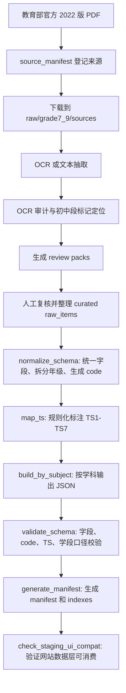

# 课标拆解方法：当前工作法总结

更新时间：2026-06-30

本文基于仓库现有文件整理，说明我们现在如何把《义务教育课程标准（2022 年版）》拆解成网站可使用的数据。它不是新的数据规范，而是对当前实际做法的归纳，方便后续继续拆解、复核、合并和交付。

主要依据：

- `docs/CURRICULUM_STANDARD_DECOMPOSITION_METHOD.md`
- `docs/CURRICULUM_STANDARD_DECOMPOSITION_METHOD_SUMMARY.md`
- `docs/RESOURCE_ARCHITECTURE.md`
- `docs/JUNIOR_SECONDARY_EXPANSION_WORKFLOW.md`
- `docs/JUNIOR_SECONDARY_SOURCE_AUDIT.md`
- `docs/*_GRADE7_9_STAGING.md`
- `src/data/schema.js`
- `public/data/manifest.json`
- `public/data/by_subject/*.json`
- `public/data/subjects_meta.json`
- `public/data/skills_meta.json`
- `scripts/grade7_9/*.js`
- `scripts/grade7_9/curated/*_h3_raw.json`

## 1. 一句话概括

我们的课标拆解方法是：

> 以官方 2022 版课标为唯一可信来源，先定位页码和章节，再人工复核并整理为 `raw_items`；随后把每个原子学习目标转换成统一 schema 的标准记录，补充教学支持字段和 TS1-TS7 可迁移技能标签，最后生成按学科组织的 JSON、manifest、indexes，并通过脚本校验。

网站正式运行时的主数据入口是：

```text
public/data/by_subject/{subject_slug}.json
```

初中 7-9 年级目前仍是 staging 数据，不直接覆盖正式 `public/data/by_subject/`。

## 2. 最小拆解单位

拆解后的最小单位不是 PDF 页面、章节、表格行，也不是一整个学段说明，而是：

> 一条独立、可定位、可教学使用、可评价、可关联技能标签的学习目标记录。

一条合格记录至少要回答：

- 学科是什么。
- 学段或年级是什么。
- 属于哪个领域或任务群。
- 学生应知道、理解、会做或表现出什么。
- 教师可以如何组织学习活动。
- 可以用什么证据判断学生是否达成。
- 主要关联哪一个可迁移技能。

## 3. 核心原则

### 3.1 真实来源优先

标准正文、来源页码和 code 不允许凭经验编造。初中 7-9 年级来源登记在：

```text
scripts/grade7_9/source_manifest.json
```

官方 PDF 下载到本地忽略目录：

```text
raw/grade7_9/sources/
```

该目录不提交到 git，只作为本地官方源文件缓存。

### 3.2 原文核心与教学建议分离

`standard` 保存课标核心要求。它可以做少量结构化整理，但不能混入泛化教学建议。

教学落地信息放入：

- `context`
- `practice`
- `teaching_tip`
- `assessment_evidence_type`
- `materials_tools`
- `safety_notes`

这样网站、Skill 和未来 API 才能区分“课标要求”和“基于课标生成的教学支持”。

### 3.3 原子化

拆分段落时看四个判断点：

1. 是否包含多个学习对象。
2. 是否包含多个核心动作。
3. 是否跨多个领域、任务群或子领域。
4. 是否需要不同的评价证据。

如果是，就优先拆成多条记录。

### 3.4 保留学科结构

不同学科不强行套同一套 `domain`。当前做法是让 `domain` 承担一级筛选和页面分组，让 `subdomain` 承担更细的内容定位。

示例：

| 学科 | 常见 domain |
| --- | --- |
| 语文 | 识字与写字、阅读与鉴赏、表达与交流、梳理与探究、学习任务群 |
| 数学 | 数与代数、图形与几何、统计与概率、综合与实践、学业质量 |
| 英语 | 语言能力、文化意识、思维品质、学习能力、主题、语篇 |
| 科学 | 科学观念、科学思维、探究实践、态度责任、核心概念 |
| 信息科技 | 数据与编码、身边的算法、过程与控制、人工智能与智慧社会 |
| 道德与法治 | 道德教育、法治教育、国情教育、生命安全与健康教育 |
| 劳动 | 日常生活劳动、生产劳动、服务性劳动、公益劳动与志愿服务 |
| 体育与健康 | 运动能力、健康教育、体育品德、体能、专项运动技能 |
| 艺术 | 音乐、美术、舞蹈、戏剧（含戏曲）、影视（含数字媒体艺术）、课程目标、学业质量 |

### 3.5 可校验

拆解结果必须能被脚本检查：

- JSON 合法。
- code 唯一。
- `subject_slug` 与文件名一致。
- `grade_band`、`grade_range`、`grade` 一致。
- `domain` 和 `standard` 非空。
- `ts_primary` 有且仅有一个。
- `ts_secondary` 最多两个。
- TS code 只能来自 TS1-TS7。

## 4. 数据记录结构

前端通过 `src/data/schema.js` 对标准记录做兜底规范化。当前主要字段如下：

| 字段 | 作用 |
| --- | --- |
| `id` | 条目 ID，通常等于 `code`。 |
| `code` | 标准唯一编码，用于 URL、收藏、详情页和反查。 |
| `subject` | 中文学科名。 |
| `subject_slug` | 学科 slug，也是 `by_subject` 文件名。 |
| `grade_band` | 学段代码，如 H1、H2、H3。 |
| `grade_range` | 年级范围，如 `1-2`、`7-9`。 |
| `grade` | 人类可读年级或学段。 |
| `domain` | 一级领域、核心素养维度、内容模块或任务群。 |
| `subdomain` | 子领域、内容线索、项目主题或细分学习任务。 |
| `project` | 项目、任务群或主题，可为空。 |
| `standard` | 标准核心学习要求。 |
| `context` | 适用情境或来源上下文。 |
| `practice` | 可落地学习任务或教学活动建议。 |
| `teaching_tip` | 教师组织、支架或注意事项。 |
| `assessment_evidence_type` | 可观察、可收集的评价证据。 |
| `materials_tools` | 材料和工具，可为空。 |
| `safety_notes` | 安全提示，可为空。 |
| `previous_code` | 前置或上一条标准 code，可为空。 |
| `next_code` | 后续或下一条标准 code，可为空。 |
| `ts_primary` | 主要可迁移技能，数组，当前要求一个。 |
| `ts_secondary` | 次要可迁移技能，数组，最多两个。 |
| `ts_rationale` | TS 标注理由。 |

## 5. 从官方 PDF 到网站数据的流程



## 6. `raw_items` 的整理方式

人工复核后的初中段草案放在：

```text
scripts/grade7_9/curated/{subject_slug}_h3_raw.json
```

文件通常包含：

```json
{
  "source_file": "raw/grade7_9/sources/chinese-W020220420582344386456.pdf",
  "source_standard": "义务教育语文课程标准（2022年版）",
  "subject": "语文",
  "subject_slug": "chinese",
  "grade_scope": "7-9",
  "review_status": "staging_first_pass_needs_human_review",
  "raw_items": []
}
```

单条 `raw_items` 的关键字段：

| 字段 | 作用 |
| --- | --- |
| `source_pages` | 来源页码，用于回查官方 PDF。 |
| `source_section` | 来源章节、表格或内容块。 |
| `domain` | 一级领域。 |
| `subdomain` | 子领域、任务群或内容点。 |
| `standard` | 从官方内容整理出的核心学习要求。 |
| `context` | 来源上下文或适用情境。 |
| `practice` | 教学活动或学习任务建议。 |
| `teaching_tip` | 教学提示。 |
| `assessment_evidence_type` | 评价证据。 |
| `target_grades` | 目标年级数组，如 `[7, 8, 9]`。 |

`source_pages` 是人工复核的关键字段：它让每条草案都能回到官方 PDF。

## 7. 7-9 年级拆分规则

2022 版课标的初中段经常把 7-9 年级合写。当前不新增字段，而是用现有字段承载初中年级：

```json
{
  "grade_band": "H3",
  "grade_range": "7-9",
  "grade": "七年级"
}
```

拆分规则：

1. 如果官方文本明确写七、八、九年级，按官方年级拆。
2. 如果官方文本写 7-9 共同要求，且确实跨三年适用，`raw_items` 使用 `target_grades: [7, 8, 9]`。
3. `normalize_schema.js` 会把一条共同要求展开成七年级、八年级、九年级三条 records。
4. 展开后的 records 可以共享同一核心要求，但 code 必须独立。
5. 如果无法确认年级归属，保留在 staging，不进入正式主数据。

特别注意：正式数据中 `H3` 已被小学高段或艺术 6-7 年级使用。在 H3 口径冲突解决前，7-9 staging 不能覆盖 `public/data/by_subject/`。

## 8. code 生成方法

7-9 staging 由 `scripts/grade7_9/normalize_schema.js` 自动生成 code。

基本结构：

```text
{学科前缀}-H3-{领域缩写}-{三位序号}
```

示例：

```text
CN-H3-READ-001
MA-H3-ALG-001
ENG-H3-LANG-001
SC-H3-MAT-001
LA-H3-DL-001
```

学科前缀和领域缩写来自：

```text
scripts/grade7_9/config.js
```

如果某个 `domain` 没有配置缩写，脚本会 fallback。正式发布前应补齐配置，避免出现不清晰的 `GEN` 或不可读 code。

## 9. TS1-TS7 标注方法

TS 技能体系来自：

```text
public/data/skills_meta.json
```

7-9 staging 的自动标注由：

```text
scripts/grade7_9/map_ts.js
```

当前规则是 keyword-based + rule-based，不使用随机生成：

| TS | 倾向匹配内容 |
| --- | --- |
| TS1 | 分析、比较、解释、推理、证据、判断、论证、探究、归纳 |
| TS2 | 设计、创作、方案、改进、制作、项目、实践、解决问题 |
| TS3 | 计划、反思、自评、管理、策略、习惯、自主、持续 |
| TS4 | 合作、协作、小组、共同、分工、团队、公共参与 |
| TS5 | 表达、交流、展示、汇报、讲述、写作、阅读、倾听、沟通 |
| TS6 | 数据、编码、算法、程序、信息、数字、网络、人工智能、模型 |
| TS7 | 责任、伦理、法治、规则、安全、健康、可持续、国家、社会、环境 |

自动标注只是第一轮，正式入库前仍需要人工复核。

## 10. 7-9 staging 脚本管线

9 科 curated raw 草案可用一条命令重建完整 staging：

```bash
npm run grade7_9:build-curated
```

该命令默认输出到 `generated/grade7_9_all_curated/`，并自动完成 normalize、map-ts、by_subject、manifest/indexes 和 `--staging-root` 整包校验。

以单学科为例，当前校验链路是：

```bash
rm -rf generated/grade7_9_{subject}_curated
mkdir -p generated/grade7_9_{subject}_curated/{normalized,mapped,by_subject}

node scripts/grade7_9/normalize_schema.js \
  --input scripts/grade7_9/curated/{subject_slug}_h3_raw.json \
  --out generated/grade7_9_{subject}_curated/normalized/{subject_slug}.json

node scripts/grade7_9/map_ts.js \
  --input generated/grade7_9_{subject}_curated/normalized/{subject_slug}.json \
  --out generated/grade7_9_{subject}_curated/mapped/{subject_slug}.json

node scripts/grade7_9/build_by_subject.js \
  --input-dir generated/grade7_9_{subject}_curated/mapped \
  --out-dir generated/grade7_9_{subject}_curated/by_subject

node scripts/grade7_9/validate_schema.js \
  --by-subject-dir generated/grade7_9_{subject}_curated/by_subject \
  --existing-data-root public/data

node scripts/grade7_9/generate_manifest.js \
  --by-subject-dir generated/grade7_9_{subject}_curated/by_subject \
  --out-dir generated/grade7_9_{subject}_curated

node scripts/grade7_9/validate_schema.js \
  --staging-root generated/grade7_9_{subject}_curated \
  --existing-data-root public/data
```

完整 9 科 staging 还要验证它能被现有网站页面的数据层消费：

```bash
npm run grade7_9:check-ui -- --staging-root generated/grade7_9_all_curated
```

该步骤会检查学科页的 H3 筛选和领域分组、对比页的选择模式、搜索页的学段和 TS 筛选、技能详情页的 TS 反查、标准详情页的 code-to-subject 查找和详情字段。

校验通过时应满足：

- `valid: true`
- `errors: []`
- 所有 records 都是 `grade_band: "H3"`、`grade_range: "7-9"`
- `grade` 已拆为七年级、八年级、九年级
- 每条标准有唯一 code
- 每条标准有且仅有一个 `ts_primary`
- manifest、`code_to_subject`、`skill_to_subjects`、`subject_stats` 与 `by_subject` 实际数据一致
- 网站数据层兼容检查通过，能支撑学科页、搜索页、对比页、技能详情页和标准详情页

当前出现的 H3 warning 是预期风险提示，不代表 staging 失败；它提醒我们正式数据已有 H3 口径冲突。

## 11. 当前 staging 进度

截至当前文件整理时，仓库里已有以下 7-9 首批 curated raw 草案：

| 学科 | curated raw | raw_items | normalize 后 records | 说明文档 |
| --- | --- | ---: | ---: | --- |
| 劳动 | `scripts/grade7_9/curated/labor_h3_raw.json` | 22 | 66 | `docs/LABOR_GRADE7_9_STAGING.md` |
| 信息科技 | `scripts/grade7_9/curated/it_h3_raw.json` | 22 | 66 | `docs/IT_GRADE7_9_STAGING.md` |
| 道德与法治 | `scripts/grade7_9/curated/morality_law_h3_raw.json` | 42 | 126 | `docs/MORALITY_LAW_GRADE7_9_STAGING.md` |
| 语文 | `scripts/grade7_9/curated/chinese_h3_raw.json` | 52 | 156 | `docs/CHINESE_GRADE7_9_STAGING.md` |
| 数学 | `scripts/grade7_9/curated/math_h3_raw.json` | 38 | 114 | `docs/MATH_GRADE7_9_STAGING.md` |
| 英语 | `scripts/grade7_9/curated/english_h3_raw.json` | 54 | 132 | `docs/ENGLISH_GRADE7_9_STAGING.md` |
| 体育与健康 | `scripts/grade7_9/curated/pe_h3_raw.json` | 41 | 123 | `docs/PE_GRADE7_9_STAGING.md` |
| 科学 | `scripts/grade7_9/curated/science_h3_raw.json` | 67 | 201 | `docs/SCIENCE_GRADE7_9_STAGING.md` |
| 艺术 | `scripts/grade7_9/curated/arts_h3_raw.json` | 62 | 97 | `docs/ARTS_GRADE7_9_STAGING.md` |

这些都是首批结构化草案，`review_status` 仍是 `staging_first_pass_needs_human_review`，不是正式入库数据。

## 12. 正式数据与 staging 的关系

正式网站运行时数据：

```text
public/data/
├── manifest.json
├── subjects_meta.json
├── skills_meta.json
├── glossary.json
├── by_subject/
└── indexes/
```

初中扩展临时产物：

```text
generated/grade7_9*/
```

当前原则：

- `public/data/by_subject` 是网站当前主数据。
- `generated/grade7_9*` 是初中扩展 staging，不是正式发布入口。
- `scripts/grade7_9/curated/*_h3_raw.json` 是可提交的人工结构化草案。
- `raw/grade7_9/sources` 和 `generated` 是本地工作产物，不提交。
- 只有 H3 口径冲突解决后，才可以把 7-9 staging 合并到正式主数据。

## 13. 人工拆解检查表

新增或修改一条标准时，逐条确认：

- [ ] 是否来自官方 2022 版课标或可核验 OCR 页码。
- [ ] 是否有 `source_pages` 可回查。
- [ ] 是否只表达一个原子学习目标。
- [ ] `standard` 是否保留原文核心，不混入泛化教学建议。
- [ ] `context` 是否说明来源情境或适用情境。
- [ ] `practice` 是否是可落地任务。
- [ ] `teaching_tip` 是否是教师操作提示。
- [ ] `assessment_evidence_type` 是否可观察、可收集。
- [ ] `domain` / `subdomain` 是否符合学科结构。
- [ ] `target_grades` 是否合理。
- [ ] normalize 后 `grade` 是否拆到七/八/九年级。
- [ ] code 是否唯一且可读。
- [ ] `ts_primary` 是否唯一。
- [ ] `ts_secondary` 是否不超过两个。
- [ ] `ts_rationale` 是否解释了标注理由。
- [ ] staging pipeline 是否完整跑通并通过 validate。

## 14. 当前方法边界

1. OCR 结果不是最终标准原文，必须人工复核。
2. 自动 raw extraction 只能生成候选，不能直接作为正式标准。
3. TS 自动映射是第一轮标签，不代表最终人工审核结论。
4. 初中 7-9 的 `H3=7-9` 与现有正式数据中的 H3 使用存在冲突。
5. 在合并策略确认前，不能覆盖 `public/data/by_subject/*.json`。
6. 教学建议字段可以辅助使用，但对外引用“课程标准原文”时应优先引用 `standard` 和来源页码。

## 15. 推荐后续动作

1. 继续补齐尚未完成的学科 staging 草案。
2. 对已完成学科逐条复核 `source_pages`、`standard`、`domain`、`subdomain` 和 TS 标注。
3. 决策 H3 口径：正式数据中的 H3 是继续表示小学高段/艺术 6-7，还是迁移到 7-9。
4. H3 口径确认后，再合并 staging 到 `public/data/by_subject` 并重建 manifest/indexes。
5. 合并后运行前端页面验证，重点检查学科页、详情页、技能页、搜索和对比视图。
