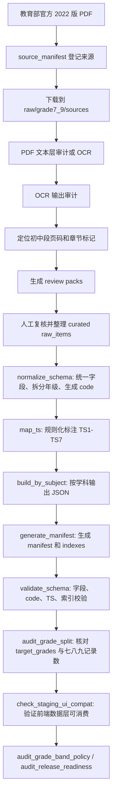

# 课标拆解方法说明（基于现有文件）

更新时间：2026-07-01

本文从仓库现有文档、脚本和数据文件中整理，说明我们现在如何把《义务教育课程标准（2022 年版）》拆解成网站可使用的数据。它不是新规范，而是对当前实际工作流的归纳，方便继续拆解、人工复核、数据合并和发布校验。

## 1. 主要依据文件

本说明主要参考以下现有文件：

| 文件或目录 | 作用 |
| --- | --- |
| `docs/CURRICULUM_STANDARD_DECOMPOSITION_METHOD.md` | 早期课标拆解方法说明。 |
| `docs/CURRICULUM_STANDARD_DECOMPOSITION_METHOD_SUMMARY.md` | 早期方法总结。 |
| `docs/CURRICULUM_STANDARD_BREAKDOWN_METHOD_CURRENT.md` | 当前工作法总结。 |
| `docs/STANDARD_EXTRACTION_METHOD_CONTRACT.md` | 全学科 standards 提取方法总 contract，固定每个学科的 primary source section、分类方式和必须保留的标签。 |
| `docs/RESOURCE_ARCHITECTURE.md` | 网站资源、架构和数据组织说明。 |
| `docs/JUNIOR_SECONDARY_EXPANSION_WORKFLOW.md` | 7-9 年级扩展工作流。 |
| `docs/JUNIOR_SECONDARY_SOURCE_AUDIT.md` | 官方来源和 OCR 证据审计。 |
| `docs/JUNIOR_SECONDARY_STRUCTURE_COVERAGE.md` | 课程目标、课程内容、学业质量、教学建议、评价建议覆盖审计。 |
| `docs/JUNIOR_SECONDARY_GRADE_SPLIT_AUDIT.md` | 7-9 年级拆分审计。 |
| `docs/JUNIOR_SECONDARY_PUBLIC_INTEGRATION_PLAN.md` | 7-9 staging 接入正式数据的记录和维护命令。 |
| `docs/JUNIOR_SECONDARY_RELEASE_READINESS.md` | 7-9 正式接入后的准备度和 gate 状态。 |
| `docs/*_GRADE7_9_STAGING.md` | 各学科 7-9 staging 说明。 |
| `src/data/schema.js` | 前端运行时标准记录规范化。 |
| `src/data/dataLoader.js` | 前端数据加载、缓存、筛选、学段展示口径。 |
| `public/data/by_subject/*.json` | 网站当前正式课程标准主数据。 |
| `public/data/manifest.json` | 正式数据总索引和字段清单。 |
| `public/data/subjects_meta.json` | 学科元数据。 |
| `public/data/skills_meta.json` | TS1-TS7 可迁移技能体系。 |
| `scripts/grade7_9/*.js` | 7-9 年级拆解、转换、校验和接入审计脚本。 |
| `scripts/grade7_9/curated/*_h3_raw.json` | 人工复核后的 7-9 年级结构化草案。 |

## 2. 一句话概括

我们的课标拆解方法是：

> 以官方 2022 版课标为唯一可信来源，先定位 PDF 页码和章节，再人工复核并整理为 `raw_items`；随后把每个原子学习目标转换成统一 schema 的标准记录，补充教学支持字段和 TS1-TS7 可迁移技能标签，最后生成按学科组织的 JSON、manifest、indexes，并通过脚本校验。

后续全学科标准提取和 H4G source-anchor correction 的最高方法 contract 是：

```text
docs/STANDARD_EXTRACTION_METHOD_CONTRACT.md
```

该 contract 明确：第 1-3 学段沿用当前已确定方法；H4G7/H4G8/H4G9 保留当前年级化结果作为起点，但必须按学科修正 primary source anchor、分类方式和必要标签。

网站正式运行时的主数据入口是：

```text
public/data/by_subject/{subject_slug}.json
```

7-9 年级的整理过程仍先输出到 staging：

```text
generated/grade7_9_all_curated/
```

当前正式 runtime 已采用目标口径 `H1=1-2, H2=3-4, H3=5-6, H4G7=7, H4G8=8, H4G9=9`。7-9 staging 仍以 `H4=7-9` 作为中间层语义，但写入 `public/data/by_subject/` 时已经拆为七、八、九年级独立记录。

## 3. 拆解目标

课标原文通常是长段落、表格、课程内容模块、学业质量描述或教学建议。拆解目标不是简单复制章节，而是形成网站和未来 Skill 都能直接使用的结构化记录。

拆解后的最小单位是：

> 一条独立、可定位、可教学使用、可评价、可关联能力标签的学习目标记录。

每条记录要能支持：

- 按学科浏览。
- 按学段、年级、领域、子领域筛选。
- 按可迁移技能反查。
- 进入单条标准详情页。
- 被搜索页、对比页、收藏清单和打印视图使用。
- 被教学计划匹配、进度表生成和覆盖分析复用。

## 4. 核心原则

### 4.1 真实来源优先

标准正文、来源页码和 code 不允许凭经验编造。7-9 年级的官方来源登记在：

```text
scripts/grade7_9/source_manifest.json
```

官方 PDF 下载到本地工作目录：

```text
raw/grade7_9/sources/
```

`raw/grade7_9/sources/` 不提交到 git，只作为本地官方源文件缓存。

### 4.2 原文核心与教学建议分离

`standard` 字段保存课标核心要求。它可以为了结构化做少量整理，但不能混入泛化教学建议。

教学落地信息放入：

- `context`
- `practice`
- `teaching_tip`
- `assessment_evidence_type`
- `materials_tools`
- `safety_notes`

这样网站和 Skill 才能清楚区分“课标要求”和“基于课标的教学支持”。

### 4.3 原子化

一条记录只表达一个相对独立的学习目标。拆分段落时看四个判断点：

1. 是否包含多个学习对象。
2. 是否包含多个核心动作。
3. 是否跨多个领域、任务群或子领域。
4. 是否需要不同的评价证据。

如果答案为是，优先拆成多条记录。

### 4.4 保留学科结构

不同学科不强行套同一套 `domain`。当前做法是让：

- `domain` 承担一级筛选和页面分组。
- `subdomain` 承担更细的内容定位。
- `project` 承担项目、任务群、主题或概念线索。

示例：

| 学科 | 常见 domain |
| --- | --- |
| 语文 | 识字与写字、阅读与鉴赏、表达与交流、梳理与探究、学习任务群 |
| 数学 | 数与代数、图形与几何、统计与概率、综合与实践、学业质量 |
| 英语 | 语言能力、文化意识、思维品质、学习能力、主题、语篇 |
| 科学 | 科学观念、科学思维、探究实践、态度责任、核心概念 |
| 信息科技 | 数据与编码、身边的算法、过程与控制、人工智能与智慧社会 |
| 道德与法治 | 道德教育、法治教育、国情教育、生命安全与健康教育 |
| 劳动 | 日常生活劳动、生产劳动、服务性劳动、公益劳动与志愿服务 |
| 体育与健康 | 运动能力、健康教育、体育品德、体能、专项运动技能 |
| 艺术 | 音乐、美术、舞蹈、戏剧（含戏曲）、影视（含数字媒体艺术）、课程目标、学业质量 |

### 4.5 可校验

拆解结果必须能被脚本检查：

- JSON 合法。
- code 唯一。
- `subject_slug` 与文件名一致。
- `grade_band`、`grade_range`、`grade` 一致。
- `domain` 和 `standard` 非空。
- `ts_primary` 有且仅有一个。
- `ts_secondary` 最多两个。
- TS code 只能来自 TS1-TS7。
- manifest 和 indexes 必须由 `by_subject` 派生并一致。
- H4G 完整三元组如果核心文本完全相同，必须标记为共享源标准和待年级化细分。

## 5. 标准记录结构

前端通过 `src/data/schema.js` 对标准记录做兜底规范化。当前主要字段如下：

| 字段 | 作用 |
| --- | --- |
| `id` | 条目 ID，通常等于 `code`。 |
| `code` | 标准唯一编码，用于 URL、收藏、详情页和反查。 |
| `subject` | 中文学科名。 |
| `subject_slug` | 学科 slug，也是 `by_subject` 文件名。 |
| `grade_band` | 学段/年级代码，如 H1、H2、H3、H4G7、H4G8、H4G9。 |
| `grade_range` | 年级范围，如 `1-2`、`7`、`8`、`9`。 |
| `grade` | 人类可读年级或学段。 |
| `stage_band` | 初中拆分记录的大阶段标记，当前为 `H4`。 |
| `grade_level` | 初中拆分记录的具体年级数字，当前为 7、8、9。 |
| `grade_assignment_type` | 年级归属依据类型，如 `shared_requirement_textbook_file_supported` 或 `auto_judged_low_confidence`。 |
| `textbook_evidence_ids` | 支持年级归属判断的教材证据 ID。 |
| `textbook_unit_evidence_ids` | 未来单元/章节级教材证据 ID，当前仍为空数组。 |
| `progression_group_id` | 同一标准在七/八/九年级进阶关系中的分组 ID。 |
| `standard_variant_type` | 当前 H4G 记录是否为 `same_source_shared`、`grade_specific_variant` 或部分年级变体。 |
| `evidence_granularity` | 教材证据粒度，如 `textbook_file_grade_level` 或 `textbook_unit_level`。 |
| `progression_distinctiveness` | 同组 H4G 核心文本是否相同。 |
| `requires_unit_level_evidence` | 是否仍需教材单元/章节级证据。 |
| `review_status` | 审核状态，如 `needs_grade_differentiation`。 |
| `domain` | 一级领域、核心素养维度、内容模块或任务群。 |
| `subdomain` | 子领域、内容线索、项目主题或细分学习任务。 |
| `project` | 项目、任务群或主题，可为空。 |
| `standard` | 标准核心学习要求。 |
| `context` | 适用情境或来源上下文。 |
| `practice` | 可落地学习任务或教学活动建议。 |
| `teaching_tip` | 教师组织、支架或注意事项。 |
| `assessment_evidence_type` | 可观察、可收集的评价证据。 |
| `materials_tools` | 材料和工具，可为空。 |
| `safety_notes` | 安全提示，可为空。 |
| `previous_code` | 前置或上一条标准 code，可为空。 |
| `next_code` | 后续或下一条标准 code，可为空。 |
| `ts_primary` | 主要可迁移技能，数组，当前要求一个。 |
| `ts_secondary` | 次要可迁移技能，数组，最多两个。 |
| `ts_rationale` | TS 标注理由。 |
| `ts_confidence` | TS 标注置信度，可为空。 |
| `ts_tag_source` | TS 标签来源，可为空。 |
| `discipline` | 学科或专业字段，部分数据使用。 |
| `art_discipline` | 艺术细分领域，艺术学科可用。 |

## 6. 从官方 PDF 到网站数据的流程



## 7. raw_items 的整理方式

人工复核后的 7-9 年级草案放在：

```text
scripts/grade7_9/curated/{subject_slug}_h3_raw.json
```

文件通常包含：

```json
{
  "source_file": "raw/grade7_9/sources/chinese-W020220420582344386456.pdf",
  "source_standard": "义务教育语文课程标准（2022年版）",
  "subject": "语文",
  "subject_slug": "chinese",
  "grade_scope": "7-9",
  "review_status": "staging_first_pass_needs_human_review",
  "raw_items": []
}
```

单条 `raw_items` 的关键字段：

| 字段 | 作用 |
| --- | --- |
| `source_pages` | 来源页码，用于回查官方 PDF。 |
| `source_section` | 来源章节、表格或内容块。 |
| `domain` | 一级领域。 |
| `subdomain` | 子领域、任务群或内容点。 |
| `standard` | 从官方内容整理出的核心学习要求。 |
| `context` | 来源上下文或适用情境。 |
| `practice` | 教学活动或学习任务建议。 |
| `teaching_tip` | 教学提示。 |
| `assessment_evidence_type` | 评价证据。 |
| `target_grades` | 目标年级数组，如 `[7, 8, 9]`。 |

`source_pages` 是人工复核的关键字段：它让每条草案都能回到官方 PDF。

## 8. 7-9 年级拆分规则

2022 版课标的初中段经常把 7-9 年级合写。staging 中仍可用 `H4=7-9` 表示第四学段中间层；正式 runtime 使用 `H4G7/H4G8/H4G9` 表示具体年级：

```json
{
  "stage_band": "H4",
  "grade_band": "H4G7",
  "grade_range": "7",
  "grade": "七年级"
}
```

拆分规则：

1. 如果官方文本明确写七、八、九年级，按官方年级拆。
2. 如果官方文本写 7-9 共同要求，且确实跨三年适用，`raw_items` 使用 `target_grades: [7, 8, 9]`。
3. `normalize_schema.js` 会把一条共同要求展开成七年级、八年级、九年级三条 staging records。
4. `build_grade_level_candidate.js` 会把正式 runtime 记录生成为 `H4G7/H4G8/H4G9`，并补充年级归属和进阶元数据。
5. 展开后的 records 可以共享同一核心要求，但 code 必须独立。
6. 完整 H4G 三元组如果核心文本完全相同，必须标为 `standard_variant_type: "same_source_shared"` 和 `review_status: "needs_grade_differentiation"`。
7. `audit_h4g_distinctiveness.js` 会核对是否存在未标记的完全重复三元组。
8. 如果无法确认年级归属，可低置信度发布，但必须显式标注，不能伪装成官方确定结论。

当前 curated staging 的年级展开事实是：

- 9 个学科。
- 400 条 raw items。
- 1081 条展开后的标准 records。
- 年级 records 拆为七年级、八年级、九年级。

## 9. code 生成方法

7-9 staging 由 `scripts/grade7_9/normalize_schema.js` 自动生成 code。

基本结构：

```text
{学科前缀}-H4-{领域缩写}-{三位序号}
```

示例：

```text
CN-H4-READ-001
MA-H4-ALG-001
ENG-H4-LANG-001
SC-H4-MAT-001
LA-H4-DL-001
```

学科前缀和领域缩写来自：

```text
scripts/grade7_9/config.js
```

如果某个 `domain` 没有配置缩写，脚本会 fallback。正式发布前应补齐配置，避免出现不清晰的 `GEN` 或不可读 code。

## 10. TS1-TS7 标注方法

TS 技能体系来自：

```text
public/data/skills_meta.json
```

7-9 staging 的自动标注由：

```text
scripts/grade7_9/map_ts.js
```

当前规则是 keyword-based + rule-based，不使用随机生成：

| TS | 倾向匹配内容 |
| --- | --- |
| TS1 | 分析、比较、解释、推理、证据、判断、论证、探究、归纳 |
| TS2 | 设计、创作、方案、改进、制作、项目、实践、解决问题 |
| TS3 | 计划、反思、自评、管理、策略、习惯、自主、持续 |
| TS4 | 合作、协作、小组、共同、分工、团队、公共参与 |
| TS5 | 表达、交流、展示、汇报、讲述、写作、阅读、倾听、沟通 |
| TS6 | 数据、编码、算法、程序、信息、数字、网络、人工智能、模型 |
| TS7 | 责任、伦理、法治、规则、安全、健康、可持续、国家、社会、环境 |

自动标注只是第一轮，正式入库前仍需要人工复核。

## 11. 7-9 staging 脚本管线

9 科 curated raw 草案可用一条命令重建完整 staging：

```bash
npm run grade7_9:build-curated
```

该命令默认输出到：

```text
generated/grade7_9_all_curated/
```

它会自动完成：

1. `normalize_schema`
2. `map_ts`
3. `build_by_subject`
4. `generate_manifest`
5. `validate_schema --staging-root`
6. `audit_grade_split`

以单学科为例，当前校验链路是：

```bash
node scripts/grade7_9/normalize_schema.js \
  --input scripts/grade7_9/curated/{subject_slug}_h3_raw.json \
  --out generated/grade7_9_{subject}_curated/normalized/{subject_slug}.json

node scripts/grade7_9/map_ts.js \
  --input generated/grade7_9_{subject}_curated/normalized/{subject_slug}.json \
  --out generated/grade7_9_{subject}_curated/mapped/{subject_slug}.json

node scripts/grade7_9/build_by_subject.js \
  --input-dir generated/grade7_9_{subject}_curated/mapped \
  --out-dir generated/grade7_9_{subject}_curated/by_subject

node scripts/grade7_9/generate_manifest.js \
  --by-subject-dir generated/grade7_9_{subject}_curated/by_subject \
  --out-dir generated/grade7_9_{subject}_curated

node scripts/grade7_9/validate_schema.js \
  --staging-root generated/grade7_9_{subject}_curated \
  --existing-data-root public/data
```

## 12. manifest 和 indexes 的生成方式

正式数据和 staging 数据都以 `by_subject` 为主数据源。manifest 和 indexes 是派生产物。

正式数据重建命令：

```bash
npm run build:indexes
npm run validate:indexes
```

staging 数据重建命令：

```bash
node scripts/grade7_9/generate_manifest.js \
  --by-subject-dir generated/grade7_9_all_curated/by_subject \
  --out-dir generated/grade7_9_all_curated
```

派生索引包括：

| 文件 | 作用 |
| --- | --- |
| `manifest.json` | 学科列表、字段清单、各学科 record_count、domain、grade_bands、grades。 |
| `indexes/code_to_subject.json` | 标准 code 到 `subject_slug` 的反查索引。 |
| `indexes/skill_to_subjects.json` | TS 技能到相关学科的轻量索引。 |
| `indexes/subject_stats.json` | 各学科总数、领域数、学段、年级和技能覆盖统计。 |

原则是：不要手工维护派生索引；修改主数据后重新生成并校验。

## 13. 正式数据与 staging 的关系

正式网站运行时数据：

```text
public/data/
├── manifest.json
├── subjects_meta.json
├── skills_meta.json
├── glossary.json
├── by_subject/
└── indexes/
```

7-9 扩展中间产物：

```text
generated/grade7_9*/
```

当前原则：

- `public/data/by_subject` 是网站当前主数据。
- `generated/grade7_9*` 是 7-9 扩展 staging 或 release candidate，不是正式发布入口。
- `scripts/grade7_9/curated/*_h3_raw.json` 是可提交的人工结构化草案。
- `raw/grade7_9/sources` 和 `generated` 是本地工作产物，不提交。
- 正式 runtime 已采用 `H1=1-2, H2=3-4, H3=5-6, H4G7=7, H4G8=8, H4G9=9`，7-9 数据已按年级粒度合并到正式主数据。

## 14. 当前学段口径

当前正式 runtime 使用：

```text
H1 = 1-2
H2 = 3-4
H3 = 5-6
H4G7 = 7
H4G8 = 8
H4G9 = 9
```

前端 `src/data/dataLoader.js` 中的 `GRADE_BANDS.H3.range` 保持为 `5-6年级`，并新增 `GRADE_BANDS.H4G7/H4G8/H4G9`。`GRADE_BANDS.H4` 仅作为 legacy stage label 保留，不参与正式筛选。

写入当前 runtime 时，原正式 public 数据中的 H1/H2/H3 记录已恢复并保留，共 852 条；7-9 staging records 已拆为 H4G7/H4G8/H4G9，共 1081 条。艺术旧数据中的 `H2:3-5`、`H3:6-7` 作为来源年级范围保留，不硬改。

当前正式主数据合计 1933 条，其中 H4G7 为 355 条、H4G8 为 363 条、H4G9 为 363 条。

当前 H4G distinctiveness 审计显示：323 个完整 H4G 三元组核心文本完全相同，但 `unlabeled_identical_triplets` 为 0；这些记录已经标为共享源标准和待年级化细分。后续真正分化需要教材单元/章节级证据、可用 `grade_specific_focus` 和人工/课程复核批准。

用于审计该风险的命令是：

```bash
npm run grade7_9:audit-grade-band-policy -- --out generated/grade7_9_grade_band_policy.json
```

作为发布 gate 时使用 strict 模式：

```bash
npm run grade7_9:audit-grade-band-policy -- --strict
npm run grade7_9:audit-h4g-distinctiveness -- --strict
npm run grade7_9:audit-h4g-grade-differentiation
```

当前结论是：正式 public 数据和前端学段展示口径已经统一，`audit-grade-band-policy --strict` 可通过；共享源标准也已被标记，`audit-h4g-distinctiveness --strict` 可通过。但 `audit-h4g-grade-differentiation` 会报告 `differentiation_ready=false`，因为正式 public 尚无单元级教材证据和最终年级化重点。

## 15. 发布前必须通过的校验

每次修改 7-9 curated raw 或 staging 管线后，建议按顺序运行：

```bash
npm run grade7_9:audit-structure -- --out generated/grade7_9_structure_coverage.json
npm run grade7_9:build-curated
npm run grade7_9:audit-grade-split -- --out generated/grade7_9_grade_split_audit.json
npm run grade7_9:plan-integration -- --staging-root generated/grade7_9_all_curated
npm run grade7_9:validate -- --staging-root generated/grade7_9_all_curated --existing-data-root public/data
npm run grade7_9:check-ui -- --staging-root generated/grade7_9_all_curated
npm run grade7_9:build-release-candidate
npm run grade7_9:check-release-candidate
npm run grade7_9:audit-grade-band-policy -- --strict
npm run grade7_9:audit-h4g-distinctiveness -- --strict
npm run grade7_9:audit-h4g-grade-differentiation
npm run grade7_9:audit-release -- --staging-root generated/grade7_9_all_curated --strict
npm run build:indexes
npm run validate:indexes
npm run build
```

如果候选集确认无误，再执行真实写入：

```bash
npm run grade7_9:apply-release-candidate -- --write --confirm-target-policy
```

## 16. 当前 7-9 staging 进度

截至本文整理时，已有 9 科 curated raw 草案：

| 学科 | curated raw | raw_items | 展开后 records | 说明文档 |
| --- | --- | ---: | ---: | --- |
| 劳动 | `scripts/grade7_9/curated/labor_h3_raw.json` | 22 | 66 | `docs/LABOR_GRADE7_9_STAGING.md` |
| 信息科技 | `scripts/grade7_9/curated/it_h3_raw.json` | 22 | 66 | `docs/IT_GRADE7_9_STAGING.md` |
| 道德与法治 | `scripts/grade7_9/curated/morality_law_h3_raw.json` | 42 | 126 | `docs/MORALITY_LAW_GRADE7_9_STAGING.md` |
| 语文 | `scripts/grade7_9/curated/chinese_h3_raw.json` | 52 | 156 | `docs/CHINESE_GRADE7_9_STAGING.md` |
| 数学 | `scripts/grade7_9/curated/math_h3_raw.json` | 38 | 114 | `docs/MATH_GRADE7_9_STAGING.md` |
| 英语 | `scripts/grade7_9/curated/english_h3_raw.json` | 54 | 132 | `docs/ENGLISH_GRADE7_9_STAGING.md` |
| 体育与健康 | `scripts/grade7_9/curated/pe_h3_raw.json` | 41 | 123 | `docs/PE_GRADE7_9_STAGING.md` |
| 科学 | `scripts/grade7_9/curated/science_h3_raw.json` | 67 | 201 | `docs/SCIENCE_GRADE7_9_STAGING.md` |
| 艺术 | `scripts/grade7_9/curated/arts_h3_raw.json` | 62 | 97 | `docs/ARTS_GRADE7_9_STAGING.md` |

这些 curated raw 仍保留 `review_status: "staging_first_pass_needs_human_review"`，表示文本粒度和 OCR 复核仍可继续精修；但它们已经通过 release candidate 流程生成并接入当前正式 runtime 数据。

## 17. 人工拆解检查表

新增或修改一条标准时，逐条确认：

- [ ] 是否来自官方 2022 版课标或可核验 OCR 页码。
- [ ] 是否有 `source_pages` 可回查。
- [ ] 是否只表达一个原子学习目标。
- [ ] `standard` 是否保留原文核心，不混入泛化教学建议。
- [ ] `context` 是否说明来源情境或适用情境。
- [ ] `practice` 是否是可落地任务。
- [ ] `teaching_tip` 是否是教师操作提示。
- [ ] `assessment_evidence_type` 是否可观察、可收集。
- [ ] `domain` / `subdomain` 是否符合学科结构。
- [ ] `target_grades` 是否合理且可解释。
- [ ] normalize 后 `grade` 是否拆到七/八/九年级。
- [ ] code 是否唯一且可读。
- [ ] `ts_primary` 是否唯一。
- [ ] `ts_secondary` 是否不超过两个。
- [ ] `ts_rationale` 是否解释了标注理由。
- [ ] staging pipeline 是否完整跑通并通过 validate。
- [ ] H3=5-6、H4G7/H4G8/H4G9 口径是否已经通过 policy gate。

## 18. 当前方法边界

1. OCR 结果不是最终标准原文，必须人工复核。
2. 自动 raw extraction 只能生成候选，不能直接作为正式标准。
3. `standard` 是结构化后的核心学习要求，不应混入泛化教学建议。
4. TS 自动映射是第一轮标签，不代表最终人工审核结论。
5. 旧 public 中 H1/H2/H3 记录已恢复并保留；7-9 不再占用 H3，而是使用 H4。
6. 后续如果要调整艺术 `H2:3-5`、`H3:6-7` 这类来源范围，必须先设计清晰的数据契约，不能直接硬改年级含义。
7. 对外引用“课程标准原文”时，应优先引用 `standard`、`source_pages` 和官方来源，而不是教学建议字段。

## 19. 推荐下一步

1. 继续人工复核 7-9 curated raw 的 OCR 误差、标准粒度和 TS 映射。
2. 修复既有非 H4 记录 `SC-D1-SC-012` 的 `assessment_evidence_type` 空值。
3. 如需调整旧 `H2:3-5`、`H3:6-7` 数据，先设计新的 runtime 数据契约。
4. 每次修改正式数据后运行 `npm run validate:indexes`、`npm run grade7_9:audit-grade-band-policy -- --strict`、`npm run grade7_9:audit-release -- --staging-root generated/grade7_9_all_curated --strict`、`npm run build`。
5. 检查学科页、搜索页、对比页、技能页和详情页是否能正常消费 7-9 数据。
