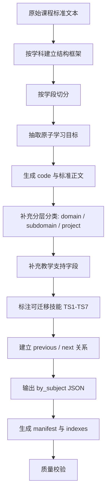

# 课标拆解方法说明

更新时间：2026-06-30
整理依据：`README.md`、`docs/RESOURCE_ARCHITECTURE.md`、`src/data/schema.js`、`public/data/manifest.json`、`public/data/by_subject/*.json`、`public/data/subjects_meta.json`、`public/data/skills_meta.json`、`skills/*/zhenzheng-keyong-kebiao-skill/references/*.md`

## 1. 方法目标

我们当前的课标拆解方法，是把《义务教育课程标准（2022年版）》中长篇、叙述性的课程要求，拆成可以检索、筛选、对比、匹配教学计划的结构化数据。

拆解后的最小单位不是章节、段落或页面，而是：

> 一条独立、可定位、可教学使用、可评价、可关联能力标签的学习目标条目。

这个条目最终落在 `public/data/by_subject/*.json` 的 `standards` 数组中，是网站和 Skill 都应优先信任的主数据。

## 2. 拆解原则

### 2.1 原子化

每条记录只承载一个相对独立的学习要求。拆解时优先寻找“学生应能做什么、知道什么、理解什么、表现出什么”的可观察目标。

如果原文中一个段落包含多个对象、多个动作或多个评价点，需要拆成多条记录，避免一条标准里混入过多教学任务。

### 2.2 可定位

每条标准必须能被唯一定位，至少包含：

- 学科：`subject` / `subject_slug`
- 学段：`grade_band` / `grade_range`
- 领域：`domain`
- 子领域：`subdomain`
- 唯一编码：`code`

这样才能支持学科页、搜索页、标准详情页、收藏清单和 Skill 反查。

### 2.3 保留原文核心

`standard` 字段应保存课程标准的核心学习要求。可以为了结构化做轻微整理，但不能把教学建议、活动设计或解释性语言混成标准原文。

如果需要补充“为什么这样教、如何落地、如何评价”，放入教学支持字段。

### 2.4 教学可用

每条标准不仅要能被查到，还要能服务教学设计。因此现有数据会为标准补充：

- `context`：标准适用的情境或原文上下文。
- `practice`：可落地的教学活动或任务建议。
- `teaching_tip`：教师操作提示、支架或注意事项。
- `assessment_evidence_type`：可观察、可收集的评价证据。
- `materials_tools`、`safety_notes`：材料、工具和安全提示，可为空。

### 2.5 能力可迁移

每条标准可以关联可迁移技能：

- `ts_primary`：主要培养的可迁移技能。
- `ts_secondary`：附带培养的可迁移技能。
- `ts_rationale`：为什么这样标注。

技能体系来自 `public/data/skills_meta.json`，当前为 TS1-TS7 七类，细分为 26 个子技能。

### 2.6 可解释与可校验

拆解结果要能解释“为什么这样归类、为什么这样标注技能、为什么对应这个学段”。字段缺失或低置信度时，应保留空值或 warning 思路，而不是假装完整。

## 3. 拆解后的标准记录结构

当前标准记录字段由 `manifest.json.columns` 和 `src/data/schema.js` 共同约束。

### 3.1 身份字段

| 字段 | 说明 |
| --- | --- |
| `id` | 条目 ID，通常等于 `code`。 |
| `code` | 唯一编码，用于详情页、收藏、打印、Skill 引用。 |

### 3.2 学科与分类字段

| 字段 | 说明 |
| --- | --- |
| `subject` | 中文学科名，如“科学”。 |
| `subject_slug` | 学科 slug，如 `science`。 |
| `discipline` | 学科/专业字段，部分数据使用。 |
| `art_discipline` | 艺术细分领域，艺术学科可用。 |
| `domain` | 学科一级领域或核心素养维度。 |
| `subdomain` | 领域下更细的内容、学习任务、核心概念或任务群。 |
| `project` | 项目、任务群、主题或概念线索，可为空。 |

### 3.3 学段字段

| 字段 | 说明 |
| --- | --- |
| `grade_band` | 学段代码，如 `H1`、`H2`、`H3`。 |
| `grade_range` | 年级范围，如 `1-2`、`3-4`。 |
| `grade` | 人类可读学段文本，如“第一学段（1-2年级）”。 |

注意：当前文件中存在学段口径需统一的问题。代码里的常见口径是 H1=1-2、H2=3-4、H3=5-6；README/术语内容中曾出现 H2=3-6、H3=7-9 的全阶段口径。继续拆解时必须先确认本批数据采用哪套口径。

### 3.4 标准正文与教学支持字段

| 字段 | 说明 |
| --- | --- |
| `standard` | 标准核心描述，是最重要的原子学习目标。 |
| `context` | 情境说明或原文上下文，帮助理解标准适用场景。 |
| `practice` | 可落地教学活动、任务或实践建议。 |
| `teaching_tip` | 教师策略、支架、提醒或教学注意点。 |
| `assessment_evidence_type` | 学生达成标准的证据类型。 |
| `materials_tools` | 材料和工具。 |
| `safety_notes` | 安全提示。 |

### 3.5 顺序与导航字段

| 字段 | 说明 |
| --- | --- |
| `previous_code` | 前置或上一条标准 code，可为空，可多行。 |
| `next_code` | 后续或下一条标准 code，可为空，可多行。 |

这些字段让标准之间可以形成学习进阶或内容衔接关系。例如语文 H1 识字条目可指向 H2 相关条目。

### 3.6 可迁移技能字段

| 字段 | 说明 |
| --- | --- |
| `ts_primary` | 主技能标签，数组。 |
| `ts_secondary` | 次技能标签，数组。 |
| `ts_rationale` | 技能标注理由。 |
| `ts_confidence` | 技能标注置信度，可为空。 |
| `ts_tag_source` | 标签来源，可为空。 |

`schema.js` 会把 `ts_primary` 和 `ts_secondary` 规范化为数组，避免页面和脚本处理时出现类型不一致。

## 4. 编码方法

### 4.1 基本结构

现有编码整体遵循：

```text
学科前缀-学段/阶段-领域或任务缩写-序号
```

例如：

```text
SC-D1-AR-001
│  │  │   │
│  │  │   └── 序号
│  │  └────── 领域/核心素养/任务缩写
│  └───────── 学段或阶段
└──────────── 学科前缀
```

### 4.2 当前实际前缀示例

| 学科 | 示例 code |
| --- | --- |
| 科学 | `SC-D1-AR-001` |
| 数学 | `MA-D1-GE-001` |
| 语文 | `CN-D1-LI-001` |
| 英语 | `EN-D1-SA-001` |
| 信息科技 | `IT-H1-DL-001` |
| 劳动 | `LA-D1-DL-CH-001` |
| 道德与法治 | `ML-D1-ENR-001` |
| 体育 | `PE-D1-HB-001` |
| 艺术 | `AR-D1-AE-MU-001` |

注意：当前数据里同时出现 `D1/D2/D3` 和 `H1/H2/H3` 两种 code 中段写法。继续拆解时建议统一规范，或在数据契约中明确二者的关系。

### 4.3 编码要求

- 每条标准 `code` 必须唯一。
- `code` 不要复用已删除或已改写条目的旧含义。
- `code` 应能大致看出学科、学段和领域。
- 对未来新增学科，应先建立前缀表，再批量生成 code。

## 5. 学科结构如何映射到 domain / subdomain

不同学科的课程结构不同，拆解时不强行用同一套领域名称，而是保留学科自身结构。

当前做法：

| 学科 | domain / subdomain 的拆解口径 |
| --- | --- |
| 语文 | `domain` 常见为识字与写字、阅读与鉴赏、表达与交流、梳理与探究；`project` 可记录学习任务群。 |
| 数学 | `domain` 常见为数与代数、图形与几何、统计与概率；`subdomain` 记录更细内容。 |
| 英语 | `domain` 常见为语言能力、文化意识、学习能力、思维品质。 |
| 科学 | `domain` 常见为科学观念、科学思维、探究实践、态度责任；`subdomain` 可记录核心概念。 |
| 信息科技 | `domain` 可为内容模块或跨学科主题，如数据与编码、身边的算法。 |
| 道德与法治 | `domain` 可为道德教育、法治教育、国情教育等主题板块。 |
| 艺术 | `domain` 可为艺术表现等素养线索，`subdomain` 常记录学习任务。 |
| 劳动 | `domain` 可为日常生活劳动、生产劳动、服务性劳动等。 |
| 体育 | `domain` 可为健康教育、体育品德、运动技能、体能等。 |

原则是：`domain` 承担“一级筛选和分组”，`subdomain` 承担“细分定位和教学语境”。

## 6. 拆解流程 SOP

### Step 1：确定数据范围和版本

先记录：

- 来源标准版本。
- 学科覆盖范围。
- 年级/学段覆盖范围。
- 本批数据采用的 H1/H2/H3 口径。
- 拆解日期和负责人/工具。

建议未来写入 `public/data/data_version.json`。

### Step 2：按学科建立结构框架

阅读该学科课程标准的目录、核心素养、内容模块、学习任务群或主题板块，先确定：

- `subject`
- `subject_slug`
- 允许的 `domain`
- 常见 `subdomain`
- 是否需要 `project`
- 是否需要学科特殊字段，如 `art_discipline`

这个框架应与 `public/data/subjects_meta.json` 的 `structure_notes` 对齐。

### Step 3：按学段切分

把原始文本按年级段或学习水平切开，填入：

- `grade_band`
- `grade_range`
- `grade`

如果原文是跨年级要求，要明确落入哪个学段；不能确定时不应硬拆为确定年级。

### Step 4：抽取原子学习目标

对每个学段和领域，逐句识别学习要求。判断是否需要拆成多条时，看四个维度：

1. 是否有多个学习对象。
2. 是否有多个核心动词。
3. 是否跨多个领域或子领域。
4. 是否需要不同的评价证据。

如果答案为是，优先拆成多条标准。

### Step 5：生成标准正文 `standard`

把原子目标改写为简洁、可读、可检索的标准正文。

要求：

- 保留原文核心意思。
- 使用学生表现导向的句式，如“能……”“认识……”“愿意……”“掌握……”。
- 不把活动建议写入 `standard`。
- 不把评价方式写入 `standard`，除非原文本身就是表现要求。

### Step 6：补充分层分类

为每条记录填入：

- `domain`
- `subdomain`
- `project`

如果原文来自某个学习任务群、核心概念、项目主题，把它放入 `subdomain` 或 `project`，不要丢失结构来源。

### Step 7：补充教学支持字段

基于原文、课程结构和教学使用场景补充：

- `context`：这条标准在什么情境中发生。
- `practice`：可以做什么任务或活动。
- `teaching_tip`：教师如何组织、提示、支架。
- `assessment_evidence_type`：通过什么证据判断达成。
- `materials_tools`、`safety_notes`：如有必要再填。

这些字段是教学建议，不等同于标准原文。

### Step 8：标注可迁移技能

使用 `skills_meta.json` 中 TS1-TS7 框架，为标准标注：

- 一个主技能 `ts_primary`。
- 可选的次技能 `ts_secondary`。
- 简短理由 `ts_rationale`。

判断逻辑：

- 标准要求证据、解释、推理、比较、判断：常关联 TS1。
- 标准要求创造、设计、改进、方案：常关联 TS2。
- 标准要求计划、自我管理、反思、习惯：常关联 TS3。
- 标准要求小组合作、公共参与、共同完成任务：常关联 TS4。
- 标准要求表达、展示、交流、倾听：常关联 TS5。
- 标准要求数据、数字工具、算法、信息判断：常关联 TS6。
- 标准要求责任、伦理、可持续、国家/社会/环境议题：常关联 TS7。

如果无法判断，不要硬标；保留空数组比误标更好。

### Step 9：建立前后关系

如果标准明显存在学习进阶，填入：

- `previous_code`
- `next_code`

例如同一领域从 H1 到 H2 的递进，或同一学习任务群的连续要求。

### Step 10：按学科输出 JSON

每个学科输出一个文件：

```text
public/data/by_subject/{subject_slug}.json
```

结构：

```json
{
  "standards": []
}
```

每条记录需要通过 `schema.js` 的字段契约：缺失字符串用空字符串，数组字段用空数组。

### Step 11：生成索引和统计

拆解完成后，更新或生成：

- `public/data/manifest.json`
- `public/data/indexes/code_to_subject.json`
- `public/data/indexes/skill_to_subjects.json`
- `public/data/indexes/subject_stats.json`

索引只能由主数据派生，不应手工维护两套口径。

### Step 12：质量校验

至少检查：

- JSON 是否合法。
- `code` 是否唯一。
- `subject_slug` 是否与文件名一致。
- `grade_band` 是否符合本批学段口径。
- `domain` 是否在该学科结构框架中。
- `ts_primary` / `ts_secondary` 是否只包含合法 TS code。
- `manifest` 统计是否等于 `by_subject` 实际数量。
- 标准正文、教学建议、评价证据是否混写。
- staging 数据是否能被当前网站数据层消费：学科页筛选、领域分组、对比、搜索 TS 筛选、技能详情反查、标准详情 code 查找。

## 7. 初中段 7-9 合写课标的特殊拆解规则

2022 版义务教育课标中，初中段内容经常以“7-9 年级”整体呈现。进入本项目数据时，不能只保留一个笼统的 7-9 条目，而要在不改变 schema 的前提下拆成年级记录。

当前约定：

- staging 阶段统一使用 `grade_band: "H3"`。
- staging 阶段统一使用 `grade_range: "7-9"`。
- 具体年级写入现有 `grade` 字段，值为“七年级”“八年级”“九年级”。
- 不新增 `target_grade`、`junior_grade` 等并行字段。
- 在 H3 口径冲突解决前，不把初中段 staging 数据直接覆盖到 `public/data/by_subject`。

拆解时按以下优先级处理：

1. 原文已经明确七/八/九年级或水平层级时，按原文分配到对应年级。
2. 原文只写 7-9 年级共同要求，但目标确实跨三年递进适用时，生成三条记录，分别写入七年级、八年级、九年级。
3. 原文包含多个动作、对象、任务或评价点时，先拆成原子标准，再分配年级。
4. 如果无法从原文和学科结构判断年级归属，保留在 staging 审核队列，不写入正式主数据。

年级拆分后的三条记录可以共享同一条原文核心，但必须有独立 `code`。例如：

```text
CN-H3-READ-001  七年级
CN-H3-READ-002  八年级
CN-H3-READ-003  九年级
```

这样做的原因是：网站的筛选、对比、详情页和 Skill 反查都依赖单条记录的字段，而不是额外的年级解释文本。

## 8. 一条标准的拆解样例

以科学样例 `SC-D1-AR-001` 为例：

| 字段 | 内容 |
| --- | --- |
| `subject` | 科学 |
| `grade_band` | H1 |
| `domain` | 态度责任 |
| `subdomain` | 人类活动与环境 |
| `project` | 人类活动对环境的影响 |
| `standard` | 愿意倾听他人想法，并乐于分享和表达自己的观点。 |
| `context` | 在调查与交流中倾听、分享、表达观点。 |
| `practice` | 一周垃圾分类调查、小组汇报、绿色墙海报。 |
| `teaching_tip` | 通过资料收集、实地调查、交流分享认识资源与环境问题。 |
| `assessment_evidence_type` | 数据表/图表+口头/书面汇报 |
| `ts_primary` | TS4 |
| `ts_rationale` | 标准/活动要求小组合作、分工协作完成探究或任务。 |

这说明一条拆解后的记录同时保留了：

- 学习目标：学生要达成什么。
- 结构位置：属于哪个学科、学段、领域。
- 教学落地：可以怎样教。
- 评价证据：如何看见达成。
- 能力关联：练到了什么可迁移技能。

## 9. 当前方法中的已知注意点

### 9.1 学段口径需要统一

当前文件中存在小学阶段口径和义务教育全阶段口径混用的风险。继续拆解前应先确认：

- 本项目是否只覆盖小学阶段。
- H2/H3 是否对应 3-4 / 5-6，还是 3-6 / 7-9。

### 9.2 数据统计需要从主数据再生成

`docs/RESOURCE_ARCHITECTURE.md` 已指出，`manifest.json`、`subject_stats.json` 与 `public/data/by_subject` 实际数量存在差异。方法上应以 `by_subject` 为主数据，派生索引必须重新生成。

### 9.3 技能标注字段名要统一

当前主数据使用 `ts_primary` / `ts_secondary`。不要再引入 `transferable_skills` 之类的并行字段，除非做完整迁移。

### 9.4 原文与建议要分离

`standard` 是核心标准正文；`practice`、`teaching_tip`、`assessment_evidence_type` 是基于标准的教学支持信息。未来导出或 Skill 输出时必须区分二者。

### 9.5 初中段数据必须先过 OCR/原文复核

本仓库已经记录了教育部官方 2022 版 PDF 链接，并可下载到 `raw/grade7_9/sources/`。但本机审计发现这些 PDF 当前没有可用文本层，自动抽取只能生成 `requires_ocr` 状态，不能直接产出真实标准条目。

因此，7-9 年级正式拆解前必须先完成 OCR 或提供可核验文本，再进入原子化拆解、schema 归一和 TS 映射。当前仓库提供了 macOS Apple Vision OCR 命令：

```bash
npm run grade7_9:ocr -- --subjects chinese --out-dir generated/grade7_9/ocr_text
```

OCR 文本只能作为待复核来源，不能绕过人工校对直接发布为正式标准数据。

## 10. 当前仓库的 staging 管线

当前 7-9 年级拆解不直接改正式主数据，而是先进入 staging 管线。

实际流程：

1. 官方 PDF 登记在 `scripts/grade7_9/source_manifest.json`。
2. 官方 PDF 下载到 `raw/grade7_9/sources/`，该目录不提交到 git。
3. OCR 文本生成到 `generated/grade7_9/ocr_text/`，该目录只作为本机 staging 产物。
4. 初中段标记由 `npm run grade7_9:locate-junior` 生成。
5. 人工复核包由 `npm run grade7_9:review-packs` 生成。
6. 人工整理后的首批结构化草案放在 `scripts/grade7_9/curated/{subject}_h3_raw.json`。
7. `normalize_schema.js` 把 `target_grades: [7, 8, 9]` 展开成七年级、八年级、九年级 records。
8. `map_ts.js` 依据规则补充 TS 标签。
9. `build_by_subject.js` 生成 staging 的 by_subject JSON。
10. `validate_schema.js` 校验字段、数量和 H3 口径风险。
11. `generate_manifest.js` 为 staging 数据生成 manifest 与 indexes。
12. 再次运行 `validate_schema.js --staging-root`，交叉校验 manifest、code_to_subject、skill_to_subjects、subject_stats 与 by_subject 实际数据一致。
13. 运行 `check_staging_ui_compat.js`，验证 staging 数据能支撑现有网站的数据层入口。

```bash
npm run grade7_9:check-ui -- --staging-root generated/grade7_9_all_curated
```

这个检查会覆盖 `SubjectPage`、`CompareView`、`SearchResultsPage`、`SkillDetailPage`、`StandardDetailPage` 依赖的字段、筛选、分组、TS 反查和 code-to-subject 索引。

已按这条管线形成首批 staging 草案：

| 学科 | curated raw | normalize 后 records | 说明文档 |
| --- | --- | ---: | --- |
| 劳动 | `scripts/grade7_9/curated/labor_h3_raw.json` | 66 | `docs/LABOR_GRADE7_9_STAGING.md` |
| 信息科技 | `scripts/grade7_9/curated/it_h3_raw.json` | 66 | `docs/IT_GRADE7_9_STAGING.md` |
| 道德与法治 | `scripts/grade7_9/curated/morality_law_h3_raw.json` | 126 | `docs/MORALITY_LAW_GRADE7_9_STAGING.md` |
| 语文 | `scripts/grade7_9/curated/chinese_h3_raw.json` | 156 | `docs/CHINESE_GRADE7_9_STAGING.md` |
| 数学 | `scripts/grade7_9/curated/math_h3_raw.json` | 114 | `docs/MATH_GRADE7_9_STAGING.md` |
| 英语 | `scripts/grade7_9/curated/english_h3_raw.json` | 132 | `docs/ENGLISH_GRADE7_9_STAGING.md` |
| 体育与健康 | `scripts/grade7_9/curated/pe_h3_raw.json` | 123 | `docs/PE_GRADE7_9_STAGING.md` |
| 科学 | `scripts/grade7_9/curated/science_h3_raw.json` | 201 | `docs/SCIENCE_GRADE7_9_STAGING.md` |
| 艺术 | `scripts/grade7_9/curated/arts_h3_raw.json` | 97 | `docs/ARTS_GRADE7_9_STAGING.md` |

当前 staging 校验通过，但仍会提示正式数据已占用 `H3` 的 warning。在 H3 合并策略确认前，只能把生成结果保存在 `generated/`，不能写入 `public/data/by_subject/`。

## 11. 推荐的拆解检查表

新增或修改一批标准时，逐条确认：

- [ ] 是否只有一个原子学习目标。
- [ ] `code` 是否唯一且符合前缀规则。
- [ ] `subject_slug` 是否与文件名一致。
- [ ] `grade_band`、`grade_range`、`grade` 是否一致。
- [ ] 初中段是否已经从 7-9 合写要求拆到七年级、八年级、九年级。
- [ ] `domain`、`subdomain` 是否符合学科结构。
- [ ] `standard` 是否保留原文核心要求。
- [ ] `context` 是否说明适用情境。
- [ ] `practice` 是否是可落地任务。
- [ ] `teaching_tip` 是否给出教师操作提示。
- [ ] `assessment_evidence_type` 是否可观察、可收集。
- [ ] `ts_primary` / `ts_secondary` 是否使用合法 TS code。
- [ ] `ts_rationale` 是否能解释标注理由。
- [ ] `previous_code` / `next_code` 是否需要填写。
- [ ] 空字段是否用空字符串或空数组，而不是缺失字段。
- [ ] staging 数据是否通过 normalize、map-ts、build、validate、manifest 全链路。
- [ ] staging 数据是否通过 `grade7_9:check-ui`，证明现有网站页面的数据层可以消费。

## 12. 简化流程图


