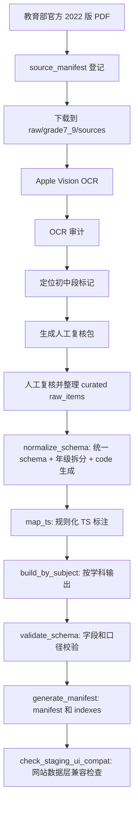

# 课标拆解方法总结

更新时间：2026-06-30

本文件基于仓库现有文件整理，说明我们当前如何把《义务教育课程标准（2022 年版）》拆解成网站可查询、可筛选、可对比、可匹配教学计划的结构化数据。

主要依据文件：

- `docs/CURRICULUM_STANDARD_DECOMPOSITION_METHOD.md`
- `docs/RESOURCE_ARCHITECTURE.md`
- `docs/JUNIOR_SECONDARY_EXPANSION_WORKFLOW.md`
- `docs/JUNIOR_SECONDARY_SOURCE_AUDIT.md`
- `docs/*_GRADE7_9_STAGING.md`
- `src/data/schema.js`
- `public/data/manifest.json`
- `public/data/by_subject/*.json`
- `public/data/subjects_meta.json`
- `public/data/skills_meta.json`
- `scripts/grade7_9/*.js`
- `scripts/grade7_9/curated/*_h3_raw.json`

## 1. 一句话概括

我们的拆解方法是：

> 先从官方课标 PDF 和 OCR 文本中定位真实来源，再人工复核并整理为 `raw_items`，把每个原子学习目标转换成统一 schema 的标准记录，补充教学支持字段和 TS1-TS7 可迁移技能标签，最后生成按学科组织的 JSON、manifest、indexes，并通过脚本校验。

最终进入网站运行时的主数据形态是：

```text
public/data/by_subject/{subject_slug}.json
```

初中 7-9 年级目前只进入 staging，不直接写入正式 `public/data/by_subject`。

## 2. 核心目标

课标原文通常是长段落、表格、学段要求或任务群说明。拆解的目标不是简单搬运章节，而是形成最小可用教学单元：

> 一条独立、可定位、可教学使用、可评价、可关联能力标签的学习目标记录。

拆解后的每条记录需要支持：

- 按学科浏览。
- 按学段筛选。
- 按领域、子领域筛选。
- 按可迁移技能反查。
- 进入单条标准详情页。
- 被教学计划、进度表、覆盖分析或 Skill 调用。

## 3. 方法原则

### 3.1 真实来源优先

标准正文和 code 不允许凭经验编造。

当前 7-9 年级来源统一登记在：

```text
scripts/grade7_9/source_manifest.json
```

来源 PDF 下载到：

```text
raw/grade7_9/sources/
```

该目录不提交到 git，只作为本地官方源文件缓存。

### 3.2 原文、结构化改写、教学建议分离

`standard` 字段承载标准核心要求，不能混入泛化教学建议。

教学落地信息进入：

- `context`
- `practice`
- `teaching_tip`
- `assessment_evidence_type`
- `materials_tools`
- `safety_notes`

这样网站和 Skill 可以清楚区分“课标要求”和“基于课标的教学支持”。

### 3.3 原子化

一条记录只表达一个相对独立的学习目标。判断是否需要拆分时，看四个问题：

1. 是否包含多个学习对象。
2. 是否包含多个核心动作。
3. 是否跨多个领域或子领域。
4. 是否需要不同评价证据。

如果答案为是，优先拆成多条记录。

### 3.4 保留学科自身结构

不同学科不用强行套同一套领域名称。

`domain` 用于一级筛选和页面分组，`subdomain` 用于更细定位。比如：

| 学科 | 常见 domain |
| --- | --- |
| 语文 | 识字与写字、阅读与鉴赏、表达与交流、梳理与探究、学习任务群 |
| 数学 | 数与代数、图形与几何、统计与概率、综合与实践、学业质量 |
| 英语 | 语言能力、文化意识、思维品质、学习能力、主题、语篇 |
| 信息科技 | 数据与编码、身边的算法、过程与控制、人工智能与智慧社会 |
| 道德与法治 | 道德教育、法治教育、国情教育、生命安全与健康教育 |
| 劳动 | 日常生活劳动、生产劳动、服务性劳动、公益劳动与志愿服务 |

### 3.5 可校验

拆解结果必须能被脚本检查：

- JSON 合法。
- code 唯一。
- 字段齐全。
- 学科 slug 与文件名一致。
- 学段字段一致。
- domain 和 standard 非空。
- `ts_primary` 有且仅有一个。
- `ts_secondary` 最多两个。
- TS code 来自 TS1-TS7。

## 4. 标准记录结构

当前前端通过 `src/data/schema.js` 统一规范化标准记录。核心字段如下：

| 字段 | 作用 |
| --- | --- |
| `id` | 条目 ID，通常等于 `code`。 |
| `code` | 标准唯一编码，用于详情页、收藏、引用和反查。 |
| `subject` | 中文学科名。 |
| `subject_slug` | 学科 slug，也是 by_subject 文件名。 |
| `grade_band` | 学段代码，如 H1、H2、H3。 |
| `grade_range` | 年级范围，如 1-2、3-4、7-9。 |
| `grade` | 人类可读年级或学段。 |
| `domain` | 一级领域、核心素养维度、内容模块或任务群。 |
| `subdomain` | 子领域、内容线索、项目主题或细分学习任务。 |
| `project` | 项目、任务群或主题，可为空。 |
| `standard` | 标准核心学习要求。 |
| `context` | 适用情境或原文上下文。 |
| `practice` | 可落地的学习任务或教学活动建议。 |
| `teaching_tip` | 教师组织、支架或注意事项。 |
| `assessment_evidence_type` | 可观察、可收集的评价证据。 |
| `materials_tools` | 材料和工具，可为空。 |
| `safety_notes` | 安全提示，可为空。 |
| `previous_code` | 前置或上一条标准 code，可为空。 |
| `next_code` | 后续或下一条标准 code，可为空。 |
| `ts_primary` | 主要可迁移技能，数组，当前要求一个。 |
| `ts_secondary` | 次要可迁移技能，数组，最多两个。 |
| `ts_rationale` | TS 标注理由。 |

## 5. 数据流



## 6. 7-9 年级 staging 管线

初中段使用独立脚本目录：

```text
scripts/grade7_9/
```

主要脚本职责：

| 脚本 | 作用 |
| --- | --- |
| `download_sources.js` | 根据 source_manifest 下载官方 PDF。 |
| `audit_pdf_text.js` | 检查 PDF 是否有可抽取文本层。 |
| `ocr_pdf_vision.js` / `vision_ocr.swift` | 使用 macOS Apple Vision 做 OCR。 |
| `audit_ocr_outputs.js` | 审计 OCR 是否完整、是否有错误页或低文本页。 |
| `locate_junior_markers.js` | 定位第四学段、7-9、三级、水平四等初中段标记。 |
| `build_review_packs.js` | 生成每科人工复核 Markdown/JSON 包。 |
| `normalize_schema.js` | 把 raw_items 转成统一标准记录，生成 code，并拆成年级记录。 |
| `map_ts.js` | 按关键词和规则映射 TS1-TS7。 |
| `build_by_subject.js` | 输出 staging by_subject JSON。 |
| `build_curated_staging.js` | 从 curated raw 一键重建 normalized、mapped、by_subject、manifest/indexes，并运行整包校验。 |
| `audit_release_readiness.js` | 审计 staging 是否完整，以及是否可以安全写入正式 `public/data`。 |
| `plan_public_integration.js` | dry-run 计算 7-9 staging 追加到正式 public 数据的影响面和冲突。 |
| `validate_schema.js` | 校验字段、年级、TS、code、manifest/indexes 一致性和 H3 口径风险。 |
| `generate_manifest.js` | 生成 staging manifest 和 indexes。 |
| `check_staging_ui_compat.js` | 复用前端数据层，检查 staging 是否支撑学科页、对比页、搜索页、技能详情页和标准详情页。 |

## 7. raw_items 的整理方式

人工复核后的初中段草案放在：

```text
scripts/grade7_9/curated/{subject_slug}_h3_raw.json
```

raw 文件通常包含：

```json
{
  "source_file": "raw/grade7_9/sources/chinese-W020220420582344386456.pdf",
  "source_standard": "义务教育语文课程标准（2022年版）",
  "subject": "语文",
  "subject_slug": "chinese",
  "grade_scope": "7-9",
  "review_status": "staging_first_pass_needs_human_review",
  "raw_items": []
}
```

单条 `raw_items` 的核心字段：

| 字段 | 作用 |
| --- | --- |
| `source_pages` | 来源页码，用于人工回查官方 PDF。 |
| `source_section` | 来源章节或表格。 |
| `domain` | 一级领域。 |
| `subdomain` | 子领域或内容点。 |
| `standard` | 基于官方内容整理出的核心学习要求。 |
| `context` | 来源上下文。 |
| `practice` | 教学活动或学习任务建议。 |
| `teaching_tip` | 教学提示。 |
| `assessment_evidence_type` | 评价证据。 |
| `target_grades` | 目标年级数组，如 `[7, 8, 9]`。 |

`source_pages` 是当前人工复核的关键字段：它让每条草案都能回到官方 PDF。

## 8. 年级拆分方法

2022 版课标的 7-9 年级内容经常合写。仓库当前不新增字段，而是用现有字段承载初中年级：

```json
{
  "grade_band": "H3",
  "grade_range": "7-9",
  "grade": "七年级"
}
```

拆分规则：

1. 如果官方文本明确写了七年级、八年级、九年级，按官方年级拆。
2. 如果官方文本写的是 7-9 共同要求，且可跨三年适用，则 raw item 使用 `target_grades: [7, 8, 9]`。
3. `normalize_schema.js` 会把一条 shared raw item 展开成七年级、八年级、九年级三条 standards。
4. 三条 records 共享同一核心要求，但 code 独立。
5. 如果无法确认年级归属，保留在 staging，不进入正式主数据。

当前阶段不能直接把 7-9 数据写入正式 `public/data/by_subject`，因为正式数据中 `H3` 已被小学高段或艺术 6-7 年级使用，H3 口径尚未统一。

## 9. code 生成方法

7-9 staging 由 `normalize_schema.js` 自动生成 code。

基本结构：

```text
{学科前缀}-H3-{领域缩写}-{三位序号}
```

示例：

```text
CN-H3-READ-001
MA-H3-ALG-001
LA-H3-DL-001
IT-H3-AI-001
ML-H3-LAW-001
```

学科前缀和领域缩写来自：

```text
scripts/grade7_9/config.js
```

如果 domain 在配置中有映射，则使用固定缩写；否则使用 fallback 缩写。正式发布前应优先补齐配置，避免出现不清晰的 `GEN` code。

## 10. TS1-TS7 标注方法

TS 体系来自：

```text
public/data/skills_meta.json
```

7-9 staging 的自动标注由：

```text
scripts/grade7_9/map_ts.js
```

当前是 keyword-based + rule-based，不使用随机生成。规则大意：

| TS | 倾向匹配内容 |
| --- | --- |
| TS1 | 分析、比较、解释、推理、证据、判断、论证、探究、归纳 |
| TS2 | 设计、创作、方案、改进、制作、项目、实践、解决问题 |
| TS3 | 计划、反思、自评、管理、策略、习惯、自主、持续 |
| TS4 | 合作、协作、小组、共同、分工、团队、公共参与 |
| TS5 | 表达、交流、展示、汇报、讲述、写作、阅读、倾听、沟通 |
| TS6 | 数据、编码、算法、程序、信息、数字、网络、人工智能、模型 |
| TS7 | 责任、伦理、法治、规则、安全、健康、可持续、国家、社会、环境 |

每条标准校验时要求：

- `ts_primary` 必须有且仅有一个。
- `ts_secondary` 最多两个。
- 所有 TS code 必须属于 TS1-TS7。
- `ts_rationale` 应解释匹配理由。

自动标注只是第一轮，正式入库前仍需要人工复核。

## 11. 输出与校验

以数学为例，当前 staging 验证流程是：

```bash
rm -rf generated/grade7_9_math_curated
mkdir -p generated/grade7_9_math_curated/{normalized,mapped,by_subject}

node scripts/grade7_9/normalize_schema.js \
  --input scripts/grade7_9/curated/math_h3_raw.json \
  --out generated/grade7_9_math_curated/normalized/math.json

node scripts/grade7_9/map_ts.js \
  --input generated/grade7_9_math_curated/normalized/math.json \
  --out generated/grade7_9_math_curated/mapped/math.json

node scripts/grade7_9/build_by_subject.js \
  --input-dir generated/grade7_9_math_curated/mapped \
  --out-dir generated/grade7_9_math_curated/by_subject

node scripts/grade7_9/validate_schema.js \
  --by-subject-dir generated/grade7_9_math_curated/by_subject \
  --existing-data-root public/data

node scripts/grade7_9/generate_manifest.js \
  --by-subject-dir generated/grade7_9_math_curated/by_subject \
  --out-dir generated/grade7_9_math_curated

node scripts/grade7_9/validate_schema.js \
  --staging-root generated/grade7_9_math_curated \
  --existing-data-root public/data
```

9 科完整 staging 重建后，再运行：

```bash
npm run grade7_9:check-ui -- --staging-root generated/grade7_9_all_curated
```

它验证当前网站数据层是否能完成 H3 筛选、领域分组、TS 筛选、TS 反查和标准详情查找。

正式接入前还要运行：

```bash
npm run grade7_9:plan-integration -- --staging-root generated/grade7_9_all_curated
npm run grade7_9:audit-release -- --staging-root generated/grade7_9_all_curated --strict
```

当前审计结论是 `staging_ready: true`，但 `direct_public_integration_ready: false`，因为正式 `public/data` 已有 H3 非 7-9 数据。

校验通过的结果应类似：

```json
{
  "valid": true,
  "total": 114,
  "errors": [],
  "warnings": [
    "Existing data already uses H3 with non-7-9 grade_range ..."
  ]
}
```

这里的 warning 是预期风险提示：正式数据已有 H3 口径冲突，因此 staging 不能直接合并。

## 12. 当前已形成 staging 草案的学科

截至本文件整理时，已有以下 7-9 年级首批 staging 草案：

| 学科 | curated raw | normalize 后 records | 说明文档 |
| --- | --- | ---: | --- |
| 劳动 | `scripts/grade7_9/curated/labor_h3_raw.json` | 66 | `docs/LABOR_GRADE7_9_STAGING.md` |
| 信息科技 | `scripts/grade7_9/curated/it_h3_raw.json` | 66 | `docs/IT_GRADE7_9_STAGING.md` |
| 道德与法治 | `scripts/grade7_9/curated/morality_law_h3_raw.json` | 126 | `docs/MORALITY_LAW_GRADE7_9_STAGING.md` |
| 语文 | `scripts/grade7_9/curated/chinese_h3_raw.json` | 156 | `docs/CHINESE_GRADE7_9_STAGING.md` |
| 数学 | `scripts/grade7_9/curated/math_h3_raw.json` | 114 | `docs/MATH_GRADE7_9_STAGING.md` |
| 英语 | `scripts/grade7_9/curated/english_h3_raw.json` | 132 | `docs/ENGLISH_GRADE7_9_STAGING.md` |
| 体育与健康 | `scripts/grade7_9/curated/pe_h3_raw.json` | 123 | `docs/PE_GRADE7_9_STAGING.md` |
| 科学 | `scripts/grade7_9/curated/science_h3_raw.json` | 201 | `docs/SCIENCE_GRADE7_9_STAGING.md` |
| 艺术 | `scripts/grade7_9/curated/arts_h3_raw.json` | 97 | `docs/ARTS_GRADE7_9_STAGING.md` |

这些都是首批结构化草案，不是正式入库数据。

## 13. 正式数据与 staging 的关系

正式网站运行时数据：

```text
public/data/
├── manifest.json
├── subjects_meta.json
├── skills_meta.json
├── glossary.json
├── by_subject/
└── indexes/
```

7-9 年级临时产物：

```text
generated/grade7_9*/
```

原则：

- `public/data/by_subject` 是网站当前主数据。
- `generated/grade7_9*` 是初中扩展 staging，不是正式发布入口。
- `scripts/grade7_9/curated/*_h3_raw.json` 是可提交的人工结构化草案。
- `raw/grade7_9/sources` 和 `generated` 是本地工作产物，不提交。
- 只有 H3 口径冲突解决后，才可以把 7-9 staging 合并到正式主数据。

## 14. 每条标准的人工检查表

新增或修改一条标准时，应逐条确认：

- [ ] 是否来自官方 2022 版课标或可核验 OCR 页码。
- [ ] 是否有 `source_pages` 可回查。
- [ ] 是否只表达一个原子学习目标。
- [ ] `standard` 是否保留原文核心，不混入泛化教学建议。
- [ ] `context` 是否说明来源情境。
- [ ] `practice` 是否是可落地任务。
- [ ] `teaching_tip` 是否是教师操作提示。
- [ ] `assessment_evidence_type` 是否能被观察或收集。
- [ ] `domain` / `subdomain` 是否符合学科结构。
- [ ] `target_grades` 是否合理。
- [ ] normalize 后 `grade` 是否拆到七/八/九年级。
- [ ] code 是否唯一且可读。
- [ ] `ts_primary` 是否唯一。
- [ ] `ts_secondary` 是否不超过两个。
- [ ] `ts_rationale` 是否解释了标注理由。
- [ ] staging pipeline 是否完整跑通并通过 validate。

## 15. 当前方法的边界

1. OCR 结果不是最终标准原文，必须人工复核。
2. 自动 raw extraction 只能生成候选，不能直接作为正式标准。
3. TS 自动映射是第一轮标签，不代表最终人工审核结论。
4. 初中 7-9 的 `H3=7-9` 与现有正式数据中的 H3 使用存在冲突。
5. 在合并策略确认前，不能覆盖 `public/data/by_subject/*.json`。
6. 教学建议字段可以辅助使用，但对外引用“课程标准原文”时应优先引用 `standard` 和来源页码。
