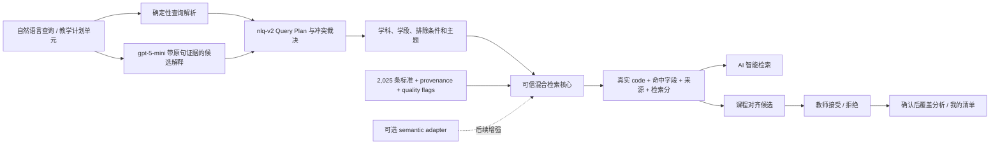

# kebiao AI 智能检索与课程对齐工作台：评审、修订与执行计划

状态：当前 MVP 已实现，自然语言检索已升级到 `nlq-v2`（M1–M4 查询理解链路端到端）

日期：2026-07-15
评审对象：`kebiao-ai-smart-search-alignment-workbench-codex-brief.md`

## 1. 结论

原方案的产品方向成立：自然语言检索和课程计划对齐都应建立在同一套可信检索能力上，并显式展示来源、证据和人工复核状态。但原方案把检索质量、向量基础设施、LLM、文件上传、账户系统、对象存储和完整审核工作流放在同一交付面，首版风险过高，也无法判断失败来自数据、检索还是模型。

修订后的主线是：

1. 先上线无需外部模型的可信混合检索内核；
2. 用版本化评测证明硬约束、真实 code、来源隔离和可解释性；
3. 在 `/smart-search` 交付自然语言检索；
4. 复用同一内核交付纯文本课程对齐工作台；
5. 外部 embedding、LLM 查询改写、DOCX/PDF 和账户持久化作为可插拔的后续增强，不成为首版阻塞项。

## 2. 对原方案的 critique

### 2.1 值得保留

- 将学科、学段、领域等识别结果作为硬约束，而不是只做语义相似度排序。
- 区分课标原文、结构化整理、规则生成与 AI 生成。
- 返回命中字段、证据片段、分项得分和人工复核标记。
- 检索内核同时服务智能搜索与课程计划对齐，避免两个系统产生不同答案。
- 先建立离线评测，再讨论模型升级。
- 教师确认是课程对齐结果进入清单与覆盖分析的必要步骤。

### 2.2 必须调整

1. **向量库不是 2,025 条标准的首要前置。** 当前规模可在 Vercel Function 内完成受信字段的确定性检索。先建立 adapter 边界，等评测证明词法召回不足再接 pgvector 或托管向量服务。
2. **LLM 不应负责首版匹配理由。** 匹配理由可以直接由真实命中字段生成，既可复现，也不会把加工内容改写成“课标原文”。
3. **相似度不是概率。** UI 和 API 使用“检索分”，分项全部归一化到 0–1，但不宣称 0.8 等于 80% 正确率。
4. **`requires_human_review` 不依赖未经标定的阈值。** 所有机器候选默认必须复核；分数只用于排序。
5. **覆盖分析必须基于审核决定。** 未接受的候选不能计入覆盖；没有明确参考标准范围时不能输出“缺口”。
6. **技能关键词必须与当前 TS1–TS7 定义一致。** 旧实现把“观察/实验”映射到 TS1，把“数据”映射到 TS5，与当前公开技能定义错位，已纳入修复。
7. **文件上传和隐私边界不完整。** 在对象存储、删除策略、恶意文档防护和 PII 处理确定前，只交付非持久化纯文本输入。
8. **API 命名需要收敛。** 正式接口使用 `/api/v1/plans/match-standards` 与 `/api/v1/plans/analyze-coverage`；旧的开发态路径保持 404，避免把实验契约误当稳定契约。

## 3. 架构选择

| 方案 | 优点 | 代价 | 当前决定 |
|---|---|---|---|
| PostgreSQL + pgvector | 数据、权限和向量统一，适合后续账户与持久化 | 首版引入数据库迁移、索引和运行成本 | 保留为规模化候选 |
| 托管向量服务 | 快速获得 ANN 与运维能力 | 供应商依赖、数据出境/隐私、成本和降级复杂度 | 暂不采用 |
| 静态数据 + 确定性可信混合检索 | 与现有 Vercel 架构一致，可复现、零模型依赖、低成本 | 语义同义召回上限较低 | **MVP 采用** |

可信混合检索不是单纯关键词搜索。它组合：字段权重、中文双字词、学科/学段/领域硬约束、当前技能映射、字段 provenance、`rag_eligible`、质量置信度和质量标记。未来 semantic adapter 只增加一个排序信号，不改变硬约束、来源隔离或真实 code 校验。

## 4. 目标架构

## 5. 数据与信任契约

- `field_provenance[field].rag_eligible === false` 的字段禁止参与检索证据。
- 每个命中字段返回 `provenance`、`review_status`、`confidence`、`quality_flags` 与真实 excerpt。
- API 只返回输入数据集中存在的 canonical code。
- `semantic_provider: none` 明示当前未调用 embedding；LLM 查询解释器通过独立 `query_interpretation` 元数据披露。
- 所有机器候选 `requires_human_review: true`。
- 计划覆盖只统计 `review_decisions.decision === accepted`。
- 没有 `reference_scope_codes` 时，`gap_standard_codes` 必须为空并返回提示。
- AI/规则候选不会写回标准主数据或技能正式映射。

## 6. 分阶段执行

### M0 数据可信基础（已完成）

- 标准字段 provenance、source_ref、review_status、confidence、quality_flags。
- 关系引用修复、候选关系分层、技能候选映射。
- RAG 上下文按来源分组并隔离不合格字段。

### M1 可信检索核心（已实现首版）

- `parseSmartSearchQuery`：学科、学段、技能和中文检索词识别。
- 显式筛选优先，并对查询理解冲突返回 warning。
- 受信字段检索、来源质量参与排序、真实 code 校验。
- `trusted-hybrid-v1` 响应契约与核心测试。
- 计划匹配移除旧 TS 语义并复用相同检索内核。
- `nlq-v2` 明确区分原句主题、模型支持扩展、最终约束与被丢弃的冲突解释。
- 已覆盖“第二学段 / G3-4 / 小学三年级”和“语文以外 / 但不是语文”等自然表达。

### M2 API 与智能搜索 UI（已实现首版）

- `POST /api/v1/standards/semantic-search`。
- `/smart-search`：只保留一个自然语言输入，不暴露学科/学段/技能硬筛选。结果前展示“我理解为”、冲突/澄清状态和覆盖说明。
- 课标正文/标题/分类命中的 `direct` 候选先展示；编辑加工字段命中的 `supporting` 候选收起在延伸关联中。
- 确定性 fallback 是正式运行模式，不依赖付费模型或密钥。
- 部署后 smoke 增加智能检索的真实 code 与契约检查。

### M3 纯文本课程对齐工作台（已实现首版）

- `/alignment-workbench`：文本解析、结构编辑、候选匹配、接受/拒绝、覆盖、加入清单。
- 正式 API：`/plans/parse`、`/plans/validate`、`/plans/match-standards`、`/plans/analyze-coverage`。
- 教学计划不持久化；页面刷新即清除。

### M4 外部 AI 与文件处理（查询理解已实现；其余后续独立验收）

- 用离线评测对比 OpenAI embeddings 与 M1 baseline，只有显著提升才启用。
- `gpt-5-mini` 仅用于查询结构化和检索词扩展，不生成或覆盖课标事实、code、来源或匹配理由。它可以提交硬约束候选，但必须附带能在用户原句中定位的证据；无证据候选被拒绝，与规则解析冲突时原话优先。
- Responses API 使用 Structured Outputs；兼容 Chat Completions 路径使用 JSON mode 并在服务端执行同一字段白名单与结构校验，任一路径失败都回退 M1。
- 服务端密钥、HTTPS base URL、500–7000ms 有界超时、禁记请求正文、模型调用前去标识化和前端隐私提示已经纳入实现。
- DOCX/PDF 前置：文件大小/类型限制、恶意文档扫描、临时存储、删除 SLA、PII 声明、失败恢复。
- 账户与团队工作流前置：权限模型、数据保留策略、导出与删除能力。

## 7. 评测与发布门槛

首版不设未经标注支持的“90% 准确率”。先固定可自动验证的门槛：

- 100% 返回 code 存在于当前数据版本；
- 100% 遵守显式学科/学段硬约束；
- 100% 不使用 `rag_eligible=false` 字段作为证据；
- 同一数据版本、同一请求结果顺序可复现；
- 所有候选标记人工复核；
- 未接受候选不计入覆盖；
- 无参考范围时不生成缺口；
- API 422/429/500 与超时状态可观察；
- 键盘、焦点、移动端和 reduced-motion 通过现有 E2E/A11y 门槛。
- 自然语言回归中 Query Plan 约束违规、主题词污染、直接候选越界均必须为 0。

教师标注集形成后，再报告 Recall@K、MRR、nDCG、学科/学段解析准确率和接受率，并以 baseline 的置信区间决定是否引入 embedding。

## 8. 外部项目与能力边界

- **OpenAI Responses API / Structured Outputs（M4）**：只做结构化查询解析和可选解释；不作为首版依赖。
- **Promptfoo（M4 模型回归）**：部署后调用完整 semantic-search API，验证真实模型可用性、Query Plan 约束忠实度和结果越界；不取代每次 PR 的确定性评测。
- **Meilisearch adapter（可选召回层）**：索引权重先课标正文/标题/领域，后情境/实践/教学提示；不改变 Query Plan 和证据闸门。
- **GSAP + `useGSAP`（UI 状态动效）**：只用于查询理解与结果状态过渡，并尊重 reduced-motion；不用动效遮盖等待、错误或降级状态。
- **OpenAI embeddings（M4）**：作为可插拔排序信号；不绕过硬约束和 provenance。
- **pgvector（规模化候选）**：当账户、持久化和向量检索共同需要数据库时再引入。
- **现有 React / Hono / Vercel 架构（M1–M3）**：继续作为交付基础，避免为 2,025 条记录新增常驻服务。
- **现有 localStorage 清单（M3）**：保存教师接受的标准；不保存原始教学计划文本。

## 9. 安全与隐私

- 文本长度、数组数量、top-k 和返回数量均由 schema 限制。
- 公开端点沿用 API 分层限流、CORS、安全响应头和 request_id。
- 不记录请求正文；指标只记录路径、状态、延迟、层级和匿名 key id。
- 页面不把教学计划写入 localStorage；只有教师接受的标准 code 可进入现有清单。
- 外部模型请求先执行可审计的去标识化，并在 UI 明示数据处理边界；指标只记录去标识化类别数量，不记录原文。

## 10. 本轮完成定义

本轮完成需同时满足：核心/API/client typecheck；核心/API/client 单测；前端 build；新增检索与对齐 E2E；OpenAPI 与 smoke 同步；现有核心 E2E/A11y 不回退；主分支质量门禁与生产部署后 smoke 自动执行。生产密钥仅保存在部署平台 Secret 中，不进入仓库或前端变量。
