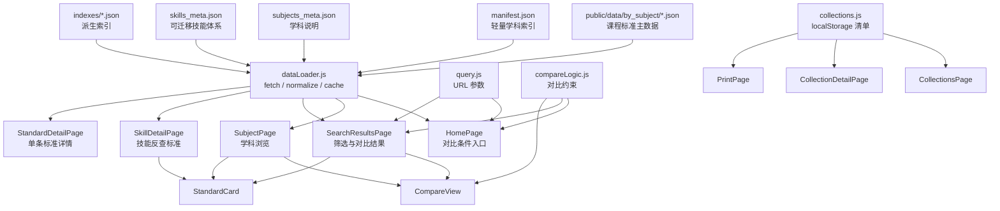

# 课标罗盘资源与架构文档

更新时间：2026-07-03
对应状态：当前工作树，H4G reviewed publication gate 已发布数学六版本/科学单元级年级焦点，并新增全局 H4G progression group decision model
项目路径：`/Users/shawn.fsc/Downloads/curriculum breakdown/curriculum-standards-breakdown`

## 1. 项目概览

课标罗盘是一个基于 Vite + React 的静态 Web 应用，用来浏览、筛选、对比和收藏《义务教育课程标准（2022年版）》的结构化条目。

网站的核心不是后端服务，而是一套放在 `public/data` 下的 JSON 数据资源。前端运行时通过 `fetch('/data/...')` 按需读取 JSON，再在浏览器内完成筛选、分组、对比、收藏和打印。

当前主要能力：

- 按学科浏览课程标准。
- 按学段、领域、可迁移技能筛选标准。
- 支持多学科同学段对比，或单学科多学段对比。
- 查看可迁移技能体系，并反查关联标准。
- 查看单条标准详情、复制链接、收藏到本地清单。
- 清单支持本地创建、导入、导出、统计和打印。
- 提供术语表、反馈页和样式指南页面。

## 2. 技术栈与运行方式

核心技术：

- 构建工具：Vite 6
- 前端框架：React 18
- 路由：React Router 7
- 数据：静态 JSON + `fetch`
- 埋点：`@vercel/analytics`
- 部署配置：`vercel.json`

重要命令：

```bash
npm install
npm run dev
npm run build
npm run preview
npm run build:indexes
npm run validate:indexes
```

`npm run build` 会先执行 `prebuild`，也就是 `npm run build:indexes`。该脚本会根据 `public/data/by_subject` 重新生成 `manifest.json` 和派生索引文件。`npm run validate:indexes` 会校验 manifest、`code_to_subject`、`skill_to_subjects`、`subject_stats` 是否与 `by_subject` 主数据一致。

## 3. 顶层资源清单

### 3.1 应用源码

| 路径 | 作用 |
| --- | --- |
| `src/main.jsx` | React 入口，挂载 `BrowserRouter` 和 `App`。 |
| `src/App.jsx` | 全站路由定义，统一包裹 `Header`、`Footer` 和 Vercel Analytics。 |
| `src/pages` | 页面层，每个路由一个主要页面组件。 |
| `src/components` | 可复用 UI 组件，如标准卡片、对比视图、筛选控件、状态组件。 |
| `src/data` | 前端数据访问、数据规范化、URL 查询、收藏清单和对比逻辑。 |
| `src/styles/design-tokens.css` | Ocean Soft 主题设计变量。 |
| `src/index.css` | 全局样式、旧变量、布局工具和基础组件样式。 |

### 3.2 运行时数据资源

真正被网站运行时读取的数据都在 `public/data` 下。Vite 会把 `public` 目录作为静态资源根目录，因此代码中使用 `/data/...` 访问这些文件。

| 路径 | 作用 |
| --- | --- |
| `public/data/manifest.json` | 轻量级总索引，包含生成时间、字段清单、学科列表、各学科统计和文件路径。 |
| `public/data/subjects_meta.json` | 9 个学科的介绍、长描述、课程结构说明。 |
| `public/data/skills_meta.json` | 7 个可迁移技能领域及其子技能、定义、表现证据和教师策略。 |
| `public/data/glossary.json` | 术语表资源，供 `/glossary` 页面读取。当前 JSON 存在语法问题，见第 10 节。 |
| `public/data/by_subject/*.json` | 按学科拆分的课程标准主数据。 |
| `public/data/indexes/code_to_subject.json` | 标准 code 到 `subject_slug` 的反查索引，由 `scripts/build-indexes.js` 从主数据派生。 |
| `public/data/indexes/skill_to_subjects.json` | 技能到相关学科的轻量索引。 |
| `public/data/indexes/subject_stats.json` | 学科统计索引，由 `public/data/by_subject` 派生。 |

### 3.3 导出与源副本资源

| 路径 | 作用 |
| --- | --- |
| `standards_json_export/standards_all.json` | 课程标准全量导出快照。 |
| `standards_json_export/by_subject/*.json` | 按学科拆分的导出快照。 |
| `standards_json_export/manifest.json` | 导出快照的 manifest。 |
| `subjects_meta_all.json` | 学科元数据源副本，结构与 `public/data/subjects_meta.json` 对应。 |
| `transferable_skills_meta.json` | 可迁移技能源副本，结构与 `public/data/skills_meta.json` 对应。 |

这些文件位于 `public` 之外，默认不会作为网站静态资源直接访问。它们更像数据处理过程中的源文件或备份快照。

### 3.4 构建与部署资源

| 路径 | 作用 |
| --- | --- |
| `package.json` | npm 脚本和依赖声明。 |
| `package-lock.json` | 依赖锁定文件。 |
| `vite.config.js` | Vite 配置。 |
| `vercel.json` | Vercel 部署路由配置。 |
| `index.html` | Vite HTML 入口。 |
| `scripts/build-indexes.js` | 根据主数据生成派生索引。 |
| `scripts/grade7_9/build_h4g_progression_decision_model.js` | 从正式 `public/data` 和 English/PE anchor action worklist 生成全量 H4G progression group 决策模型；逐组判断下一步是 anchor 拆分、补 source anchor、补单元证据、修复部分年级归属、补 source coverage，或保持 reviewed focus verified。只写 generated 报告。 |
| `scripts/textbooks/index_china_textbook.js` | 从 ChinaTextbook Git tree 生成初中教材文件证据索引，不下载 PDF blob。 |
| `scripts/textbooks/build_textbook_unit_index.js` | 从教材文件索引生成单元/章节候选证据入口；默认只生成文件级 `volume_seed`，也支持按 `evidence_id` 小批量物化 PDF、raw URL fallback、断点续传、文本层目录解析、英文 `Contents/Module/Unit` 目录解析、`S2/S 2` 印刷页、目录页码在 leader 前后的解析和可选 OCR fallback。 |
| `scripts/textbooks/textbook_unit_page_start_overrides.json` | 已复核的教材印刷页码补证据；用于 TOC OCR 缺右侧页码但正文 OCR 标题/页脚可确认页码的情况，只附着到已有单元候选。 |
| `scripts/textbooks/textbook_unit_alignment_aliases.json` | 已复核的标准级 alignment alias；只允许指定 `standard_code` 使用指定单元标题关键词，不作为全局同义词表。 |
| `scripts/textbooks/h4g_subject_theme_taxonomy.json` | English/PE 等学科主题桥接的受控主题表；只提供 review seed 和禁用泛词规则，不代表 approved evidence。 |
| `scripts/textbooks/audit_textbook_unit_index.js` | 校验教材单元候选索引，区分文件级 seed 与真实目录/章节候选。 |
| `scripts/textbooks/match_standards_to_textbook_units.js` | 将 H4G standards 与真实 `toc_unit_or_chapter` 候选做可解释匹配，并把单元页码、`subdomain_alignment`、标准级 `alias_alignment`、强字段 alignment 和 approved `subject_theme_bridge_alignment` 传入匹配结果。 |
| `scripts/textbooks/build_h4g_unit_evidence_candidate.js` | 将通过 eligible 门的标准-单元匹配组织为写回前 H4G 单元证据候选包和逐条 review pack；包含候选页段与页码状态，不写 `public/data`。 |
| `scripts/textbooks/h4g_grade_focus.js` | 根据已审核的同年级单元证据生成 H4G 年级化学习重点文案；候选阶段带 `候选：` 前缀，审核通过后去除候选前缀并保留“课标原文保持不变”。 |
| `scripts/textbooks/audit_h4g_unit_evidence_candidate.js` | 在 apply 前校验 H4G 单元证据候选包，确保官方字段未变、alignment 可解释、候选仍需人工复核；支持 `--require-page-start` 作为页码证据门禁。 |
| `scripts/textbooks/audit_h4g_unit_evidence_consistency.js` | 校验 H4G 单元证据候选包的跨版本一致性、progression group 年级覆盖和页码状态；用于区分诊断样本与发布级候选。 |
| `scripts/textbooks/audit_h4g_reverse_lookup_gaps.js` | 反向检索 H4G 候选包未过发布门的原因，按缺失版本和 progression group 输出页码、alignment、低分/错年级、无候选等缺口画像；只写 generated 报告，不写 `public/data`。 |
| `scripts/textbooks/audit_h4g_subject_theme_bridge_gaps.js` | 审计真实单元已存在但标准-单元匹配仍为 0 或只有弱匹配的学科，输出是否需要 `bilingual_topic_bridge_required` 或 `curriculum_activity_theme_bridge_required`。 |
| `scripts/textbooks/build_h4g_subject_theme_bridge_review_packet.js` | 根据受控主题表为教材单元和 H4G progression groups 生成 review-only 主题桥接候选；所有候选默认 `needs_source_review`，不可直接作为 H4G evidence。 |
| `scripts/textbooks/audit_h4g_subject_theme_bridge_review_packet.js` | 审计主题桥接 review packet，拦截 unknown topic tag、未复核 eligible、public write、官方文本变更、跨年级 same-grade 候选和 approved bridge 混入 review-only packet。 |
| `scripts/textbooks/build_h4g_subject_theme_bridge_review_decisions_template.js` | 从主题桥接 review packet 生成可编辑 source review 决策模板；每条 bridge candidate 默认 `pending`，并要求 reviewer 明确 standard-scoped 或 progression-group-scoped。 |
| `scripts/textbooks/audit_h4g_subject_theme_bridge_review_decisions.js` | 审计主题桥接 source review 决策文件，拦截 public write、官方文本变更、直接 matcher use、未确认 source/page/scope 的批准，以及缺失/越权 bridge decision。 |
| `scripts/textbooks/build_h4g_subject_theme_bridge_review_decisions_recommendation.js` | 从 source review batch 生成 reviewed decision candidate；只更新批次内 decisions，强 standard-scoped 关系可建议批准，明确错配可拒绝，其余保持需修订或 pending。 |
| `scripts/textbooks/build_h4g_subject_theme_bridge_review_worklist.js` | 将主题桥接 source review decisions 排成只读复核队列；按页码、topic fan-out、unit overmatch 和质量类标准风险划分 P1-P4。 |
| `scripts/textbooks/audit_h4g_subject_theme_bridge_review_worklist.js` | 审计主题桥接复核队列覆盖所有 decisions，且不写 public、不启用 matcher、不把 priority 当作 approval。 |
| `scripts/textbooks/build_h4g_subject_theme_bridge_review_batch.js` | 从 worklist 选出指定 priority range、review path 和 reviewer decision 的主题桥接复核批次，并补齐 official standard context、unit context、topic/fan-out 风险和决策模板；只作审前阅读包。 |
| `scripts/textbooks/audit_h4g_subject_theme_bridge_review_batch.js` | 审计主题桥接复核批次与 worklist、decisions、`public/data/by_subject` 的 lineage 和 selection filter 一致，并确认批次仍不写 public、不启用 matcher、不代表 approval。 |
| `scripts/textbooks/build_h4g_subject_theme_bridge_page_recovery_batch.js` | 将 page-missing 主题桥接 work items 按教材单元聚合成页码恢复批次，并生成 `textbook_unit_page_start_overrides.json` 填写模板。 |
| `scripts/textbooks/audit_h4g_subject_theme_bridge_page_recovery_batch.js` | 审计页码恢复批次只包含 `page_recovery_then_source_review` items，且每条 linked standard 能回溯到 decisions 和 `public/data/by_subject`。 |
| `scripts/textbooks/build_h4g_subject_theme_bridge_registry.js` | 从已审 decisions 和 decisions audit 导出 matcher 可读取的 approved subject-theme bridge registry；pending/rejected 不会进入。 |
| `scripts/textbooks/audit_h4g_subject_theme_bridge_registry.js` | 审计 approved bridge registry 中每条 bridge 都来自 approved source-review decision，并保持 generated/pre-publication 边界。 |
| `scripts/textbooks/build_h4g_subject_theme_bridge_anchor_group_action_worklist.js` | 将 52 个 English/PE anchor group recommendation 展开为 review-only 执行清单；把 219 条 anchor review items 拆为 bounded split candidates 或 source-anchor evidence requests，不更新正式 decisions。 |
| `scripts/textbooks/build_h4g_subject_theme_bridge_anchor_group_triage_decisions_candidate.js` | 将 anchor group worklist 转成非批准型 decisions candidate；只允许 `split_or_refine_group_scope` 或 `needs_source_anchor_evidence`，并保留 item-level review、matcher、publication 后续 gate。 |
| `scripts/textbooks/build_h4g_subject_theme_bridge_anchor_group_split_review_batch.js` | 将 43 个 split/refine anchor groups 展开为 `standard_code + grade_band + action_family + anchor_type` item-level bounded slice 审阅包；不批准 bridge。 |
| `scripts/textbooks/audit_h4g_subject_theme_bridge_anchor_group_split_review_batch.js` | 审计 split review batch 精确覆盖 worklist 中的 split candidates，并校验 source item lineage、public standard context 和 no-public-write/no-matcher 边界。 |
| `scripts/textbooks/build_h4g_subject_theme_bridge_anchor_group_source_evidence_batch.js` | 将 9 个 needs-source-anchor-evidence groups 展开为 source evidence request 审阅包；反查缺失年级 target standards，并标出 target-standard gaps。 |
| `scripts/textbooks/audit_h4g_subject_theme_bridge_anchor_group_source_evidence_batch.js` | 审计 source evidence batch 精确覆盖 worklist 中的 evidence requests，并校验 source item lineage、missing-grade target standard lookup 和 no-public-write/no-matcher 边界。 |
| `scripts/textbooks/build_h4g_subject_theme_bridge_anchor_group_item_review_decisions_template.js` | 将 split review batch 与 source evidence batch 合并成 115 行 item-level pending decisions；作为后续审阅结果的编辑面，不批准 bridge。 |
| `scripts/textbooks/audit_h4g_subject_theme_bridge_anchor_group_item_review_decisions.js` | 审计 item review decisions 精确覆盖 split/source-evidence 两个 batch，并校验 pending/completed 决策、source lineage 和 no-public-write/no-matcher 边界。 |
| `scripts/textbooks/build_h4g_subject_theme_bridge_anchor_group_item_review_recommendations.js` | 为 115 行 pending item review decisions 生成 recommendation-only 审阅建议；不修改 editable template，不批准 bridge。 |
| `scripts/textbooks/audit_h4g_subject_theme_bridge_anchor_group_item_review_recommendations.js` | 审计 item review recommendations 精确覆盖 editable decisions，并校验每条建议属于该 row 的 allowed decisions 且仍是 recommendation-only。 |
| `scripts/textbooks/build_h4g_subject_theme_bridge_anchor_group_item_review_action_worklist.js` | 将 115 行 item review recommendations 转为 worklist-only 执行队列；按继续拆分、补 source-anchor 证据、教材单元索引、target-standard gap 和 item-level review ready 分流。 |
| `scripts/textbooks/audit_h4g_subject_theme_bridge_anchor_group_item_review_action_worklist.js` | 审计 item review action worklist 一对一覆盖 recommendations，并校验队列映射、source batch lineage、source row counts 和 no-public-write/no-matcher 边界。 |
| `scripts/textbooks/audit_h4g_subject_theme_bridge_anchor_group_item_review_downstream_coverage.js` | 系统审计 item review worklist 的 5 个执行队列是否全部被下游 batches 覆盖，并校验 parent work item 与展开 review rows 的 missing/extra/duplicate。 |
| `scripts/textbooks/build_h4g_subject_theme_bridge_anchor_group_item_review_source_review_ready_batch.js` | 将 item review worklist 中 7 条 item-level source review ready 队列展开成单源 source-review-ready 审阅包；每行保持 `standard_code + grade_band + anchor_review_item_id` 粒度。 |
| `scripts/textbooks/audit_h4g_subject_theme_bridge_anchor_group_item_review_source_review_ready_batch.js` | 审计 source-review-ready batch 精确覆盖 expected ready rows，并校验单 source row、source split lineage、review grain 和 no-public-write/no-matcher 边界。 |
| `scripts/textbooks/build_h4g_subject_theme_bridge_anchor_group_item_review_child_split_batch.js` | 将 item review worklist 中 44 条 unit/source-row split 队列展开成 124 条单源 child split review rows；审阅粒度为 `standard_code + grade_band + unit_evidence_id + anchor_review_item_id`。 |
| `scripts/textbooks/audit_h4g_subject_theme_bridge_anchor_group_item_review_child_split_batch.js` | 审计 child split batch 精确覆盖 expected child slices，并校验 source row lineage、单源粒度、page-ready、no-public-write/no-matcher 边界。 |
| `scripts/textbooks/build_h4g_subject_theme_bridge_anchor_group_item_review_source_anchor_specificity_batch.js` | 将 item review worklist 中 52 条 source-anchor specificity 队列展开成 exact-anchor 审阅包；每行确认单个 source row 是否证明目标 anchor，而非仅共享宽主题。 |
| `scripts/textbooks/audit_h4g_subject_theme_bridge_anchor_group_item_review_source_anchor_specificity_batch.js` | 审计 source-anchor specificity batch 精确覆盖 expected work items，并校验单 source row 粒度、risk flags、source lineage 和 no-public-write/no-matcher 边界。 |
| `scripts/textbooks/build_h4g_subject_theme_bridge_anchor_group_item_review_missing_grade_unit_indexing_batch.js` | 将 item review worklist 中 9 条 missing-grade textbook unit indexing 队列展开成 12 条 target-standard 级索引任务；要求为缺失年级标准寻找同年级教材单元候选。 |
| `scripts/textbooks/audit_h4g_subject_theme_bridge_anchor_group_item_review_missing_grade_unit_indexing_batch.js` | 审计 missing-grade unit indexing batch 精确覆盖 expected target-standard items，并校验缺失年级、target standard、source evidence lineage 和 no-public-write/no-matcher 边界。 |
| `scripts/textbooks/build_h4g_subject_theme_bridge_anchor_group_item_review_target_standard_gap_batch.js` | 将 item review worklist 中 3 条 target-standard gap 队列展开成 6 条逐缺失年级复核行；要求确认目标年级 public standard 是否真的缺位或 progression group 是否需要重切。 |
| `scripts/textbooks/audit_h4g_subject_theme_bridge_anchor_group_item_review_target_standard_gap_batch.js` | 审计 target-standard gap batch 精确覆盖 expected missing-grade rows，并校验来源 work item、source evidence lineage、review grain 和 no-public-write/no-matcher 边界。 |
| `scripts/textbooks/build_h4g_subject_theme_bridge_anchor_group_item_review_downstream_decisions_template.js` | 将 item review 的 5 个 downstream batches 合并为统一 editable downstream decisions template；201 行全部 pending，用于记录后续 reviewer outcome。 |
| `scripts/textbooks/audit_h4g_subject_theme_bridge_anchor_group_item_review_downstream_decisions.js` | 审计 downstream decisions template 精确覆盖 5 个 batches 的 201 条 review rows，并校验 allowed decisions、source lineage、pending/completed 状态和 no-public-write/no-matcher 边界。 |
| `scripts/textbooks/build_h4g_subject_theme_bridge_anchor_group_item_review_downstream_recommendations.js` | 为 201 条 pending downstream decisions 生成 recommendation-only 分流；推荐值必须来自该 row 的 allowed decisions，不修改 editable template。 |
| `scripts/textbooks/audit_h4g_subject_theme_bridge_anchor_group_item_review_downstream_recommendations.js` | 审计 downstream recommendations 精确覆盖 downstream decisions，并校验 source lineage、allowed decisions、missing/extra 和 no-public-write/no-matcher 边界。 |
| `scripts/textbooks/build_h4g_subject_theme_bridge_anchor_group_item_review_downstream_action_worklist.js` | 将 201 条 downstream recommendations 转为下一步执行队列；保持 worklist-only，不修改 downstream decisions。 |
| `scripts/textbooks/audit_h4g_subject_theme_bridge_anchor_group_item_review_downstream_action_worklist.js` | 审计 downstream action worklist 精确覆盖 recommendations，并校验队列映射、decision lineage、missing/extra 和 no-public-write/no-matcher 边界。 |
| `scripts/textbooks/audit_h4g_subject_theme_bridge_anchor_group_item_review_downstream_action_coverage.js` | 审计 5 个 downstream action batches 精确、互斥覆盖 downstream action worklist 的 201 条 work items，并校验 no-public-write/no-matcher 边界。 |
| `scripts/textbooks/build_h4g_subject_theme_bridge_anchor_group_item_review_downstream_action_decisions_template.js` | 将 5 个 downstream action batches 合并为 201 条可编辑 action-review decisions；默认全部 pending，不自动关闭任何 reviewer outcome。 |
| `scripts/textbooks/audit_h4g_subject_theme_bridge_anchor_group_item_review_downstream_action_decisions.js` | 审计 downstream action decisions 精确覆盖 5 个 action batches，并校验 allowed decisions、required confirmations、lineage 和 no-public-write/no-matcher 边界。 |
| `scripts/textbooks/build_h4g_subject_theme_bridge_anchor_group_item_review_downstream_action_recommendations.js` | 为 201 条 pending downstream action decisions 生成 recommendation-only reviewer outcome；建议必须来自该 row 的 allowed decisions，且必须人工确认。 |
| `scripts/textbooks/audit_h4g_subject_theme_bridge_anchor_group_item_review_downstream_action_recommendations.js` | 审计 downstream action recommendations 精确覆盖 action decisions，并校验 recommendation-only、manual-confirmation、lineage 和 no-public-write/no-matcher 边界。 |
| `scripts/textbooks/audit_h4g_subject_theme_bridge_anchor_group_item_review_downstream_action_closure_readiness.js` | 审计 downstream action recommendations 是否具备关闭 action decision 的条件；当前强制保持 0 条 auto-close，并标出优先人工确认候选。 |
| `scripts/textbooks/build_h4g_subject_theme_bridge_anchor_group_item_review_downstream_source_row_confirmation_batch.js` | 将 downstream worklist 中 7 条 source-row confirmation 队列展开成单源确认批次；每行保持 `standard_code + grade_band + source_batch_item_id + source_anchor_review_item_id` 粒度。 |
| `scripts/textbooks/audit_h4g_subject_theme_bridge_anchor_group_item_review_downstream_source_row_confirmation_batch.js` | 审计 downstream source-row confirmation batch 精确覆盖 expected confirmation rows，并校验单源粒度、downstream decision lineage 和 no-public-write/no-matcher 边界。 |
| `scripts/textbooks/build_h4g_subject_theme_bridge_anchor_group_item_review_downstream_source_row_confirmation_inventory.js` | 将 7 条 source-row confirmation rows 转成只读风险 inventory，拆出 single-source/page-ready 优势和 low-bridge/shared-topic/manual-confirmation 未关闭风险。 |
| `scripts/textbooks/audit_h4g_subject_theme_bridge_anchor_group_item_review_downstream_source_row_confirmation_inventory.js` | 审计 source-row confirmation inventory 与 batch/action decisions 一一对应，并确认所有行仍需人工确认、不写 reviewer decision、不启用 matcher/publication。 |
| `scripts/textbooks/build_h4g_subject_theme_bridge_anchor_group_item_review_downstream_item_level_source_review_batch.js` | 将 downstream worklist 中 8 条 item-level source review 队列展开成 child-split 后的单源审阅包；每行保持 `standard_code + grade_band + unit_evidence_id + anchor_review_item_id` 粒度。 |
| `scripts/textbooks/audit_h4g_subject_theme_bridge_anchor_group_item_review_downstream_item_level_source_review_batch.js` | 审计 downstream item-level source review batch 精确覆盖 expected review rows，并校验 child-split 来源、单源粒度、downstream decision lineage 和 no-public-write/no-matcher 边界。 |
| `scripts/textbooks/build_h4g_subject_theme_bridge_anchor_group_item_review_downstream_item_level_source_review_inventory.js` | 将 8 条 item-level source review rows 转成只读风险 inventory，标出 page-ready 优势以及 shared-topic、multi-source、multi-unit 和 manual-confirmation 未关闭风险。 |
| `scripts/textbooks/audit_h4g_subject_theme_bridge_anchor_group_item_review_downstream_item_level_source_review_inventory.js` | 审计 item-level source review inventory 与 batch/action decisions 一一对应，并确认所有行仍需人工 item-level source review、不写 reviewer decision、不启用 matcher/publication。 |
| `scripts/textbooks/build_h4g_subject_theme_bridge_anchor_group_item_review_downstream_target_standard_gap_resolution_batch.js` | 将 downstream worklist 中 6 条 target-standard gap resolution 队列展开成目标标准缺口复核包；每行保持 `progression_group + missing_grade_band + source_standard_code` 粒度。 |
| `scripts/textbooks/audit_h4g_subject_theme_bridge_anchor_group_item_review_downstream_target_standard_gap_resolution_batch.js` | 审计 downstream target-standard gap resolution batch 精确覆盖 expected gap rows，并校验 source standard、missing grade、downstream decision lineage 和 no-public-write/no-official-text-change 边界。 |
| `scripts/textbooks/audit_h4g_subject_theme_bridge_anchor_group_item_review_downstream_target_standard_gap_inventory.js` | 将 6 条 target-standard gap rows 与当前 `public/data` inventory 对账，确认目标年级同 group/code/legacy code 是否存在；只提供 inventory evidence。 |
| `scripts/textbooks/build_h4g_subject_theme_bridge_anchor_group_item_review_downstream_target_gap_inventory_decisions_candidate.js` | 将 inventory audit 中确认缺失的 target-standard gap rows 写入一个非发布型 action decisions candidate；只更新候选文件中的 reviewer outcome，不改 editable template。 |
| `scripts/textbooks/audit_h4g_subject_theme_bridge_anchor_group_item_review_downstream_target_gap_inventory_decisions_candidate.js` | 审计 target-gap inventory decisions candidate 只改确认缺失的 6 条 row，其余 195 条必须与 source action decisions template 保持一致，并校验 no-public-write/no-matcher/no-publication 边界。 |
| `scripts/textbooks/build_h4g_subject_theme_bridge_anchor_group_item_review_downstream_target_gap_inventory_parent_decisions_candidate.js` | 将已审 action decisions candidate 回传到上游 downstream decisions candidate；只更新 6 条 parent target-standard gap row，不改 source template。 |
| `scripts/textbooks/audit_h4g_subject_theme_bridge_anchor_group_item_review_downstream_target_gap_inventory_parent_decisions_candidate.js` | 审计 parent decisions candidate 只改有 action candidate 和 inventory evidence 支撑的 6 条 row，且可继续通过原 downstream decisions contract。 |
| `scripts/textbooks/build_h4g_subject_theme_bridge_anchor_group_item_review_target_gap_inventory_decisions_candidate.js` | 将 parent target-gap candidate 回传到 115 行 item-review decisions candidate；只更新 3 条已完整覆盖缺失年级的 source-evidence item rows，不改 source template。 |
| `scripts/textbooks/audit_h4g_subject_theme_bridge_anchor_group_item_review_target_gap_inventory_decisions_candidate.js` | 审计 item-review target-gap candidate 只改由 6 条 parent target-gap rows 完整支撑的 3 条 item rows，其余 112 条必须与 source item decisions template 保持一致。 |
| `scripts/textbooks/build_h4g_subject_theme_bridge_anchor_group_item_review_downstream_manual_scope_indexing_batch.js` | 将 downstream worklist 中 12 条 manual scope/indexing 队列展开成目标标准范围与同年级教材单元索引复核包；每行保持 `progression_group + target_grade_band + target_standard_code + source_batch_item_id` 粒度。 |
| `scripts/textbooks/audit_h4g_subject_theme_bridge_anchor_group_item_review_downstream_manual_scope_indexing_batch.js` | 审计 downstream manual scope/indexing batch 精确覆盖 expected manual rows，并校验 target standard、same-grade indexing confirmations、downstream decision lineage 和 no-public-write/no-matcher 边界。 |
| `scripts/textbooks/build_h4g_subject_theme_bridge_anchor_group_item_review_downstream_manual_scope_indexing_inventory.js` | 将 12 条 manual scope/indexing rows 与当前 H4G unit indexes 对账，生成 read-only 同年级单元索引覆盖 inventory；标出目标年级、page-ready unit candidates、跨年级已有证据和未关闭人工确认项。 |
| `scripts/textbooks/audit_h4g_subject_theme_bridge_anchor_group_item_review_downstream_manual_scope_indexing_inventory.js` | 审计 manual scope/indexing inventory 与 batch、action decisions、unit indexes 一一对应，并确认 inventory 不写 decisions、不写 public、不启用 matcher/publication。 |
| `scripts/textbooks/build_h4g_subject_theme_bridge_anchor_group_item_review_downstream_manual_scope_indexing_decisions_candidate.js` | 将 12 条已具备同年级 page-ready unit candidates 的 manual scope/indexing inventory rows 写成非发布型 action decisions candidate；仅标记 `missing_grade_units_indexed_for_later_source_review`，不批准 bridge。 |
| `scripts/textbooks/audit_h4g_subject_theme_bridge_anchor_group_item_review_downstream_manual_scope_indexing_decisions_candidate.js` | 审计 manual scope/indexing candidate 只改 12 条 inventory-supported action decisions，其余 189 条必须与 source action decisions template 完全一致，且仍不写 public、不启用 matcher/publication。 |
| `scripts/textbooks/build_h4g_subject_theme_bridge_anchor_group_item_review_downstream_manual_scope_indexing_parent_decisions_candidate.js` | 将 12 条 manual scope action candidate 精确回传到 parent downstream decisions candidate；只标记对应 missing-grade unit-indexing parent rows，不批准 bridge。 |
| `scripts/textbooks/audit_h4g_subject_theme_bridge_anchor_group_item_review_downstream_manual_scope_indexing_parent_decisions_candidate.js` | 审计 manual scope parent candidate 只改 12 条 parent downstream decisions，其余 189 条必须与 source parent template 完全一致，且仍不写 public、不启用 matcher/publication。 |
| `scripts/textbooks/build_h4g_subject_theme_bridge_anchor_group_item_review_downstream_source_anchor_evidence_batch.js` | 将 downstream worklist 中 168 条 source-anchor evidence 队列展开成单 source row 的 anchor evidence 复核包；每行保持 `standard_code + grade_band + source_batch + source_batch_item_id` 粒度。 |
| `scripts/textbooks/audit_h4g_subject_theme_bridge_anchor_group_item_review_downstream_source_anchor_evidence_batch.js` | 审计 downstream source-anchor evidence batch 精确覆盖 expected evidence rows，并校验单 source row、source batch 类型、downstream decision lineage 和 no-public-write/no-matcher 边界。 |
| `scripts/textbooks/build_h4g_subject_theme_bridge_anchor_group_item_review_downstream_source_anchor_evidence_inventory.js` | 将 168 条 source-anchor evidence rows 整理成 read-only 风险 inventory；标出低 bridge score、generic/deny term、fan-out、多 source/多 unit 等 exact-anchor review bucket。 |
| `scripts/textbooks/audit_h4g_subject_theme_bridge_anchor_group_item_review_downstream_source_anchor_evidence_inventory.js` | 审计 source-anchor evidence inventory 与 168-row batch、action decisions 一一对应，并确认 inventory 不写 decisions、不写 public、不启用 matcher/publication。 |
| `scripts/textbooks/build_h4g_subject_theme_bridge_anchor_group_item_review_downstream_source_anchor_review_worklist.js` | 将 168 条 source-anchor 风险 inventory 转成 exact-anchor reviewer queue；按 unit/source scope、generic/deny-term、fan-out lanes 分流，但不写 reviewer decisions。 |
| `scripts/textbooks/audit_h4g_subject_theme_bridge_anchor_group_item_review_downstream_source_anchor_review_worklist.js` | 审计 source-anchor reviewer queue 与 inventory 一一对应，校验每条 work item 的风险 lane、review checklist、source lineage 和 no-public-write/no-matcher 边界。 |
| `scripts/textbooks/build_h4g_subject_theme_bridge_anchor_group_item_review_downstream_source_anchor_page_evidence_packet.js` | 为 168 条 source-anchor review work items 抽取本地 PDF 页面文本，并附同 progression group 的 H4G7/H4G8/H4G9 sibling context；只作为页面证据包，不批准 bridge。 |
| `scripts/textbooks/audit_h4g_subject_theme_bridge_anchor_group_item_review_downstream_source_anchor_page_evidence_packet.js` | 审计 page evidence packet 精确覆盖 source-anchor review worklist；校验 168 条文本摘录、页码线索来源、triplet context 和 no-public-write/no-matcher/no-publication 边界。 |
| `scripts/textbooks/build_h4g_subject_theme_bridge_anchor_group_item_review_downstream_source_anchor_review_decisions_template.js` | 将 source-anchor page evidence packet 转成可编辑 reviewer decisions template；168 条默认 pending，用于人工记录 exact-anchor outcome，不批准 bridge。 |
| `scripts/textbooks/audit_h4g_subject_theme_bridge_anchor_group_item_review_downstream_source_anchor_review_decisions.js` | 审计 source-anchor review decisions 与 page evidence packet 一一对应；pending 默认合法，completed rows 必须补 exact evidence、same-grade/same-subject 和 H4G distinctiveness confirmations。 |
| `scripts/textbooks/build_h4g_subject_theme_bridge_anchor_group_item_review_downstream_source_anchor_review_recommendations.js` | 基于 168 条 pending source-anchor decisions 生成 recommendation-only 路由：116 条 scope-not-closed 建议拆分，52 条 exact-anchor 风险继续 pending，不自动批准 evidence found。 |
| `scripts/textbooks/audit_h4g_subject_theme_bridge_anchor_group_item_review_downstream_source_anchor_review_recommendations.js` | 审计 source-anchor review recommendations 与 decisions template 一一对应，强制 `recommendation_only=true`、missing/extra 为 0、exact-anchor auto approvals 为 0。 |
| `scripts/textbooks/build_h4g_subject_theme_bridge_anchor_group_item_review_downstream_source_anchor_scope_not_closed_decisions_candidate.js` | 将 116 条 scope-not-closed recommendations 转成非公开 source-anchor decisions candidate；只标记需要 split/source-scope 回流的行，52 条 exact-anchor pending 行保持不变。 |
| `scripts/textbooks/audit_h4g_subject_theme_bridge_anchor_group_item_review_downstream_source_anchor_scope_not_closed_decisions_candidate.js` | 审计 scope-not-closed candidate 与 source decisions/recommendations 对齐；确认 candidate=116、pending=52、changed non-candidate=0、exact-anchor auto approvals=0。 |
| `scripts/textbooks/build_h4g_subject_theme_bridge_anchor_group_item_review_downstream_source_anchor_scope_not_closed_action_decisions_candidate.js` | 将 116 条 source-anchor scope-not-closed review candidates 回流到 downstream action decisions candidate；对应 action 行候选为 `reject_slice_as_overbroad`，85 条非候选 action 行保持不变。 |
| `scripts/textbooks/audit_h4g_subject_theme_bridge_anchor_group_item_review_downstream_source_anchor_scope_not_closed_action_decisions_candidate.js` | 审计 source-anchor scope-not-closed action candidate；确认 116 条候选与 source-review candidate 1:1 对齐、pending action decisions 为 85、changed non-candidate 为 0。 |
| `scripts/textbooks/build_h4g_subject_theme_bridge_anchor_group_item_review_downstream_source_anchor_scope_not_closed_closure_candidate.js` | 将 116 条 overbroad action candidates 接回 closure readiness 候选层；只追加候选闭环证据，official `auto_close_allowed`/`close_ready` 继续为 0，85 条非候选 closure row 保持不变。 |
| `scripts/textbooks/audit_h4g_subject_theme_bridge_anchor_group_item_review_downstream_source_anchor_scope_not_closed_closure_candidate.js` | 审计 source-anchor scope-not-closed closure candidate；确认 116 条 closure candidate 与 action candidate 1:1 对齐、pending manual items 为 85、changed non-candidate closure items 为 0。 |
| `scripts/textbooks/build_h4g_subject_theme_bridge_anchor_group_item_review_downstream_action_closure_candidates_combined.js` | 将 target-gap 6、manual-scope 12、source-anchor overbroad 116 三条 action-candidate lane 合并成 201-row closure candidate surface；134 条为候选闭环，67 条仍待人工确认。 |
| `scripts/textbooks/audit_h4g_subject_theme_bridge_anchor_group_item_review_downstream_action_closure_candidates_combined.js` | 审计 combined closure candidate；确认 134 条候选来自三条已审 action candidate lane 且不重叠，67 条非候选 closure row 完全不变，official close/auto-close 仍为 0。 |
| `scripts/textbooks/build_h4g_subject_theme_bridge_anchor_group_item_review_downstream_post_candidate_remaining_worklist.js` | 从 201 条 manual confirmation worklist 中排除 combined closure candidate 已覆盖的 134 条，生成 67 条 post-candidate remaining worklist；只暴露仍需人工 exact-anchor/source-row/item-level 复核的行。 |
| `scripts/textbooks/audit_h4g_subject_theme_bridge_anchor_group_item_review_downstream_post_candidate_remaining_worklist.js` | 审计 post-candidate remaining worklist 精确等于 combined candidate 后剩余 67 条，校验 missing/extra 为 0、excluded=134、official close/auto-close 仍为 0。 |
| `scripts/textbooks/build_h4g_subject_theme_bridge_anchor_group_item_review_downstream_post_candidate_source_anchor_exact_evidence_packet.js` | 将 post-candidate remaining worklist 中的 52 条 source-anchor exact review 行与 source-anchor review decisions/recommendations/page evidence 合并为小证据包；保留页面摘录、sibling H4G context 和风险信号。 |
| `scripts/textbooks/audit_h4g_subject_theme_bridge_anchor_group_item_review_downstream_post_candidate_source_anchor_exact_evidence_packet.js` | 审计 52 条 exact evidence packet 精确覆盖 post-candidate source-anchor 子集，确认 pending decisions/recommendations、text-extracted/ready-for-manual-review、missing/extra=0、auto approval=0。 |
| `scripts/textbooks/build_h4g_subject_theme_bridge_anchor_group_item_review_downstream_post_candidate_bounded_source_evidence_packet.js` | 将 post-candidate remaining worklist 中剩余的 7 条 source-row confirmation 和 8 条 item-level source review 合并为 bounded-source evidence packet；保留 inventory profile、review questions、page-ready/scope-risk 状态。 |
| `scripts/textbooks/audit_h4g_subject_theme_bridge_anchor_group_item_review_downstream_post_candidate_bounded_source_evidence_packet.js` | 审计 15 条 bounded-source evidence packet 精确覆盖 post-candidate source-row + item-level 子集，确认 pending action decisions、page-ready、manual confirmation required、missing/extra=0、auto approval=0。 |
| `scripts/textbooks/build_h4g_subject_theme_bridge_anchor_group_item_review_downstream_manual_confirmation_worklist.js` | 汇总 closure readiness、target gap inventory、manual scope/indexing、source-row、item-level 与 source-anchor inventories，生成 201 条统一人工确认队列；按可优先关闭、scope、source-row、item-level、source-anchor 风险 lanes 排序。 |
| `scripts/textbooks/audit_h4g_subject_theme_bridge_anchor_group_item_review_downstream_manual_confirmation_worklist.js` | 审计 manual confirmation worklist 精确覆盖 201 条 action decisions，校验每条都来自对应 inventory/closure row，并确认 0 条 auto-close、0 条 close-ready、不写 public、不启用 matcher/publication。 |
| `scripts/textbooks/audit_h4g_topic_placement_matrix.js` | 扫描同一主题在不同教材版本的 7/8/9 年级单元投放位置，区分真实缺证据与跨版本年级投放差异；只作诊断，不把跨年级单元升级为同年级证据。 |
| `scripts/textbooks/build_h4g_placement_evidence_candidate.js` | 将 topic placement matrix 中的跨年级投放差异整理成 progression group 级候选包；只用于发布前决策，不写 `public/data`，不生成 `textbook_unit_evidence_ids`。 |
| `scripts/textbooks/audit_h4g_placement_evidence_candidate.js` | 校验 placement 候选包仍是只读诊断材料，并强制 cross-grade unit evidence 不能被当作 same-grade standard evidence。 |
| `scripts/textbooks/build_h4g_progression_decision_matrix.js` | 合并同年级单元候选、consistency audit、reverse gaps 和 placement 候选包，生成 H4G 发布前 progression 决策矩阵；只作决策辅助，不写正式数据。 |
| `scripts/textbooks/build_h4g_ready_unit_evidence_candidate.js` | 根据 progression 决策矩阵过滤出 `same_grade_unit_candidate_ready` standards，生成 ready-only 写回前候选包；自动排除跨版本投放 review 和仍需缺口修复的 standards。 |
| `scripts/textbooks/build_h4g_progression_review_worklist.js` | 根据 progression 决策矩阵、placement 候选包和 reverse gaps 生成 blocked standards 的复核工作清单；把跨版本投放模型决策和同年级缺口补救分开，不写正式数据。 |
| `scripts/textbooks/build_h4g_edition_placement_model_candidate.js` | 将 progression review worklist 中的跨版本投放差异整理为 progression group 级模型候选；区分可进入版本投放说明复核和仍需补充 review 的主题，不写正式数据。 |
| `scripts/textbooks/build_h4g_publication_review_packet.js` | 合并 ready-only 单元证据、版本投放模型候选和 blocked worklist，生成三层发布前复核包；明确同年级单元证据、progression group 投放说明和阻塞项互不混写。 |
| `scripts/textbooks/build_h4g_publication_contract_candidate.js` | 从发布前复核包生成未来数据契约候选；定义标准级同年级单元证据、progression group 版本投放说明和 blocked registry 三个 surface 的字段白名单与 gate。 |
| `scripts/textbooks/apply_h4g_publication_contract_candidate.js` | 将 H4G 发布契约候选应用到独立 generated 数据根；只演练标准级同年级单元证据和 progression note candidate，不写 `public/data`。 |
| `scripts/textbooks/audit_h4g_publication_readiness.js` | 审计发布复核包、契约候选、dry-run 数据根、progression notes 和 blocked registry 是否一致；输出 `manual_review_ready` 与 `publication_ready=false` 的明确边界。 |
| `scripts/textbooks/build_h4g_publication_review_decisions_template.js` | 从发布复核包、契约候选和 readiness audit 生成可编辑的人工/课程复核决策模板；默认所有必需决策为 `pending`。 |
| `scripts/textbooks/audit_h4g_publication_review_decisions.js` | 审计人工/课程复核决策文件，防止请求 public write、官方课标文本改写、blocked 项发布或 cross-grade note 混入 same-grade evidence。 |
| `scripts/textbooks/publish_h4g_reviewed_candidate.js` | reviewed H4G public migration gate；默认 dry-run，正式写入必须传 `--write --confirm-reviewed-h4g-publication --strict`，只发布已审核同年级单元证据字段并拒绝官方核心课标字段变更。 |
| `scripts/textbooks/build_h4g_blocked_remediation_packet.js` | 合并 progression worklist、reverse gaps、alias source review 和 placement model，把 blocked H4G standards 分成可执行补证据/回源复核/继续阻断任务；只写 generated 行动包，不写正式数据。 |
| `scripts/textbooks/plan_h4g_unit_evidence_worklist.js` | 生成 H4G 单元证据工作清单，把待分化 progression groups、当前候选覆盖和 ChinaTextbook 完整版本覆盖合并成下一批可执行教材物化任务。 |
| `scripts/textbooks/run_h4g_unit_work_item.js` | 按 worklist 中的单个 work item 串行执行物化、索引审计、匹配、候选包、consistency gate、候选数据根 apply 和 H4G 审计；默认只写 `generated/textbook_evidence/h4g_runs/`。 |
| `scripts/textbooks/apply_h4g_unit_evidence_candidate.js` | 将 H4G 单元证据候选包应用到独立候选数据根，供索引、审计和 UI 验证；默认拒绝写入 `public/data`。 |
| `scripts/textbooks/audit_textbook_standard_matches.js` | 校验标准-单元匹配，禁止把 `volume_seed` 当作正式分化证据。 |
| `dist` | 已构建产物目录，不是源码的主要维护入口。 |

## 4. 当前页面架构

路由由 `src/App.jsx` 统一声明：

| 路由 | 页面组件 | 主要作用 |
| --- | --- | --- |
| `/` | `HomePage` | 首页，对比筛选入口，加载 manifest、学科元数据和技能元数据。 |
| `/subjects/:slug` | `SubjectPage` | 单学科浏览页，按学科加载标准，可按学段过滤，可切换列表/对比视图。 |
| `/skills` | `SkillsOverviewPage` | 可迁移技能总览。 |
| `/skills/:code` | `SkillDetailPage` | 技能详情页，展示技能定义、子技能，并反查关联标准。 |
| `/search` | `SearchResultsPage` | 对比和筛选结果页，URL 保存筛选状态。 |
| `/glossary` | `GlossaryPage` | 术语表页面，直接 fetch `/data/glossary.json`。 |
| `/standards/:code` | `StandardDetailPage` | 单条标准详情页。 |
| `/collections` | `CollectionsPage` | 本地清单列表、创建和导入。 |
| `/collections/:id` | `CollectionDetailPage` | 清单详情、统计、导出和打印入口。 |
| `/print` | `PrintPage` | 打印视图，可按 collection 或 codes 加载标准。 |
| `/styleguide` | `StyleGuidePage` | 设计系统样式指南。 |
| `/feedback` | `FeedbackPage` | 反馈与纠错表单，支持 Web3Forms 或 mailto fallback。 |

## 5. 前端分层说明

### 5.1 页面层 `src/pages`

页面层负责：

- 读取路由参数和 URL 查询参数。
- 调用 `src/data` 的加载函数。
- 管理页面级状态，如 loading、error、筛选条件、展开状态。
- 组合组件层完成渲染。

典型例子：

- `SubjectPage.jsx` 使用 `loadSubjectStandards(slug)` 加载单学科标准，再用 `filterStandards` 和 `groupByDomain` 组织页面。
- `SearchResultsPage.jsx` 使用 URL query 作为“已应用筛选条件”，只加载用户选择的学科文件。
- `SkillDetailPage.jsx` 先加载技能和 manifest，再按选中学科加载标准并按技能过滤。
- `StandardDetailPage.jsx` 通过标准 code 定位单条标准。

### 5.2 组件层 `src/components`

组件层负责可复用 UI：

| 组件 | 作用 |
| --- | --- |
| `Header` / `Footer` | 全站导航和页脚。 |
| `StandardCard` | 标准条目卡片，支持展开详情、收藏、复制 ID、跳转详情。 |
| `CompareView` | 对比视图容器，支持多学科/多学段两种模式。 |
| `SubjectColumn` | 多学科对比时的单列学科视图。 |
| `GradeBandTabs` | 学段选择控件。 |
| `FilterBar` | 通用筛选栏。 |
| `FavoriteButton` | 收藏按钮，操作 localStorage 清单。 |
| `TSBadge` | 可迁移技能标签。 |
| `StateComponents` | Loading、Error、Empty、复制链接等状态组件。 |
| `HomeHeroBanner` / `SubjectHeroBanner` / `TSHeroBanner` | 页面 Hero 区域组件。 |

### 5.3 数据层 `src/data`

| 文件 | 作用 |
| --- | --- |
| `dataLoader.js` | 所有公开数据加载函数、缓存、筛选、分组、颜色常量。 |
| `schema.js` | 对标准、技能、学科元数据进行规范化，保证字段默认值。 |
| `query.js` | URL 查询参数解析、序列化、分享链接和复制能力。 |
| `compareLogic.js` | 对比模式的约束规则和筛选条件纠偏。 |
| `collections.js` | 收藏清单的 localStorage 持久化、CRUD、导入导出和统计。 |

## 6. 数据组织方式

### 6.1 数据主入口

网站的主数据入口是：

```text
public/data/
├── manifest.json
├── subjects_meta.json
├── skills_meta.json
├── glossary.json
├── by_subject/
│   ├── arts.json
│   ├── chinese.json
│   ├── english.json
│   ├── it.json
│   ├── labor.json
│   ├── math.json
│   ├── morality_law.json
│   ├── pe.json
│   └── science.json
└── indexes/
    ├── code_to_subject.json
    ├── skill_to_subjects.json
    └── subject_stats.json
```

其中 `by_subject` 是课程标准主数据。每个学科一个 JSON 文件，结构是：

```json
{
  "standards": [
    {
      "id": "SC-D1-AR-001",
      "code": "SC-D1-AR-001",
      "subject": "科学",
      "subject_slug": "science",
      "grade_band": "H1",
      "grade_range": "1-2",
      "domain": "态度责任",
      "subdomain": "人类活动与环境",
      "standard": "愿意倾听他人想法，并乐于分享和表达自己的观点。",
      "context": "...",
      "practice": "...",
      "teaching_tip": "...",
      "assessment_evidence_type": "...",
      "ts_primary": ["TS4"],
      "ts_secondary": [],
      "ts_rationale": "..."
    }
  ]
}
```

### 6.2 标准条目的核心字段

| 字段 | 类型 | 说明 |
| --- | --- | --- |
| `id` | string | 条目 ID，通常等于 `code`。 |
| `code` | string | 标准唯一编码，用于 URL、收藏、详情查询。 |
| `subject` | string | 中文学科名。 |
| `subject_slug` | string | 学科英文 slug，也是文件名。 |
| `domain` | string | 学科一级领域。 |
| `subdomain` | string | 子领域或更细分类。 |
| `grade_band` | string | 学段/年级代码：`H1`、`H2`、`H3`、`H4G7`、`H4G8`、`H4G9`。`H4` 仅作为 legacy stage label，不作为正式筛选项。 |
| `grade_range` | string | 年级范围，如 `1-2`、`7`、`8`、`9`。 |
| `grade` | string | 人类可读学段文本。 |
| `standard` | string | 标准正文，是页面最核心展示内容。 |
| `context` | string | 情境说明。 |
| `practice` | string | 实践建议。 |
| `teaching_tip` | string | 教学提示。 |
| `assessment_evidence_type` | string | 评价证据类型。 |
| `materials_tools` | string | 材料或工具。 |
| `safety_notes` | string | 安全提示。 |
| `project` | string | 项目或主题。 |
| `previous_code` | string | 上一条/前置标准 code，可为空或多行。 |
| `next_code` | string | 下一条/后续标准 code，可为空或多行。 |
| `ts_primary` | string[] | 主可迁移技能标签。 |
| `ts_secondary` | string[] | 次可迁移技能标签。 |
| `ts_rationale` | string | 技能标注理由。 |
| `ts_confidence` | string | 标注置信度。 |
| `ts_tag_source` | string | 标注来源。 |
| `discipline` | string | 学科/专业字段。 |
| `art_discipline` | string | 艺术学科细分字段。 |

`schema.js` 会将空值兜底为字符串或空数组，并保证 `ts_primary`、`ts_secondary`、`resources` 等字段始终是数组。

### 6.2.1 H4G 年级拆分元数据

初中正式记录使用 `H4G7/H4G8/H4G9` 作为 runtime 年级口径，同时保留 `stage_band: "H4"` 表示第四学段。因为 2022 版课标中大量初中要求本身是 7-9 共同要求，当前数据必须区分“源课标原文”和“年级化拆分状态”。

| 字段 | 类型 | 说明 |
| --- | --- | --- |
| `stage_band` | string | 初中拆分记录的大阶段标记，当前为 `H4`。 |
| `grade_level` | number | 具体年级数字，当前为 7、8、9。 |
| `legacy_code` | string | H4 拆分前或来源记录的 code。 |
| `source_grade_band` | string | 来源记录的学段，如 `H4`。 |
| `source_grade_range` | string | 来源记录的年级范围，如 `7-9`。 |
| `grade_assignment_type` | string | 年级归属依据类型；共享源记录会使用 `shared_requirement_*` 或低置信度类型。 |
| `grade_assignment_confidence` | number | 年级归属置信度，0 到 1。 |
| `grade_assignment_rationale` | string | 年级归属依据说明，非课标原文。 |
| `textbook_evidence_ids` | string[] | 教材文件级证据 ID。 |
| `textbook_unit_evidence_ids` | string[] | 单元/章节级证据 ID；当前数学 28 条、科学 17 条已正式写入，其他 H4G records 仍为空数组。 |
| `standard_text_role` | string | 当前 `standard` 的文本角色，当前为 `source_standard_original`。 |
| `source_standard_scope` | string | 来源范围，如 `stage_shared_7_9`。 |
| `standard_variant_type` | string | `same_source_shared`、`grade_specific_variant` 或 `single_or_partial_grade_variant`。 |
| `evidence_granularity` | string | `none`、`textbook_file_grade_level` 或 `textbook_unit_level`。 |
| `progression_group_id` | string | 同一源标准跨年级展示或进阶的分组 ID。 |
| `progression_distinctiveness` | string | 当前三元组是否为 `identical_core_fields` 或 `core_fields_differ`。 |
| `progression_distinctiveness_fields` | string[] | 发生差异的核心字段。 |
| `requires_unit_level_evidence` | boolean | 是否仍需教材单元/章节级证据。 |
| `grade_specific_focus` | string | 年级化学习重点；45 条 reviewed records 已写入基于教材单元证据的学习重点，其他共享源记录只写待补充，不编造具体内容。 |
| `progression_delta` | string | 年级间差异状态，如 `not_yet_differentiated_from_shared_7_9_source`。 |
| `progression_review_note` | string | 给前端和人工复核看的拆分状态说明。 |
| `review_status` | string | 如 `needs_grade_differentiation`、`needs_grade_differentiation_low_confidence`、`unit_evidence_approved`。 |

当前 `public/data` 中 323 个完整 H4G 三元组核心文本完全相同，但 `unlabeled_identical_triplets` 为 0；这些记录已标为共享源标准。45 条记录已经通过 reviewed publication gate 拥有 `textbook_unit_level` 证据和 `unit_evidence_approved` 状态，其余 1036 条 H4G records 仍待单元证据或复核。全局 progression decision model 当前覆盖 400 个 group：52 个 English/PE anchor route、35 个 unit evidence completion、68 个部分年级归属复核、200 个共享源标准补单元证据、44 个低置信度/source coverage 缺口、1 个 reviewed focus verified。详见 `docs/H4G_DISTINCTIVENESS_REMEDIATION.md`。

全局 H4G progression group 决策模型产物：

| 路径 | 作用 |
| --- | --- |
| `generated/grade7_9_h4g_progression_decision_model.json` | 全量 400 个 H4G progression group 的只读决策模型；每组包含 `decision_layer`、`decision_route`、证据覆盖、缺失年级、anchor worklist 路由和下一步 gate。 |
| `generated/grade7_9_h4g_progression_decision_model.md` | 上述模型的人读摘要，列出 route 分布、layer 分布、学科路线和最高优先级 group。 |

### 6.2.2 教材证据工作产物

教材证据相关产物位于 `generated/textbook_evidence/`，属于可重建工作产物，不提交到 git，也不是网站 runtime 的静态数据入口。

| 路径 | 作用 |
| --- | --- |
| `generated/textbook_evidence/china_textbook_index.json` | ChinaTextbook 初中教材文件索引，记录教材路径、版本、年级、册次和 `textbook_evidence_id`。 |
| `generated/textbook_evidence/china_textbook_index_summary.md` | 教材文件覆盖摘要。 |
| `generated/textbook_evidence/junior_textbook_progression_audit.json` | 初中教材进阶覆盖审计。 |
| `generated/textbook_evidence/textbook_unit_index.json` | 单元/章节候选证据索引；当前默认包含 `volume_seed`，物化 PDF 后的 `toc_unit_or_chapter` 可包含 `page_start/page_range/page_range_status`。 |
| `generated/textbook_evidence/textbook_unit_index_summary.md` | 单元候选索引摘要，包含真实目录候选数和目录页码状态分布。 |
| `generated/textbook_evidence/textbook_unit_index_audit.json` | 单元候选索引审计结果。 |
| `generated/textbook_evidence/textbook_unit_standard_matches.json` | H4G standard 到教材单元/章节候选的可解释匹配结果；会继承单元页码字段，并保留 `subdomain_alignment`、`alias_alignment`、`field_alignment`。 |
| `generated/textbook_evidence/textbook_unit_standard_matches_summary.md` | 标准-单元匹配摘要，包含 eligible alignment 分布。 |
| `generated/textbook_evidence/textbook_unit_standard_matches_audit.json` | 标准-单元匹配审计结果。 |
| `generated/textbook_evidence/h4g_subject_theme_bridge_gaps.json` / `.md` | 学科主题桥接缺口审计；识别 English/PE 这类真实单元存在但仍需双语或活动主题桥接的情况。 |
| `generated/textbook_evidence/h4g_subject_theme_bridge_review_packet.json` / `.md` | 学科主题桥接 review-only 候选包；包含 unit theme items、progression theme items 和同年级 bridge review candidates，默认全部 `needs_source_review`。 |
| `generated/textbook_evidence/h4g_subject_theme_bridge_review_packet_audit.json` / `.md` | 主题桥接 review packet 审计结果；确认不写 public、不改官方文本、不跨年级、不把未复核候选升级成 eligible evidence。 |
| `generated/textbook_evidence/h4g_subject_theme_bridge_review_decisions_template.json` / `.md` | 主题桥接 source review 决策模板；English/PE 首批包含 515 条 bridge 决策，默认全部 pending，并显式记录 approval scope 和 required confirmations。 |
| `generated/textbook_evidence/h4g_subject_theme_bridge_review_decisions_audit.json` / `.md` | 主题桥接 source review 决策审计；默认允许 pending，保持 `matcher_ready=false`、`publication_ready=false`，复核完成后可加 `--require-complete`。 |
| `generated/textbook_evidence/h4g_theme_bridge_review_decisions_p1_codex_reviewed_english_pe.json` / `.md` | P1 source review recommendation candidate；57 条 P1/page-ready decisions 中 18 条建议 standard-scoped approval、9 条 reject、30 条 needs revision，其余 458 条仍 pending。 |
| `generated/textbook_evidence/h4g_theme_bridge_review_decisions_p1_codex_reviewed_english_pe_audit.json` / `.md` | P1 recommendation 审计结果；确认 approved rows 全部 page-ready，且仍 `source_review_complete=false`、`matcher_ready=false`、`publication_ready=false`。 |
| `generated/textbook_evidence/h4g_theme_bridge_review_decisions_p1_p2_codex_reviewed_english_pe.json` / `.md` | P1+P2 source review recommendation candidate；254 条 decisions 已处理，18 条 approved、16 条 rejected、220 条 needs revision，剩余 261 条全部 pending/page-missing。 |
| `generated/textbook_evidence/h4g_theme_bridge_review_decisions_p1_p2_codex_reviewed_english_pe_audit.json` / `.md` | P1+P2 recommendation 审计结果；确认 P2 没有新增 approved bridge，approved rows 仍全部 page-ready，`publication_ready=false`。 |
| `generated/textbook_evidence/h4g_theme_bridge_review_decisions_p1_p2_page_recovered_english_pe.json` / `.md` | after-P2 page recovery 后的保守刷新决策面；保留原 515 条 decisions 和 254 条 P1/P2 审阅结论，只刷新 page fields。当前 472 条 page-ready、43 条 page-missing，approved 仍为 18 条。 |
| `generated/textbook_evidence/h4g_theme_bridge_review_decisions_p1_p2_page_recovered_english_pe_audit.json` / `.md` | page-recovered decisions 审计；确认 approved rows 全部 page-ready，`publication_ready=false`，且仍有 261 条 pending 需要后续 source review/page recovery。 |
| `generated/textbook_evidence/h4g_theme_bridge_review_decisions_after_page_recovery_codex_reviewed_english_pe.json` / `.md` | after-page-recovery conservative source-review candidate；472 条 decisions 已完成，18 条 approved、80 条 rejected、374 条 needs revision，剩余 43 条 pending 全部缺页码。 |
| `generated/textbook_evidence/h4g_theme_bridge_review_decisions_after_page_recovery_codex_reviewed_english_pe_audit.json` / `.md` | after-page-recovery source-review 审计；确认 approved rows 全部 page-ready，仍 `source_review_complete=false`、`publication_ready=false`。 |
| `generated/textbook_evidence/h4g_theme_bridge_review_decisions_full_page_recovered_english_pe.json` / `.md` | final page recovery 后的保守刷新决策面；515 条 decisions 全部 page-ready，保留 472 条已审结论和 43 条待审状态。 |
| `generated/textbook_evidence/h4g_theme_bridge_review_decisions_full_page_recovered_codex_reviewed_english_pe.json` / `.md` | full-page-recovered conservative source-review candidate；515 条 decisions 全部完成，18 条 approved、83 条 rejected、414 条 needs revision、0 pending。 |
| `generated/textbook_evidence/h4g_theme_bridge_review_decisions_full_page_recovered_codex_reviewed_english_pe_audit.json` / `.md` | full-page-recovered decisions 严格审计；`--require-complete --require-page-ready-for-approval` 通过，确认 source review complete 但 publication 仍 false。 |
| `generated/textbook_evidence/h4g_subject_theme_bridge_review_worklist.json` / `.md` | 主题桥接 source review 复核队列；把 515 条 decisions 分成 page-ready source review、page recovery 和 P1-P4 优先级，并暴露高 fan-out 单元。 |
| `generated/textbook_evidence/h4g_subject_theme_bridge_review_worklist_audit.json` / `.md` | 主题桥接复核队列审计；确认 515 条 decisions 全覆盖且队列仍为 read-only，不具备 matcher/public 发布能力。 |
| `generated/textbook_evidence/h4g_theme_bridge_review_worklist_after_p1_codex_reviewed_english_pe.json` / `.md` | 基于 P1 reviewed decisions 重建的 after-P1 worklist；仍覆盖 515 条 decisions，但每条带有 P1 后的 reviewer decision，供后续只抽 pending。 |
| `generated/textbook_evidence/h4g_theme_bridge_review_worklist_after_p2_codex_reviewed_english_pe.json` / `.md` | 基于 P1+P2 reviewed decisions 重建的 after-P2 worklist；剩余 pending 全部进入 page recovery 路径，没有 page-ready pending 项。 |
| `generated/textbook_evidence/h4g_theme_bridge_review_worklist_after_p2_page_recovered_english_pe.json` / `.md` | 基于保守 page-recovered decisions 重建的 after-P2 worklist；472 条 `source_review_ready`、43 条 `page_recovery_then_source_review`，用于后续 H4G7/H4G9 source review。 |
| `generated/textbook_evidence/h4g_theme_bridge_review_worklist_after_page_recovery_codex_reviewed_english_pe.json` / `.md` | 基于 after-page-recovery reviewed decisions 重建的 worklist；source-ready pending 已处理完，剩余 43 条 page recovery。 |
| `generated/textbook_evidence/h4g_theme_bridge_review_worklist_full_page_recovered_codex_reviewed_english_pe.json` / `.md` | 基于 full-page-recovered reviewed decisions 重建的 worklist；515 条均为 `source_review_ready`，page recovery 为 0。 |
| `generated/textbook_evidence/h4g_subject_theme_bridge_review_batch.json` / `.md` | 主题桥接 source review 批次；把选中的 worklist items 补齐标准原文、实践、教学提示、单元页码、topic/fan-out 风险和待编辑决策模板。 |
| `generated/textbook_evidence/h4g_subject_theme_bridge_review_batch_audit.json` / `.md` | 主题桥接批次审计；确认批次 selection 与 worklist 一致，且所有标准上下文能回溯到 `public/data/by_subject`。 |
| `generated/textbook_evidence/h4g_theme_bridge_review_batch_p2_pending_after_p1_english_pe.json` / `.md` | P1 后精确抽取的 P2 pending/source-ready 审前阅读包；197 条全部 page-ready、全部 pending，覆盖 H4G7 57 条、H4G8 130 条、H4G9 10 条。 |
| `generated/textbook_evidence/h4g_theme_bridge_review_batch_p2_pending_after_p1_english_pe_audit.json` / `.md` | P2 pending batch 审计；确认 selection 为 `min=max=P2`、`review_path=source_review_ready`、`reviewer_decisions=pending`，且不写 public、不启用 matcher。 |
| `generated/textbook_evidence/h4g_theme_bridge_review_batch_pending_after_page_recovery_english_pe.json` / `.md` | after-P2 page recovery 后的新 pending/source-ready 审前阅读包；218 条全部 page-ready、全部 pending、全部 P2，覆盖 H4G7 103 条、H4G9 115 条。 |
| `generated/textbook_evidence/h4g_theme_bridge_review_batch_pending_after_page_recovery_english_pe_audit.json` / `.md` | after-page-recovery pending batch 审计；确认 selection 为 `P1-P4 + source_review_ready + pending`，实际命中 218 条 P2 items，不写 public、不启用 matcher。 |
| `generated/textbook_evidence/h4g_theme_bridge_review_batch_pending_full_page_recovered_english_pe.json` / `.md` | final page recovery 后最后 43 条 pending/source-ready 审前阅读包；全部 page-ready，H4G7 29 条、H4G9 14 条。 |
| `generated/textbook_evidence/h4g_theme_bridge_remediation_packet_full_page_recovered_english_pe.json` / `.md` | full-page-recovered source review 后的 needs-revision remediation packet；414 条 read-only 行动项，拆成 action family、priority 和 decision owner。 |
| `generated/textbook_evidence/h4g_theme_bridge_remediation_packet_full_page_recovered_english_pe_audit.json` / `.md` | remediation packet 审计；确认 414 条 needs_revision decisions 精确覆盖，missing/extra coverage 均为 0，且不写 public、不启用 matcher。 |
| `generated/textbook_evidence/h4g_theme_bridge_progression_matrix_full_page_recovered_english_pe.json` / `.md` | subject-theme bridge progression-group matrix；把 414 条 remediation items 与 18 条 approved bridges 上卷到 70 个 progression groups，并给出 resolution track。 |
| `generated/textbook_evidence/h4g_theme_bridge_progression_matrix_full_page_recovered_english_pe_audit.json` / `.md` | progression matrix 审计；确认 70 个 source groups 精确覆盖，`complete_h4g_triplet_approved_groups=0`，且仍不写 public、不启用 matcher。 |
| `generated/textbook_evidence/h4g_theme_bridge_review_decisions_language_use_rejected_english_pe.json` / `.md` | remediation recommendation 后的 source-review decisions candidate；把 110 条 English `Language in use` title-only bridge 从 needs_revision 推进为 reject。 |
| `generated/textbook_evidence/h4g_theme_bridge_remediation_packet_language_use_rejected_english_pe.json` / `.md` | language-use rejection 后的剩余 needs-revision packet；304 条 read-only remediation items，覆盖 128 条 standards、69 个 progression groups。 |
| `generated/textbook_evidence/h4g_theme_bridge_progression_matrix_language_use_rejected_english_pe.json` / `.md` | language-use rejection 后的 progression matrix；generic Language in use title bridge blocked track 清空，剩余 groups 进入更窄 source-anchor / curriculum-review track。 |
| `generated/textbook_evidence/h4g_theme_bridge_review_decisions_language_use_pe_quality_rejected_english_pe.json` / `.md` | language-use + PE quality/performance rejection 后的 source-review decisions candidate；累计 126 条 needs_revision 被推进为 reject，approved 仍 18 条。 |
| `generated/textbook_evidence/h4g_theme_bridge_remediation_packet_language_use_pe_quality_rejected_english_pe.json` / `.md` | language-use + PE quality/performance rejection 后的剩余 needs-revision packet；288 条 read-only remediation items，覆盖 120 条 standards、64 个 progression groups。 |
| `generated/textbook_evidence/h4g_theme_bridge_progression_matrix_language_use_pe_quality_rejected_english_pe.json` / `.md` | language-use + PE quality/performance rejection 后的 progression matrix；generic Language in use 和 PE curriculum progression review required tracks 均已清空。 |
| `generated/textbook_evidence/h4g_theme_bridge_anchor_review_batch_language_use_pe_quality_rejected_english_pe.json` / `.md` | language-use + PE quality/performance rejection 后的 source-anchor review batch；把 288 条剩余 needs_revision 拆成 5 类学科锚点审阅问题，不新增 approval。 |
| `generated/textbook_evidence/h4g_theme_bridge_anchor_review_batch_language_use_pe_quality_rejected_english_pe_audit.json` / `.md` | source-anchor review batch 审计；确认 288 条 remediation items 精确覆盖，missing/extra 均为 0，且仍不写 public、不启用 matcher。 |
| `generated/textbook_evidence/h4g_theme_bridge_review_decisions_anchor_domain_rejected_english_pe.json` / `.md` | anchor-domain recommendation 后的 source-review decisions candidate；新增拒绝 69 条 English/PE anchor/domain 或 quality direct-bridge mismatch，approved 仍 18 条。 |
| `generated/textbook_evidence/h4g_theme_bridge_remediation_packet_anchor_domain_rejected_english_pe.json` / `.md` | anchor-domain rejection 后的剩余 needs-revision packet；219 条 read-only remediation items，覆盖 93 条 standards、52 个 progression groups。 |
| `generated/textbook_evidence/h4g_theme_bridge_progression_matrix_anchor_domain_rejected_english_pe.json` / `.md` | anchor-domain rejection 后的 progression matrix；English source-anchor groups 从 37 降到 31，PE source-anchor groups 从 16 降到 10，仍无完整 H4G triplet approved group。 |
| `generated/textbook_evidence/h4g_theme_bridge_anchor_review_batch_anchor_domain_rejected_english_pe.json` / `.md` | anchor-domain rejection 后重建的 source-anchor review batch；剩余 219 条，English 审阅面降到 172 条、PE 审阅面降到 47 条。 |
| `generated/textbook_evidence/h4g_theme_bridge_anchor_group_decisions_triage_candidate_anchor_domain_rejected_english_pe.json` / `.md` | anchor group worklist 后的非批准型 triage decisions candidate；52 个 group 全覆盖，43 个进入拆分/收窄，9 个进入补 source-anchor 证据，仍不写 public、不启用 matcher。 |
| `generated/textbook_evidence/h4g_theme_bridge_anchor_group_split_review_batch_anchor_domain_rejected_english_pe.json` / `.md` | 43 个 split/refine group 的 item-level bounded slice 审阅包；103 个 slices 覆盖 183 条 source-anchor review rows，按 H4G7/H4G8/H4G9 分开审。 |
| `generated/textbook_evidence/h4g_theme_bridge_anchor_group_split_review_batch_anchor_domain_rejected_english_pe_audit.json` / `.md` | split review batch 审计；确认 expected/missing/extra split candidates 为 103/0/0，且每个 slice 能回溯到 worklist、triage decision、anchor batch 和 public standard。 |
| `generated/textbook_evidence/h4g_theme_bridge_anchor_group_source_evidence_batch_anchor_domain_rejected_english_pe.json` / `.md` | 9 个 needs-source-anchor-evidence group 的补证据审阅包；12 个 requests 覆盖 36 条现有 source rows，反查 12 个 missing-grade target standards，并标出 3 个 target-standard gaps。 |
| `generated/textbook_evidence/h4g_theme_bridge_anchor_group_source_evidence_batch_anchor_domain_rejected_english_pe_audit.json` / `.md` | source evidence batch 审计；确认 expected/missing/extra requests 为 12/0/0，且每个 request 能回溯到 worklist、triage decision、anchor batch 和 public progression targets。 |
| `generated/textbook_evidence/h4g_theme_bridge_anchor_group_item_review_decisions_template_anchor_domain_rejected_english_pe.json` / `.md` | split/source-evidence 两条分支合并后的 item-level pending decisions template；115 行全部 pending，覆盖 219 条 source-anchor review rows。 |
| `generated/textbook_evidence/h4g_theme_bridge_anchor_group_item_review_decisions_template_anchor_domain_rejected_english_pe_audit.json` / `.md` | item review decisions 审计；确认 expected/missing/extra decisions 为 115/0/0，且每行保持 no-public-write、no-matcher、no-publication 边界。 |
| `generated/textbook_evidence/h4g_theme_bridge_anchor_group_item_review_recommendations_anchor_domain_rejected_english_pe.json` / `.md` | 115 行 item review decisions 的 recommendation-only 辅助层；7 行建议进入后续 item-level source review，其余继续拆分、补证据、索引教材单元或处理 target-standard gap。 |
| `generated/textbook_evidence/h4g_theme_bridge_anchor_group_item_review_recommendations_anchor_domain_rejected_english_pe_audit.json` / `.md` | item review recommendations 审计；确认 expected/missing/extra recommendations 为 115/0/0，且建议均属于各自 row 的 allowed decisions。 |
| `generated/textbook_evidence/h4g_theme_bridge_anchor_group_item_review_action_worklist_anchor_domain_rejected_english_pe.json` / `.md` | item review recommendations 后的 worklist-only 执行队列；115 个 work items 分流到 5 个队列，并为继续拆分项给出 124 个建议 child slices。 |
| `generated/textbook_evidence/h4g_theme_bridge_anchor_group_item_review_action_worklist_anchor_domain_rejected_english_pe_audit.json` / `.md` | item review action worklist 审计；确认 expected/missing/extra work items 为 115/0/0，source-anchor row count 为 219，且每条队列映射可回溯到 recommendation 与 source batch。 |
| `generated/textbook_evidence/h4g_theme_bridge_anchor_group_item_review_downstream_coverage_audit_anchor_domain_rejected_english_pe.json` / `.md` | item review 下游覆盖总审计；确认 5 个 downstream batches 覆盖 115/115 个 parent work items，并展开为 201/201 条 expected review rows。 |
| `generated/textbook_evidence/h4g_theme_bridge_anchor_group_item_review_source_review_ready_batch_anchor_domain_rejected_english_pe.json` / `.md` | item review worklist 中 item-level source review ready 队列的单源审阅入口；7 个父 work items 展开为 7 条 source-review-ready rows，全部 PE/H4G7。 |
| `generated/textbook_evidence/h4g_theme_bridge_anchor_group_item_review_source_review_ready_batch_anchor_domain_rejected_english_pe_audit.json` / `.md` | source-review-ready batch 审计；确认 expected/missing/extra ready rows 为 7/0/0，`unique_source_keys=7`，每行可回溯到 parent work item 和 split review source row。 |
| `generated/textbook_evidence/h4g_theme_bridge_anchor_group_item_review_child_split_batch_anchor_domain_rejected_english_pe.json` / `.md` | item review worklist 中继续拆分队列的 child split batch；44 个父 work items 展开为 124 条单源 review rows，按 H4G7/H4G8/H4G9 独立列出。 |
| `generated/textbook_evidence/h4g_theme_bridge_anchor_group_item_review_child_split_batch_anchor_domain_rejected_english_pe_audit.json` / `.md` | child split batch 审计；确认 expected/missing/extra child rows 为 124/0/0，`unique_source_keys=124`，每行可回溯到 parent work item 和 split review source row。 |
| `generated/textbook_evidence/h4g_theme_bridge_anchor_group_item_review_source_anchor_specificity_batch_anchor_domain_rejected_english_pe.json` / `.md` | item review worklist 中 source-anchor specificity 队列的 exact-anchor 审阅包；52 个父 work items 展开为 52 条单 source-row review rows。 |
| `generated/textbook_evidence/h4g_theme_bridge_anchor_group_item_review_source_anchor_specificity_batch_anchor_domain_rejected_english_pe_audit.json` / `.md` | source-anchor specificity batch 审计；确认 expected/missing/extra specificity rows 为 52/0/0，`unique_source_keys=52`，每行可回溯到 parent work item 和 split review source row。 |
| `generated/textbook_evidence/h4g_theme_bridge_anchor_group_item_review_missing_grade_unit_indexing_batch_anchor_domain_rejected_english_pe.json` / `.md` | item review worklist 中 missing-grade textbook unit indexing 队列的索引任务包；9 个父 work items 展开为 12 条 target-standard 级 indexing rows。 |
| `generated/textbook_evidence/h4g_theme_bridge_anchor_group_item_review_missing_grade_unit_indexing_batch_anchor_domain_rejected_english_pe_audit.json` / `.md` | missing-grade unit indexing batch 审计；确认 expected/missing/extra indexing rows 为 12/0/0，待索引年级为 H4G8 3 条、H4G9 9 条。 |
| `generated/textbook_evidence/h4g_theme_bridge_anchor_group_item_review_target_standard_gap_batch_anchor_domain_rejected_english_pe.json` / `.md` | item review worklist 中 target-standard gap 队列的缺口复核包；3 个父 work items 展开为 6 条逐缺失年级 target-standard gap rows。 |
| `generated/textbook_evidence/h4g_theme_bridge_anchor_group_item_review_target_standard_gap_batch_anchor_domain_rejected_english_pe_audit.json` / `.md` | target-standard gap batch 审计；确认 expected/missing/extra gap rows 为 6/0/0，待处理缺口年级为 H4G7 1 条、H4G8 3 条、H4G9 2 条。 |
| `generated/textbook_evidence/h4g_theme_bridge_anchor_group_item_review_downstream_decisions_template_anchor_domain_rejected_english_pe.json` / `.md` | item review 下游统一决策模板；5 个 batches 合并为 201 条 pending downstream decisions，按 H4G7/H4G8/H4G9 独立保留年级粒度。 |
| `generated/textbook_evidence/h4g_theme_bridge_anchor_group_item_review_downstream_decisions_template_anchor_domain_rejected_english_pe_audit.json` / `.md` | downstream decisions template 审计；确认 expected/downstream decisions 为 201/201，missing/extra 为 0，全部 pending 且不具备 matcher/publication 能力。 |
| `generated/textbook_evidence/h4g_theme_bridge_anchor_group_item_review_downstream_recommendations_anchor_domain_rejected_english_pe.json` / `.md` | item review 下游 recommendation-only 分流；201 条 recommendations 全覆盖 downstream decisions，主要把宽主题风险继续指向 source-anchor evidence。 |
| `generated/textbook_evidence/h4g_theme_bridge_anchor_group_item_review_downstream_recommendations_anchor_domain_rejected_english_pe_audit.json` / `.md` | downstream recommendations 审计；确认 expected/downstream recommendations 为 201/201，missing/extra 为 0，且建议均属于对应 decision 的 allowed decisions。 |
| `generated/textbook_evidence/h4g_theme_bridge_anchor_group_item_review_downstream_action_worklist_anchor_domain_rejected_english_pe.json` / `.md` | item review 下游执行清单；201 条 work items 分流到 source-anchor evidence、manual scope/indexing、source-row confirmation、item-level source review 和 target-standard gap resolution 队列。 |
| `generated/textbook_evidence/h4g_theme_bridge_anchor_group_item_review_downstream_action_worklist_anchor_domain_rejected_english_pe_audit.json` / `.md` | downstream action worklist 审计；确认 expected/work items 为 201/201，missing/extra 为 0，且队列映射全部来自 recommendation-only 层。 |
| `generated/textbook_evidence/h4g_theme_bridge_anchor_group_item_review_downstream_action_coverage_audit_anchor_domain_rejected_english_pe.json` / `.md` | downstream action coverage 总审计；确认 5 个 downstream action batches 精确覆盖 201 个 parent work items，expected/actual review rows 为 201/201，missing/duplicate 为 0。 |
| `generated/textbook_evidence/h4g_theme_bridge_anchor_group_item_review_downstream_action_decisions_template_anchor_domain_rejected_english_pe.json` / `.md` | downstream action review 的统一可编辑决策模板；201 条 decisions 全部 pending，覆盖 5 个 downstream action batches。 |
| `generated/textbook_evidence/h4g_theme_bridge_anchor_group_item_review_downstream_action_decisions_template_anchor_domain_rejected_english_pe_audit.json` / `.md` | downstream action decisions 审计；确认 expected/actual decisions 为 201/201，missing/extra 为 0，且所有 allowed decisions 均来自对应 action batch template。 |
| `generated/textbook_evidence/h4g_theme_bridge_anchor_group_item_review_downstream_action_recommendations_anchor_domain_rejected_english_pe.json` / `.md` | downstream action decisions 的 recommendation-only 辅助层；201 条 recommendations 全覆盖 action decisions，全部需要人工确认后才可写回 editable decisions。 |
| `generated/textbook_evidence/h4g_theme_bridge_anchor_group_item_review_downstream_action_recommendations_anchor_domain_rejected_english_pe_audit.json` / `.md` | downstream action recommendations 审计；确认 expected/recommendations 为 201/201，missing/extra 为 0，且建议均属于对应 action decision 的 allowed decisions。 |
| `generated/textbook_evidence/h4g_theme_bridge_anchor_group_item_review_downstream_action_closure_readiness_anchor_domain_rejected_english_pe.json` / `.md` | downstream action closure readiness 审计；确认 201 条 action recommendations 全部仍需人工确认，0 条允许自动关闭，6 条 target-standard gap 可优先做人审。 |
| `generated/textbook_evidence/h4g_theme_bridge_anchor_group_item_review_downstream_source_row_confirmation_batch_anchor_domain_rejected_english_pe.json` / `.md` | downstream worklist 中 source-row confirmation 队列的单源确认批次；7 个 work items 展开为 7 条 confirmation rows，全部 PE/H4G7。 |
| `generated/textbook_evidence/h4g_theme_bridge_anchor_group_item_review_downstream_source_row_confirmation_batch_anchor_domain_rejected_english_pe_audit.json` / `.md` | downstream source-row confirmation batch 审计；确认 expected/source-row confirmation items 为 7/7，missing/extra 为 0，`unique_source_keys=7`。 |
| `generated/textbook_evidence/h4g_theme_bridge_anchor_group_item_review_downstream_source_row_confirmation_inventory_anchor_domain_rejected_english_pe.json` / `.md` | downstream source-row confirmation 后的只读风险 inventory；7 条全部 PE/H4G7，均为 single-source/page-ready，但都仍需 manual scope check。 |
| `generated/textbook_evidence/h4g_theme_bridge_anchor_group_item_review_downstream_source_row_confirmation_inventory_anchor_domain_rejected_english_pe_audit.json` / `.md` | source-row confirmation inventory 审计；确认 expected/audited 为 7/7，missing/extra 为 0，`matcher_ready=false`、`publication_ready=false`。 |
| `generated/textbook_evidence/h4g_theme_bridge_anchor_group_item_review_downstream_item_level_source_review_batch_anchor_domain_rejected_english_pe.json` / `.md` | downstream worklist 中 item-level source review 队列的单源审阅包；8 个 child-split work items 展开为 8 条 review rows，全部 H4G7/P1。 |
| `generated/textbook_evidence/h4g_theme_bridge_anchor_group_item_review_downstream_item_level_source_review_batch_anchor_domain_rejected_english_pe_audit.json` / `.md` | downstream item-level source review batch 审计；确认 expected/item-level source review items 为 8/8，missing/extra 为 0，`unique_source_keys=8`。 |
| `generated/textbook_evidence/h4g_theme_bridge_anchor_group_item_review_downstream_item_level_source_review_inventory_anchor_domain_rejected_english_pe.json` / `.md` | downstream item-level source review 后的只读风险 inventory；8 条全部 H4G7/P1、page-ready，但都仍需 manual unit scope check。 |
| `generated/textbook_evidence/h4g_theme_bridge_anchor_group_item_review_downstream_item_level_source_review_inventory_anchor_domain_rejected_english_pe_audit.json` / `.md` | item-level source review inventory 审计；确认 expected/audited 为 8/8，missing/extra 为 0，`matcher_ready=false`、`publication_ready=false`。 |
| `generated/textbook_evidence/h4g_theme_bridge_anchor_group_item_review_downstream_target_standard_gap_resolution_batch_anchor_domain_rejected_english_pe.json` / `.md` | downstream worklist 中 target-standard gap resolution 队列的目标标准缺口复核包；6 个 work items 展开为 6 条 gap rows，全部 English/P1。 |
| `generated/textbook_evidence/h4g_theme_bridge_anchor_group_item_review_downstream_target_standard_gap_resolution_batch_anchor_domain_rejected_english_pe_audit.json` / `.md` | downstream target-standard gap resolution batch 审计；确认 expected/gap resolution items 为 6/6，missing/extra 为 0，`unique_source_keys=6`。 |
| `generated/textbook_evidence/h4g_theme_bridge_anchor_group_item_review_downstream_target_standard_gap_inventory_anchor_domain_rejected_english_pe.json` / `.md` | downstream target-standard gap public inventory 审计；6 条缺口均确认 source standard 存在、missing-grade target code 不存在、目标年级无同 legacy code 替代记录。 |
| `generated/textbook_evidence/h4g_theme_bridge_anchor_group_item_review_downstream_target_gap_inventory_decisions_candidate_anchor_domain_rejected_english_pe.json` / `.md` | target-gap inventory 后的非发布型 action decisions candidate；201 条 action decisions 中 6 条 target-standard gap 被标记为 `target_standard_gap_confirmed`，其余 195 条保持 pending。 |
| `generated/textbook_evidence/h4g_theme_bridge_anchor_group_item_review_downstream_target_gap_inventory_decisions_candidate_anchor_domain_rejected_english_pe_audit.json` / `.md` | target-gap inventory decisions candidate 审计；确认 expected/candidate decisions 为 6/6，missing/extra 为 0，候选目标年级 H4G7/H4G8/H4G9 为 1/3/2。 |
| `generated/textbook_evidence/h4g_theme_bridge_anchor_group_item_review_downstream_target_gap_inventory_parent_decisions_candidate_anchor_domain_rejected_english_pe.json` / `.md` | action candidate 回传后的非发布型 parent downstream decisions candidate；201 条 parent decisions 中 6 条 target-standard gap 被标记为 `target_standard_gap_confirmed`，其余 195 条保持 pending。 |
| `generated/textbook_evidence/h4g_theme_bridge_anchor_group_item_review_downstream_target_gap_inventory_parent_decisions_candidate_anchor_domain_rejected_english_pe_audit.json` / `.md` | parent decisions candidate 审计；确认 expected/parent candidate decisions 为 6/6，missing/extra 为 0，且候选目标年级 H4G7/H4G8/H4G9 为 1/3/2。 |
| `generated/textbook_evidence/h4g_theme_bridge_anchor_group_item_review_target_gap_inventory_decisions_candidate_anchor_domain_rejected_english_pe.json` / `.md` | parent candidate 回传后的非发布型 item-review decisions candidate；115 条 item decisions 中 3 条 source-evidence target-gap rows 被标记为 `target_missing_grade_standard_absent`，其余 112 条保持 pending。 |
| `generated/textbook_evidence/h4g_theme_bridge_anchor_group_item_review_target_gap_inventory_decisions_candidate_anchor_domain_rejected_english_pe_audit.json` / `.md` | item-review target-gap candidate 审计；确认 expected/audited/candidate markers 为 3/3/3，missing/extra 为 0，且 6 条 parent gap 支撑的目标年级分布为 H4G7/H4G8/H4G9 1/3/2。 |
| `generated/textbook_evidence/h4g_theme_bridge_anchor_group_item_review_downstream_manual_scope_indexing_batch_anchor_domain_rejected_english_pe.json` / `.md` | downstream worklist 中 manual scope/indexing 队列的目标标准范围与同年级教材单元索引复核包；12 个 work items 展开为 12 条 manual rows，English/PE 各 6 条。 |
| `generated/textbook_evidence/h4g_theme_bridge_anchor_group_item_review_downstream_manual_scope_indexing_batch_anchor_domain_rejected_english_pe_audit.json` / `.md` | downstream manual scope/indexing batch 审计；确认 expected/manual scope indexing items 为 12/12，missing/extra 为 0，`unique_source_keys=12`。 |
| `generated/textbook_evidence/h4g_theme_bridge_anchor_group_item_review_downstream_manual_scope_indexing_inventory_anchor_domain_rejected_english_pe.json` / `.md` | downstream manual scope/indexing 的 read-only 同年级单元索引覆盖 inventory；12 条目标年级 rows 都已有去重后的同年级 page-ready unit candidates，但都仍需人工 scope confirmation。 |
| `generated/textbook_evidence/h4g_theme_bridge_anchor_group_item_review_downstream_manual_scope_indexing_inventory_anchor_domain_rejected_english_pe_audit.json` / `.md` | downstream manual scope/indexing inventory 审计；确认 expected/audited inventory items 为 12/12，missing/extra 为 0，去重 unit-index candidates 为 90 条。 |
| `generated/textbook_evidence/h4g_theme_bridge_anchor_group_item_review_downstream_manual_scope_indexing_decisions_candidate_anchor_domain_rejected_english_pe.json` / `.md` | manual scope/indexing inventory 后的非发布型 action decisions candidate；201 条 action decisions 中 12 条被标记为 `missing_grade_units_indexed_for_later_source_review`，其余 189 条保持 pending。 |
| `generated/textbook_evidence/h4g_theme_bridge_anchor_group_item_review_downstream_manual_scope_indexing_decisions_candidate_anchor_domain_rejected_english_pe_audit.json` / `.md` | manual scope/indexing candidate 审计；确认 expected/audited candidate decisions 为 12/12，changed non-candidate decisions 为 0，候选目标年级 H4G8/H4G9 为 3/9。 |
| `generated/textbook_evidence/h4g_theme_bridge_anchor_group_item_review_downstream_manual_scope_indexing_parent_decisions_candidate_anchor_domain_rejected_english_pe.json` / `.md` | action candidate 回传后的非发布型 parent downstream decisions candidate；201 条 parent decisions 中同一 12 条被标记为 `missing_grade_units_indexed_for_later_source_review`，其余 189 条保持 pending。 |
| `generated/textbook_evidence/h4g_theme_bridge_anchor_group_item_review_downstream_manual_scope_indexing_parent_decisions_candidate_anchor_domain_rejected_english_pe_audit.json` / `.md` | manual scope parent candidate 审计；确认 expected/audited parent candidate decisions 为 12/12，changed non-candidate decisions 为 0，候选目标年级 H4G8/H4G9 为 3/9。 |
| `generated/textbook_evidence/h4g_theme_bridge_anchor_group_item_review_downstream_source_anchor_evidence_batch_anchor_domain_rejected_english_pe.json` / `.md` | downstream worklist 中 source-anchor evidence 队列的单 source row 复核包；168 个 work items 展开为 168 条 evidence rows，English 144 条、PE 24 条。 |
| `generated/textbook_evidence/h4g_theme_bridge_anchor_group_item_review_downstream_source_anchor_evidence_batch_anchor_domain_rejected_english_pe_audit.json` / `.md` | downstream source-anchor evidence batch 审计；确认 expected/source-anchor evidence items 为 168/168，missing/extra 为 0，`unique_source_keys=168`。 |
| `generated/textbook_evidence/h4g_theme_bridge_anchor_group_item_review_downstream_source_anchor_evidence_inventory_anchor_domain_rejected_english_pe.json` / `.md` | source-anchor evidence 的 read-only 风险 inventory；168 条全部仍需人工 exact-anchor review，其中 generic/deny-term 49 条、多 source/多 unit scope 116 条、fan-out 3 条。 |
| `generated/textbook_evidence/h4g_theme_bridge_anchor_group_item_review_downstream_source_anchor_evidence_inventory_anchor_domain_rejected_english_pe_audit.json` / `.md` | source-anchor evidence inventory 审计；确认 expected/audited inventory items 为 168/168，missing/extra 为 0，low bridge score 为 157 条。 |
| `generated/textbook_evidence/h4g_theme_bridge_anchor_group_item_review_downstream_source_anchor_review_worklist_anchor_domain_rejected_english_pe.json` / `.md` | source-anchor exact-anchor reviewer queue；168 条 work items 分为 unit/source scope 116 条、generic/deny-term 49 条、fan-out 3 条，覆盖 H4G7/H4G8/H4G9 为 50/76/42。 |
| `generated/textbook_evidence/h4g_theme_bridge_anchor_group_item_review_downstream_source_anchor_review_worklist_anchor_domain_rejected_english_pe_audit.json` / `.md` | source-anchor reviewer queue 审计；确认 expected/audited review work items 为 168/168，missing/extra 为 0，覆盖 73 个 target standards、43 个 progression groups。 |
| `generated/textbook_evidence/h4g_theme_bridge_anchor_group_item_review_downstream_source_anchor_page_evidence_packet_anchor_domain_rejected_english_pe.json` / `.md` | source-anchor page evidence packet；168 条 work items 全部抽到本地 PDF 文本，122 条由 unit index 页码支撑，46 条由正文 title search 补页，0 条低可信 printed-page fallback。 |
| `generated/textbook_evidence/h4g_theme_bridge_anchor_group_item_review_downstream_source_anchor_page_evidence_packet_anchor_domain_rejected_english_pe_audit.json` / `.md` | page evidence packet 审计；确认 expected/audited page evidence items 为 168/168，missing/extra 为 0，text extracted rows 为 168，并保留 no-decision/no-publication 边界。 |
| `generated/textbook_evidence/h4g_theme_bridge_anchor_group_item_review_downstream_source_anchor_review_decisions_template_anchor_domain_rejected_english_pe.json` / `.md` | source-anchor review decisions template；168 条 exact-anchor review decisions 全部 pending，带 page evidence context 和 H4G sibling context，等待人工填写 outcome。 |
| `generated/textbook_evidence/h4g_theme_bridge_anchor_group_item_review_downstream_source_anchor_review_decisions_template_anchor_domain_rejected_english_pe_audit.json` / `.md` | source-anchor review decisions audit；确认 expected/audited decisions 为 168/168，missing/extra 为 0，pending 为 168、completed 为 0，仍不写 public、不启用 matcher/publication。 |
| `generated/textbook_evidence/h4g_theme_bridge_anchor_group_item_review_downstream_source_anchor_review_recommendations_anchor_domain_rejected_english_pe.json` / `.md` | source-anchor review recommendation-only 路由；168 条 recommendations 中 116 条建议 `source_anchor_scope_not_closed_requires_split`，52 条保持 `pending` 进入 exact-anchor 人工精读，0 条自动批准。 |
| `generated/textbook_evidence/h4g_theme_bridge_anchor_group_item_review_downstream_source_anchor_review_recommendations_anchor_domain_rejected_english_pe_audit.json` / `.md` | source-anchor review recommendations 审计；确认 expected/audited recommendations 为 168/168，missing/extra 为 0，`exact_anchor_auto_approval_recommendations=0`。 |
| `generated/textbook_evidence/h4g_theme_bridge_anchor_group_item_review_downstream_source_anchor_scope_not_closed_decisions_candidate_anchor_domain_rejected_english_pe.json` / `.md` | source-anchor scope-not-closed decisions candidate；复制 168 条 decisions template，仅将 116 条 scope-not-closed 行标成候选决策，52 条 exact-anchor 行继续 pending。 |
| `generated/textbook_evidence/h4g_theme_bridge_anchor_group_item_review_downstream_source_anchor_scope_not_closed_decisions_candidate_anchor_domain_rejected_english_pe_audit.json` / `.md` | source-anchor scope-not-closed candidate 审计；确认 expected/audited candidate decisions 为 116/116、pending review decisions 为 52、changed non-candidate decisions 为 0、exact-anchor auto approval candidates 为 0。 |
| `generated/textbook_evidence/h4g_theme_bridge_anchor_group_item_review_downstream_source_anchor_scope_not_closed_action_decisions_candidate_anchor_domain_rejected_english_pe.json` / `.md` | source-anchor scope-not-closed action decisions candidate；复制 201 条 downstream action decisions，仅将 116 条 linked source-anchor evidence action rows 候选为 `reject_slice_as_overbroad`，85 条 action rows 继续 pending。 |
| `generated/textbook_evidence/h4g_theme_bridge_anchor_group_item_review_downstream_source_anchor_scope_not_closed_action_decisions_candidate_anchor_domain_rejected_english_pe_audit.json` / `.md` | source-anchor scope-not-closed action candidate 审计；确认 action decisions 为 201、candidate decisions 为 116、pending action decisions 为 85、changed non-candidate decisions 为 0。 |
| `generated/textbook_evidence/h4g_theme_bridge_anchor_group_item_review_downstream_source_anchor_scope_not_closed_closure_candidate_anchor_domain_rejected_english_pe.json` / `.md` | source-anchor scope-not-closed closure candidate；复制 201 条 closure readiness rows，仅给 116 条 overbroad action candidates 追加 candidate closure metadata，85 条 closure rows 保持不变。 |
| `generated/textbook_evidence/h4g_theme_bridge_anchor_group_item_review_downstream_source_anchor_scope_not_closed_closure_candidate_anchor_domain_rejected_english_pe_audit.json` / `.md` | source-anchor scope-not-closed closure candidate 审计；确认 expected/audited closure candidates 为 116/116、pending manual confirmation items 为 85、changed non-candidate closure items 为 0，official close-ready/auto-close 均为 0。 |
| `generated/textbook_evidence/h4g_theme_bridge_anchor_group_item_review_downstream_action_closure_candidates_combined_anchor_domain_rejected_english_pe.json` / `.md` | combined downstream action closure candidate；复制 201 条 closure readiness rows，合并 target-gap 6、manual-scope 12、source-anchor overbroad 116，共 134 条候选闭环，67 条继续 pending。 |
| `generated/textbook_evidence/h4g_theme_bridge_anchor_group_item_review_downstream_action_closure_candidates_combined_anchor_domain_rejected_english_pe_audit.json` / `.md` | combined closure candidate 审计；确认 expected/audited closure candidates 为 134/134、pending manual confirmation items 为 67、changed non-candidate closure items 为 0，official close-ready/auto-close 均为 0。 |
| `generated/textbook_evidence/h4g_theme_bridge_anchor_group_item_review_downstream_post_candidate_remaining_worklist_anchor_domain_rejected_english_pe.json` / `.md` | post-candidate remaining worklist；从 201 条人工确认队列中排除 combined candidate 已覆盖的 134 条，剩余 67 条：source-anchor exact review 52、source-row confirmation 7、item-level source review 8。 |
| `generated/textbook_evidence/h4g_theme_bridge_anchor_group_item_review_downstream_post_candidate_remaining_worklist_anchor_domain_rejected_english_pe_audit.json` / `.md` | post-candidate remaining worklist 审计；确认 expected/audited remaining work items 为 67/67、missing/extra 为 0、excluded combined candidate items 为 134，close-ready/auto-close 均为 0。 |
| `generated/textbook_evidence/h4g_theme_bridge_anchor_group_item_review_downstream_post_candidate_source_anchor_exact_evidence_packet_anchor_domain_rejected_english_pe.json` / `.md` | post-candidate source-anchor exact evidence packet；52 条 source-anchor 剩余项全部带 text-extracted page evidence 和人工精读上下文，English/PE 为 47/5，H4G7/H4G8/H4G9 为 8/36/8。 |
| `generated/textbook_evidence/h4g_theme_bridge_anchor_group_item_review_downstream_post_candidate_source_anchor_exact_evidence_packet_anchor_domain_rejected_english_pe_audit.json` / `.md` | exact evidence packet 审计；确认 expected/audited 为 52/52、missing/extra 为 0、pending review decisions 为 52、text-extracted/ready-for-manual-review 为 52/52、auto approval 为 0。 |
| `generated/textbook_evidence/h4g_theme_bridge_anchor_group_item_review_downstream_post_candidate_bounded_source_evidence_packet_anchor_domain_rejected_english_pe.json` / `.md` | post-candidate bounded-source evidence packet；15 条 source-row/item-level 剩余项全部 page-ready，source-row confirmation 7 条、item-level source review 8 条，全部为 H4G7。 |
| `generated/textbook_evidence/h4g_theme_bridge_anchor_group_item_review_downstream_post_candidate_bounded_source_evidence_packet_anchor_domain_rejected_english_pe_audit.json` / `.md` | bounded-source evidence packet 审计；确认 expected/audited 为 15/15、missing/extra 为 0、pending action decisions 为 15、page-ready/manual-confirmation-required 为 15/15、auto approval 为 0。 |
| `generated/textbook_evidence/h4g_theme_bridge_anchor_group_item_review_downstream_manual_confirmation_worklist_anchor_domain_rejected_english_pe.json` / `.md` | downstream action 的统一人工确认队列；201 条 items 全部仍需 manual confirmation，按 target gap、same-grade scope、source-row、item-level 与 source-anchor 风险 lanes 排序。 |
| `generated/textbook_evidence/h4g_theme_bridge_anchor_group_item_review_downstream_manual_confirmation_worklist_anchor_domain_rejected_english_pe_audit.json` / `.md` | manual confirmation worklist 审计；确认 expected/worklist/action decisions 为 201/201/201，`auto_close_allowed_items=0`、`close_ready_items=0`、missing/extra 为 0。 |
| `generated/textbook_evidence/h4g_subject_theme_bridge_page_recovery_batch.json` / `.md` | 主题桥接页码恢复批次；把缺页码 work items 聚合到教材单元，暴露受影响 standards、topic tags、风险和 override 模板。 |
| `generated/textbook_evidence/h4g_subject_theme_bridge_page_recovery_batch_audit.json` / `.md` | 页码恢复批次审计；确认 selection 与 worklist 一致，且仍不代表 source review、matcher 或 publication readiness。 |
| `generated/textbook_evidence/h4g_theme_bridge_page_recovery_batch_h4g9_after_p2_english_pe.json` / `.md` | after-P2 H4G9 页码恢复批次；129 条 linked work items 聚合为 9 个 recovery units，English 7 个、PE 2 个。 |
| `generated/textbook_evidence/h4g_theme_bridge_page_recovery_batch_h4g7_after_p2_english_pe.json` / `.md` | after-P2 H4G7 页码恢复批次；132 条 linked work items 聚合为 12 个 recovery units，English 3 个、PE 9 个。 |
| `generated/textbook_evidence/h4g_theme_bridge_page_recovery_batch_remaining_after_p2_page_recovered_english_pe.json` / `.md` | after-P2 reviewed page recovery 后剩余缺页码批次；43 条 linked work items 聚合为 10 个 recovery units，English 5 个、PE 5 个。 |
| `generated/textbook_evidence/h4g_theme_bridge_page_recovery_batch_remaining_after_page_recovery_codex_reviewed_english_pe.json` / `.md` | after-page-recovery source review 后的剩余缺页码批次；仍为 43 条 linked work items / 10 个 recovery units，作为下一轮 page recovery 入口。 |
| `generated/textbook_evidence/h4g_subject_theme_bridge_registry.json` / `.md` | 已审核主题桥接 registry；只包含 approved decisions，供 matcher 生成 `reviewed_subject_theme_bridge` eligible alignment。当前 English/PE pending 模板导出 0 条。 |
| `generated/textbook_evidence/h4g_subject_theme_bridge_registry_audit.json` / `.md` | 主题桥接 registry 审计；确认 registry 只来自 approved decisions，且仍不写 public、不代表 publication ready。 |
| `generated/textbook_evidence/h4g_theme_bridge_registry_p1_codex_reviewed_english_pe.json` / `.md` | P1 recommendation 导出的 approved bridge registry；18 条 approved bridges，English 15 条、PE 3 条，H4G7 12 条、H4G8 6 条，全部 standard-scoped 且 page-ready。 |
| `generated/textbook_evidence/h4g_theme_bridge_registry_p1_p2_codex_reviewed_english_pe.json` / `.md` | P1+P2 recommendation 导出的 approved bridge registry；仍为 18 条 approved bridges，说明 P2 未扩大 matcher-approved 范围。 |
| `generated/textbook_evidence/h4g_theme_bridge_registry_after_page_recovery_codex_reviewed_english_pe.json` / `.md` | after-page-recovery reviewed decisions 导出的 registry；仍为 18 条 approved bridges，确认本轮 H4G7/H4G9 P2 审阅没有自动扩大 matcher-approved 范围。 |
| `generated/textbook_evidence/h4g_theme_bridge_registry_full_page_recovered_codex_reviewed_english_pe.json` / `.md` | full-page-recovered reviewed decisions 导出的 registry；仍为 18 条 approved bridges，全部 page-ready、standard-scoped。 |
| `generated/textbook_evidence/h4g_theme_bridge_match_english_p1_codex_reviewed.json` / `.md` | 使用 P1 registry 复跑 English matcher 的结果；15 条 `reviewed_subject_theme_bridge` eligible matches，覆盖 8 条 standards。 |
| `generated/textbook_evidence/h4g_theme_bridge_match_pe_p1_codex_reviewed.json` / `.md` | 使用 P1 registry 复跑 PE matcher 的结果；3 条 `reviewed_subject_theme_bridge` eligible matches，覆盖 3 条 standards。 |
| `generated/textbook_evidence/h4g_theme_bridge_unit_candidate_english_p1_codex_reviewed.json` / `.md` | P1 English H4G unit candidate；8 条 candidate standards、15 个单元证据对象，全部有 page_start。 |
| `generated/textbook_evidence/h4g_theme_bridge_unit_candidate_pe_p1_codex_reviewed.json` / `.md` | P1 PE H4G unit candidate；3 条 candidate standards、3 个单元证据对象，全部有 page_start。 |
| `generated/textbook_evidence/h4g_theme_bridge_unit_candidate_*_p1_codex_reviewed_consistency.json` | P1 candidate consistency audit；page gate ready，但仍 `cross_version_consistency_proven=false`、`complete_progression_groups=false`，不能发布。 |
| `generated/textbook_evidence/h4g_unit_evidence_candidate.json` | 写回前 H4G 单元证据候选包，包含拟写入的 `textbook_unit_evidence_ids` 和 review 信息。 |
| `generated/textbook_evidence/h4g_unit_evidence_candidate_summary.md` | 写回前候选包 review pack，逐条展示官方字段、候选单元、页段、页码状态、alignment、命中字段和关键词。 |
| `generated/textbook_evidence/h4g_unit_evidence_candidate_audit.json` | 写回前候选包审计结果，校验官方字段快照、安全边界、alignment、页码门禁和 proposed update。 |
| `generated/textbook_evidence/h4g_unit_evidence_consistency_audit.json` | 写回前候选包一致性审计结果，记录候选是否具备跨版本、多年级 progression group 和稳定页码证据。 |
| `generated/textbook_evidence/h4g_runs/<work_item_id>/h4g_topic_placement_matrix.json` / `.md` | H4G 主题投放矩阵；按 standard、progression group、教材版本和年级列出同主题单元位置，帮助识别跨版本年级投放差异。 |
| `generated/textbook_evidence/h4g_runs/<work_item_id>/h4g_placement_evidence_candidate.json` / `.md` | H4G 投放差异候选包；把 cross-grade 主题命中整理为 progression group 级 review material，但不作为同年级单元证据。 |
| `generated/textbook_evidence/h4g_runs/<work_item_id>/h4g_placement_evidence_candidate_audit.json` | H4G 投放差异候选包审计结果；确认候选包不写正式数据、不含 proposed update，且 cross-grade 证据只作诊断。 |
| `generated/textbook_evidence/h4g_runs/<work_item_id>/h4g_progression_decision_matrix.json` / `.md` | H4G 发布前 progression 决策矩阵；把 standards 分为同年级候选可复核、跨版本投放需模型决策、继续缺口修复和当前候选范围外。 |
| `generated/textbook_evidence/h4g_runs/<work_item_id>/h4g_unit_evidence_candidate_ready_only.json` / `.md` | ready-only H4G 单元证据候选包；只包含 progression decision 为 `same_grade_unit_candidate_ready` 的 standards。 |
| `generated/textbook_evidence/h4g_runs/<work_item_id>/h4g_progression_review_worklist.json` / `.md` | H4G progression 复核工作清单；覆盖被 ready-only 排除的 `edition_placement_review` 和 `continue_gap_remediation` standards，明确下一步是模型决策还是同年级缺口补救。 |
| `generated/textbook_evidence/h4g_runs/<work_item_id>/h4g_edition_placement_model_candidate.json` / `.md` | H4G 版本投放模型候选；把 cross-grade 教材单元转成 progression group 级诊断关系，明确不能写入 same-grade `textbook_unit_evidence_ids`。 |
| `generated/textbook_evidence/h4g_runs/<work_item_id>/h4g_publication_review_packet.json` / `.md` | H4G 发布前复核包；把 ready same-grade standard reviews、edition placement note reviews 和 blocked reviews 拆成三层，作为后续人工/课程进阶复核入口。 |
| `generated/textbook_evidence/h4g_runs/<work_item_id>/h4g_publication_contract_candidate.json` / `.md` | H4G 发布数据契约候选；只定义未来可加的字段/collection 和 required gates，不执行 public migration。 |
| `generated/textbook_evidence/h4g_runs/<work_item_id>/data_candidate_publication_contract/` | 发布契约候选 apply 后的隔离数据根；当前演练 19 条 same-grade unit evidence records、5 条 progression note candidates 和 blocked registry 摘要，不是正式 `public/data`。 |
| `generated/textbook_evidence/h4g_runs/<work_item_id>/data_candidate_publication_contract/h4g_progression_notes.json` | progression group 级版本投放说明候选 collection；用于后续课程进阶复核和 UI/schema 设计，不会被当前网站 runtime 读取。 |
| `generated/textbook_evidence/h4g_runs/<work_item_id>/data_candidate_publication_contract/h4g_publication_contract_apply_summary.json` | 发布契约候选 apply 摘要，记录 applied/missing、unit evidence objects、notes、blocked contracts、官方字段变更检查和候选根审计命令。 |
| `generated/textbook_evidence/h4g_runs/<work_item_id>/h4g_publication_readiness_audit.json` / `.md` | 发布准备度安全审计；确认当前 artifacts 可进入人工/课程复核，但仍 `publication_ready=false`、`public_migration_ready=false`。 |
| `generated/textbook_evidence/h4g_runs/<work_item_id>/h4g_publication_review_decisions_template.json` / `.md` | 人工/课程复核决策模板；数学六版本包包含 28 条 same-grade standard 决策、3 条 progression note 决策和 2 条 blocked guardrail 决策，默认 pending。 |
| `generated/textbook_evidence/h4g_runs/<work_item_id>/h4g_publication_review_decisions_audit.json` / `.md` | 决策文件审计结果；默认允许 pending，但 `--require-complete` 可用于复核完成后的强门禁。 |
| `generated/textbook_evidence/h4g_runs/<work_item_id>/data_candidate_codex_reviewed/` | 已完成复核决策 apply 的候选数据根；用于最终 public migration gate 的输入，仍不是 runtime 数据入口。 |
| `generated/textbook_evidence/h4g_reviewed_publication_summary_math6.json` | reviewed publication gate 的正式写入摘要；当前记录 45 条已写入 public，数学 28 条、科学 17 条，且 `official_standard_text_changed=false`。 |
| `generated/textbook_evidence/h4g_runs/<work_item_id>/h4g_blocked_remediation_packet.json` / `.md` | blocked H4G standards 的补救行动包；把 placement partial、same-grade gap、alias source review 和缺版本证据整理到同一任务层，不生成 publishable update。 |
| `generated/textbook_evidence/h4g_runs/<work_item_id>/data_candidate_ready_only/` | ready-only 候选包应用后的隔离数据根；用于索引、H4G 审计和 UI 兼容性验证，不是正式 `public/data`。 |
| `generated/textbook_evidence/h4g_unit_evidence_worklist.json` / `.md` | H4G 单元证据工作清单；记录每个学科仍需单元证据的 progression groups、可用完整教材版本和推荐 `evidence_ids` 批次。 |
| `generated/textbook_evidence/h4g_runs/<work_item_id>/` | 单个 H4G work item 的端到端运行目录；包含单元索引、匹配、候选包、consistency audit、候选数据根、`run_summary.json` 和 `run_summary.md`。 |
| `generated/textbook_evidence/h4g_unit_evidence_data_candidate/` | 可选候选数据根；由 H4G 单元证据候选包应用而来，用于重建索引和严格审计。 |
| `generated/textbook_evidence/h4g_unit_evidence_data_candidate/h4g_unit_evidence_apply_summary.json` | 候选包 apply 摘要，记录 applied/missing/skipped、单元证据对象数和课标原文字段变更检查。 |
| `generated/textbook_evidence/pdf_cache/` | 可选 PDF 物化缓存；不提交。 |

相关命令：

```bash
npm run textbooks:index-china
npm run textbooks:unit-index
npm run textbooks:audit-unit-index -- --strict
npm run textbooks:match-units
npm run textbooks:audit-unit-matches -- --strict
npm run textbooks:h4g-unit-candidates -- --strict --require-candidates
npm run textbooks:audit-h4g-unit-candidates -- --strict --require-candidates
npm run textbooks:audit-h4g-unit-candidates -- --strict --require-candidates --require-page-start
npm run textbooks:audit-h4g-unit-consistency -- --strict --require-candidates --require-page-start
npm run textbooks:audit-h4g-topic-placement -- --strict --require-hits
npm run textbooks:h4g-placement-candidates -- --strict --require-candidates
npm run textbooks:audit-h4g-placement-candidates -- --strict --require-candidates --require-cross-grade-evidence
npm run textbooks:h4g-progression-decisions -- --strict --max-unresolved-gaps 1
npm run textbooks:h4g-ready-unit-candidates -- --strict --require-candidates
npm run textbooks:h4g-progression-review-worklist -- --strict --require-work-items
npm run textbooks:h4g-edition-placement-model -- --strict --require-candidates
npm run textbooks:h4g-blocked-remediation-packet -- --strict --require-items
npm run textbooks:h4g-publication-review -- --strict --require-ready --require-edition-notes
npm run textbooks:h4g-publication-contract -- --strict --require-ready-surface --require-edition-note-surface
npm run textbooks:apply-h4g-publication-contract -- --strict
npm run textbooks:audit-h4g-publication-readiness -- --strict
npm run textbooks:h4g-publication-review-decisions -- --strict
npm run textbooks:audit-h4g-publication-review-decisions -- --strict
npm run textbooks:audit-h4g-publication-readiness -- --strict --require-review-decisions-audit
npm run textbooks:h4g-theme-bridge-review-recommendations -- --strict --require-items
npm run textbooks:h4g-theme-bridge-review-batch -- --min-priority 2 --max-priority 2 --review-path source_review_ready --reviewer-decisions pending --strict --require-items
npm run textbooks:audit-h4g-theme-bridge-review-batch -- --min-priority 2 --max-priority 2 --review-path source_review_ready --reviewer-decisions pending --strict --require-items
npm run textbooks:apply-h4g-publication-review-decisions -- --strict
npm run textbooks:publish-h4g-reviewed-candidate -- --candidate-roots generated/textbook_evidence/h4g_runs/math_three_edition_alignment_alias_page_clean/data_candidate_codex_reviewed,generated/textbook_evidence/h4g_runs/science_eight_edition_hujiao_full_page_clean/data_candidate_codex_reviewed --write --confirm-reviewed-h4g-publication --strict
npm run grade7_9:audit-h4g-grade-differentiation -- --data-root generated/textbook_evidence/h4g_runs/math_three_edition_alignment_alias_page_clean/data_candidate_publication_contract
npm run grade7_9:audit-h4g-grade-differentiation -- --data-root generated/textbook_evidence/h4g_runs/math_three_edition_alignment_alias_page_clean/data_candidate_review_decisions
npm run textbooks:audit-h4g-unit-candidates -- --candidate generated/textbook_evidence/h4g_runs/math_three_edition_alignment_alias_page_clean/h4g_unit_evidence_candidate_ready_only.json --strict --require-candidates --require-page-start
npm run textbooks:plan-h4g-unit-worklist -- --strict --require-work-items
npm run textbooks:run-h4g-unit-work-item -- --work-item h4g_unit_work_math_6aec3166
npm run textbooks:apply-h4g-unit-candidates -- --strict
```

重要边界：

- `textbook_evidence_ids` 当前是教材文件级证据，可支持年级适配判断。
- `textbook_unit_evidence_ids` 只有在获得 `toc_unit_or_chapter`、完成标准匹配并进入 H4G 单元证据候选包后才能填写。
- `volume_seed` 不能证明标准已完成单元级分化；它只是后续 OCR/目录提取的任务入口。
- `page_start` 和 `page_range` 是教材目录中的印刷页码证据，不是 PDF 页码；`page_range_status=toc_page_nonmonotonic` 必须人工确认，不能当成强页段证据自动发布。
- 双栏/交错 OCR 目录只有在同一目录窗口出现多次页码回退时，才按印刷页顺序推断页段；普通单次回退仍保留 `toc_page_nonmonotonic`，防止真实目录错误被静默吞掉。
- `eligible_for_h4g_differentiation` 必须来自真实 `toc_unit_or_chapter`、达到匹配分数，并通过 alignment gate：通常要求命中标准 `subdomain` 锚点；数学等学科只能使用标准级、已复核的 `reviewed_alias_anchor` 作为局部例外；科学编号内容项可用 `strong_field_alignment` 作为第二通道；English/PE 等词面不可比学科可使用 `reviewed_subject_theme_bridge`，但只能来自 approved bridge registry。四者都必须保留可审计证据，不能用全局同义词放宽。
- `h4g_unit_evidence_candidate` 是写回前候选，不会修改 `public/data`，也不会改写课标原文；其 Markdown summary 用于逐条复核，不是正式发布记录。
- `textbooks:audit-h4g-unit-candidates` 必须在 apply 前运行，防止候选包缺少官方字段快照、真实单元证据、alignment 证据或误把候选说明当作已发布分化；声称支持 H4G 年级分化的候选包应加 `--require-page-start`。
- `textbooks:audit-h4g-unit-consistency` 必须在正式发布前运行。普通 review gate 可以只要求 `--require-candidates --require-page-start`；发布级 gate 应加 `--fail-on-nonmonotonic-pages --min-editions-per-standard 2 --min-editions-per-progression-group 2 --require-complete-progression-groups`，否则单版本样本不能被解释为跨版本一致的年级分化。
- `textbooks:audit-h4g-topic-placement` 是跨版本年级投放诊断 gate。它能说明同一主题在不同版本教材中落在不同年级，但跨年级命中不能作为某条 same-grade standard 的证据自动写回。
- `textbooks:h4g-placement-candidates` 会把 topic placement matrix 中的 `review_cross_grade_placement` 结果整理成 progression group 级候选包，帮助讨论 publication gate 或 progression model；它仍是诊断层，不写 `public/data`，不写 `textbook_unit_evidence_ids`。
- `textbooks:audit-h4g-placement-candidates` 必须确认 placement 候选包的 `writes_public_data=false`、`writes_textbook_unit_evidence_ids=false`，并确认 cross-grade unit evidence 只解释版本投放差异，不能升级为 same-grade evidence。
- `textbooks:h4g-progression-decisions` 是发布前决策 gate。它把 same-grade unit evidence、reverse gap 和 edition placement evidence 合并到同一张矩阵中；输出可以说明哪些 standards 可进入人工发布复核、哪些需要 progression model 决策、哪些仍需继续补证据。
- `textbooks:h4g-ready-unit-candidates` 是 ready-only 过滤 gate。它只保留 `same_grade_unit_candidate_ready`，因此可用于隔离数据根 QA；它仍不代表已完成正式年级化发布。
- `textbooks:h4g-progression-review-worklist` 是 blocked standards 的复核任务 gate。它按标准级 decision 覆盖 ready-only 排除的跨版本投放差异和未解缺口；同一 progression group 可以同时生成 placement item 与 gap item。cross-grade 单元只能诊断版本投放，不能写入 same-grade `textbook_unit_evidence_ids`。
- `textbooks:h4g-edition-placement-model` 是 progression group 级模型候选 gate。只有完整 multi-grade placement evidence 才能提出 `candidate_for_edition_placement_note`；单向或不完整 cross-grade 证据必须保持 partial review。它仍只是课程进阶复核输入，不是前端发布字段，也不是 H4G standards 的单元级证据。
- `textbooks:h4g-blocked-remediation-packet` 是 blocked standards 的行动清单 gate。它把 progression worklist、reverse gaps、alias source review 和 placement model 合并，输出每个 blocker 的 action family、priority、decision owner 和下一步；它仍是只读补救计划，不写 `public/data`、不写 `textbook_unit_evidence_ids`、不改官方标准文本。
- `textbooks:h4g-publication-review` 是发布前复核包 gate。它把 same-grade unit review、progression-group edition placement note review 和 blocked review 拆成互斥层；该包仍不写 `public/data`，也不写 `textbook_unit_evidence_ids`。
- `textbooks:h4g-publication-contract` 是数据契约候选 gate。它只定义未来 additive publication surfaces 和字段白名单：标准级同年级单元证据、progression group 版本投放说明、blocked registry；它不迁移 `public/data`。
- `textbooks:apply-h4g-publication-contract` 是发布契约 dry-run gate。它复制 `public/data` 到 generated 候选根，只按 contract 白名单写入同年级单元证据字段，并生成 `h4g_progression_notes.json` 候选；当没有 note-ready 候选时允许空 notes collection。它仍拒绝写正式 `public/data`，也不会自动标记 `grade_specific_variant`。
- `textbooks:audit-h4g-publication-readiness` 是发布前安全审计 gate。它要求 review packet、contract、apply summary、候选根、progression notes 和 blocked registry 互相一致；自定义 run 只有显式传入 decisions audit 才接入人工/课程复核审计。通过时只表示 `manual_review_ready=true`，仍明确 `publication_ready=false`。
- `textbooks:h4g-publication-review-decisions` 是人工/课程复核入口生成 gate。它把 review packet 中的 same-grade standards、progression notes 和 blocked 项整理为可编辑决策文件，但默认所有必需复核仍是 `pending`。
- `textbooks:audit-h4g-publication-review-decisions` 是决策文件审计 gate。默认允许 pending 并保持 `publication_ready=false`；复核完成后可加 `--require-complete`，要求所有必需人工/课程决策全部填写且不越权。
- `textbooks:h4g-theme-bridge-review-decisions` 是 English/PE 主题桥接 source review 的决策入口。它把 review packet 中的 515 条 bridge candidates 转为可编辑决策文件；批准时必须绑定 standard code 或 progression group，默认不会请求 matcher use。
- `textbooks:audit-h4g-theme-bridge-review-decisions` 是主题桥接决策审计 gate。默认允许 pending 并保持 `matcher_ready=false`、`publication_ready=false`；加 `--require-complete` 可要求全部 source review 填写，加 `--require-page-ready-for-approval` 可禁止批准缺页码 bridge。
- `textbooks:h4g-theme-bridge-review-recommendations` 是批次级 source review recommendation gate。它只更新被选中 batch 中的 decisions；P1 Codex-reviewed candidate 当前批准 18 条、拒绝 9 条、需修订 30 条，其余 458 条仍 pending。它不会写 `public/data`，也不会让 publication ready 变成 true。
- `textbooks:h4g-theme-bridge-review-worklist` 是主题桥接复核执行队列 gate。它不改变 decisions，只把 pending/approved/rejected rows 按证据质量和 fan-out 风险排序；R2/R3 页码恢复后，当前 English/PE 输出 57 个 P1、197 个 P2、3 个 P3、258 个 P4。
- `textbooks:audit-h4g-theme-bridge-review-worklist` 是复核队列覆盖审计 gate。它确保每条 source decision 恰好出现一次，并警告仍有多少 item 需要 page recovery；它不代表 source review complete。
- `textbooks:h4g-theme-bridge-review-batch` 是主题桥接审前阅读包 gate。R2/R3 页码恢复后，当前 P1 English/PE 批次选出 57 条 `source_review_ready` items，其中 H4G7 27 条、H4G8 30 条，English 43 条、PE 14 条；这仍只是审前阅读包，不代表 H4G8/H4G9 已完成复核。
- `textbooks:audit-h4g-theme-bridge-review-batch` 是批次 lineage 审计 gate。它校验 batch 与 worklist、decisions 和 official standards 一致，保持 `matcher_ready=false`、`publication_ready=false`。
- `textbooks:h4g-theme-bridge-remediation-packet` 是 subject-theme bridge needs-revision 的行动包 gate。它只抽取 `needs_revision` decisions，输出 action family、priority、decision owner 和 recommended next step；当前 414 条全部覆盖，其中 English 325 条、PE 89 条。
- `textbooks:audit-h4g-theme-bridge-remediation-packet` 是 remediation packet 覆盖与边界审计 gate。它要求每条 needs_revision decision 恰好出现一次，并拒绝 approved/rejected/pending 混入、public write、官方文本变更或 direct matcher use。
- `textbooks:h4g-theme-bridge-remediation-recommendations` 是 subject-theme bridge remediation 的窄化决策 gate。它只允许把指定 needs-revision action family 转成 rejection，不新增 approval；当前已拒绝 110 条 English `Language in use` title-only bridge 和 16 条 PE 学业质量/表现类 direct bridge。
- `textbooks:h4g-theme-bridge-progression-matrix` 是 subject-theme bridge 的 progression-group 上卷 gate。它把 remediation packet 和 approved registry 合并到 70 个 `progression_group_id`，输出 public grade coverage、approved/remediation grade coverage 和 resolution track。
- `textbooks:audit-h4g-theme-bridge-progression-matrix` 是 progression matrix 覆盖与边界审计 gate。它要求 source groups missing/extra 均为 0，并明确 English/PE 当前 `complete_h4g_triplet_approved_groups=0`，不能发布为完整七八九年级分化。
- `textbooks:h4g-theme-bridge-anchor-review-batch` 是剩余 subject-theme bridge needs-revision 的 source-anchor 审阅包 gate。它把 288 条剩余 items 转成 English speech function、English culture objective、English learning strategy、PE movement skill、PE health behavior 5 类具体审阅问题；它不产生 decisions、不新增 approval、不写正式数据。
- `textbooks:audit-h4g-theme-bridge-anchor-review-batch` 是 source-anchor review batch 覆盖与边界审计 gate。它要求每条 remediation item 恰好出现一次，并保持 `matcher_ready=false`、`publication_ready=false`、`writes_public_data=false`。
- `textbooks:h4g-theme-bridge-anchor-recommendations` 是 anchor review batch 的窄化决策 gate。当前默认只拒绝明确 anchor/domain 或 quality direct-bridge mismatch：English cultural objective anchor 不能仅凭 `culture_places` 证明语篇、学习策略或语言知识；English speech/culture/learning anchor 不能仅凭宽主题标题直接证明学业质量标准；PE activity/movement anchor 不能仅凭运动项目标题证明课程目标、健康教育或跨学科主题学习；PE health/load-management anchor 不能仅凭健康理论或运动负荷标题证明课程目标、体育品德、运动能力或跨学科主题学习。它不新增 approval，不写正式数据。
- `textbooks:h4g-theme-bridge-anchor-group-worklist` 是 anchor group recommendation 后的执行清单 gate。当前 52 个 group / 219 条 item 全覆盖，输出 43 个 `split_scope_before_item_review` group、9 个 `source_anchor_evidence_gap_review` group、103 个 bounded split candidates 和 12 个 source-anchor evidence requests；它不更新正式 group decisions，也不代表 matcher/publication approval。
- `textbooks:h4g-theme-bridge-anchor-group-triage-decisions` 是 worklist 后的非批准型 group decision candidate gate。当前 52 个 group 在现有 decisions audit `--require-complete` 下通过：43 个 `split_or_refine_group_scope`、9 个 `needs_source_anchor_evidence`；它不允许 ready/approval decision，仍要求后续 item-level source review、matcher gate 和 publication gate。
- `textbooks:h4g-theme-bridge-anchor-group-split-review-batch` 是 split/refine group 的 item-level bounded slice 审阅 gate。当前 43 个 group 展开为 103 个 slices，覆盖 183 条 source-anchor rows；audit 确认 missing/extra 均为 0，并把 H4G7/H4G8/H4G9 拆到各自的 standard+grade+anchor 粒度，但仍不代表 source review complete、matcher ready 或 publication ready。
- `textbooks:h4g-theme-bridge-anchor-group-source-evidence-batch` 是 needs-source-anchor-evidence group 的补证据审阅 gate。当前 9 个 group 展开为 12 个 requests，覆盖 36 条现有 source-anchor rows；audit 确认 missing/extra 均为 0，并反查出 12 个 missing-grade target standards，同时暴露 3 个 target-standard gaps。它仍不代表 source review complete、matcher ready 或 publication ready。
- `textbooks:h4g-theme-bridge-anchor-group-item-review-decisions` 是 split/source-evidence 两条分支合并后的 item-level 决策编辑 gate。当前 115 行 decisions 全部 pending，覆盖 219 条 source-anchor rows；audit 确认 missing/extra 均为 0。它只是后续记录 reviewer outcome 的位置，不代表 source review complete、matcher ready 或 publication ready。
- `textbooks:h4g-theme-bridge-anchor-group-item-review-recommendations` 是 item decisions 的 recommendation-only 辅助 gate。当前 115 行全覆盖：7 行建议进入后续 item-level source review、44 行建议继续拆分、52 行建议补 source-anchor evidence、9 行建议先做教材单元索引、3 行建议处理 target-standard gap；它不修改 editable decisions，也不代表 source review complete、matcher ready 或 publication ready。
- `textbooks:h4g-theme-bridge-anchor-group-item-review-worklist` 是 recommendation 后的执行队列 gate。当前 115 个 work items 全覆盖 recommendations，并分流到 5 个队列：7 条 item-level source review ready、44 条 unit/source-row split、52 条 source-anchor specificity、9 条 missing-grade textbook unit indexing、3 条 target-standard gap；audit 确认 missing/extra 均为 0，仍不修改 editable decisions、不批准 bridge、不写正式数据。
- `textbooks:audit-h4g-theme-bridge-anchor-group-item-review-downstream-coverage` 是 item review 下游执行面的总覆盖 gate。当前 5 个 downstream batches 覆盖 115/115 个 parent work items，并展开为 201/201 条 review rows；missing parent、extra parent、duplicate parent assignments 均为 0，仍不修改 editable decisions、不批准 bridge、不写正式数据。
- `textbooks:h4g-theme-bridge-anchor-group-item-review-source-review-ready-batch` 是 item-level source review ready 队列的单源审阅入口 gate。当前 7 个父 work items 展开为 7 条 source-review-ready rows，全部为 PE/H4G7，movement/fitness/sportsmanship anchor 1 条、health behavior/load-management anchor 6 条；audit 确认 expected/missing/extra 为 7/0/0，仍不修改 editable decisions、不批准 bridge、不写正式数据。
- `textbooks:h4g-theme-bridge-anchor-group-item-review-child-split-batch` 是继续拆分队列的单源粒度审阅 gate。当前 44 个父 work items 展开为 124 条 child split rows，H4G7/H4G8/H4G9 为 50/40/34，English/PE 为 101/23；audit 确认 expected/missing/extra 为 124/0/0，仍不修改 editable decisions、不批准 bridge、不写正式数据。
- `textbooks:h4g-theme-bridge-anchor-group-item-review-source-anchor-specificity-batch` 是 source-anchor specificity 队列的 exact-anchor 审阅 gate。当前 52 个父 work items 展开为 52 条单 source-row rows，H4G7/H4G8/H4G9 为 8/36/8，English/PE 为 47/5；audit 确认 expected/missing/extra 为 52/0/0，仍不修改 editable decisions、不批准 bridge、不写正式数据。
- `textbooks:h4g-theme-bridge-anchor-group-item-review-missing-grade-unit-indexing-batch` 是 missing-grade textbook unit indexing 队列的索引任务 gate。当前 9 个父 work items 展开为 12 条 target-standard indexing rows，H4G8/H4G9 为 3/9，English/PE 为 6/6；audit 确认 expected/missing/extra 为 12/0/0，仍不修改 editable decisions、不批准 bridge、不写正式数据。
- `textbooks:h4g-theme-bridge-anchor-group-item-review-target-standard-gap-batch` 是 target-standard gap 队列的目标标准缺口复核 gate。当前 3 个父 work items 展开为 6 条 target-standard gap rows，H4G7/H4G8/H4G9 为 1/3/2，全部来自 English；audit 确认 expected/missing/extra 为 6/0/0，仍不修改 official standard text、不批准 bridge、不写正式数据。
- `textbooks:h4g-theme-bridge-anchor-group-item-review-downstream-decisions` 是 5 个 item-review downstream batches 的统一 editable decision gate。当前 201 条 decisions 全部 pending，覆盖 child split 124、source-anchor specificity 52、missing-grade unit indexing 12、source-review ready 7、target-standard gap 6；audit 确认 expected/downstream decisions 为 201/201，missing/extra 为 0，仍不修改上一层 editable item decisions、不批准 bridge、不写正式数据。
- `textbooks:h4g-theme-bridge-anchor-group-item-review-downstream-recommendations` 是 downstream decisions 的 recommendation-only 分流 gate。当前 201 条 recommendations 全覆盖 downstream decisions，其中 168 条建议继续补 source-anchor evidence、12 条建议 manual scope/indexing review、7 条建议 source-row confirmation、8 条建议进入 item-level source review、6 条建议确认 target-standard gap；audit 确认 missing/extra 为 0，仍不修改 editable decisions、不批准 bridge、不写正式数据。
- `textbooks:h4g-theme-bridge-anchor-group-item-review-downstream-worklist` 是 downstream recommendations 后的执行队列 gate。当前 201 个 work items 全覆盖 recommendations，并分流到 5 个队列：168 条 downstream source-anchor evidence、12 条 manual scope/indexing、8 条 item-level source review、7 条 source-row confirmation、6 条 target-standard gap resolution；audit 确认 missing/extra 为 0，仍不修改 editable decisions、不批准 bridge、不写正式数据。
- `textbooks:audit-h4g-theme-bridge-anchor-group-item-review-downstream-action-coverage` 是 5 个 downstream action batches 的覆盖总审计 gate。当前 source-anchor evidence / manual scope-indexing / item-level source review / source-row confirmation / target-standard gap resolution 以 168/12/8/7/6 精确覆盖 201 个 parent work items，missing/duplicate 为 0；它只证明队列分配完整，不代表 downstream decisions 已完成或可发布。
- `textbooks:h4g-theme-bridge-anchor-group-item-review-downstream-action-decisions` 是 5 个 downstream action batches 的统一 editable action-review decision gate。当前 201 条 decisions 全部 pending，audit 确认 expected/actual 为 201/201，missing/extra 为 0；它只提供记录 reviewer outcome 的入口，不自动关闭 downstream decisions、不批准 bridge、不写正式数据。
- `textbooks:h4g-theme-bridge-anchor-group-item-review-downstream-action-recommendations` 是 downstream action decisions 的 recommendation-only 辅助 gate。当前 201 条 recommendations 全覆盖 action decisions，并要求 manual confirmation；audit 确认 missing/extra 为 0，仍不修改 editable decisions、不批准 bridge、不写正式数据。
- `textbooks:audit-h4g-theme-bridge-anchor-group-item-review-downstream-action-closure-readiness` 是 downstream action recommendations 的关闭条件审计 gate。当前 201 条 rows 全覆盖 action decisions，但 `auto_close_allowed_items=0`、`manual_confirmation_required_items=201`；只有 6 条 target-standard gap 被列为优先人工确认候选，仍不修改 editable decisions、不批准 bridge、不写正式数据。
- `textbooks:h4g-theme-bridge-anchor-group-item-review-downstream-source-row-confirmation-batch` 是 source-row confirmation 队列的单源确认 gate。当前 7 个 work items 展开为 7 条 confirmation rows，全部 PE/H4G7，health behavior/load-management anchor 6 条、movement/fitness/sportsmanship anchor 1 条；audit 确认 expected/missing/extra 为 7/0/0，仍不修改 downstream decisions、不批准 bridge、不写正式数据。
- `textbooks:h4g-theme-bridge-anchor-group-item-review-downstream-source-row-confirmation-inventory` 是 source-row confirmation batch 后的只读风险盘点 gate。当前 7 条 inventory rows 全部 PE/H4G7，虽然都是 single-source、same standard+grade+anchor、page-ready，但同时全部有 low bridge score、shared-topic 风险和 4 个 manual confirmation 字段未关闭，因此都落在 `single_source_confirmation_needs_manual_scope_check`，不是可关闭候选；audit 确认 expected/audited 为 7/7，missing/extra 为 0，仍不修改 downstream/action decisions、不批准 bridge、不写正式数据。
- `textbooks:h4g-theme-bridge-anchor-group-item-review-downstream-item-level-source-review-batch` 是 item-level source review 队列的单源审阅 gate。当前 8 个 child-split work items 展开为 8 条 review rows，全部 H4G7/P1，English/PE 各 4 条；audit 确认 expected/missing/extra 为 8/0/0，仍不修改 downstream decisions、不批准 bridge、不写正式数据。
- `textbooks:h4g-theme-bridge-anchor-group-item-review-downstream-item-level-source-review-inventory` 是 item-level source review batch 后的只读风险盘点 gate。当前 8 条 inventory rows 全部 H4G7/P1、page-ready，English/PE 各 4 条；但 8 条都有 shared-topic、multi-source、multi-unit scope 风险，且 4 个 manual confirmation 字段未关闭，因此都落在 `item_level_source_review_needs_manual_unit_scope_check`，不是可关闭候选；audit 确认 expected/audited 为 8/8，missing/extra 为 0，仍不修改 downstream/action decisions、不批准 bridge、不写正式数据。
- `textbooks:h4g-theme-bridge-anchor-group-item-review-downstream-target-standard-gap-resolution-batch` 是 target-standard gap resolution 队列的缺口复核 gate。当前 6 个 work items 展开为 6 条 gap rows，全部 English/P1，缺口年级 H4G7/H4G8/H4G9 为 1/3/2；audit 确认 expected/missing/extra 为 6/0/0，仍不修改 downstream decisions、不改 official standard text、不写正式数据。
- `textbooks:audit-h4g-theme-bridge-anchor-group-item-review-downstream-target-standard-gap-inventory` 是 target-standard gap 的 public inventory 对账 gate。当前 6 条 gap rows 均确认 source standard 存在、missing-grade target code 不存在、目标年级没有同 legacy code 替代记录；它只提供人审证据，不自动关闭 action decisions、不写正式数据。
- `textbooks:h4g-theme-bridge-anchor-group-item-review-downstream-target-gap-inventory-decisions-candidate` 是 inventory evidence 到 action-review 候选决策的窄 gate。当前只把 6 条 confirmed-absent target gap 写成 `target_standard_gap_confirmed` 候选，195 条非 target-gap row 保持 pending；配套 audit 确认 expected/candidate 为 6/6、missing/extra 为 0，仍不修改 editable template、不写 `public/data`、不启用 matcher 或 publication。
- `textbooks:h4g-theme-bridge-anchor-group-item-review-downstream-target-gap-inventory-parent-decisions-candidate` 是 action candidate 回传到上游 downstream decisions 的候选 gate。当前只把同一 6 条 parent target-standard gap 写成 `target_standard_gap_confirmed` 候选，195 条其他 parent decisions 保持 pending；配套 audit 和原 downstream decisions audit 均为 valid，仍不修改 editable template、不写 `public/data`、不启用 matcher 或 publication。
- `textbooks:h4g-theme-bridge-anchor-group-item-review-target-gap-inventory-decisions-candidate` 是 parent downstream candidate 回传到 115 行 item-review decisions 的候选 gate。当前 6 条 parent target-standard gap 完整覆盖 3 条 source-evidence item rows 的 missing target grades，因此这 3 条被标记为 `target_missing_grade_standard_absent` 候选，112 条其他 item decisions 保持 pending；配套 audit 和原 item-review decisions audit 均为 valid，仍不修改 editable template、不写 `public/data`、不启用 matcher 或 publication。
- `textbooks:h4g-theme-bridge-anchor-group-item-review-downstream-manual-scope-indexing-batch` 是 manual scope/indexing 队列的目标标准范围与同年级教材单元索引 gate。当前 12 个 work items 展开为 12 条 manual rows，English/PE 各 6 条，目标年级 H4G8/H4G9 为 3/9；audit 确认 expected/missing/extra 为 12/0/0，仍不修改 downstream decisions、不批准 bridge、不写正式数据。
- `textbooks:h4g-theme-bridge-anchor-group-item-review-downstream-manual-scope-indexing-inventory` 是 manual scope/indexing batch 后的同年级单元索引覆盖 inventory。当前 12 条 inventory rows 全部有去重后的同年级 unit-index candidates 且都有 page-ready candidates，但 12 条都有跨年级已有证据和未关闭 manual confirmation，因此全部落在 `manual_scope_indexing_has_page_ready_candidates_needs_reviewer_confirmation`，不是可关闭候选；audit 确认 expected/audited 为 12/12，missing/extra 为 0，仍不修改 downstream/action decisions、不批准 bridge、不写正式数据。
- `textbooks:h4g-theme-bridge-anchor-group-item-review-downstream-manual-scope-indexing-decisions-candidate` 是 manual scope/indexing inventory 到 action-review 候选决策的窄 gate。当前 12 条 rows 全部被标记为 `missing_grade_units_indexed_for_later_source_review` 候选，English/PE 各 6 条，目标年级 H4G8/H4G9 为 3/9；配套 audit 确认 expected/audited candidate decisions 为 12/12、changed non-candidate decisions 为 0，仍不修改 editable template、不写 `public/data`、不启用 matcher 或 publication。
- `textbooks:h4g-theme-bridge-anchor-group-item-review-downstream-manual-scope-indexing-parent-decisions-candidate` 是 manual scope action candidate 回传到 parent downstream decisions 的窄 gate。当前同一 12 条 rows 被标记为 `missing_grade_units_indexed_for_later_source_review` parent 候选，189 条其他 parent decisions 保持 pending；配套 audit 确认 expected/audited parent candidate decisions 为 12/12、changed non-candidate decisions 为 0，仍不修改 editable template、不写 `public/data`、不启用 matcher 或 publication。
- `textbooks:h4g-theme-bridge-anchor-group-item-review-downstream-source-anchor-scope-not-closed-closure-candidate` 是 source-anchor scope-not-closed action candidate 到 closure readiness 的只读候选 gate。当前 116 条 overbroad action candidates 被标记为 candidate closure items，85 条非候选 rows 仍 pending；audit 确认 expected/audited closure candidates 为 116/116、changed non-candidate closure items 为 0，official `auto_close_allowed_items=0`、`close_ready_items=0`，仍不修改 editable template、不写 `public/data`、不启用 matcher 或 publication。
- `textbooks:h4g-theme-bridge-anchor-group-item-review-downstream-action-closure-candidates-combined` 是 downstream action closure 的统一候选汇总 gate。当前合并 target-gap 6、manual-scope 12、source-anchor overbroad 116，共 134 条 candidate closure items；剩余 67 条仍需 manual confirmation，其中 official `auto_close_allowed_items=0`、`close_ready_items=0`，仍不修改 editable template、不写 `public/data`、不启用 matcher 或 publication。
- `textbooks:h4g-theme-bridge-anchor-group-item-review-downstream-post-candidate-remaining-worklist` 是 combined closure candidate 后的剩余工作清单 gate。当前从 201 条 manual confirmation items 中排除 134 条 candidate closure items，保留 67 条真正待人工复核项：source-anchor exact review 52、source-row confirmation 7、item-level source review 8；audit 确认 missing/extra 为 0，仍不写 decisions、不批准 bridge、不写正式数据。
- `textbooks:h4g-theme-bridge-anchor-group-item-review-downstream-post-candidate-source-anchor-exact-evidence-packet` 是 67 条剩余项里 source-anchor 子集的精读证据 gate。当前 52 条 source-anchor exact review 全部已有 text-extracted page evidence 且 ready for manual review；page hint source 为 unit index override 29、unit index hint 15、PDF title search 8。该层只收窄人工精读入口，不自动批准 exact anchor、不写 decisions、不进入 matcher/publication。
- `textbooks:h4g-theme-bridge-anchor-group-item-review-downstream-post-candidate-bounded-source-evidence-packet` 是 67 条剩余项里 source-row + item-level 子集的人工精读证据 gate。当前 15 条 bounded-source rows 全部 page-ready、pending action decision、manual confirmation required；其中 source-row confirmation 7 条、item-level source review 8 条，H4G7 15 条，English/PE 为 4/11。该层只收窄 reviewer 入口，不自动关闭 action decision、不写 decisions、不进入 matcher/publication。
- `textbooks:h4g-theme-bridge-anchor-group-item-review-downstream-manual-confirmation-worklist` 是 downstream action 的统一人工确认队列 gate。当前 201 条 action decisions 全部进入 worklist，H4G7/H4G8/H4G9 为 66/82/53；lane 分布为 target gap 6、same-grade unit scope 12、source-row 7、item-level 8、source-anchor generic/deny-term 49、source-anchor unit/scope 116、source-anchor fanout 3。audit 确认 expected/worklist/action decisions 为 201/201/201，`auto_close_allowed_items=0`、`close_ready_items=0`，仍不修改 editable decisions、不批准 bridge、不写正式数据。
- `textbooks:h4g-theme-bridge-anchor-group-item-review-downstream-source-anchor-evidence-batch` 是 source-anchor evidence 队列的单 source row 复核 gate。当前 168 个 work items 展开为 168 条 evidence rows，child split/source-anchor specificity 为 116/52，H4G7/H4G8/H4G9 为 50/76/42，English/PE 为 144/24；audit 确认 expected/missing/extra 为 168/0/0，仍不修改 downstream decisions、不批准 bridge、不写正式数据。
- `textbooks:h4g-theme-bridge-anchor-group-item-review-downstream-source-anchor-evidence-inventory` 是 source-anchor evidence batch 后的风险 inventory gate。当前 168 条全部仍需人工 exact-anchor review：157 条 low bridge score，49 条 generic/deny-term 或 broad-topic 风险，116 条多 source/多 unit scope 未关闭，3 条 fan-out review；audit 确认 expected/audited 为 168/168，missing/extra 为 0，仍不修改 downstream/action decisions、不批准 bridge、不写正式数据。
- batch/audit 现在支持 `--min-priority` 和 `--reviewer-decisions`，用于 after-P1 这类增量复核。当前 P2 pending batch 精确选出 197 条 page-ready/pending items，包含 H4G9 10 条，但全部仍需要 source review，不能直接批准。
- after-P2 page recovery 后，English/PE 使用保守 page-recovered decisions 作为 official review state：472 条 `source_review_ready`、43 条 `page_recovery_then_source_review`。新的 pending source-review batch 为 218 条，全部 page-ready、全部 pending、全部 P2；它只打开 H4G7/H4G9 审阅入口，不扩大 approved registry。
- after-page-recovery conservative source review 已处理上述 218 条 source-ready pending items：completed decisions 增至 472，pending 降至 43 且全部为 page-missing；registry 仍为 18 条 approved bridges，说明 H4G7/H4G9 P2 宽主题项没有自动进入 matcher-approved 范围。
- final page recovery 又写入 10 条 reviewed overrides；English/PE theme bridge 现在 515 条 decisions 全部 page-ready，严格 source-review decisions audit 在 `--require-complete --require-page-ready-for-approval` 下通过。最终 registry 仍为 18 条 approved bridges，说明 source review complete 只是完成审阅面，不代表扩大 publication-ready 数据。
- `textbooks:h4g-theme-bridge-page-recovery` 是缺页码主题桥接的单元级恢复 gate。初始 H4G8 English/PE 批次把 160 条 page-missing work items 聚合成 9 个教材单元、3 个教材文件；R2/R3 页码恢复写入后，H4G8 剩余 0 条 page-missing work items。本轮 H4G7/H4G9 共写入 21 条 reviewed overrides，page recovery items 已归零。
- `textbooks:audit-h4g-theme-bridge-page-recovery` 是页码恢复批次审计 gate。它确认批次只包含 `page_recovery_then_source_review` items，且 page recovery 不能被当作 bridge approval。
- `textbooks:h4g-theme-bridge-registry` 是 matcher 前的 approved bridge 导出 gate。当前 English/PE 全部 pending 时输出 `approved_bridges=0`；只有 approved source-review decisions 才能进入 registry。
- `textbooks:audit-h4g-theme-bridge-registry` 是 registry 安全审计 gate。它校验每条 registry bridge 都能回溯到 approved decision，且仍保持 `publication_ready=false`。
- P1 Codex-reviewed registry 当前 `approved_bridges=18`、`matcher_ready=true`，可用于验证 `reviewed_subject_theme_bridge` matcher 通道；但 unit candidate consistency 仍是单版本、progression group 不完整，所以不能进入 reviewed publication gate。
- `textbooks:match-units` 现在可以读取 approved subject-theme bridge registry；命中时输出 `eligible_alignment=reviewed_subject_theme_bridge` 和 `subject_theme_bridge_alignment`。registry 为空时对现有匹配结果无影响。
- `textbooks:audit-h4g-publication-readiness -- --require-review-decisions-audit` 是决策模板接入后的 readiness 复跑 gate。它会把 `h4g_publication_review_decisions_audit` 中的 pending/complete 状态纳入 readiness summary；science reviewed 决策当前报告 17 个 required standard decisions completed、0 pending，但 generated 候选根仍 `publication_ready=false`，需要单独 reviewed publication gate 才能写 public。
- `textbooks:apply-h4g-publication-review-decisions` 是复核决策 dry-run apply gate。它只把通过复核模板表达的 approved/rejected/needs_revision 决策应用到新的 generated 候选根 `data_candidate_review_decisions` 或显式指定的 `data_candidate_codex_reviewed`，拒绝写 `public/data`，也不改官方课标文本；pending 模板应报告 `applied_standard_decisions=0`。
- `textbooks:publish-h4g-reviewed-candidate` 是 reviewed public migration gate。默认 dry-run；正式写入必须传 `--write --confirm-reviewed-h4g-publication --strict`。它只发布已审核同年级单元证据字段，拒绝官方核心课标字段变更。当前 public 已通过该 gate 写入 45 条 records，数学 28 条、科学 17 条。
- `grade7_9:audit-h4g-grade-differentiation` 是 H4G 年级化显示层 readiness gate。它不同于 `audit-h4g-distinctiveness`：后者只确认重复三元组被诚实标记，前者要求可用 `grade_specific_focus`、单元/章节级证据和人工/课程复核批准。当前 public 为 `valid=true`、`differentiation_ready=false`，其中 45 条 records 已 `final_ready`，但 1036 条仍未完成。
- `grade7_9:h4g-differentiation-issue-matrix` 是全局 H4G 执行导航 gate。它合并 public readiness、distinctiveness audit、English/PE anchor priority matrix 和 anchor group decisions，把 9 个学科分流到 anchor group decision、existing unit evidence completion、single/partial grade assignment repair、unit/chapter source indexing 或 source coverage gap；它只写 generated 报告，不写 `public/data`。
- `grade7_9:h4g-progression-decision-model` 是全局 H4G progression group 决策模型 gate。它直接读取 `public/data`，并可叠加 English/PE anchor action worklist，把 400 个 group 逐组分类为 anchor 拆分、source anchor gap、unit evidence completion、partial grade scope review、shared source unit evidence required、source coverage gap 或 reviewed focus verified；它只写 generated 报告，不写 `public/data`，不改官方标准文本，不启用 matcher。
- `textbooks:plan-h4g-unit-worklist` 是任务规划 gate，不是证据 gate。它可以确认哪些学科有至少两个完整教材版本可进入跨版本候选生成，也会暴露当前 ChinaTextbook 无法覆盖的 IT、劳动等缺口。
- `textbooks:run-h4g-unit-work-item` 是执行 gate，不是发布 gate。它把 worklist 的单个批次跑到 generated 候选数据根和审计摘要，但不会写 `public/data`；如果要证明发布级分化，仍需使用 consistency audit 的发布级参数。
- `textbooks:apply-h4g-unit-candidates` 只把候选包应用到独立候选数据根；正式写入 `public/data` 仍需要单独发布 gate。
- `materialize_timeout` 或 `raw_materialize_timeout` 代表远端 PDF 文件没有稳定取得，不得被解释为教材缺少目录或标准无法分化。
- `--materialize` 会先尝试读取 PDF blob，失败时默认使用 raw URL fallback 并保留 `.part` 供下次续传；`--ocr-fallback` 会调用本机 Apple Vision OCR。它们可能受网络、外部仓库大小和本机环境影响，暂不作为默认 gate。

### 6.3 学科元数据

`public/data/subjects_meta.json` 的结构：

```json
{
  "generated_at": "...",
  "source": "...",
  "subjects_meta": [
    {
      "subject_slug": "chinese",
      "subject_cn": "语文",
      "short_description": "...",
      "long_description": "...",
      "structure_notes": "..."
    }
  ]
}
```

这些内容主要用于学科页 Hero、学科说明和课程结构说明。

### 6.4 可迁移技能元数据

`public/data/skills_meta.json` 的结构：

```json
{
  "meta": {
    "generated_at": "...",
    "version": "v1",
    "language": "zh-CN"
  },
  "competencies": [
    {
      "code": "TS1",
      "name_cn": "批判性思维与问题解决",
      "name_en": "Critical Thinking & Problem Solving",
      "tagline_cn": "...",
      "definition_cn": "...",
      "look_fors": [],
      "teacher_moves": [],
      "subskills": []
    }
  ]
}
```

当前包含 7 个一级可迁移技能：

| Code | 名称 |
| --- | --- |
| `TS1` | 批判性思维与问题解决 |
| `TS2` | 创新、创造与实践性解决方案 |
| `TS3` | 自主学习与终身发展 |
| `TS4` | 协作与共同体行动 |
| `TS5` | 沟通与表达 |
| `TS6` | 数字素养与数据驱动 |
| `TS7` | 全球公民、可持续与伦理责任 |

### 6.5 Manifest

`manifest.json` 是轻量索引，用来让页面先知道有哪些学科、每个学科文件在哪里、每个学科大概有多少条数据和哪些领域/学段。

核心字段：

| 字段 | 说明 |
| --- | --- |
| `generated_at` | 生成时间。 |
| `columns` | 标准条目的字段列表。 |
| `subjects` | 学科数组。 |
| `subjects[].subject` | 中文学科名。 |
| `subjects[].subject_slug` | 学科 slug。 |
| `subjects[].record_count` | 该学科条目数。 |
| `subjects[].file` | 对应 `by_subject` 文件路径。 |
| `subjects[].domains` | 领域计数。 |
| `subjects[].grade_bands` | 学段计数。 |

### 6.6 派生索引

`public/data/indexes/skill_to_subjects.json` 用于技能反查学科：

```json
{
  "TS1": ["chinese", "english", "it", "math", "morality_law", "science"]
}
```

理论用途：打开某个技能页或按技能搜索时，只加载含该技能的学科文件，避免加载全部标准。

`public/data/indexes/subject_stats.json` 用于学科统计：

```json
{
  "chinese": {
    "total": 225,
    "domains": 11,
    "grade_bands": {
      "H1": 15,
      "H2": 26,
      "H3": 28,
      "H4G7": 52,
      "H4G8": 52,
      "H4G9": 52
    },
    "grades": {
      "七年级": 52,
      "八年级": 52,
      "九年级": 52
    },
    "skill_coverage": {}
  }
}
```

该索引由 `scripts/build-indexes.js` 从主数据派生；`grades` 统计优先使用记录的 `grade` 字段，旧记录缺少 `grade` 时使用 `grade_band:grade_range` 兜底。这用于支持 7-9 年级拆分后按七、八、九年级核对和展示。

## 7. 当前主数据规模

以下数量直接来自 `public/data/by_subject/*.json` 当前实际文件：

| 学科 slug | 学科 | 实际条目数 |
| --- | --- | ---: |
| `arts` | 艺术 | 233 |
| `chinese` | 语文 | 225 |
| `english` | 英语 | 236 |
| `it` | 信息科技 | 116 |
| `labor` | 劳动 | 181 |
| `math` | 数学 | 161 |
| `morality_law` | 道德与法治 | 221 |
| `pe` | 体育 | 211 |
| `science` | 科学 | 349 |
| **合计** |  | **1933** |

注意：当前 `manifest.json` 与 `subject_stats.json` 已由主数据重新生成，并可通过 `npm run validate:indexes` 校验。

## 8. 数据加载流程

### 8.1 基础加载

`src/data/dataLoader.js` 中的 `DATA_BASE_PATH` 是：

```js
const DATA_BASE_PATH = '/data'
```

所有数据都通过：

```js
fetch(`${DATA_BASE_PATH}${path}`)
```

加载。

基础加载函数：

- `loadManifest()` 读取 `/data/manifest.json`。
- `loadSubjectsMeta()` 读取 `/data/subjects_meta.json`。
- `loadSkillsMeta()` 读取 `/data/skills_meta.json`。
- `loadSubjectStandards(subjectSlug)` 读取 `/data/by_subject/${subjectSlug}.json`。
- `loadMultipleSubjectStandards(subjectSlugs)` 并行加载多个学科。
- `loadAllStandards()` 根据 manifest 中的所有学科加载全量标准。
- `loadStandardByCode(code)` 按 code 定位单条标准。

### 8.2 缓存策略

`dataLoader.js` 维护一个模块级内存缓存：

```js
const cache = {
  manifest: null,
  subjectsMeta: null,
  skillsMeta: null,
  skillsInfo: null,
  subjectStandards: new Map(),
  allStandards: null,
  skillToSubjects: null,
  subjectStats: null,
  codeToSubjectMap: new Map()
}
```

作用：

- 同一页面生命周期内避免重复请求同一 JSON。
- 同一个学科文件只加载一次。
- manifest、学科元数据、技能元数据作为轻量资源提前加载。
- 全量标准只在必要时加载。

### 8.3 单条标准查找

`loadStandardByCode(code)` 的顺序：

1. 先在已经加载过的学科缓存里查找。
2. 通过 code 前缀推断学科，比如 `SCI` → `science`。
3. 如果无法推断，再遍历 manifest 中所有学科逐个加载查找。

前缀映射在 `inferSubjectFromCode` 中：

| 前缀 | 学科 slug |
| --- | --- |
| `CNC` | `chinese` |
| `ML` | `math` |
| `ENG` | `english` |
| `SCI` | `science` |
| `IT` | `it` |
| `MLW` | `morality_law` |
| `ART` | `arts` |
| `LAB` | `labor` |
| `PE` | `pe` |

当前科学数据样例中使用了 `SC-D1-AR-001` 这类前缀，而代码里映射的是 `SCI`。如果存在大量 `SC-...` 编码，详情页首次直达时可能走 fallback 全量搜索。可以考虑补充 `SC: 'science'`。

### 8.4 筛选与分组

`filterStandards(standards, filters)` 支持：

- `subjects`
- `gradeBands`
- `domains`
- `skills`
- `keyword`

技能筛选会同时看 `ts_primary` 和 `ts_secondary`，并支持 `TS1` 与 `TS1.2` 这类父子 code 的前缀匹配。

`groupByDomain(standards)` 将标准按 `domain` 分组，主要用于学科页和对比页。

## 9. URL 与对比架构

### 9.1 URL 查询参数

`src/data/query.js` 定义的查询参数：

| 参数 | 示例 | 说明 |
| --- | --- | --- |
| `mode` | `compare` | 当前模式。 |
| `subjects` | `math,science` | 逗号分隔的学科 slug。 |
| `bands` | `H1,H2` | 逗号分隔的学段。 |
| `skills` | `TS1,TS3` | 逗号分隔的技能 code。 |
| `q` | `数据` | 关键词。 |

这些参数让搜索/对比结果可以分享。

### 9.2 对比规则

`src/data/compareLogic.js` 规定互斥规则：

- 模式 A：1 到 3 个学科 + 恰好 1 个学段。
- 模式 B：恰好 1 个学科 + 1 到 3 个学段。
- 不允许“多个学科 + 多个学段”同时存在。

`CompareView` 根据选择自动进入两类布局：

- 多学科同学段：每个学科一列，列内按领域展开。
- 单学科多学段：每个学段一列，按领域对齐展示。

## 10. 收藏、清单与打印数据

收藏和清单不是云端数据，全部存储在浏览器 `localStorage`：

```js
const STORAGE_KEY = 'curriculum-collections'
```

默认结构：

```json
{
  "version": 1,
  "collections": {
    "default": {
      "id": "default",
      "name": "我的收藏",
      "description": "默认收藏夹",
      "createdAt": "...",
      "standardCodes": []
    }
  }
}
```

清单只保存标准 code，不复制标准正文。打开清单时再通过 `loadStandardByCode` 把 code 转回完整标准对象。

导出 JSON 格式会包含：

- 类型标记：`curriculum-standards-collection`
- 导出时间
- 清单元数据
- `standardCodes`

打印页 `/print` 支持：

- `?collection=default`
- `?codes=CODE1,CODE2`

## 11. 当前数据一致性与维护风险

这部分是当前仓库真实状态，不是设计目标。

### 11.1 `manifest.json` 已由主数据重新生成

截至 2026-07-01，`public/data/manifest.json` 已通过 `scripts/build-indexes.js` 从 `public/data/by_subject` 重新生成。当前 manifest 显示：

- 学科数：9
- 总条目数：1933
- 科学：349

这与 `public/data/by_subject/*.json` 当前实际合计一致：

- 学科数：9
- 总条目数：1933
- 科学：349

`manifest.subjects[].record_count`、`domains`、`grade_bands`、`grades` 均由主数据派生。

### 11.2 `subject_stats.json` 已由主数据重新生成

截至 2026-07-01，`public/data/indexes/subject_stats.json` 已通过 `scripts/build-indexes.js` 从 `public/data/by_subject` 重新生成，合计 1933 条，与主数据实际数量一致，并包含 `grade_bands` 与具体 `grades` 两层统计。

当前正式主数据按学科统计如下：

| 学科 | 主数据实际 |
| --- | ---: |
| 艺术 | 233 |
| 语文 | 225 |
| 英语 | 236 |
| 信息科技 | 116 |
| 劳动 | 181 |
| 数学 | 161 |
| 道德与法治 | 221 |
| 体育 | 211 |
| 科学 | 349 |

建议：每次修改 `public/data/by_subject` 后重新运行 `npm run build:indexes` 和 `npm run validate:indexes`，并一起提交 manifest 与派生索引。

### 11.3 `code_to_subject.json` 已纳入正式派生索引

脚本会写出：

- `public/data/indexes/code_to_subject.json`
- `public/data/indexes/skill_to_subjects.json`
- `public/data/indexes/subject_stats.json`

`public/data/indexes/code_to_subject.json` 已纳入正式资源，避免 `npm run build` 后出现未提交生成物。当前 `dataLoader.js` 仍主要通过 code 前缀和已加载缓存查找详情；后续可以进一步改为优先读取该索引，减少 fallback 全量扫描。

### 11.4 `glossary.json` 当前不是合法 JSON

`public/data/glossary.json` 中存在未转义的中文引号场景，例如：

```text
如数学分为"数与代数""图形与几何"等
```

这会导致 `res.json()` 解析失败，从而影响 `/glossary` 页面。

建议：将字符串内部引号转义为 `\"`，或统一改用中文书名号/单引号表述。

### 11.5 学段定义已经统一为当前 runtime 口径

`dataLoader.js` 中的 `GRADE_BANDS` 定义为：

- `H1`：1-2 年级
- `H2`：3-4 年级
- `H3`：5-6 年级
- `H4G7`：7 年级
- `H4G8`：8 年级
- `H4G9`：9 年级

当前正式数据、manifest、indexes 和前端展示都采用：

- `H1`：1-2 年级
- `H2`：3-4 年级
- `H3`：5-6 年级
- `H4G7`：7 年级
- `H4G8`：8 年级
- `H4G9`：9 年级

按该口径，旧 public 中的 H1/H2/H3 记录已经恢复并保留；7-9 年级记录使用 H4G7/H4G8/H4G9。`H4` 只作为 legacy stage label 保留为 `selectable: false`，不再作为正式筛选项。艺术旧数据中的 `H2:3-5`、`H3:6-7` 作为来源年级范围保留，不被硬改。

建议：后续如果要调整学段定义，应先设计新的 grade_band 或数据集契约，再同步 README、glossary、`GRADE_BANDS`、数据字段和页面展示。

### 11.6 搜索页技能筛选字段疑似不一致

`filterStandards` 使用 `ts_primary` 和 `ts_secondary`。

但 `SearchResultsPage.jsx` 的局部技能筛选逻辑使用：

```js
s?.transferable_skills?.map(t => t.code)
```

当前标准主数据没有 `transferable_skills` 字段，因此搜索页在应用技能筛选时可能筛不出结果。

建议：搜索页复用 `filterStandards`，或改为读取 `ts_primary` / `ts_secondary`。

## 12. 数据维护流程建议

推荐把数据维护分成四层：

1. 源数据层：保留原始整理文件或导出文件，如 `standards_json_export`、根目录元数据。
2. 主数据层：维护 `public/data/by_subject/*.json`，这是网站读取标准的唯一可信来源。
3. 元数据层：维护 `manifest.json`、`subjects_meta.json`、`skills_meta.json`、`glossary.json`。
4. 派生索引层：由脚本生成 `public/data/indexes/*.json`，不手工编辑。

每次更新课程标准后建议执行：

```bash
npm run build:indexes
npm run validate:indexes
npm run grade7_9:audit-h4g-distinctiveness -- --strict
npm run grade7_9:audit-h4g-grade-differentiation
npm run build
```

然后检查：

- `validate:indexes` 是否通过。
- `audit-h4g-distinctiveness` 是否确认 `unlabeled_identical_triplets` 为 0。
- `audit-h4g-grade-differentiation` 是否把 H4G 的真实分化状态量化出来；当前 public 应保持 `valid=true`、`differentiation_ready=false`，同时报告 `unit_level_evidence_records=45`、`final_ready_records=45`，说明已有 reviewed records 但全量尚未完成。
- `glossary.json`、`skills_meta.json`、`subjects_meta.json` 是否能被 `jq` 或 `JSON.parse` 正常解析。
- 随机打开一个学科页、一个技能页、一个标准详情页、一个清单打印页。

## 13. 推荐的架构改进顺序

优先级从高到低：

1. 修复 `glossary.json` 的 JSON 语法问题。
2. 继续保持学段口径一致：README、glossary、`GRADE_BANDS`、数据字段都应维持 `H1=1-2, H2=3-4, H3=5-6, H4G7=7, H4G8=8, H4G9=9`。
3. 每次修改主数据后重新生成 `manifest.json`，确保统计来自 `by_subject` 主数据。
4. 让 `loadStandardByCode` 优先使用已纳入的 `code_to_subject.json`，减少 fallback 全量扫描。
5. 持续保持搜索页、技能页和索引脚本统一使用 `ts_primary` / `ts_secondary`。
6. 给数据校验增加脚本，例如检查 JSON 合法性、字段完整性、code 唯一性、manifest 统计一致性。

## 14. 一句话架构图

```text
public/data JSON
   ↓ fetch + normalize + cache
src/data/dataLoader.js
   ↓ filter / group / lookup
pages
   ↓ props
components
   ↓ user actions
URL query + localStorage collections
```

## 15. Mermaid 架构图


