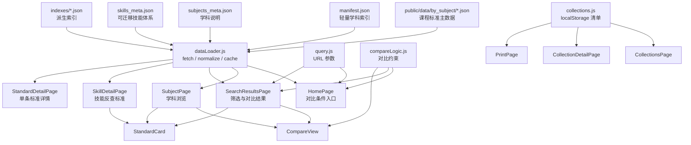

# 课标罗盘资源与架构文档

更新时间：2026-07-01
对应状态：当前工作树，H4G distinctiveness 修复与教材单元证据入口落地后
项目路径：`/Users/shawn.fsc/Downloads/curriculum breakdown/curriculum-standards-breakdown`

## 1. 项目概览

课标罗盘是一个基于 Vite + React 的静态 Web 应用，用来浏览、筛选、对比和收藏《义务教育课程标准（2022年版）》的结构化条目。

网站的核心不是后端服务，而是一套放在 `public/data` 下的 JSON 数据资源。前端运行时通过 `fetch('/data/...')` 按需读取 JSON，再在浏览器内完成筛选、分组、对比、收藏和打印。

当前主要能力：

- 按学科浏览课程标准。
- 按学段、领域、可迁移技能筛选标准。
- 支持多学科同学段对比，或单学科多学段对比。
- 查看可迁移技能体系，并反查关联标准。
- 查看单条标准详情、复制链接、收藏到本地清单。
- 清单支持本地创建、导入、导出、统计和打印。
- 提供术语表、反馈页和样式指南页面。

## 2. 技术栈与运行方式

核心技术：

- 构建工具：Vite 6
- 前端框架：React 18
- 路由：React Router 7
- 数据：静态 JSON + `fetch`
- 埋点：`@vercel/analytics`
- 部署配置：`vercel.json`

重要命令：

```bash
npm install
npm run dev
npm run build
npm run preview
npm run build:indexes
npm run validate:indexes
```

`npm run build` 会先执行 `prebuild`，也就是 `npm run build:indexes`。该脚本会根据 `public/data/by_subject` 重新生成 `manifest.json` 和派生索引文件。`npm run validate:indexes` 会校验 manifest、`code_to_subject`、`skill_to_subjects`、`subject_stats` 是否与 `by_subject` 主数据一致。

## 3. 顶层资源清单

### 3.1 应用源码

| 路径 | 作用 |
| --- | --- |
| `src/main.jsx` | React 入口，挂载 `BrowserRouter` 和 `App`。 |
| `src/App.jsx` | 全站路由定义，统一包裹 `Header`、`Footer` 和 Vercel Analytics。 |
| `src/pages` | 页面层，每个路由一个主要页面组件。 |
| `src/components` | 可复用 UI 组件，如标准卡片、对比视图、筛选控件、状态组件。 |
| `src/data` | 前端数据访问、数据规范化、URL 查询、收藏清单和对比逻辑。 |
| `src/styles/design-tokens.css` | Ocean Soft 主题设计变量。 |
| `src/index.css` | 全局样式、旧变量、布局工具和基础组件样式。 |

### 3.2 运行时数据资源

真正被网站运行时读取的数据都在 `public/data` 下。Vite 会把 `public` 目录作为静态资源根目录，因此代码中使用 `/data/...` 访问这些文件。

| 路径 | 作用 |
| --- | --- |
| `public/data/manifest.json` | 轻量级总索引，包含生成时间、字段清单、学科列表、各学科统计和文件路径。 |
| `public/data/subjects_meta.json` | 9 个学科的介绍、长描述、课程结构说明。 |
| `public/data/skills_meta.json` | 7 个可迁移技能领域及其子技能、定义、表现证据和教师策略。 |
| `public/data/glossary.json` | 术语表资源，供 `/glossary` 页面读取。当前 JSON 存在语法问题，见第 10 节。 |
| `public/data/by_subject/*.json` | 按学科拆分的课程标准主数据。 |
| `public/data/indexes/code_to_subject.json` | 标准 code 到 `subject_slug` 的反查索引，由 `scripts/build-indexes.js` 从主数据派生。 |
| `public/data/indexes/skill_to_subjects.json` | 技能到相关学科的轻量索引。 |
| `public/data/indexes/subject_stats.json` | 学科统计索引，由 `public/data/by_subject` 派生。 |

### 3.3 导出与源副本资源

| 路径 | 作用 |
| --- | --- |
| `standards_json_export/standards_all.json` | 课程标准全量导出快照。 |
| `standards_json_export/by_subject/*.json` | 按学科拆分的导出快照。 |
| `standards_json_export/manifest.json` | 导出快照的 manifest。 |
| `subjects_meta_all.json` | 学科元数据源副本，结构与 `public/data/subjects_meta.json` 对应。 |
| `transferable_skills_meta.json` | 可迁移技能源副本，结构与 `public/data/skills_meta.json` 对应。 |

这些文件位于 `public` 之外，默认不会作为网站静态资源直接访问。它们更像数据处理过程中的源文件或备份快照。

### 3.4 构建与部署资源

| 路径 | 作用 |
| --- | --- |
| `package.json` | npm 脚本和依赖声明。 |
| `package-lock.json` | 依赖锁定文件。 |
| `vite.config.js` | Vite 配置。 |
| `vercel.json` | Vercel 部署路由配置。 |
| `index.html` | Vite HTML 入口。 |
| `scripts/build-indexes.js` | 根据主数据生成派生索引。 |
| `scripts/textbooks/index_china_textbook.js` | 从 ChinaTextbook Git tree 生成初中教材文件证据索引，不下载 PDF blob。 |
| `scripts/textbooks/build_textbook_unit_index.js` | 从教材文件索引生成单元/章节候选证据入口；默认只生成文件级 `volume_seed`，也支持按 `evidence_id` 小批量物化 PDF、raw URL fallback、断点续传、文本层目录解析、目录印刷页解析和可选 OCR fallback。 |
| `scripts/textbooks/textbook_unit_page_start_overrides.json` | 已复核的教材印刷页码补证据；用于 TOC OCR 缺右侧页码但正文 OCR 标题/页脚可确认页码的情况，只附着到已有单元候选。 |
| `scripts/textbooks/textbook_unit_alignment_aliases.json` | 已复核的标准级 alignment alias；只允许指定 `standard_code` 使用指定单元标题关键词，不作为全局同义词表。 |
| `scripts/textbooks/audit_textbook_unit_index.js` | 校验教材单元候选索引，区分文件级 seed 与真实目录/章节候选。 |
| `scripts/textbooks/match_standards_to_textbook_units.js` | 将 H4G standards 与真实 `toc_unit_or_chapter` 候选做可解释匹配，并把单元页码、`subdomain_alignment`、标准级 `alias_alignment` 和强字段 alignment 传入匹配结果。 |
| `scripts/textbooks/build_h4g_unit_evidence_candidate.js` | 将通过 eligible 门的标准-单元匹配组织为写回前 H4G 单元证据候选包和逐条 review pack；包含候选页段与页码状态，不写 `public/data`。 |
| `scripts/textbooks/audit_h4g_unit_evidence_candidate.js` | 在 apply 前校验 H4G 单元证据候选包，确保官方字段未变、alignment 可解释、候选仍需人工复核；支持 `--require-page-start` 作为页码证据门禁。 |
| `scripts/textbooks/audit_h4g_unit_evidence_consistency.js` | 校验 H4G 单元证据候选包的跨版本一致性、progression group 年级覆盖和页码状态；用于区分诊断样本与发布级候选。 |
| `scripts/textbooks/audit_h4g_reverse_lookup_gaps.js` | 反向检索 H4G 候选包未过发布门的原因，按缺失版本和 progression group 输出页码、alignment、低分/错年级、无候选等缺口画像；只写 generated 报告，不写 `public/data`。 |
| `scripts/textbooks/audit_h4g_topic_placement_matrix.js` | 扫描同一主题在不同教材版本的 7/8/9 年级单元投放位置，区分真实缺证据与跨版本年级投放差异；只作诊断，不把跨年级单元升级为同年级证据。 |
| `scripts/textbooks/build_h4g_placement_evidence_candidate.js` | 将 topic placement matrix 中的跨年级投放差异整理成 progression group 级候选包；只用于发布前决策，不写 `public/data`，不生成 `textbook_unit_evidence_ids`。 |
| `scripts/textbooks/audit_h4g_placement_evidence_candidate.js` | 校验 placement 候选包仍是只读诊断材料，并强制 cross-grade unit evidence 不能被当作 same-grade standard evidence。 |
| `scripts/textbooks/plan_h4g_unit_evidence_worklist.js` | 生成 H4G 单元证据工作清单，把待分化 progression groups、当前候选覆盖和 ChinaTextbook 完整版本覆盖合并成下一批可执行教材物化任务。 |
| `scripts/textbooks/run_h4g_unit_work_item.js` | 按 worklist 中的单个 work item 串行执行物化、索引审计、匹配、候选包、consistency gate、候选数据根 apply 和 H4G 审计；默认只写 `generated/textbook_evidence/h4g_runs/`。 |
| `scripts/textbooks/apply_h4g_unit_evidence_candidate.js` | 将 H4G 单元证据候选包应用到独立候选数据根，供索引、审计和 UI 验证；默认拒绝写入 `public/data`。 |
| `scripts/textbooks/audit_textbook_standard_matches.js` | 校验标准-单元匹配，禁止把 `volume_seed` 当作正式分化证据。 |
| `dist` | 已构建产物目录，不是源码的主要维护入口。 |

## 4. 当前页面架构

路由由 `src/App.jsx` 统一声明：

| 路由 | 页面组件 | 主要作用 |
| --- | --- | --- |
| `/` | `HomePage` | 首页，对比筛选入口，加载 manifest、学科元数据和技能元数据。 |
| `/subjects/:slug` | `SubjectPage` | 单学科浏览页，按学科加载标准，可按学段过滤，可切换列表/对比视图。 |
| `/skills` | `SkillsOverviewPage` | 可迁移技能总览。 |
| `/skills/:code` | `SkillDetailPage` | 技能详情页，展示技能定义、子技能，并反查关联标准。 |
| `/search` | `SearchResultsPage` | 对比和筛选结果页，URL 保存筛选状态。 |
| `/glossary` | `GlossaryPage` | 术语表页面，直接 fetch `/data/glossary.json`。 |
| `/standards/:code` | `StandardDetailPage` | 单条标准详情页。 |
| `/collections` | `CollectionsPage` | 本地清单列表、创建和导入。 |
| `/collections/:id` | `CollectionDetailPage` | 清单详情、统计、导出和打印入口。 |
| `/print` | `PrintPage` | 打印视图，可按 collection 或 codes 加载标准。 |
| `/styleguide` | `StyleGuidePage` | 设计系统样式指南。 |
| `/feedback` | `FeedbackPage` | 反馈与纠错表单，支持 Web3Forms 或 mailto fallback。 |

## 5. 前端分层说明

### 5.1 页面层 `src/pages`

页面层负责：

- 读取路由参数和 URL 查询参数。
- 调用 `src/data` 的加载函数。
- 管理页面级状态，如 loading、error、筛选条件、展开状态。
- 组合组件层完成渲染。

典型例子：

- `SubjectPage.jsx` 使用 `loadSubjectStandards(slug)` 加载单学科标准，再用 `filterStandards` 和 `groupByDomain` 组织页面。
- `SearchResultsPage.jsx` 使用 URL query 作为“已应用筛选条件”，只加载用户选择的学科文件。
- `SkillDetailPage.jsx` 先加载技能和 manifest，再按选中学科加载标准并按技能过滤。
- `StandardDetailPage.jsx` 通过标准 code 定位单条标准。

### 5.2 组件层 `src/components`

组件层负责可复用 UI：

| 组件 | 作用 |
| --- | --- |
| `Header` / `Footer` | 全站导航和页脚。 |
| `StandardCard` | 标准条目卡片，支持展开详情、收藏、复制 ID、跳转详情。 |
| `CompareView` | 对比视图容器，支持多学科/多学段两种模式。 |
| `SubjectColumn` | 多学科对比时的单列学科视图。 |
| `GradeBandTabs` | 学段选择控件。 |
| `FilterBar` | 通用筛选栏。 |
| `FavoriteButton` | 收藏按钮，操作 localStorage 清单。 |
| `TSBadge` | 可迁移技能标签。 |
| `StateComponents` | Loading、Error、Empty、复制链接等状态组件。 |
| `HomeHeroBanner` / `SubjectHeroBanner` / `TSHeroBanner` | 页面 Hero 区域组件。 |

### 5.3 数据层 `src/data`

| 文件 | 作用 |
| --- | --- |
| `dataLoader.js` | 所有公开数据加载函数、缓存、筛选、分组、颜色常量。 |
| `schema.js` | 对标准、技能、学科元数据进行规范化，保证字段默认值。 |
| `query.js` | URL 查询参数解析、序列化、分享链接和复制能力。 |
| `compareLogic.js` | 对比模式的约束规则和筛选条件纠偏。 |
| `collections.js` | 收藏清单的 localStorage 持久化、CRUD、导入导出和统计。 |

## 6. 数据组织方式

### 6.1 数据主入口

网站的主数据入口是：

```text
public/data/
├── manifest.json
├── subjects_meta.json
├── skills_meta.json
├── glossary.json
├── by_subject/
│   ├── arts.json
│   ├── chinese.json
│   ├── english.json
│   ├── it.json
│   ├── labor.json
│   ├── math.json
│   ├── morality_law.json
│   ├── pe.json
│   └── science.json
└── indexes/
    ├── code_to_subject.json
    ├── skill_to_subjects.json
    └── subject_stats.json
```

其中 `by_subject` 是课程标准主数据。每个学科一个 JSON 文件，结构是：

```json
{
  "standards": [
    {
      "id": "SC-D1-AR-001",
      "code": "SC-D1-AR-001",
      "subject": "科学",
      "subject_slug": "science",
      "grade_band": "H1",
      "grade_range": "1-2",
      "domain": "态度责任",
      "subdomain": "人类活动与环境",
      "standard": "愿意倾听他人想法，并乐于分享和表达自己的观点。",
      "context": "...",
      "practice": "...",
      "teaching_tip": "...",
      "assessment_evidence_type": "...",
      "ts_primary": ["TS4"],
      "ts_secondary": [],
      "ts_rationale": "..."
    }
  ]
}
```

### 6.2 标准条目的核心字段

| 字段 | 类型 | 说明 |
| --- | --- | --- |
| `id` | string | 条目 ID，通常等于 `code`。 |
| `code` | string | 标准唯一编码，用于 URL、收藏、详情查询。 |
| `subject` | string | 中文学科名。 |
| `subject_slug` | string | 学科英文 slug，也是文件名。 |
| `domain` | string | 学科一级领域。 |
| `subdomain` | string | 子领域或更细分类。 |
| `grade_band` | string | 学段/年级代码：`H1`、`H2`、`H3`、`H4G7`、`H4G8`、`H4G9`。`H4` 仅作为 legacy stage label，不作为正式筛选项。 |
| `grade_range` | string | 年级范围，如 `1-2`、`7`、`8`、`9`。 |
| `grade` | string | 人类可读学段文本。 |
| `standard` | string | 标准正文，是页面最核心展示内容。 |
| `context` | string | 情境说明。 |
| `practice` | string | 实践建议。 |
| `teaching_tip` | string | 教学提示。 |
| `assessment_evidence_type` | string | 评价证据类型。 |
| `materials_tools` | string | 材料或工具。 |
| `safety_notes` | string | 安全提示。 |
| `project` | string | 项目或主题。 |
| `previous_code` | string | 上一条/前置标准 code，可为空或多行。 |
| `next_code` | string | 下一条/后续标准 code，可为空或多行。 |
| `ts_primary` | string[] | 主可迁移技能标签。 |
| `ts_secondary` | string[] | 次可迁移技能标签。 |
| `ts_rationale` | string | 技能标注理由。 |
| `ts_confidence` | string | 标注置信度。 |
| `ts_tag_source` | string | 标注来源。 |
| `discipline` | string | 学科/专业字段。 |
| `art_discipline` | string | 艺术学科细分字段。 |

`schema.js` 会将空值兜底为字符串或空数组，并保证 `ts_primary`、`ts_secondary`、`resources` 等字段始终是数组。

### 6.2.1 H4G 年级拆分元数据

初中正式记录使用 `H4G7/H4G8/H4G9` 作为 runtime 年级口径，同时保留 `stage_band: "H4"` 表示第四学段。因为 2022 版课标中大量初中要求本身是 7-9 共同要求，当前数据必须区分“源课标原文”和“年级化拆分状态”。

| 字段 | 类型 | 说明 |
| --- | --- | --- |
| `stage_band` | string | 初中拆分记录的大阶段标记，当前为 `H4`。 |
| `grade_level` | number | 具体年级数字，当前为 7、8、9。 |
| `legacy_code` | string | H4 拆分前或来源记录的 code。 |
| `source_grade_band` | string | 来源记录的学段，如 `H4`。 |
| `source_grade_range` | string | 来源记录的年级范围，如 `7-9`。 |
| `grade_assignment_type` | string | 年级归属依据类型；共享源记录会使用 `shared_requirement_*` 或低置信度类型。 |
| `grade_assignment_confidence` | number | 年级归属置信度，0 到 1。 |
| `grade_assignment_rationale` | string | 年级归属依据说明，非课标原文。 |
| `textbook_evidence_ids` | string[] | 教材文件级证据 ID。 |
| `textbook_unit_evidence_ids` | string[] | 未来单元/章节级证据 ID；当前仍为空数组。 |
| `standard_text_role` | string | 当前 `standard` 的文本角色，当前为 `source_standard_original`。 |
| `source_standard_scope` | string | 来源范围，如 `stage_shared_7_9`。 |
| `standard_variant_type` | string | `same_source_shared`、`grade_specific_variant` 或 `single_or_partial_grade_variant`。 |
| `evidence_granularity` | string | `none`、`textbook_file_grade_level` 或 `textbook_unit_level`。 |
| `progression_group_id` | string | 同一源标准跨年级展示或进阶的分组 ID。 |
| `progression_distinctiveness` | string | 当前三元组是否为 `identical_core_fields` 或 `core_fields_differ`。 |
| `progression_distinctiveness_fields` | string[] | 发生差异的核心字段。 |
| `requires_unit_level_evidence` | boolean | 是否仍需教材单元/章节级证据。 |
| `grade_specific_focus` | string | 年级化学习重点；共享源记录只写待补充，不编造具体内容。 |
| `progression_delta` | string | 年级间差异状态，如 `not_yet_differentiated_from_shared_7_9_source`。 |
| `progression_review_note` | string | 给前端和人工复核看的拆分状态说明。 |
| `review_status` | string | 如 `needs_grade_differentiation`、`needs_grade_differentiation_low_confidence`。 |

当前 `public/data` 中 323 个完整 H4G 三元组核心文本完全相同，但 `unlabeled_identical_triplets` 为 0；这些记录已标为共享源标准和待年级化细分。详见 `docs/H4G_DISTINCTIVENESS_REMEDIATION.md`。

### 6.2.2 教材证据工作产物

教材证据相关产物位于 `generated/textbook_evidence/`，属于可重建工作产物，不提交到 git，也不是网站 runtime 的静态数据入口。

| 路径 | 作用 |
| --- | --- |
| `generated/textbook_evidence/china_textbook_index.json` | ChinaTextbook 初中教材文件索引，记录教材路径、版本、年级、册次和 `textbook_evidence_id`。 |
| `generated/textbook_evidence/china_textbook_index_summary.md` | 教材文件覆盖摘要。 |
| `generated/textbook_evidence/junior_textbook_progression_audit.json` | 初中教材进阶覆盖审计。 |
| `generated/textbook_evidence/textbook_unit_index.json` | 单元/章节候选证据索引；当前默认包含 `volume_seed`，物化 PDF 后的 `toc_unit_or_chapter` 可包含 `page_start/page_range/page_range_status`。 |
| `generated/textbook_evidence/textbook_unit_index_summary.md` | 单元候选索引摘要，包含真实目录候选数和目录页码状态分布。 |
| `generated/textbook_evidence/textbook_unit_index_audit.json` | 单元候选索引审计结果。 |
| `generated/textbook_evidence/textbook_unit_standard_matches.json` | H4G standard 到教材单元/章节候选的可解释匹配结果；会继承单元页码字段，并保留 `subdomain_alignment`、`alias_alignment`、`field_alignment`。 |
| `generated/textbook_evidence/textbook_unit_standard_matches_summary.md` | 标准-单元匹配摘要，包含 eligible alignment 分布。 |
| `generated/textbook_evidence/textbook_unit_standard_matches_audit.json` | 标准-单元匹配审计结果。 |
| `generated/textbook_evidence/h4g_unit_evidence_candidate.json` | 写回前 H4G 单元证据候选包，包含拟写入的 `textbook_unit_evidence_ids` 和 review 信息。 |
| `generated/textbook_evidence/h4g_unit_evidence_candidate_summary.md` | 写回前候选包 review pack，逐条展示官方字段、候选单元、页段、页码状态、alignment、命中字段和关键词。 |
| `generated/textbook_evidence/h4g_unit_evidence_candidate_audit.json` | 写回前候选包审计结果，校验官方字段快照、安全边界、alignment、页码门禁和 proposed update。 |
| `generated/textbook_evidence/h4g_unit_evidence_consistency_audit.json` | 写回前候选包一致性审计结果，记录候选是否具备跨版本、多年级 progression group 和稳定页码证据。 |
| `generated/textbook_evidence/h4g_runs/<work_item_id>/h4g_topic_placement_matrix.json` / `.md` | H4G 主题投放矩阵；按 standard、progression group、教材版本和年级列出同主题单元位置，帮助识别跨版本年级投放差异。 |
| `generated/textbook_evidence/h4g_runs/<work_item_id>/h4g_placement_evidence_candidate.json` / `.md` | H4G 投放差异候选包；把 cross-grade 主题命中整理为 progression group 级 review material，但不作为同年级单元证据。 |
| `generated/textbook_evidence/h4g_runs/<work_item_id>/h4g_placement_evidence_candidate_audit.json` | H4G 投放差异候选包审计结果；确认候选包不写正式数据、不含 proposed update，且 cross-grade 证据只作诊断。 |
| `generated/textbook_evidence/h4g_unit_evidence_worklist.json` / `.md` | H4G 单元证据工作清单；记录每个学科仍需单元证据的 progression groups、可用完整教材版本和推荐 `evidence_ids` 批次。 |
| `generated/textbook_evidence/h4g_runs/<work_item_id>/` | 单个 H4G work item 的端到端运行目录；包含单元索引、匹配、候选包、consistency audit、候选数据根、`run_summary.json` 和 `run_summary.md`。 |
| `generated/textbook_evidence/h4g_unit_evidence_data_candidate/` | 可选候选数据根；由 H4G 单元证据候选包应用而来，用于重建索引和严格审计。 |
| `generated/textbook_evidence/h4g_unit_evidence_data_candidate/h4g_unit_evidence_apply_summary.json` | 候选包 apply 摘要，记录 applied/missing/skipped、单元证据对象数和课标原文字段变更检查。 |
| `generated/textbook_evidence/pdf_cache/` | 可选 PDF 物化缓存；不提交。 |

相关命令：

```bash
npm run textbooks:index-china
npm run textbooks:unit-index
npm run textbooks:audit-unit-index -- --strict
npm run textbooks:match-units
npm run textbooks:audit-unit-matches -- --strict
npm run textbooks:h4g-unit-candidates -- --strict --require-candidates
npm run textbooks:audit-h4g-unit-candidates -- --strict --require-candidates
npm run textbooks:audit-h4g-unit-candidates -- --strict --require-candidates --require-page-start
npm run textbooks:audit-h4g-unit-consistency -- --strict --require-candidates --require-page-start
npm run textbooks:audit-h4g-topic-placement -- --strict --require-hits
npm run textbooks:h4g-placement-candidates -- --strict --require-candidates
npm run textbooks:audit-h4g-placement-candidates -- --strict --require-candidates --require-cross-grade-evidence
npm run textbooks:plan-h4g-unit-worklist -- --strict --require-work-items
npm run textbooks:run-h4g-unit-work-item -- --work-item h4g_unit_work_math_6aec3166
npm run textbooks:apply-h4g-unit-candidates -- --strict
```

重要边界：

- `textbook_evidence_ids` 当前是教材文件级证据，可支持年级适配判断。
- `textbook_unit_evidence_ids` 只有在获得 `toc_unit_or_chapter`、完成标准匹配并进入 H4G 单元证据候选包后才能填写。
- `volume_seed` 不能证明标准已完成单元级分化；它只是后续 OCR/目录提取的任务入口。
- `page_start` 和 `page_range` 是教材目录中的印刷页码证据，不是 PDF 页码；`page_range_status=toc_page_nonmonotonic` 必须人工确认，不能当成强页段证据自动发布。
- 双栏/交错 OCR 目录只有在同一目录窗口出现多次页码回退时，才按印刷页顺序推断页段；普通单次回退仍保留 `toc_page_nonmonotonic`，防止真实目录错误被静默吞掉。
- `eligible_for_h4g_differentiation` 必须来自真实 `toc_unit_or_chapter`、达到匹配分数，并通过 alignment gate：通常要求命中标准 `subdomain` 锚点；数学等学科只能使用标准级、已复核的 `reviewed_alias_anchor` 作为局部例外；科学编号内容项可用 `strong_field_alignment` 作为第二通道。三者都必须保留可审计证据，不能用全局同义词放宽。
- `h4g_unit_evidence_candidate` 是写回前候选，不会修改 `public/data`，也不会改写课标原文；其 Markdown summary 用于逐条复核，不是正式发布记录。
- `textbooks:audit-h4g-unit-candidates` 必须在 apply 前运行，防止候选包缺少官方字段快照、真实单元证据、alignment 证据或误把候选说明当作已发布分化；声称支持 H4G 年级分化的候选包应加 `--require-page-start`。
- `textbooks:audit-h4g-unit-consistency` 必须在正式发布前运行。普通 review gate 可以只要求 `--require-candidates --require-page-start`；发布级 gate 应加 `--fail-on-nonmonotonic-pages --min-editions-per-standard 2 --min-editions-per-progression-group 2 --require-complete-progression-groups`，否则单版本样本不能被解释为跨版本一致的年级分化。
- `textbooks:audit-h4g-topic-placement` 是跨版本年级投放诊断 gate。它能说明同一主题在不同版本教材中落在不同年级，但跨年级命中不能作为某条 same-grade standard 的证据自动写回。
- `textbooks:h4g-placement-candidates` 会把 topic placement matrix 中的 `review_cross_grade_placement` 结果整理成 progression group 级候选包，帮助讨论 publication gate 或 progression model；它仍是诊断层，不写 `public/data`，不写 `textbook_unit_evidence_ids`。
- `textbooks:audit-h4g-placement-candidates` 必须确认 placement 候选包的 `writes_public_data=false`、`writes_textbook_unit_evidence_ids=false`，并确认 cross-grade unit evidence 只解释版本投放差异，不能升级为 same-grade evidence。
- `textbooks:plan-h4g-unit-worklist` 是任务规划 gate，不是证据 gate。它可以确认哪些学科有至少两个完整教材版本可进入跨版本候选生成，也会暴露当前 ChinaTextbook 无法覆盖的 IT、劳动等缺口。
- `textbooks:run-h4g-unit-work-item` 是执行 gate，不是发布 gate。它把 worklist 的单个批次跑到 generated 候选数据根和审计摘要，但不会写 `public/data`；如果要证明发布级分化，仍需使用 consistency audit 的发布级参数。
- `textbooks:apply-h4g-unit-candidates` 只把候选包应用到独立候选数据根；正式写入 `public/data` 仍需要单独发布 gate。
- `materialize_timeout` 或 `raw_materialize_timeout` 代表远端 PDF 文件没有稳定取得，不得被解释为教材缺少目录或标准无法分化。
- `--materialize` 会先尝试读取 PDF blob，失败时默认使用 raw URL fallback 并保留 `.part` 供下次续传；`--ocr-fallback` 会调用本机 Apple Vision OCR。它们可能受网络、外部仓库大小和本机环境影响，暂不作为默认 gate。

### 6.3 学科元数据

`public/data/subjects_meta.json` 的结构：

```json
{
  "generated_at": "...",
  "source": "...",
  "subjects_meta": [
    {
      "subject_slug": "chinese",
      "subject_cn": "语文",
      "short_description": "...",
      "long_description": "...",
      "structure_notes": "..."
    }
  ]
}
```

这些内容主要用于学科页 Hero、学科说明和课程结构说明。

### 6.4 可迁移技能元数据

`public/data/skills_meta.json` 的结构：

```json
{
  "meta": {
    "generated_at": "...",
    "version": "v1",
    "language": "zh-CN"
  },
  "competencies": [
    {
      "code": "TS1",
      "name_cn": "批判性思维与问题解决",
      "name_en": "Critical Thinking & Problem Solving",
      "tagline_cn": "...",
      "definition_cn": "...",
      "look_fors": [],
      "teacher_moves": [],
      "subskills": []
    }
  ]
}
```

当前包含 7 个一级可迁移技能：

| Code | 名称 |
| --- | --- |
| `TS1` | 批判性思维与问题解决 |
| `TS2` | 创新、创造与实践性解决方案 |
| `TS3` | 自主学习与终身发展 |
| `TS4` | 协作与共同体行动 |
| `TS5` | 沟通与表达 |
| `TS6` | 数字素养与数据驱动 |
| `TS7` | 全球公民、可持续与伦理责任 |

### 6.5 Manifest

`manifest.json` 是轻量索引，用来让页面先知道有哪些学科、每个学科文件在哪里、每个学科大概有多少条数据和哪些领域/学段。

核心字段：

| 字段 | 说明 |
| --- | --- |
| `generated_at` | 生成时间。 |
| `columns` | 标准条目的字段列表。 |
| `subjects` | 学科数组。 |
| `subjects[].subject` | 中文学科名。 |
| `subjects[].subject_slug` | 学科 slug。 |
| `subjects[].record_count` | 该学科条目数。 |
| `subjects[].file` | 对应 `by_subject` 文件路径。 |
| `subjects[].domains` | 领域计数。 |
| `subjects[].grade_bands` | 学段计数。 |

### 6.6 派生索引

`public/data/indexes/skill_to_subjects.json` 用于技能反查学科：

```json
{
  "TS1": ["chinese", "english", "it", "math", "morality_law", "science"]
}
```

理论用途：打开某个技能页或按技能搜索时，只加载含该技能的学科文件，避免加载全部标准。

`public/data/indexes/subject_stats.json` 用于学科统计：

```json
{
  "chinese": {
    "total": 225,
    "domains": 11,
    "grade_bands": {
      "H1": 15,
      "H2": 26,
      "H3": 28,
      "H4G7": 52,
      "H4G8": 52,
      "H4G9": 52
    },
    "grades": {
      "七年级": 52,
      "八年级": 52,
      "九年级": 52
    },
    "skill_coverage": {}
  }
}
```

该索引由 `scripts/build-indexes.js` 从主数据派生；`grades` 统计优先使用记录的 `grade` 字段，旧记录缺少 `grade` 时使用 `grade_band:grade_range` 兜底。这用于支持 7-9 年级拆分后按七、八、九年级核对和展示。

## 7. 当前主数据规模

以下数量直接来自 `public/data/by_subject/*.json` 当前实际文件：

| 学科 slug | 学科 | 实际条目数 |
| --- | --- | ---: |
| `arts` | 艺术 | 233 |
| `chinese` | 语文 | 225 |
| `english` | 英语 | 236 |
| `it` | 信息科技 | 116 |
| `labor` | 劳动 | 181 |
| `math` | 数学 | 161 |
| `morality_law` | 道德与法治 | 221 |
| `pe` | 体育 | 211 |
| `science` | 科学 | 349 |
| **合计** |  | **1933** |

注意：当前 `manifest.json` 与 `subject_stats.json` 已由主数据重新生成，并可通过 `npm run validate:indexes` 校验。

## 8. 数据加载流程

### 8.1 基础加载

`src/data/dataLoader.js` 中的 `DATA_BASE_PATH` 是：

```js
const DATA_BASE_PATH = '/data'
```

所有数据都通过：

```js
fetch(`${DATA_BASE_PATH}${path}`)
```

加载。

基础加载函数：

- `loadManifest()` 读取 `/data/manifest.json`。
- `loadSubjectsMeta()` 读取 `/data/subjects_meta.json`。
- `loadSkillsMeta()` 读取 `/data/skills_meta.json`。
- `loadSubjectStandards(subjectSlug)` 读取 `/data/by_subject/${subjectSlug}.json`。
- `loadMultipleSubjectStandards(subjectSlugs)` 并行加载多个学科。
- `loadAllStandards()` 根据 manifest 中的所有学科加载全量标准。
- `loadStandardByCode(code)` 按 code 定位单条标准。

### 8.2 缓存策略

`dataLoader.js` 维护一个模块级内存缓存：

```js
const cache = {
  manifest: null,
  subjectsMeta: null,
  skillsMeta: null,
  skillsInfo: null,
  subjectStandards: new Map(),
  allStandards: null,
  skillToSubjects: null,
  subjectStats: null,
  codeToSubjectMap: new Map()
}
```

作用：

- 同一页面生命周期内避免重复请求同一 JSON。
- 同一个学科文件只加载一次。
- manifest、学科元数据、技能元数据作为轻量资源提前加载。
- 全量标准只在必要时加载。

### 8.3 单条标准查找

`loadStandardByCode(code)` 的顺序：

1. 先在已经加载过的学科缓存里查找。
2. 通过 code 前缀推断学科，比如 `SCI` → `science`。
3. 如果无法推断，再遍历 manifest 中所有学科逐个加载查找。

前缀映射在 `inferSubjectFromCode` 中：

| 前缀 | 学科 slug |
| --- | --- |
| `CNC` | `chinese` |
| `ML` | `math` |
| `ENG` | `english` |
| `SCI` | `science` |
| `IT` | `it` |
| `MLW` | `morality_law` |
| `ART` | `arts` |
| `LAB` | `labor` |
| `PE` | `pe` |

当前科学数据样例中使用了 `SC-D1-AR-001` 这类前缀，而代码里映射的是 `SCI`。如果存在大量 `SC-...` 编码，详情页首次直达时可能走 fallback 全量搜索。可以考虑补充 `SC: 'science'`。

### 8.4 筛选与分组

`filterStandards(standards, filters)` 支持：

- `subjects`
- `gradeBands`
- `domains`
- `skills`
- `keyword`

技能筛选会同时看 `ts_primary` 和 `ts_secondary`，并支持 `TS1` 与 `TS1.2` 这类父子 code 的前缀匹配。

`groupByDomain(standards)` 将标准按 `domain` 分组，主要用于学科页和对比页。

## 9. URL 与对比架构

### 9.1 URL 查询参数

`src/data/query.js` 定义的查询参数：

| 参数 | 示例 | 说明 |
| --- | --- | --- |
| `mode` | `compare` | 当前模式。 |
| `subjects` | `math,science` | 逗号分隔的学科 slug。 |
| `bands` | `H1,H2` | 逗号分隔的学段。 |
| `skills` | `TS1,TS3` | 逗号分隔的技能 code。 |
| `q` | `数据` | 关键词。 |

这些参数让搜索/对比结果可以分享。

### 9.2 对比规则

`src/data/compareLogic.js` 规定互斥规则：

- 模式 A：1 到 3 个学科 + 恰好 1 个学段。
- 模式 B：恰好 1 个学科 + 1 到 3 个学段。
- 不允许“多个学科 + 多个学段”同时存在。

`CompareView` 根据选择自动进入两类布局：

- 多学科同学段：每个学科一列，列内按领域展开。
- 单学科多学段：每个学段一列，按领域对齐展示。

## 10. 收藏、清单与打印数据

收藏和清单不是云端数据，全部存储在浏览器 `localStorage`：

```js
const STORAGE_KEY = 'curriculum-collections'
```

默认结构：

```json
{
  "version": 1,
  "collections": {
    "default": {
      "id": "default",
      "name": "我的收藏",
      "description": "默认收藏夹",
      "createdAt": "...",
      "standardCodes": []
    }
  }
}
```

清单只保存标准 code，不复制标准正文。打开清单时再通过 `loadStandardByCode` 把 code 转回完整标准对象。

导出 JSON 格式会包含：

- 类型标记：`curriculum-standards-collection`
- 导出时间
- 清单元数据
- `standardCodes`

打印页 `/print` 支持：

- `?collection=default`
- `?codes=CODE1,CODE2`

## 11. 当前数据一致性与维护风险

这部分是当前仓库真实状态，不是设计目标。

### 11.1 `manifest.json` 已由主数据重新生成

截至 2026-07-01，`public/data/manifest.json` 已通过 `scripts/build-indexes.js` 从 `public/data/by_subject` 重新生成。当前 manifest 显示：

- 学科数：9
- 总条目数：1933
- 科学：349

这与 `public/data/by_subject/*.json` 当前实际合计一致：

- 学科数：9
- 总条目数：1933
- 科学：349

`manifest.subjects[].record_count`、`domains`、`grade_bands`、`grades` 均由主数据派生。

### 11.2 `subject_stats.json` 已由主数据重新生成

截至 2026-07-01，`public/data/indexes/subject_stats.json` 已通过 `scripts/build-indexes.js` 从 `public/data/by_subject` 重新生成，合计 1933 条，与主数据实际数量一致，并包含 `grade_bands` 与具体 `grades` 两层统计。

当前正式主数据按学科统计如下：

| 学科 | 主数据实际 |
| --- | ---: |
| 艺术 | 233 |
| 语文 | 225 |
| 英语 | 236 |
| 信息科技 | 116 |
| 劳动 | 181 |
| 数学 | 161 |
| 道德与法治 | 221 |
| 体育 | 211 |
| 科学 | 349 |

建议：每次修改 `public/data/by_subject` 后重新运行 `npm run build:indexes` 和 `npm run validate:indexes`，并一起提交 manifest 与派生索引。

### 11.3 `code_to_subject.json` 已纳入正式派生索引

脚本会写出：

- `public/data/indexes/code_to_subject.json`
- `public/data/indexes/skill_to_subjects.json`
- `public/data/indexes/subject_stats.json`

`public/data/indexes/code_to_subject.json` 已纳入正式资源，避免 `npm run build` 后出现未提交生成物。当前 `dataLoader.js` 仍主要通过 code 前缀和已加载缓存查找详情；后续可以进一步改为优先读取该索引，减少 fallback 全量扫描。

### 11.4 `glossary.json` 当前不是合法 JSON

`public/data/glossary.json` 中存在未转义的中文引号场景，例如：

```text
如数学分为"数与代数""图形与几何"等
```

这会导致 `res.json()` 解析失败，从而影响 `/glossary` 页面。

建议：将字符串内部引号转义为 `\"`，或统一改用中文书名号/单引号表述。

### 11.5 学段定义已经统一为当前 runtime 口径

`dataLoader.js` 中的 `GRADE_BANDS` 定义为：

- `H1`：1-2 年级
- `H2`：3-4 年级
- `H3`：5-6 年级
- `H4G7`：7 年级
- `H4G8`：8 年级
- `H4G9`：9 年级

当前正式数据、manifest、indexes 和前端展示都采用：

- `H1`：1-2 年级
- `H2`：3-4 年级
- `H3`：5-6 年级
- `H4G7`：7 年级
- `H4G8`：8 年级
- `H4G9`：9 年级

按该口径，旧 public 中的 H1/H2/H3 记录已经恢复并保留；7-9 年级记录使用 H4G7/H4G8/H4G9。`H4` 只作为 legacy stage label 保留为 `selectable: false`，不再作为正式筛选项。艺术旧数据中的 `H2:3-5`、`H3:6-7` 作为来源年级范围保留，不被硬改。

建议：后续如果要调整学段定义，应先设计新的 grade_band 或数据集契约，再同步 README、glossary、`GRADE_BANDS`、数据字段和页面展示。

### 11.6 搜索页技能筛选字段疑似不一致

`filterStandards` 使用 `ts_primary` 和 `ts_secondary`。

但 `SearchResultsPage.jsx` 的局部技能筛选逻辑使用：

```js
s?.transferable_skills?.map(t => t.code)
```

当前标准主数据没有 `transferable_skills` 字段，因此搜索页在应用技能筛选时可能筛不出结果。

建议：搜索页复用 `filterStandards`，或改为读取 `ts_primary` / `ts_secondary`。

## 12. 数据维护流程建议

推荐把数据维护分成四层：

1. 源数据层：保留原始整理文件或导出文件，如 `standards_json_export`、根目录元数据。
2. 主数据层：维护 `public/data/by_subject/*.json`，这是网站读取标准的唯一可信来源。
3. 元数据层：维护 `manifest.json`、`subjects_meta.json`、`skills_meta.json`、`glossary.json`。
4. 派生索引层：由脚本生成 `public/data/indexes/*.json`，不手工编辑。

每次更新课程标准后建议执行：

```bash
npm run build:indexes
npm run validate:indexes
npm run grade7_9:audit-h4g-distinctiveness -- --strict
npm run build
```

然后检查：

- `validate:indexes` 是否通过。
- `audit-h4g-distinctiveness` 是否确认 `unlabeled_identical_triplets` 为 0。
- `glossary.json`、`skills_meta.json`、`subjects_meta.json` 是否能被 `jq` 或 `JSON.parse` 正常解析。
- 随机打开一个学科页、一个技能页、一个标准详情页、一个清单打印页。

## 13. 推荐的架构改进顺序

优先级从高到低：

1. 修复 `glossary.json` 的 JSON 语法问题。
2. 继续保持学段口径一致：README、glossary、`GRADE_BANDS`、数据字段都应维持 `H1=1-2, H2=3-4, H3=5-6, H4G7=7, H4G8=8, H4G9=9`。
3. 每次修改主数据后重新生成 `manifest.json`，确保统计来自 `by_subject` 主数据。
4. 让 `loadStandardByCode` 优先使用已纳入的 `code_to_subject.json`，减少 fallback 全量扫描。
5. 持续保持搜索页、技能页和索引脚本统一使用 `ts_primary` / `ts_secondary`。
6. 给数据校验增加脚本，例如检查 JSON 合法性、字段完整性、code 唯一性、manifest 统计一致性。

## 14. 一句话架构图

```text
public/data JSON
   ↓ fetch + normalize + cache
src/data/dataLoader.js
   ↓ filter / group / lookup
pages
   ↓ props
components
   ↓ user actions
URL query + localStorage collections
```

## 15. Mermaid 架构图


