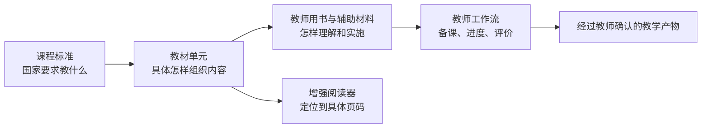

# 教材智能能力契约（Textbook Intelligence Capability）

状态：规划草案
适用产品：kebiao.org（课标罗盘）
依赖能力：课标数据、智能搜索、学习地图、收藏夹、教学计划对齐工作台、教材资源库
实施计划：[TEXTBOOK_READ_LOCATE_LINK_EXECUTION_PLAN.md](./TEXTBOOK_READ_LOCATE_LINK_EXECUTION_PLAN.md)

## CAPABILITY

### 1. 产品定位

kebiao.org 不把教材功能定义为“PDF 下载站”，而把教材建设成课标落地的证据层和教师工作入口：

> 让用户从一条课标出发，找到它在教材中的具体单元和页码；也能从一个教材单元出发，理解相关课标、教师用书、教学建议、评价证据，并继续形成可编辑的教学计划。

教材在产品中的位置如下：

### 2. 核心用户闭环

教材能力必须支持一条连续路径，而不是若干互不相连的页面：

1. 找到要求：通过学科、年级、主题或自然语言查询课标。
2. 找到落点：查看该课标在哪一本教材、哪个单元、哪些页出现。
3. 阅读原文：进入对应教材页，而不是重新在整本 PDF 中寻找。
4. 补充理解：并排查看对应教师用书、教材全解、教学提示和评价证据。
5. 形成行动：把单元和课标加入收藏、教学进度或对齐工作台。
6. 完成产物：生成有出处、可编辑、需教师确认的单元计划或周计划。

### 3. 用户可见能力

#### 3.1 教材馆 `/textbooks`

教材馆首先回答“有哪些书、是不是我要找的那一版、目前可用到什么程度”。

- 按学段、学科、年级、出版社、版本、册次筛选。
- 显示封面、书名、出版社、审定信息、出版或修订年份、册次和页数。
- 显示资源状态：当前版、未来版、历史版、版本待确认。
- 显示能力状态：可阅读、可搜索、有目录、有单元课标关联、有教师用书、有辅助材料。
- 支持由课标、学习地图、搜索结果和收藏夹反向进入教材馆。

教材馆不以“下载量”和“文件数量”为主要表达，而以资源完整度和教学可用度为主要表达。

#### 3.2 教材详情页 `/textbooks/:editionId`

详情页不直接把用户丢进阅读器，而是先提供一本书的结构化入口：

- 教材身份：学科、年级、册次、出版社、版本、审定和修订信息。
- 目录与单元：章、单元、课题、起止页及目录可信状态。
- 单元课标地图：每个单元关联的课标、学习主题、跨学科技能和评价证据。
- 配套资源：教师用书、教材全解、练习册、答案或其他辅助材料，明确标注资源类型。
- 版本说明：当前使用状态和确认来源。
- 阅读进度：继续阅读、最近页码和书签；第一阶段可保存在本机浏览器。

#### 3.3 增强教材阅读器 `/textbooks/:editionId/read`

基础体验必须优于浏览器直接打开 PDF：

- 缩略图、目录、连续/单页/双页模式、缩放、全屏和键盘翻页。
- 文本层存在时提供全文搜索；不存在时明确提示，不让搜索静默失效。
- 自动记忆阅读位置、书签和最近打开记录。
- 页面链接可稳定分享或收藏，例如 `?page=42&unit=...`。
- 区分 PDF 页码与书本印刷页码。
- 侧栏始终显示当前单元、相关课标和配套资源。
- 点击相关课标时保留当前阅读上下文；返回后仍在原页。
- 教师用书或辅助材料完成配对后，可从教材页跳到对应材料的相关页段。

阅读器不依赖 AI 才能工作；OCR、问答或自动关联失败时，基础阅读、目录定位和页码跳转仍然可用。

#### 3.4 单元教学包 `/textbooks/:editionId/units/:unitId`

“单元”是教材能力最重要的产品对象。每个单元教学包聚合：

- 教材页码和可直接打开的阅读位置。
- 经审核的相关课标及其原文出处。
- 教师用书的对应章节和页码。
- 教材全解或辅助材料的对应内容。
- 课标已有的教学提示、材料工具、安全提示和评价证据类型。
- 本单元在同学科跨年级进阶中的位置；只能称为进阶关系或内容联系，不能自动称为先修关系。
- “加入收藏”“加入教学计划”“在对齐工作台中打开”等行动入口。

后续可以在这里生成“单元教学框架”，但生成内容必须引用已确认的课标和教材证据，并允许教师逐项编辑和接受。

#### 3.5 课标到教材的反向查询

现有课标详情页增加“教材中的落实”区域：

- 哪些教材版本涉及该课标。
- 涉及哪些单元、课题和页码。
- 关联依据和审核状态。
- 同一课标在不同年级或不同教材版本中的组织差异。

系统必须把“课标原文”和“教材关联解释”分开展示。教材关联不是课标原文，也不能因为模型打分较高就显示为官方结论。

#### 3.6 教材语境搜索

现有智能搜索扩展为“课标 + 教材”联合搜索：

- 查询“七年级上册一元一次方程教到哪里”时，返回教材、单元、页码和相关课标。
- 查询一条课标时，同时返回它的教材落点。
- 结果解释区明确说明命中的字段、资源版本和证据页码。
- 没有可靠证据时返回“暂未建立关联”，不能补造单元、页码或课标编号。

#### 3.7 教师工作流连接

教材能力复用现有收藏夹和教学计划对齐工作台：

- 从一个教材单元预填年级、学科、课时范围和候选课标。
- 教师确认候选课标后再进行覆盖分析。
- 把教材目录转换为可编辑的学期进度框架。
- 显示计划覆盖了哪些课标、遗漏了哪些课标，以及哪些课标过度集中。
- 输出周计划或单元计划时保留教材页码与课标出处。

系统的角色是提出有证据的候选和发现覆盖问题；最终选择由教师确认。

### 4. 分阶段能力路线

#### 阶段 A：可读——先建立可靠的教材入口

交付范围：

- 教材馆、教材详情页和增强阅读器。
- 封面、书目身份、页数、版本状态和资源可用状态。
- 稳定的 `edition_id`、`asset_id` 和阅读 URL。
- 阅读位置、书签、目录跳转；有文本层时支持全文搜索。
- X9 Pro 保存不可变的原始文件，网站只通过资源 ID 使用文件，不暴露磁盘路径。

验收重点：所有“可阅读”资源确实可打开；页码跳转稳定；未来版、旧版和待确认版不会被误称为当前版。

#### 阶段 B：可定位——让整本 PDF 变成单元和页码

交付范围：

- 优先教材的目录抽取、人工校对和单元页码范围。
- PDF 页码与印刷页码映射。
- 教材详情页的单元目录和单元教学包骨架。
- 从搜索结果直接打开指定单元或页码。

建议先做 12—20 本高频教材作为标杆样本，不以一次性处理全部教材为前提。

#### 阶段 C：可关联——打通课标、教材和教师资源

交付范围：

- 单元到课标的候选匹配、人工审核和公开展示。
- 课标详情页反向显示教材单元和页码。
- 教师用书、教材全解等配套资源的类型化存储与版本配对。
- 阅读器侧栏展示相关课标和已配对资源。

首批教师资源仍以 20—30 组高质量配对为目标。没有核实版次的材料保留为“未配对参考资料”，不得自动挂到具体教材。

#### 阶段 D：可行动——进入备课和教学进度

交付范围：

- 单元一键进入对齐工作台。
- 目录生成可编辑学期进度框架。
- 课标覆盖、遗漏和分布分析。
- 基于已确认证据形成可编辑的单元教学框架或周计划。

#### 阶段 E：可问答——最后增加有出处的教材 AI

交付范围：

- “问这本教材”或“问这个单元”，答案逐条引用教材或教师用书页码。
- 比较同一内容在不同年级或不同版本中的安排。
- 从课标、教材和教师用书联合回答教学问题。

只有当目录、页码、版本和关联证据足够稳定后才进入此阶段。AI 问答不是第一阶段的门面功能。

### 5. 第一批建议范围

优先选择既高频、又能验证不同内容组织方式的教材：

- 初中数学、英语、物理、化学、生物。
- 统编语文、道德与法治、历史。
- 小学选择语文、数学、英语各一到两个年级作为阅读体验和跨年级进阶样本。

每一本试点教材至少完成“身份确认—可读—目录—页码—单元”五项；其中一部分再完成“课标审核关联—教师用书配对—进入教学计划”，形成端到端样板。不要把资源平均铺开到所有教材，却没有一本能走通完整闭环。

### 6. 衡量是否真正有用

首要指标不是 PDF 数量或下载量，而是：

- 可打开率：标记为可读的教材成功打开的比例。
- 定位效率：用户从进入教材到打开目标单元/页码所需时间。
- 目录覆盖率：有经过校对目录和页码范围的教材比例。
- 关联覆盖率：有经审核单元—课标关联的单元比例。
- 配套资源配对率：教师用书或辅助材料完成可靠配对的教材比例。
- 行动转化：教材单元被加入收藏、对齐工作台或教学计划的比例。
- 证据完整度：公开关联中同时具有版本、单元、页码和审核状态的比例。
- 阅读稳定性：加载失败、页码错误和断点续读失败的比例。

## CONSTRAINTS

### 固定产品规则

1. 课标原文、教材原文、编辑解释和 AI 生成内容必须分层存储并在界面上可区分。
2. 模型不能发明课标编号、教材版本、单元名称或页码；证据不足时必须明确返回未知。
3. 未审核的单元—课标匹配只能作为内部候选，不能作为公开事实。
4. 教师用书、教材全解、练习册和答案是不同资源类型，不能混为“教辅”。
5. 教材与配套材料必须按 ISBN/审定信息/出版社/修订年份/年级/册次等身份配对；模糊书名不足以建立正式关系。
6. 原始 PDF 不可变；线性化 PDF、OCR 文本、缩略图、封面和目录均为可重建派生物。
7. 前端和公开数据只引用稳定资源 ID，不能引用 X9 Pro 的实际文件路径。
8. PDF 页码和印刷页码必须分别存储和显示。
9. “进阶关系”不能默认表述为“先修关系”。
10. 教师确认是计划生成和课标选择中的必要步骤。

### 当前已知部署约束

- X9 Pro 适合作为个人原始资源库和处理源，但不能作为 kebiao.org 公网服务的直接文件源。
- 推荐第一阶段采用“双层资源模式”：X9 Pro 保存原始文件；网站使用可撤回的私有阅读副本或受控文件服务。
- 若暂时不建设账号体系，书签和阅读进度可保存在浏览器本地；跨设备同步不作承诺。
- OCR 不是所有教材进入阅读器的前置条件；只有需要全文搜索、问答或细粒度证据定位的优先教材才做 OCR。

### 架构偏好（可以调整）

- 对象存储或文件服务支持 HTTP Range，阅读器优先使用分段加载。
- 目录和页码先结构化为 JSON，再逐步迁移到数据库。
- 公开目录数据、关系数据和二进制访问权限彼此分离。
- AI 检索以页段和单元为最小证据单元，并保留 `asset_id + pdf_page + printed_page` 引用。

## IMPLEMENTATION CONTRACT

### 1. 核心数据对象

| 对象 | 用途 | 必要字段 |
|---|---|---|
| `TextbookWork` | 抽象教材作品 | 学段、学科、年级体系、出版社 |
| `TextbookEdition` | 可被准确识别的一版一册 | `edition_id`、版本、册次、审定、出版/修订年份、状态 |
| `Asset` | 实际可读取文件及派生物 | `asset_id`、类型、校验值、页数、文本层、访问状态 |
| `Unit` | 目录中的章/单元/课题 | `unit_id`、层级、标题、排序、页码范围、审核状态 |
| `PageAnchor` | 稳定页码定位 | PDF 页码、印刷页码、页段、映射状态 |
| `StandardUnitAlignment` | 单元与课标的证据关系 | 课标编号、单元、依据、置信度、审核状态、审核人/时间 |
| `RelatedResource` | 教师用书及辅助材料 | 资源类型、目标教材版次、配对依据、对应单元/页段、状态 |
| `ReadingState` | 个人阅读状态 | 最近页、书签、最近打开时间；第一阶段仅本地保存 |

现有 `textbook_evidence_id`、`unit_evidence_id` 与新资源对象之间必须建立稳定映射，不能通过文件名临时关联。

### 2. 建议路由

- `GET /textbooks`
- `GET /textbooks/:editionId`
- `GET /textbooks/:editionId/read?page=:pdfPage&unit=:unitId`
- `GET /textbooks/:editionId/units/:unitId`
- 在 `/standards/:code` 增加教材落实区。
- 在 `/smart-search` 增加教材命中和页码证据。
- 支持 `/alignment-workbench?edition=:editionId&unit=:unitId` 预填上下文。

### 3. 建议 API

- `GET /api/v1/textbooks`
- `GET /api/v1/textbooks/{editionId}`
- `GET /api/v1/textbooks/{editionId}/units`
- `GET /api/v1/textbooks/{editionId}/assets`
- `GET /api/v1/textbooks/{editionId}/viewer`
- `GET /api/v1/units/{unitId}`
- `GET /api/v1/units/{unitId}/standards`
- `GET /api/v1/units/{unitId}/resources`
- `GET /api/v1/standards/{code}/textbooks`
- 后期：`POST /api/v1/units/{unitId}/plan-drafts`

`viewer` 接口应返回受控的阅读地址和能力声明，例如是否支持 Range、文本搜索、目录、印刷页码和 OCR；不应返回 X9 Pro 文件路径。

### 4. 公开状态模型

教材卡片和详情页应分别展示以下状态，不能压缩成单一“已收录”：

- `cataloged`：已有书目信息。
- `file_verified`：文件校验通过。
- `revision_confirmed`：当前版本状态已确认。
- `viewer_ready`：阅读器可稳定打开。
- `toc_ready`：目录和页码可定位。
- `alignment_reviewed`：存在经过审核的单元—课标关系。
- `resource_paired`：存在可靠配对的教师用书或辅助材料。

### 5. 降级行为

- 没有文本层：允许阅读和目录跳转，隐藏全文搜索或明确提示不可用。
- 没有目录：允许阅读，显示“目录待整理”，不生成伪目录。
- 没有审核关联：显示“暂未建立课标关联”，不展示模型候选。
- 文件暂不可用：仍保留书目页和资源状态，但不出现无效阅读按钮。
- 配套材料未完成版本配对：只出现在参考资料区，不进入单元侧栏。
- AI 服务不可用：搜索、阅读、目录、收藏和对齐工作台的确定性功能继续可用。

## NON-GOALS

首轮不做：

- 以“输入一句话自动生成完整教案”为核心卖点。
- 对全部教材一次性进行高成本 OCR。
- 在没有审核的情况下公开模型生成的单元—课标关系。
- 一次性收齐所有版本、所有教师用书和所有教辅系列。
- 首轮建设复杂批注协作、班级管理、作业下发和 LMS。
- 把教材阅读量或文件下载量当作教学价值的替代指标。
- 让公开网站直接依赖个人电脑或外接硬盘在线。

## OPEN QUESTIONS

以下问题会改变部署或试点顺序，需要在进入开发前确定：

1. 完整 PDF 的访问模式是仅本人登录、受邀用户，还是公开访问？建议首版采用“公开书目与关联信息 + 私有完整阅读”。
2. 第一批端到端样板选择哪些教材？建议用 12—20 本覆盖不同学科结构的教材，不从 140 本平均开工。
3. 私有阅读副本放在什么文件服务或对象存储中？X9 Pro 继续作为原始资源主库。
4. 第一批教师用书和辅助材料以哪些学科为主？建议优先初中数学、英语、物理、化学和统编语文/历史。
5. 第一阶段是否需要跨设备阅读进度？建议不需要，先使用浏览器本地状态。

## HANDOFF

### 产品与设计

先完成四个页面的低保真流程：教材馆、教材详情、阅读器、单元教学包；并分别设计“资源齐全”和“目录/文本层/关联缺失”的状态。

### 数据与内容

从现有资源库选择 12—20 本试点教材，补齐身份字段，制作目录、页码映射和状态清单；选择其中 5—8 本完成单元—课标人工审核，选择 3—5 本完成教师用书配对。

### 后端与资源服务

先提供稳定 `edition_id`/`asset_id`、教材清单、详情、目录和受控阅读地址；验证 Range 请求、断点加载和文件不可用时的降级行为。

### 前端

先交付不用 AI 也完整可用的教材馆和阅读器；随后加入单元侧栏、课标反向入口以及对齐工作台预填。

### AI 与检索

只在经过校对的目录和页码证据上做试点。任何回答都必须携带资源版本与页码引用；未检索到证据时返回未知。

### 建议的第一张研发切片

选择一本已经校验、目录清晰的初中教材，端到端完成：

`教材馆卡片 → 教材详情 → 单元目录 → 指定页阅读 → 相关课标 → 加入对齐工作台`

这条切片完成后，再把相同模型扩展到更多教材和配套材料。它能同时验证资源模型、阅读体验、课标关联和教师行动闭环。
