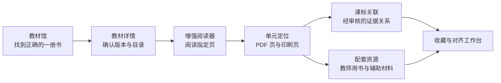
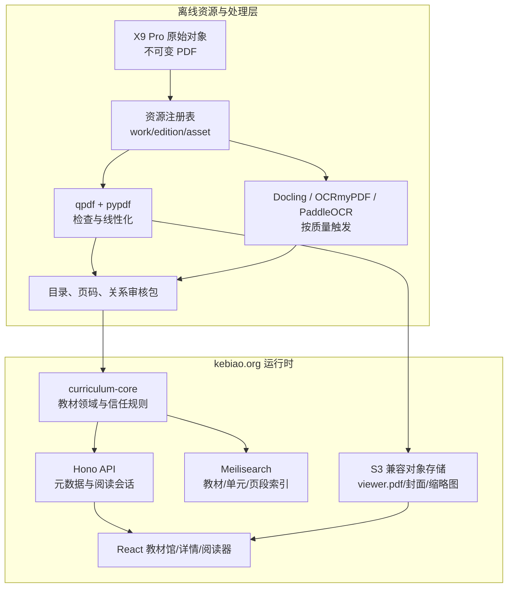

# kebiao.org 教材“可读—可定位—可关联”完整实施计划

状态：首轮实施完成
调研日期：2026-07-17
完成日期：2026-07-17
上游能力契约：[TEXTBOOK_INTELLIGENCE_CAPABILITY.md](./TEXTBOOK_INTELLIGENCE_CAPABILITY.md)
实施范围：小学、初中主流版本教材，以及与其可靠配对的教师用书和辅助材料

## 首轮实施结果

- 教材馆公开 141 册学生教材；145 个已注册 PDF/配套资源均可通过稳定 ID 打开。
- 145 个文件完成结构抽取：原生文本 92、部分文本 2、扫描型 51，失败 0。
- 公开 813 条已回查目录和 9,370 条已核对 PDF/印刷页映射；92 册形成稳定印刷页映射。
- 增强阅读器支持 Range 按需读取、目录/缩略图/全文检索、单页/连续/双页、缩放、双页码和本地进度恢复。
- 公开 9 条已复核教材—课标关系，覆盖 8 条课标；29 条未定位候选继续留在内部报告，不进入公开产品。
- 4 份地图册已按配套材料关联到教材。当前资源库未发现可靠教师用书或教材全解文件，因此相关入口和数据契约已就绪，但不展示虚构资源。
- OpenAPI、数据脱敏审计、真实 PDF Range、桌面/手机布局、39 项 API 测试、34 项全站无障碍回归及教材专项 WCAG 扫描均已通过。

## CAPABILITY

### 1. 本轮要交付的能力

本轮不是建设三个孤立功能，而是建设同一套教材基础设施的三个连续状态：

1. **可读**：用户能在教材馆中找到准确的一册书，进入详情页，并在增强阅读器中稳定、快速地阅读。
2. **可定位**：用户能通过目录、单元、PDF 页码和印刷页码精确到达内容位置，链接可以被搜索、收藏和复用。
3. **可关联**：用户能从教材单元看到相关课标、教师用书和辅助材料，也能从课标反向回到教材单元与页码。

完整用户路径：



### 2. 本轮完成后的用户承诺

- 所有显示“可阅读”的教材都能实际打开，失败时有清楚的状态和恢复方式。
- 用户复制教材链接后，重新打开仍能回到同一版次、单元和 PDF 页。
- PDF 页码与书本印刷页码分开显示，不用一个模糊的“第几页”混用两种含义。
- 公开的教材—课标、教材—教师用书、教材—辅助材料关系都有版本和审核依据。
- 没有证据或尚未审核的关联不伪装成事实。

### 3. 交付覆盖策略

不同层级采用不同覆盖目标：

| 能力层级 | 首轮覆盖 | 原因 |
|---|---:|---|
| 教材馆书目 | 当前资源库全部 145 个对象 | 已有稳定资源 ID 和文件校验结果 |
| 增强阅读器 | 全部结构校验通过的教材；优先保证 12 本样板 | 阅读能力不应依赖目录和 OCR |
| 目录与页码 | 12 本端到端样板，随后扩到 20 本 | 需要抽取和人工校对，不能把低质量目录批量发布 |
| 单元—课标关联 | 先完成 5—8 本高质量样板 | 已有候选和审核管线，但公开关系必须经过复核 |
| 教师用书/辅助材料配对 | 先完成 3—5 组真实配对 | 当前资源覆盖不足，且版次错误比资源缺失危害更大 |

首轮不追求“145 本每一本都完成所有能力”，而要先做出可以复制的完整闭环。

## CONSTRAINTS

### 4. 当前项目基线

#### 4.1 已有产品和工程能力

kebiao.org 已具备：

- React 18 + Vite 前端与现有设计系统。
- 课标详情、智能搜索、学习地图、收藏夹、教学计划对齐工作台。
- `packages/curriculum-core` 领域与检索能力、Hono API、字段级访问控制。
- `textbook_evidence_ids`、`textbook_unit_evidence_ids` 和教材单元证据发布闸门。
- 教材文件下载、校验、内容寻址存储、生成快照、恢复和审计脚本。
- 单元目录候选、OCR fallback、标准—单元候选匹配、审核包和发布检查。

因此本轮应扩展现有课程智能基础设施，不另建一套教材数据库、搜索引擎或关系系统。

#### 4.2 当前教材资源状态

以 `gen-20260717051338-15c077ccb4` 为当前资源代：

- 145 个已入库对象：小学 83、初中 62。
- 141 个学生教材，4 个学生配套资源。
- 145 个对象均已通过 PDF 结构和传输校验。
- 只有 3 个对象完成书目与当前版确认；140 个仍为 `revision_unknown`，另有 2026 秋季候选和 2027 春季未来候选。
- 现有正式公开数据中有 45 条经过发布闸门的 H4G 单元级证据记录，数学 28 条、科学 17 条；这证明关联工作流可复用，但还不是全学科覆盖。

结论：**文件存在不等于版本已确认，版本已确认也不等于目录和关联可以公开。**

#### 4.3 真实 PDF 抽样结论

本次对 12 本初中重点教材的前 15 页进行只读抽样：

- 11 本具有较强文本层；九年级英语上册候选主要为扫描页，需要 OCR。
- 只有 1 本包含 PDF outline。
- 12 本均没有 PDF page labels。
- 目录与印刷页码不能依赖 PDF 自带元数据，必须建立提取、推断和人工复核流程。

这意味着：

- 不需要把“全量 OCR”设为可读的前置条件。
- 可定位的主要难点是目录层级、单元起止页和印刷页码映射。
- OCR 应按文本质量阈值触发，而不是按文件数量批量触发。

### 5. 固定规则与信任边界

1. 原始 PDF 永久不可变；线性化 PDF、OCR PDF、封面、缩略图、文本和目录都是可重建派生物。
2. X9 Pro 是原始资源库和离线处理源，不作为 kebiao.org 公网文件服务器。
3. 前端只接触 `work_id`、`edition_id`、`asset_id`、`unit_id` 等稳定 ID，不接触 X9 路径。
4. 教材版本未确认时可以阅读，但必须显示“版本待确认”，不得显示“当前版”。
5. PDF 页码是稳定技术定位；印刷页码是经过提取或审核的用户标签。深链接以 PDF 页码为真值。
6. 单元—课标关系、教材—配套材料关系都有候选、审核、批准和否决状态。
7. 未批准关系只进入内部审核面板，不进入公开页面和普通搜索索引。
8. 课标原文、教材文字、编辑说明、规则结果和 AI 结果分层保存。
9. AI 或规则不能发明教材页码、目录标题、课标编号或版次。
10. 关联必须能反向解析：从单元找到课标，也必须从课标找到同一个单元关系对象。

### 6. 部署约束

- 现有 API 部署在 Vercel；Vercel Functions 的请求或响应体上限为 4.5 MB，因此不能用普通 Vercel Function 代理整本 PDF。官方建议大文件直接从源读取。[Vercel Functions limits](https://vercel.com/docs/functions/limitations)
- 推荐用 S3 兼容对象存储保存阅读副本，并让浏览器直接读取；Cloudflare R2 提供 S3 兼容接口，且支持 ranged request 的 206 响应。[R2 S3 API](https://developers.cloudflare.com/r2/get-started/s3/)、[R2 release notes](https://developers.cloudflare.com/r2/platform/release-notes/)
- 私有阅读时，API 只生成短期阅读会话或签名地址，不转发 PDF 本体。
- 对象存储必须配置 CORS，并暴露 `Accept-Ranges`、`Content-Range`、`Content-Length`、`ETag` 等阅读器需要的响应头。

## IMPLEMENTATION CONTRACT

### 7. GitHub 项目调研与选型

调研围绕阅读器、长文档性能、PDF 结构处理、OCR/结构化、人工审核、搜索和完整 RAG 平台展开。核心选型如下。

#### 7.1 直接采用

| 项目 | 可提供的能力 | 维护/许可判断 | 本项目决策 |
|---|---|---|---|
| [mozilla/pdf.js](https://github.com/mozilla/pdf.js) | PDF 渲染、文本层、注释层、outline、page labels、Range 加载 | Apache-2.0；2026 年仍持续发布 | 阅读器底座 |
| [wojtekmaj/react-pdf](https://github.com/wojtekmaj/react-pdf) | 把 PDF.js 的 Document/Page 能力接入 React，支持文本和注释层 | MIT；10.x 持续开发 | React 渲染适配层 |
| [TanStack Virtual](https://github.com/TanStack/virtual) | 只渲染可视区域，支持动态测量与长列表 | MIT；活跃维护 | 连续阅读虚拟化 |
| [qpdf](https://github.com/qpdf/qpdf) | PDF 检查、结构修复、线性化和内容保持型变换 | Apache-2.0；活跃维护 | 生成 `viewer.pdf` 和结构检查 |
| [pypdf](https://github.com/py-pdf/pypdf) | 离线读取页数、元数据、文本、outline/page labels | BSD-3-Clause；活跃维护 | 快速体检和轻量抽取 |
| [Docling](https://github.com/docling-project/docling) | 布局、阅读顺序、标题结构、表格、OCR 和 lossless JSON | 代码 MIT；模型另行核对；2026 年活跃发布 | 目录/结构提取主候选，先做样本评测 |
| [OCRmyPDF](https://github.com/ocrmypdf/OCRmyPDF) | 为扫描 PDF 增加可搜索文本层，保留原图并验证输出 | MPL-2.0；2026 年活跃发布 | 扫描版派生 PDF 生成器 |
| [PaddleOCR](https://github.com/PaddlePaddle/PaddleOCR) | 中文/英文 OCR、版面结构、坐标和 JSON/Markdown | Apache-2.0；中文文档生态成熟 | Docling/Tesseract 不足时的中文复杂页面 fallback |

PDF.js 官方说明：outline 和 page labels 可通过 API 读取；服务器支持 HTTP Range 时可以按需取段；长文档应只渲染可见页，以免每页 canvas 持续占用内存。[PDFDocumentProxy API](https://mozilla.github.io/pdf.js/api/draft/module-pdfjsLib-PDFDocumentProxy.html)、[PDF.js FAQ](https://github.com/mozilla/pdf.js/wiki/frequently-asked-questions)

React-PDF 提供 PDF.js worker、文本层、注释层、授权请求头和 Range transport 接口，但它不是完整的现成产品界面，因此工具栏、目录、书签、虚拟滚动和课程侧栏仍由 kebiao.org 自己控制。[React-PDF README](https://github.com/wojtekmaj/react-pdf)

#### 7.2 复用现有能力

| 项目/能力 | 决策 |
|---|---|
| [Meilisearch](https://github.com/meilisearch/meilisearch) | 项目已有适配器；扩充教材、单元和页段索引，不新增另一套搜索引擎。它支持过滤、分面、中文搜索和混合检索。 |
| 现有 `scripts/textbooks` | 继续作为候选生成、审核包、质量闸门和发布工具；新增资源库输入适配，不推翻已有单元证据模型。 |
| 现有 `curriculum-core` | 增加教材领域模块，保证 UI、API 和未来 Agent 使用同一套关系与信任规则。 |

#### 7.3 只在特定情况下使用

| 项目 | 适用条件 | 当前决策 |
|---|---|---|
| [Label Studio](https://github.com/HumanSignal/label-studio) | 需要多人进行页面区域、版面框或批量标注时 | 作为可选审核工具；首版目录和关系审核仍用项目自身的审核数据与轻量管理页 |
| [MinerU](https://github.com/opendatalab/MinerU) | Docling/PaddleOCR 在复杂教材版面上效果不足时 | 加入样本 benchmark，不作为默认依赖；其自定义开源许可证需单独核查 |
| [Universal Viewer](https://github.com/UniversalViewer/universalviewer) / [Mirador](https://github.com/ProjectMirador/mirador) | 未来需要 IIIF、跨馆资源、图像级批注或多资源对照 | 首三阶段不采用；转换到 IIIF manifest 和逐页图像会增加目前不需要的管线 |

#### 7.4 暂不采用

| 项目 | 不采用原因 |
|---|---|
| [react-pdf-viewer](https://github.com/react-pdf-viewer/react-pdf-viewer) | 功能丰富但当前需要购买商业许可证，公开 release 停留在 2023 年；不适合作为长期核心依赖 |
| [RAGFlow](https://github.com/infiniflow/ragflow) | 有文档解析、分块、引用和 RAG，但依赖 MySQL、Redis、对象存储和 Elasticsearch/Infinity 等完整栈，与现有 API、Meilisearch 和证据模型重叠；前三阶段过重 |
| [Paperless-ngx](https://github.com/paperless-ngx/paperless-ngx) | 强项是个人文档归档、OCR 和管理，不理解教材版次、单元、课标与配套材料关系 |
| [Stirling-PDF](https://github.com/Stirling-Tools/Stirling-PDF) | 强项是通用 PDF 编辑和工作流，系统较重且为 open-core；可参考处理能力，但不嵌入产品核心 |

### 8. 总体架构



#### 8.1 架构边界

- `packages/curriculum-core/src/textbooks/`：纯领域类型、状态规则、投影和关系解析，不依赖 Vercel、R2 或 React。
- `apps/api/src/textbooks/`：文件仓库、对象存储签名器、HTTP 路由和权限适配。
- `src/features/textbooks/`：教材馆、详情、阅读器、目录和关联侧栏。
- `scripts/textbooks/`：离线抽取、派生资源、候选关系、审核和发布；不作为在线请求依赖。
- `public/data/textbooks/`：只保存允许公开的书目、目录和已批准关系，不保存私有 PDF 地址。

这样依赖方向保持为：

`前端/API 适配器 → curriculum-core 教材领域 ← 离线发布数据`

核心领域不反向依赖对象存储、PDF.js 或 OCR 工具。

### 9. 数据模型

#### 9.1 复用现有身份

- `work_id`：同一教材作品的抽象身份。
- `edition_id`：具体版本、年级和册次。
- `asset_id`：具体文件或派生文件的内容身份。
- `evidence_id`：现有教材证据身份。
- `textbook_unit_evidence_id`：已进入课标证据体系的单元证据身份。

不得根据文件名临时生成页面链接，也不得另建一套与这些 ID 无法映射的教材主键。

#### 9.2 新增核心对象

##### `TextbookEditionRecord`

必要字段：

- `edition_id`, `work_id`, `stage`, `subject_slug`, `grade`, `volume`
- `title`, `publisher`, `edition_name`, `isbn`, `approval_code`
- `published_at`, `revised_at`, `revision_status`
- `bibliographic_review_status`, `current_status`
- `primary_asset_id`, `cover_asset_id`
- `viewer_status`, `toc_status`, `page_map_status`, `alignment_status`

##### `TextbookAssetRecord`

- `asset_id`, `edition_id`, `resource_type`
- `variant`: `original | viewer | ocr | thumbnail | cover | extracted_text`
- `sha256`, `bytes`, `pages`, `mime_type`
- `text_layer_status`, `outline_status`, `page_label_status`
- `storage_provider`, `storage_key`；公开投影中不得包含本地路径
- `derived_from_asset_id`, `processor`, `processor_version`, `created_at`

##### `TextbookTocNode`

- `unit_id`, `edition_id`, `parent_id`
- `node_type`: `part | unit | chapter | lesson | section | appendix`
- `title`, `normalized_title`, `order`
- `pdf_page_start`, `pdf_page_end`
- `printed_page_start`, `printed_page_end`
- `source_method`: `embedded_outline | text_toc | docling | ocr | manual`
- `confidence`, `review_status`, `reviewed_at`

##### `TextbookPageMapEntry`

- `edition_id`, `asset_id`, `pdf_page`
- `printed_label`, `printed_number`
- `section`: `cover | frontmatter | body | backmatter`
- `detection_method`, `confidence`, `review_status`

必须按页存储或按连续区间存储，不能只保存一个全书 offset，因为封面、插页、空白页和附录可能改变偏移。

##### `RelatedResourceRecord`

- `resource_id`, `asset_id`, `resource_type`
- `resource_type`: `teacher_guide | student_companion | supplement | exercise_book | answer_key | atlas`
- `target_work_id`, `target_edition_id`
- `pairing_basis`: ISBN、出版社、审定信息、修订年份、目录相似度等
- `pairing_status`: `unpaired | candidate | approved | rejected | superseded`
- `review_note`, `reviewed_at`

##### `UnitResourceLink`

- `link_id`, `unit_id`, `resource_id`
- `resource_pdf_page_start/end`, `resource_printed_page_start/end`
- `relation_type`: `explains | teaches | exercises | answers | extends`
- `method`, `confidence`, `review_status`

##### `StandardUnitAlignment`

复用现有候选和发布机制，补齐：

- `alignment_id`, `standard_code`, `unit_id`
- `edition_id`, `evidence_id`, `textbook_unit_evidence_id`
- `method`: `human | rule | model`
- `matched_fields`, `matched_terms`, `rationale`
- `confidence`, `review_status`, `reviewed_at`
- `eligible_for_publication`, `source_refs`

### 10. 状态机

#### 10.1 教材与资源状态

```text
cataloged
  → file_verified
  → viewer_ready
  → toc_candidate
  → toc_reviewed
  → alignment_candidate
  → alignment_reviewed
```

版本确认是独立轴：

```text
revision_unknown → revision_candidate → current_confirmed
                               ↘ historical_confirmed
                               ↘ future_confirmed
```

可阅读不要求 `current_confirmed`，但公开“当前教材”筛选必须要求确认状态。

#### 10.2 目录、配对和关系状态

统一采用：

`candidate → in_review → approved | rejected → superseded`

- `approved` 才能进入公开搜索和反向关系。
- 原 PDF 或版本变化后，旧目录和关系进入 `superseded`，保留审计历史。
- 派生物重建但源 `asset_id` 不变时，可以重跑质量检查，不自动推翻人工批准。

### 11. 可读：教材馆、详情页和增强阅读器

#### 11.1 教材馆 `/textbooks`

页面结构：

- 顶部：学段、学科、年级、版本、册次和资源状态筛选。
- 卡片：封面、书名、年级册次、出版社/版本、页数、版本状态。
- 能力徽标：可阅读、可搜索、有目录、有课标关联、有教师用书/辅助材料。
- 默认排序：当前版确认 → 版本待确认 → 历史/未来候选；同组内按学科、年级、册次。
- 空状态不隐藏：暂无教师用书、目录待整理、版本待确认都应可见。

#### 11.2 教材详情 `/textbooks/:editionId`

页面区域：

1. 书目身份与版本状态。
2. “继续阅读”和“从第一页阅读”。
3. 结构化目录；未完成时显示处理状态。
4. 单元—课标摘要。
5. 配套资源及配对依据。
6. 文件与数据可信度说明。

#### 11.3 阅读器 `/textbooks/:editionId/read`

技术组合：

- React-PDF/PDF.js 渲染页面、文本层和注释层。
- TanStack Virtual 只挂载可见页及少量 overscan 页。
- URL 中的 `pdf_page` 是恢复与分享真值。
- PDF.js `getOutline()` 和 `getPageLabels()` 作为第一优先级元数据源。
- 阅读文件通过对象存储直接 Range 加载；API 只发阅读会话。

桌面布局：

- 左侧：目录/缩略图切换。
- 中间：单页、连续、双页阅读区域。
- 右侧：当前单元、印刷页码、相关课标、教师用书和辅助材料。
- 顶栏：页码跳转、缩放、适合宽度、旋转、全屏、搜索和复制链接。

移动布局：

- 阅读区域占主屏。
- 目录和课程侧栏变成底部抽屉。
- 工具栏缩减为页码、缩放、目录、搜索和更多菜单。

本地阅读状态：

- `localStorage` key 包含 `edition_id + primary_asset_id + schema_version`。
- 保存最近 PDF 页、阅读模式、缩放偏好和书签。
- 文件版本变化后不盲目复用旧页码；显示“教材文件已更新”。

降级策略：

- 无文本层：阅读正常，全文搜索显示不可用。
- 无目录：仍可缩略图和页码跳转。
- 无印刷页码：显示 PDF 页码，不猜测。
- 对象存储短时失败：保留书目与目录，提供重试，不显示空白 canvas。

### 12. 可定位：目录、单元和双页码体系

#### 12.1 处理优先级

每一本教材按照下面的阶梯处理，前一步满足质量要求就停止：

1. 读取内嵌 outline 和 page labels。
2. 从现有文本层抽取目录页和页脚页码。
3. 用 Docling 对目录页和候选章节首页做结构化处理。
4. 无有效文本层时，用 OCRmyPDF 生成 searchable PDF。
5. 中文复杂版面或坐标质量不足时，使用 PaddleOCR。
6. 自动结果进入人工复核；不能通过质量闸门时保留“待整理”。

#### 12.2 文本质量闸门

每本书生成 `text_quality_report`：

- 抽样页面数量与非空文本页比例。
- 每页字符数、乱码/替代字符比例。
- 中文、英文、数字覆盖。
- 是否疑似整页图片。
- 是否存在读取权限或字体映射问题。

建议触发 OCR 的条件：

- 抽样正文页中，有效文本页比例低于 70%；或
- 目录页无法提取标题和页码；或
- 替代字符和乱码比例超过质量阈值。

阈值必须通过 12 本样板评测后锁定，不能直接把当前建议值当成永久产品事实。

#### 12.3 目录抽取

目录处理输出树，不输出扁平标题列表：

- 识别“篇/单元/章/课/节/活动/附录”等层级标志。
- 读取目录中给出的印刷页码。
- 通过标题归一化，在正文中寻找章节首页。
- 同时保留原始标题和规范化标题。
- 自动生成 `pdf_page_start`，由下一个同级节点推导 `pdf_page_end`。
- 父节点页段必须覆盖全部子节点；同级页码必须单调不下降。

现有 `build_textbook_unit_index.js` 已能生成 `toc_unit_or_chapter` 候选和 page-start override，应扩展为读取新的 X9 资源注册表，并输出统一 `TextbookTocNode`，不另写平行解析器。

#### 12.4 印刷页码映射

映射流程：

1. 若 PDF 自带 page labels，读取为候选。
2. 从页面底部或外侧区域读取页码数字/罗马数字。
3. 在连续 5 页以上验证单调序列。
4. 生成连续映射区间，再展开为单页映射供 API 使用。
5. 封面、扉页、版权页和空白页允许 `printed_label=null`。
6. 对插页、缺页或偏移变化建立新的区间，不强行维持全书单 offset。
7. 复核者在目录页、正文起始页、中间页和末页做锚点检查。

展示约定：

- 工具栏显示 `印刷页 24 · PDF 31/162`。
- URL 永远携带 `pdf_page=31`；`printed_page=24` 只作可读提示。
- 用户输入“24”时默认按印刷页跳转；无法解析时再提示按 PDF 页跳转。

#### 12.5 首批 12 本端到端样板

建议选择：

- 人教数学：七、八、九年级上册。
- 统编语文：七、八、九年级上册。
- 人教英语：七、八年级上册。
- 人教物理：八年级上册、九年级全一册。
- 统编历史：七年级上册。
- 人教化学：九年级上册。

另把“九年级英语上册扫描候选”作为 OCR 压力样本，但在版本确认前不进入“当前版”公开样板。

### 13. 可关联：课标、教师用书和辅助材料

#### 13.1 单元—课标关系

处理链：

```text
已审核目录节点
  → 规则/检索生成候选
  → 展示命中字段、关键词、年级和页段
  → 人工审核
  → 质量闸门
  → 写入批准关系
  → 课标与教材双向发布
```

候选匹配继续复用现有：

- 年级一致性检查。
- 学科主题桥接与标准级 alias。
- `matched_fields`, `matched_terms`, `rationale`。
- `eligible_alignment` 和多级发布审计。
- same-grade 证据与 cross-grade placement 诊断分离。

新增要求：

- 匹配必须指向新的 `unit_id` 和稳定 `edition_id`。
- 旧 `unit_evidence_id` 与新目录节点建立一对一或显式迁移映射。
- 课标详情页只显示 `approved` 关系。
- 智能搜索可以使用候选关系辅助内部排序，但不能把候选文字显示为公开事实。

#### 13.2 教材—教师用书/辅助材料配对

第一层是版本配对：

1. ISBN 或明确配套书号。
2. 书名、出版社、主编/编写组、审定信息。
3. 修订年份、年级、册次。
4. 目录标题和顺序相似度。
5. 人工确认。

第二层是单元配对：

- 相同或高相似标题。
- 单元顺序与页码范围。
- 教师用书中的“教材分析”“教学目标”“教学建议”等结构标志。
- 辅助材料中的章/节/课题标志。

没有通过第一层版本配对的资源只能放入“未配对参考资料”，不能自动出现在教材单元侧栏。

#### 13.3 公开展示

教材单元页：

- 相关课标及其审核依据。
- 教师用书对应章节和页段。
- 辅助材料对应章节和页段。
- 每条关系的资源类型和版本状态。

课标详情页新增“教材中的落实”：

- 教材、年级册次、单元和页码。
- 关系依据和审核状态说明。
- 打开阅读器时直达相关页。

阅读器右侧栏：

- 当前页所属单元。
- 已批准课标关系。
- 已批准教师用书/辅助材料链接。
- 加入收藏或打开对齐工作台。

### 14. 路由与 API

#### 14.1 用户路由

- `/textbooks`
- `/textbooks/:editionId`
- `/textbooks/:editionId/read?pdf_page=31&unit=:unitId`
- `/textbooks/:editionId/units/:unitId`
- `/standards/:code` 增加教材反向关联。
- `/smart-search` 增加教材/单元命中。
- `/alignment-workbench?edition=:editionId&unit=:unitId`

#### 14.2 内部审核路由

- `/admin/textbooks/metadata-review`
- `/admin/textbooks/toc-review/:editionId`
- `/admin/textbooks/page-map-review/:editionId`
- `/admin/textbooks/resource-pairing-review`
- `/admin/textbooks/alignment-review`

首版可以是只对本人开放的轻量页面；如果页面区域标注量明显增加，再接入 Label Studio。

#### 14.3 API

- `GET /api/v1/textbooks`
- `GET /api/v1/textbooks/{editionId}`
- `GET /api/v1/textbooks/{editionId}/toc`
- `GET /api/v1/textbooks/{editionId}/page-map`
- `GET /api/v1/textbooks/{editionId}/units/{unitId}`
- `GET /api/v1/textbooks/{editionId}/resources`
- `POST /api/v1/textbooks/{editionId}/viewer-session`
- `GET /api/v1/units/{unitId}/standards`
- `GET /api/v1/units/{unitId}/resources`
- `GET /api/v1/standards/{code}/textbooks`

`viewer-session` 返回：

- `edition_id`, `asset_id`, `sha256`, `pages`
- 短期阅读 URL 与 `expires_at`
- `supports_range`, `supports_text`, `supports_outline`, `supports_printed_page_map`
- CMap/标准字体配置版本

它不得返回本地路径、对象存储密钥或永久私有地址。

### 15. 搜索索引

沿用 Meilisearch，建立三个文档类型：

1. `textbook_editions`：书名、出版社、版次、学科、年级、册次和能力状态。
2. `textbook_units`：目录标题、别名、教材身份、页码和已批准课标编号。
3. `textbook_page_chunks`：后续使用的页段文本，必须携带 `asset_id + pdf_page + unit_id`。

首三阶段的搜索优先使用精确身份、目录标题和课标关系；向量/混合搜索不是发布前置条件。

### 16. 文件与数据产物

#### 16.1 X9 Pro

```text
kebiao-library/
  objects/sha256/...                 # 原始不可变 PDF
  derived/viewer/<asset_id>.pdf      # qpdf 线性化阅读副本
  derived/ocr/<asset_id>.pdf         # OCR 派生 PDF
  derived/covers/<asset_id>.webp
  derived/thumbnails/<asset_id>/...
  derived/text/<asset_id>/pages.jsonl
  derived/docling/<asset_id>/document.json
```

派生物可以重建，不进入原始对象目录。

#### 16.2 项目内部数据

```text
data/internal/textbooks/
  editions.jsonl
  assets.jsonl
  toc/<edition_id>.json
  page-maps/<edition_id>.json
  resources.jsonl
  resource-links.jsonl
  alignments.jsonl
  review-decisions/
```

#### 16.3 公开投影

```text
public/data/textbooks/
  index.json
  by-edition/<edition_id>.json
  toc/<edition_id>.json
  page-maps/<edition_id>.json
  by-standard/<standard_code>.json
```

公开投影只包含允许显示的状态和批准关系。

### 17. 实施工作包

#### WP0：领域契约与数据迁移基础

交付：

- `curriculum-core/src/textbooks/` 类型、schema、状态规则和投影函数。
- 现有注册表到 `TextbookEditionRecord/TextbookAssetRecord` 的确定性构建器。
- `evidence_id/unit_evidence_id` 与新 ID 映射表。
- JSON schema、数据验证器和失败报告。

完成标准：同一输入多次构建得到稳定 ID 与相同公开投影。

#### WP1：阅读派生物与对象存储

交付：

- qpdf 检查、线性化和 viewer asset 注册。
- 封面与缩略图生成。
- S3 兼容上传、校验和可重复同步。
- 阅读会话 API 和 Range/CORS 验证器。

完成标准：原始 PDF 不变；派生物可删除重建；浏览器直接获得 206 响应。

#### WP2：教材馆与详情页

交付：

- 教材馆筛选、卡片、状态徽标与空状态。
- 教材详情、目录骨架、资源状态和继续阅读。
- 全部页面的加载、错误、无数据和权限状态。

完成标准：145 个资源对象都能在书目层被解释，不存在裸文件名页面。

#### WP3：增强阅读器

交付：

- React-PDF/PDF.js worker、CMap 和标准字体配置。
- TanStack Virtual 连续阅读。
- 单页/连续/双页、缩放、页码、目录、缩略图、搜索、书签和断点续读。
- URL 深链接与课程侧栏插槽。

完成标准：200 页级教材不会同时挂载全部 canvas；刷新和分享链接回到同一 PDF 页。

#### WP4：文本质量、目录与页码管线

交付：

- 文本质量审计。
- qpdf/pypdf 元数据读取。
- Docling 样本评测与结构适配。
- OCRmyPDF/PaddleOCR fallback。
- 目录树、印刷页码映射和人工 override。

完成标准：12 本样板都具有经审核的目录与页码映射；无结果时明确标记，不伪造。

#### WP5：目录与页码审核页

交付：

- 左侧 PDF 页、右侧目录树/页码表。
- 修改标题层级、起止页和印刷页标签。
- approve/reject/supersede 决策记录。
- 自动运行单调性、边界和层级覆盖检查。

完成标准：任何公开目录都能追溯到一次审核决策。

#### WP6：课标关联

交付：

- 新 `unit_id` 适配现有匹配器。
- 候选匹配、审核包和发布闸门。
- 单元正向 API 和课标反向 API。
- 课标详情、单元页和阅读器侧栏。

完成标准：公开双向查询返回同一个 `alignment_id`；未批准候选不泄漏。

#### WP7：教师用书和辅助材料

交付：

- 资源类型、版本配对和单元配对模型。
- 候选生成与人工审核。
- 未配对参考资料区。
- 阅读器/单元页的配套资源直达链接。

完成标准：3—5 组批准配对可端到端跳转，且不存在模糊版次自动挂接。

#### WP8：搜索、观测与质量

交付：

- Meilisearch 教材和单元索引。
- 事件：教材打开、首屏页可见、目录跳转、页码跳转、关联点击、阅读失败。
- 数据覆盖仪表：书目、可读、目录、页码、关联、配套资源六层覆盖率。
- E2E、无障碍、移动端和性能测试。

### 18. 里程碑与依赖

#### M0：基础合同锁定

依赖：无。
包含：WP0、对象存储方案确认、12 本样板冻结。
退出条件：ID、状态机、公开/私有边界和数据 schema 不再处于口头约定。

#### M1：可读

依赖：M0。
包含：WP1、WP2、WP3。
退出条件：教材馆、详情页、阅读器和阅读会话完整可用；目录和关联可以为空，但状态准确。

#### M2：可定位

依赖：M1。
包含：WP4、WP5。
退出条件：12 本样板具有审核目录、单元边界和双页码映射；深链接全部可解析。

#### M3：可关联

依赖：M2。
包含：WP6、WP7、WP8。
退出条件：5—8 本具备批准的课标双向关系，3—5 组配套资源可靠配对，搜索和阅读器能够使用这些关系。

#### M4：规模化扩展

依赖：前三个用户里程碑通过。
内容：按学科批量扩到 20 本，再逐步扩到全库；不改变核心 ID 和状态契约。

### 19. 验收标准

#### 19.1 可读

- 教材馆能展示全部 145 个资源对象的可解释状态。
- 所有标记 `viewer_ready` 的资产能够成功打开。
- 阅读响应不经过普通 Vercel Function 传输 PDF 本体。
- 支持 Range 时返回 206；不支持时有明确兼容行为。
- 首次只渲染可视页和 overscan，不同时创建全书 canvas。
- URL 的 `pdf_page` 在刷新、复制和返回后保持。
- 文本层缺失、对象不存在、签名过期和网络中断都有可恢复界面。
- 键盘翻页、缩放、搜索、目录焦点和屏幕阅读器标签通过无障碍检查。

#### 19.2 可定位

- 12 本样板的公开目录节点均有合法 `unit_id` 和 PDF 页范围。
- 所有 PDF 页均处于 `mapped | intentionally_unlabeled | needs_review` 之一。
- 已批准同级目录页码单调不下降，子节点包含于父节点范围。
- 印刷页码跳转最终解析为唯一 PDF 页；歧义时必须让用户选择。
- 目录页、正文首个印刷页、中段和末段锚点经过人工确认。
- 自动抽取无法通过时保留待审核状态，不生成伪结果。

#### 19.3 可关联

- 公开 `StandardUnitAlignment` 均为 approved，并有版本、单元、页码、方法和审核信息。
- `GET unit/{id}/standards` 与 `GET standards/{code}/textbooks` 对同一关系返回同一 ID。
- 年级错位、学科错位和 cross-grade placement 不能作为 same-grade 公开证据。
- 教师用书/辅助材料正式关系均有目标 `edition_id` 和配对依据。
- 未配对资源不出现在单元关联侧栏。
- 从课标进入教材、再返回课标，关系和阅读页上下文不丢失。

### 20. 测试矩阵

| 层级 | 重点测试 |
|---|---|
| 数据 | schema、ID 稳定性、页码边界、目录树、关系对称、状态迁移 |
| 处理 | qpdf 输出校验、OCR 前后页数一致、文本质量、派生物可重建 |
| API | 筛选、404、权限、签名过期、字段投影、候选不泄漏 |
| 阅读器 | Range、跨域、worker 版本、长文档内存、搜索、缩放、旋转、深链接 |
| 关联 | 错年级、错版次、未审核、关系撤销、资源 supersede |
| E2E | 教材馆 → 详情 → 单元 → 阅读页 → 课标 → 对齐工作台 |
| 无障碍 | 键盘、焦点、工具栏名称、缩放后布局、移动端抽屉 |
| 观测 | 首屏成功、阅读失败、目录跳转和关联点击事件完整 |

### 21. 风险与对策

| 风险 | 影响 | 对策 |
|---|---|---|
| 140 本版本待确认 | 用户把旧版当当前版 | 版本状态独立展示；优先确认 12 本，不阻断基础阅读 |
| PDF 缺 outline/page labels | 不能直接获得目录和印刷页 | 文本→Docling→OCR→人工的分级管线 |
| 扫描页或乱码文本 | 搜索和目录提取失败 | 质量阈值触发 OCR；原始 PDF 不变 |
| 对象存储/CORS 配置错误 | PDF.js 退化为全量下载或加载失败 | 自动 Range/CORS smoke test；发布前检查 206/416 |
| Vercel 大文件限制 | 在线代理失败 | API 只发签名地址，PDF 直接由对象存储提供 |
| 单元匹配过宽 | 错误课标关系公开 | 候选与批准分层；复用现有 publication gate |
| 教师用书版次模糊 | 错误配套资料污染单元页 | 正式配对要求版次证据；否则仅放未配对区 |
| 引入过多文档平台 | 架构复杂、重复存储与搜索 | 只采用底层组件；不引入 RAGFlow/Paperless 全栈 |
| OCR/解析工具升级改变输出 | 审核结果漂移 | 保存 processor/version；人工批准不被自动覆盖，重跑产生新候选 |

## NON-GOALS

本轮明确不做：

- AI 自动生成完整教案。
- 全部 145 本一次性完成 OCR、目录和课标关联。
- 多用户课堂批注、协同审阅和学生作业系统。
- 把所有教材转换为 IIIF 图像服务。
- 引入完整 RAGFlow、Paperless 或通用 PDF 编辑平台。
- 自动把任何“教材全解”挂到同年级教材上。
- 在未审核状态下公开模型匹配分数和候选关系。
- 把 X9 Pro 暴露为互联网文件服务器。

## OPEN QUESTIONS

以下是实施前需要锁定的产品/部署选择，文档给出默认建议，因此不阻塞继续准备：

1. **完整 PDF 访问范围**：建议“公开书目、目录和关系；完整 PDF 仅本人或受邀账号可读”。
2. **对象存储**：建议首选 Cloudflare R2；若已有其他 S3 兼容存储，可替换适配器而不改变领域模型。
3. **账号体系**：首版阅读进度保存在浏览器；只为私有 PDF 阅读增加最小身份校验，不建设完整用户中心。
4. **教师用书试点**：优先数学、英语、物理、化学；如果实际资源更齐全，可按可验证程度调整，不按学科平均分配。
5. **Docling 与 PaddleOCR 的主次**：先用 12 本样板跑 benchmark，再根据目录准确率、页码坐标和运行成本锁定默认处理器。

## HANDOFF

### 22. 推荐执行顺序

第一轮开发不要同时铺开所有页面和全部教材，按下面顺序进入实现：

1. 完成 WP0：锁定数据对象、状态机和现有 ID 映射。
2. 用一册人教数学七年级上册完成首条技术切片：
   `资源注册 → viewer.pdf → 对象存储 → 阅读会话 → PDF.js 阅读 → URL 页码恢复`。
3. 加入教材馆和详情页，扩展到全部已校验资源的书目层。
4. 对 12 本样板运行文本质量、目录和页码管线，并建设审核页。
5. 把现有数学/科学单元证据映射到新 `unit_id`，先发布 5—8 本双向关系。
6. 导入并审核 3—5 组教师用书或辅助材料配对。
7. 完成搜索、观测、E2E 和发布闸门后，再扩到 20 本及全库。

### 23. 第一张可直接开发的切片

目标：一册人教数学七年级上册具备最小完整“可读”能力。

必须交付：

- 稳定 `edition_id/asset_id`。
- `viewer.pdf` 派生物和校验记录。
- 阅读会话 API。
- 教材详情页的阅读入口。
- 连续阅读、页码跳转、缩放和 URL 恢复。
- Range/CORS、加载失败、签名过期和移动端 E2E 测试。

不包含：目录自动抽取、印刷页码、课标关联。第一切片稳定后，第二张切片才加入同一本书的目录和页码；第三张切片加入已审核课标关系。这样每一层都可以独立验收和回滚。

### 24. 调研方法与主要来源

本次研究检索并交叉查看了 20 余个官方项目/文档页面，重点深读 PDF.js、React-PDF、Docling、OCRmyPDF、qpdf、Label Studio、RAGFlow、Meilisearch、R2 和 Vercel 官方资料。所有关键选型都优先使用项目官方 GitHub 或官方技术文档；工具维护状态以 2026-07-17 的页面为准。
