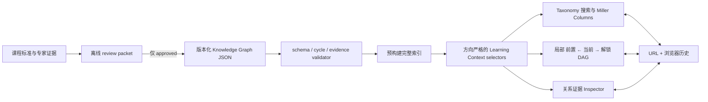

# Kebiao“学习脉络”：先修、解锁与复杂 Taxonomy 持续定位实施计划

> **For agentic workers:** REQUIRED SUB-SKILL: Use superpowers:subagent-driven-development (recommended) or superpowers:executing-plans to implement this plan task-by-task. Steps use checkbox (`- [ ]`) syntax for tracking.

**Goal:** 将现有泛化“知识图谱”收敛为一个可信的学习脉络产品：用户选中一个经审核的知识点后，能在两次交互内回答“先掌握什么、它会解锁什么”，并在复杂、多父 Taxonomy/DAG 中始终知道自己在哪里。

**Architecture:** 新增独立的 `knowledge_point + taxonomy_parent + prerequisite` 有界上下文；完整索引与当前可见投影分离。Taxonomy 用搜索、面包屑和 Miller Columns 持续定位，先修 DAG 用左到右的“前置—当前—解锁”局部视图解释关系，右侧 Inspector 展示理由与证据。现有标准正文、列表、详情页和 `progression` 学段进阶语义保持不变；旧 Sigma 全量图在迁移期作为懒加载回退，不再是默认入口。

**Tech Stack:** React 18、Vite、现有 CSS Modules 与设计令牌、`@xyflow/react + @dagrejs/dagre`（仅在 Adoption Gate 通过时启用；否则使用 CSS layered DOM）、Ajv（构建期 JSON Schema 校验）、现有 Node 校验脚本、TypeScript workspace packages、Playwright、axe、Storybook；数据采用版本化 JSON 与预构建索引。

**Scope Relationship:** 本计划只替换 `docs/KEBIAO_VISUAL_INTERACTION_GRAPH_MASTER_PLAN.md` 中的图谱产品轨道；其余已完成的视觉系统、页面信息结构与内容阅读体验继续保留。

## Global Constraints

- 不改变 kebiao 当前的信息组织方式；只替换关系探索的视觉、交互与语义层。
- 产品主入口使用“学习脉络”，辅助文案使用“先掌握什么 · 接下来解锁什么”；不再以“知识图谱”作为用户任务名称。
- 只有 `type=knowledge_point` 且 `reviewStatus=approved` 的节点可称为“知识点”。课程标准继续称“课程标准”，能力标签继续称“能力”。
- 只有经验证、带理由、证据和审核状态的 `prerequisite` 边可显示为“先修”。`unlocks` 永远由该边的反向查询派生，不单独存储。
- 现有 `progression` 只显示为“学段进阶”；不得改名为先修、前置条件或解锁关系。
- `previous_code` / `next_code` 只用于详情页相邻导航；不得进入学习 DAG。
- Taxonomy 父子关系只表示分类位置，不得推断为学习顺序。
- 机器生成候选数据只允许留在 `generated/`；生产 loader 只接受 `approved` 数据。
- 不恢复已经退役的人工审核页面。新增先修数据使用 JSON/CSV review packet、版本化决策文件和签字记录完成审核。
- 不导入 Marble 数据，不复制 Knowledge-Graph-UI 代码；遵守下文许可证边界。
- 首个试点使用现有静态 JSON/manifest 传输，不新增 API endpoint；只有公开知识点超过 500、单一 manifest 超过 5MB，或出现独立客户端需求时，才另立 API ADR。
- 初始视图最多 40 个节点，手动展开硬上限 60 个节点或 80 条边；超过后用准确计数和列表继续导航。
- Canvas 不是唯一内容源。语义化 DOM 结构必须能独立完成搜索、定位、查看前置、查看解锁与阅读证据。
- 计划不要求观察 48 小时。上线按自动化 Gate 和两个独立的 100% 发布周期晋级。
- 开始实现前必须创建独立 worktree/分支。当前主工作区存在用户修改；任何任务都只 `git add` 本任务明确列出的文件。
- 不引入新品牌字体，不恢复偏“中国风”的装饰语言，不使用全屏 3D 球、force layout、玻璃拟态堆叠或无解释性的漂浮动效。

---

## 1. 核心决策

### 1.1 产品只解决两个问题

1. **学习依赖：** 学会当前知识点之前，需要掌握什么；掌握它以后，会解锁什么。
2. **持续定位：** 在复杂、多父 Taxonomy/DAG 中，当前节点位于哪条路径、从哪个父上下文进入、还能去哪里。

以下功能不是首版主任务：全库宏观网络、任意关系开关、实体/边数量展示、无方向最短路径、能力大类散点、通用图数据库浏览、课程规划器、AI 自动生成先修边、新增 Knowledge Graph API。

### 1.2 必须先修正数据语义

截至 2026-07-12 的仓库审计：

| 项目 | 当前状态 | 产品含义 |
|---|---:|---|
| 课程标准 | 2,025 | 标准条目，不自动等于知识点 |
| 图实体 | 2,079 | subject/domain/standard/skill |
| 图关系 | 6,373 | contains/progression/skill_alignment |
| `progression` | 788 条图边；1,170 条源记录 | H4G7–9 学段进阶，不是认知先修 |
| 显式 prerequisite | 0 | 当前无法肯定回答认知先修 |
| 推断 prerequisite | 0 | 必须保持 0，禁止文本相似度推断 |
| progression groups | 390 | 可作为独立“学段进阶”视图 |
| TS1–TS7 能力连接 | 每个 243–789 | 超级 hub，是散乱的重要来源 |

因此首版必须区分三种答案：

- `reviewed + 有入边`：显示“需要先掌握”。
- `reviewed + 0 入边`：显示“这是已审核范围内的起点”。
- `not_reviewed`：显示“当前尚无经证实的先修关系”，绝不能显示“无需先修”。

出边同理区分“已审核范围内的终点”和“尚无经证实的后续解锁”。

### 1.3 首个数据试点

首个试点固定为**数学 · 图形与几何**：

- 30–60 个可教、可掌握的知识点。
- 每个知识点至少映射一条课程标准或明确声明只来自专家补充。
- 建立 `required` 与 `recommended` 两类先修边。
- 为每条公开边提供 rationale、evidence、confidence 和 review metadata。
- 准备至少 3 个 golden anchors，人工写明期望的“前置—当前—解锁”答案。
- 仓库中 `generated/h4g_skill_graph` 的 388 个候选节点只能作为词表候选；其 304 条按 label 顺序生成的边全部禁止转为 prerequisite。

试点通过后按“一个领域一个 manifest 版本”逐步扩展，不以伪造全覆盖为目标。

---

## 2. 目标架构



关键边界：

```text
完整知识索引
  ├─ taxonomy index：位置、多父上下文、祖先、子项、计数
  ├─ prerequisite index：严格方向的 incoming / outgoing / ancestors / descendants
  └─ standard alignment index：标准 ↔ 知识点
          ↓ 查询当前 focus
可见投影（最多 40，手动扩展最多 60）
          ↓
Miller Columns + DOM 学习脉络 + 可选 React Flow DAG + Evidence Inspector
```

UI 的学段、学科和领域筛选只修改“可见投影”，不能先删掉完整索引中的祖先或后继。这修复当前 `SkillsGraphWorkspace` “先过滤、后构图”导致上下文消失的问题。

---

## 3. 数据与领域契约

### 3.1 知识点节点

```json
{
  "id": "kp:math:geometry:spatial-concept",
  "type": "knowledge_point",
  "label": "空间观念",
  "aliases": ["空间概念"],
  "summary": "识别、描述并推理图形的位置、形状与空间关系。",
  "subjectSlug": "math",
  "domain": "图形与几何",
  "gradeBands": ["H2", "H3"],
  "standardCodes": ["MA-D2-GE-003"],
  "masteryEvidence": [
    {
      "statement": "能够依据图形特征描述位置与空间关系。",
      "evidenceRef": "ev:ma-d2-ge-003:content"
    }
  ],
  "dependencyCoverage": {
    "incoming": "reviewed",
    "outgoing": "reviewed"
  },
  "reviewStatus": "approved",
  "provenance": {
    "sourceType": "standard_text",
    "sourceIds": ["MA-D2-GE-003"],
    "version": "2026-07-12.math-geometry.1"
  }
}
```

### 3.2 Taxonomy 节点

Taxonomy 中的学科、领域和主题不是知识点，使用独立节点类型：

```json
{
  "id": "topic:math:geometry",
  "type": "taxonomy_node",
  "label": "图形与几何",
  "taxonomyId": "cn-curriculum-2022",
  "subjectSlug": "math",
  "order": 20,
  "reviewStatus": "approved"
}
```

`taxonomy_node` 只参与位置导航，不能成为 prerequisite 的端点，也不能在界面中称为知识点。

### 3.3 先修边

方向固定为：

```text
A --prerequisite--> B
A 是先掌握项；B 是被解锁项
```

```json
{
  "id": "pre:kp-math-geometry-figure-properties:kp-math-geometry-spatial-concept",
  "source": "kp:math:geometry:figure-properties",
  "target": "kp:math:geometry:spatial-concept",
  "type": "prerequisite",
  "directed": true,
  "necessity": "required",
  "rationale": "理解图形特征是判断位置、形状与空间关系的直接基础。",
  "evidenceRefs": ["ev:math-geometry:figure-to-space"],
  "confidence": "high",
  "reviewStatus": "approved",
  "reviewedByRole": "curriculum_domain_expert",
  "reviewedAt": "2026-07-12",
  "version": "2026-07-12.math-geometry.1"
}
```

字段语义：

- `necessity`: `required | recommended`，表示教学必要程度。
- `confidence`: `high | medium | low`，表示证据确定程度；不得与必要程度混用。
- `reviewStatus`: `candidate | approved | disputed | retired`；公开 loader 只读取 `approved`。
- `unlocks`: 不落库，查询 `source=current` 的 prerequisite 出边得到。

### 3.4 Taxonomy 边

```json
{
  "id": "tax:topic-math-geometry:kp-math-geometry-spatial-concept",
  "source": "topic:math:geometry",
  "target": "kp:math:geometry:spatial-concept",
  "type": "taxonomy_parent",
  "taxonomyId": "cn-curriculum-2022",
  "directed": true,
  "order": 30,
  "reviewStatus": "approved"
}
```

同一知识点允许出现在多个 taxonomy 或多个合法父上下文中。不得选择“JSON 中遇到的第一个父节点”作为主路径；当前 `contextPath` 必须由用户路径或稳定默认规则决定。

### 3.5 证据与覆盖

```json
{
  "id": "ev:math-geometry:figure-to-space",
  "sourceType": "expert_review",
  "sourceId": "review:math-geometry:2026-07-12",
  "locator": "edge-review-row-12",
  "statement": "该关系由课程标准内容与领域专家判断共同支持。",
  "license": "internal-derived-metadata"
}
```

数据文件：

```text
public/data/knowledge_graph/
  manifest.json
  schemas/
    knowledge-point.schema.json
    taxonomy-node.schema.json
    prerequisite-edge.schema.json
    taxonomy-edge.schema.json
    evidence.schema.json
  nodes_by_subject/
    math.json
  taxonomy_nodes.json
  prerequisite_edges.json
  taxonomy_edges.json
  evidence.json
  indexes/
    by_node.json
    by_standard.json
    taxonomy_paths.json
    search_terms.json
```

离线候选与审核文件：

```text
generated/knowledge_graph_candidates/
  math_geometry_nodes.json
  math_geometry_edges.json
  math_geometry_review_packet.csv

docs/data/reviews/knowledge_graph/
  math_geometry_review_decisions.template.json
  math_geometry_review_decisions.json
  math_geometry_signoff.md
```

生产构建必须证明：

- 0 自环、0 重复边、0 dangling endpoint。
- prerequisite DAG 0 环；taxonomy 每个 taxonomy 内 0 环。
- prerequisite 的两个端点都必须是 `knowledge_point`；`taxonomy_node` 只允许出现在 taxonomy 边中。
- 100% 公开 prerequisite 有 rationale、evidence、necessity、confidence、review metadata。
- 100% 公开知识点至少有一条可恢复的 taxonomy path，或明确 `orphanReason`。
- candidate/disputed/retired 记录不会进入公开索引。
- manifest 包含 schemaVersion、dataVersion、hash、节点数、边数和构建来源。

---

## 4. 查询与状态契约

### 4.1 核心 selector

```js
createKnowledgeGraphIndex(dataset)

getLearningContext(index, pointId, {
  prerequisiteDepth: 1,
  unlockDepth: 1,
  contextPath: [],
  necessity: ['required', 'recommended'],
  maxVisibleNodes: 40
}) => ({
  focus,
  prerequisites: {
    required: [],
    recommended: [],
    total: 0,
    hidden: 0
  },
  unlocks: {
    required: [],
    recommended: [],
    total: 0,
    hidden: 0
  },
  taxonomy: {
    activePath: [],
    alternativePaths: [],
    siblings: [],
    children: []
  },
  coverage: {
    incoming: 'reviewed' | 'not_reviewed',
    outgoing: 'reviewed' | 'not_reviewed'
  },
  warnings: []
})

getPrerequisiteAncestors(index, pointId, depth)
getUnlockedDescendants(index, pointId, depth)
getTaxonomyParents(index, pointId, taxonomyId)
getTaxonomyChildren(index, pointId, taxonomyId)
resolveTaxonomyPath(index, pointId, preferredPath)
buildTopologicalLayers(index, pointId, options)
```

所有 prerequisite traversal 必须尊重方向。现有无方向 BFS、`findShortestPath` 和只取第一分支的 `buildProgressionPath` 不得复用为先修算法。

稳定排序与默认路径规则：

1. `contextPath` 合法时原样恢复。
2. 从标准详情进入时，优先选择与该标准 subject/domain 对齐的 path。
3. 仍有多个 path 时，选择 root 距离最短者。
4. 再以 taxonomy edge `order`、节点 label、节点 ID 依次打破平局。
5. prerequisite 分支按 topological distance、`required` 优先、目标学段、label、ID 稳定排序；绝不以 JSON 遍历到的第一条边当作主分支。

### 4.2 URL 与浏览器历史

首版 URL：

```text
?view=learning-map
&selectedNode=kp:math:geometry:spatial-concept
&taxonomy=cn-curriculum-2022
&contextPath=topic:math,topic:math:geometry,kp:math:geometry:spatial-concept
&prerequisiteDepth=1
&unlockDepth=1
&necessity=required,recommended
```

规则：

- 选择节点、切换多父上下文、进入子级时 `pushState`。
- 打开/关闭 Inspector、改变纯展示密度时 `replaceState`。
- 刷新、分享、浏览器前进/后退恢复同一 focus、同一 context path、同一展开深度。
- 保留未知参数和 `utm_*`。
- 旧 `view=graph` 在迁移期保持原行为；不能映射的旧 `selectedNode` 不再静默回退到 `skill:ts1`。

### 4.3 Feature Flag

新增独立开关，不复用整个 UI V2 开关：

```text
query:        learning-map=0|1
localStorage: kebiao:learning-map:<surface>
env:          VITE_LEARNING_MAP_DEFAULT
              VITE_LEARNING_MAP_SKILLS
              VITE_LEARNING_MAP_SKILL_DETAIL
              VITE_LEARNING_MAP_SUBJECT
              VITE_LEARNING_MAP_STANDARD
```

优先级：

```text
query > localStorage > surface env > global env > production fail-closed
```

UI V2 与 Learning Map 组合：

| UI V2 | Learning Map | 结果 |
|---|---|---|
| off | off | 旧信息页 |
| off | on | 外层 UI 回滚优先，不加载 Learning Map |
| on | off | 现有关系/旧图谱 |
| on | on | 新学习脉络 |

---

## 5. 交互与视觉规格

### 5.1 桌面工作台

```text
┌──────────────────────────────────────────────────────────────────────┐
│ 搜索知识点  / 数学 / 图形与几何 / 空间观念      位置上下文 1 / 2  │
├──────────────────┬───────────────────────────────┬───────────────────┤
│ Taxonomy 定位     │ 需要先掌握 ← 当前 → 将会解锁 │ 关系依据          │
│                  │                               │                   │
│ 学科列            │ required / recommended       │ 为什么相关        │
│ 领域列            │ 分层、方向箭头、分支计数     │ 证据来源          │
│ 主题列            │ 点击任一节点重设 focus       │ 必要度/置信度      │
│ 知识点列          │ 默认 1 层，手动展开第 2 层   │ 对齐课程标准       │
└──────────────────┴───────────────────────────────┴───────────────────┘
```

主要组件：

1. **Persistent Location Bar**：始终显示 taxonomy、完整 breadcrumb、当前父上下文和替代路径数量。
2. **Search + Miller Columns**：搜索优先；当前祖先链自动展开；同级、直接子项及 descendant count 按需出现。
3. **Learning DAG**：默认只显示直接前置、当前、直接解锁；所有分支都可见或以准确的“还有 N 项”聚合，不能静默选第一支。
4. **Evidence Inspector**：点击边优先解释关系，点击节点解释知识点；关系原因、必要度、置信度、证据和对齐标准在同一处。
5. **学段进阶 Lens**：独立次级入口，继续使用现有 progression 数据和明确名称，不混入先修 DAG。

### 5.2 移动端

- 顶部 sticky location bar。
- Taxonomy 由横向多列改为逐级栈/底部抽屉；保留“返回上一级”和 context path。
- 主内容顺序固定为“当前知识点 → 需要先掌握 → 将会解锁 → 关系依据”。
- 不在 390px 视口中强行显示缩小的画布；React Flow 视图降级为同源 DOM 路径列表。
- 页面无横向溢出，触控目标至少 44px。

### 5.3 视觉语言

- 保留现有 kebiao 冷白底、深石墨文字、克制强调色和 Geist 字体。
- 用清晰的层级、细分隔线、稳定列宽和局部空间深度提升质感，不使用大面积装饰纹理。
- `required` 使用高对比实线箭头；`recommended` 使用次级色和虚线，但文字标签始终出现，不能只靠颜色。
- 当前节点具有唯一最强视觉权重；前置与解锁节点降低一级，taxonomy 控件再降低一级。
- 空状态不是大卡片，而是在对应方向的轨道中直接解释“未知”“已审核为空”或“被筛选隐藏”。

### 5.4 Motion（来自 gpt-taste 的约束性转译）

- Miller Column 前进/返回：`240ms` 横向进入/退出，帮助眼睛追踪层级变化。
- Focus 变化：当前节点一次性 `420ms` focus pulse，不循环。
- Inspector：`180ms` opacity + translate，焦点在动画完成前已正确转移。
- 禁止 ScrollTrigger、无限滚动、持续漂浮、流动虚线和无意义视差。
- `prefers-reduced-motion: reduce` 时全部改为即时状态变化。

### 5.5 文案状态

| 状态 | 固定文案 |
|---|---|
| 入边未审核 | 当前尚无经证实的先修关系。 |
| 入边已审核且为 0 | 这是当前已审核学习范围内的起点。 |
| 出边未审核 | 当前尚无经证实的后续解锁。 |
| 出边已审核且为 0 | 这是当前已审核学习范围内的终点。 |
| 只有 progression | 暂无经证实的认知先修；以下展示经核验的学段进阶。 |
| 有隐藏分支 | 还有 N 个前置项/解锁项，展开查看。 |
| 多父路径 | 此知识点还位于 N 条分类路径中。 |

---

## 6. 外部项目采用矩阵

| 项目 | 用于 kebiao 的部分 | 采用方式 | 明确禁止 | 许可证/风险 |
|---|---|---|---|---|
| [withmarbleapp/os-taxonomy](https://github.com/withmarbleapp/os-taxonomy) | 微知识点、hard/soft 先修、reason、mastery evidence、Builds on / Unlocks | 只借鉴领域模型与任务文案；kebiao 自建 schema 和数据 | 不导入其数据、文本、3D 球或把它当中国课标真相 | 数据 ODbL；自创文本 CC BY-SA；项目很新 |
| [EBISPOT/ols4](https://github.com/EBISPOT/ols4) | 搜索优先、自动恢复祖先链、lazy children、siblings/counts、超大分支分页 | 自行实现交互；不引入其后端 | 不引入 Spring/PostgreSQL/OWL 全栈，不把 taxonomy 当 prerequisite | Apache-2.0；生产成熟度最高 |
| [berangerthomas/Selma](https://github.com/berangerthomas/Selma) | Miller Columns、active path、多父 context switcher、跨视图 focus | 自行实现并持久化 `contextPath` | 不采用 arbitrary first parent，不 vendor 整个项目 | MIT；新项目，交互参考价值大于依赖价值 |
| [xyflow/xyflow](https://github.com/xyflow/xyflow) | 局部、可聚焦、键盘可达的只读 DAG | 正式 lazy dependency，通过 bundle/a11y Gate 后启用 | 不使用拖拽、连线、删除等编辑功能；不渲染全库 | MIT；成熟、活跃 |
| [dagrejs/dagre](https://github.com/dagrejs/dagre) | 首版 left-to-right layered layout | 正式 lazy dependency；固定 fixture benchmark | 不用于语义排序，只负责几何布局 | MIT；若复杂边路由不够，再单独评估 ELK |
| [MaayanLab/Knowledge-Graph-UI](https://github.com/MaayanLab/Knowledge-Graph-UI) | 单点邻域、双点路径的任务抽象 | 仅借鉴抽象 | 不复制代码、组件、样式或无方向路径算法 | CC BY-NC-SA，生产使用风险高 |
| 现有 Sigma + Graphology | 旧链接、可选全景、迁移回退 | 保留懒加载，两个稳定发布周期后再决定删除 | 不再作为默认学习脉络 renderer | 已在仓库中，避免立即破坏旧链接 |

首版不采用 ELK.js。只有 Dagre 在真实 diamond、多父、60 节点 fixture 中无法满足边路由和布局稳定性时，才开启单独 ADR 与许可证审计。

---

## 7. 分阶段完成定义

### Gate A — Data Truth

- 试点数据通过 schema、端点、重复、自环、cycle、证据和审核检查。
- 3 个 golden anchors 的前置/解锁结果与专家决策完全一致。
- 0 条 progression、previous/next、taxonomy edge 被当作 prerequisite。
- 未审核与已审核为空能被 selector 和 UI 区分。

### Gate B — Task Completion

- 从搜索或标准详情进入后，最多 2 次交互看到直接前置和直接解锁。
- 当前节点和 taxonomy path 始终可见。
- 点击前置或解锁后，方向正确、focus 和 URL 同步。
- 多父 context 切换、刷新、前进、后退均恢复同一位置。
- 默认无超过 40 节点的画布，手动展开不超过 60 节点/80 边。

### Gate C — Quality

- DOM 路径独立完成所有主任务；WebGL/SVG 失败不阻断。
- axe 0 critical/serious；VoiceOver 与 NVDA 完成人工任务验收。
- 390×844、768px、1440px 均无布局阻断；200% zoom 与 forced colors 可用。
- reduced motion、键盘列导航、焦点返回和 live announcement 完整。
- 主包不加载 React Flow/Dagre；仅在 Learning Map route 懒加载。
- 局部查询 `<100ms`；布局 fixture 达到计划内预算。

### Gate D — Release

- 独立 feature flag、旧 UI fallback 和“只 revert approved 数据提交后重新部署”的 data rollback 均通过。
- default-off → 5% → 20% → 50% → 100% cycle 1 → 100% cycle 2 全部由机器 Gate 晋级。
- 不绑定 48 小时；同一代码/数据版本完成两个独立部署周期即可进入旧图退役评估。

---

## 8. 逐任务实施计划

### Task 0: 隔离工作区并冻结基线

**Files:**

- Create: `docs/research/2026-07-12-learning-map-baseline.md`
- Reference: `docs/research/2026-07-11-graph-data-readiness-audit.md`
- Reference: `src/features/graph/SkillsGraphWorkspace.jsx`
- Reference: `src/graph/graphModel.js`

- [ ] **Step 1: 记录原工作区边界**

```bash
git status --short
```

把所有 dirty/untracked 路径写入 baseline 文档。不得执行 `git stash`、`git reset`、`git checkout --`，也不得把这些文件复制到新 worktree。执行代理始终从以下绝对路径读取本计划，即使该文件尚未进入 `HEAD`：

```text
/Users/shawn.fsc/Downloads/curriculum breakdown/curriculum-standards-breakdown/docs/superpowers/plans/2026-07-12-kebiao-learning-map.md
```

- [ ] **Step 2: 创建独立 worktree**

```bash
git worktree add ../curriculum-standards-learning-map -b feat/learning-map main
cd ../curriculum-standards-learning-map
```

Expected: 新 worktree 从已提交的 `main` 创建且干净；原工作区用户修改和未跟踪的计划文件保持原样。

- [ ] **Step 3: 安装锁定依赖**

```bash
npm ci
```

Expected: `package-lock.json` 不发生变化。

- [ ] **Step 4: 记录现有图谱数据与 URL 基线**

```bash
npm run validate:graph-model
npm run audit:graph-data
npm run validate:graph-interaction
```

Expected: 三条命令退出码均为 0；baseline 文档记录实体、关系、progression、prerequisite 数量和旧 query 参数。

- [ ] **Step 5: 跑现有交互基线**

```bash
npm run test:e2e
npm run test:a11y
npm run test:visual
npm run check:bundle
```

Expected: 全部通过；失败项先记录为 pre-existing，不在本计划中静默更新 snapshot。

- [ ] **Step 6: 提交基线文档**

```bash
git add docs/research/2026-07-12-learning-map-baseline.md
git commit -m "docs: freeze learning map baseline"
```

### Task 1: 冻结产品语义与 ADR

**Files:**

- Create: `docs/adr/ADR-0004-learning-map-domain.md`
- Create: `docs/product/LEARNING_MAP_CONTENT_CONTRACT.md`
- Create: `src/features/learning-map/learningMapCopy.js`
- Create: `scripts/validate-learning-map-copy-contract.mjs`
- Modify: `package.json`

- [ ] **Step 1: 先写会失败的文案契约检查**

```bash
mkdir -p docs/product src/features/learning-map
```

先建立唯一文案模块并校验：

- `learningMapCopy.js` 必须导出“学习脉络”和第 5.5 节全部状态文案。
- 现有 `progression` 的 relation type、标题和边标签必须保持“progression / 学段进阶”；允许在免责声明中解释“不是认知先修”。
- 现有 adapter 不得将 `standard` 或 `skill` 的 label 包装成 `knowledge_point`。

```js
assert.equal(LEARNING_MAP_COPY.title, '学习脉络')
assert.equal(LEARNING_MAP_COPY.subtitle, '先掌握什么 · 接下来解锁什么')
assert.match(progressionSource, /学段进阶/)
assert.doesNotMatch(graphModelSource, /progression[^\n]+prerequisite/)
assert.doesNotMatch(adapterSource, /type:\s*['"]knowledge_point['"]/)
```

- [ ] **Step 2: 先运行失败检查，再实现唯一文案模块**

```bash
node scripts/validate-learning-map-copy-contract.mjs
```

Expected: 首次 FAIL，提示 `learningMapCopy.js` 尚未实现；创建文案模块后再次运行并 PASS。

- [ ] **Step 3: 写 ADR**

ADR 必须冻结：

- 为什么新建 `knowledge_point` 有界上下文。
- 为什么 progression、taxonomy、standard alignment 与 prerequisite 分离。
- 为什么默认使用 Miller Columns + 局部 DAG。
- 为什么 Sigma 保留为 legacy，而 React Flow + Dagre 只懒加载局部视图。
- 为什么 `unlocks` 只能反向派生。

- [ ] **Step 4: 写固定用户文案与错误状态**

将第 5.5 节文案逐字写入 content contract；实现阶段只从该契约引用，不自行改写“未知”和“没有”的含义。

- [ ] **Step 5: 注册命令并提交**

```json
"validate:learning-map-copy": "node scripts/validate-learning-map-copy-contract.mjs"
```

```bash
git add docs/adr/ADR-0004-learning-map-domain.md docs/product/LEARNING_MAP_CONTENT_CONTRACT.md src/features/learning-map/learningMapCopy.js scripts/validate-learning-map-copy-contract.mjs package.json
git commit -m "docs: freeze learning map semantics"
```

### Task 2: 建立 schema、fixture 与数据验证器

**Files:**

- Create: `public/data/knowledge_graph/schemas/knowledge-point.schema.json`
- Create: `public/data/knowledge_graph/schemas/taxonomy-node.schema.json`
- Create: `public/data/knowledge_graph/schemas/prerequisite-edge.schema.json`
- Create: `public/data/knowledge_graph/schemas/taxonomy-edge.schema.json`
- Create: `public/data/knowledge_graph/schemas/evidence.schema.json`
- Create: `tests/fixtures/learning-map/chain.json`
- Create: `tests/fixtures/learning-map/diamond.json`
- Create: `tests/fixtures/learning-map/multi-parent.json`
- Create: `tests/fixtures/learning-map/cycle.json`
- Create: `tests/fixtures/learning-map/empty-reviewed.json`
- Create: `tests/fixtures/learning-map/empty-unreviewed.json`
- Create: `tests/fixtures/learning-map/high-degree.json`
- Create: `scripts/validate-knowledge-graph.mjs`
- Modify: `package.json`
- Modify: `package-lock.json`

- [ ] **Step 1: 安装仅构建期使用的 JSON Schema validator**

```bash
mkdir -p public/data/knowledge_graph/schemas tests/fixtures/learning-map
npm install --save-dev ajv
```

Ajv 只进入数据校验脚本，不得进入浏览器 bundle。

- [ ] **Step 2: 写最小合法 chain 与 diamond fixture**

```text
chain:   A → B → C
diamond: A → B, A → C, B → D, C → D
```

fixture 中每条边使用 `approved + rationale + evidenceRefs + reviewedAt`，节点显式声明 incoming/outgoing coverage。

- [ ] **Step 3: 写非法 cycle fixture 和失败断言**

```js
assert.throws(
  () => validateKnowledgeGraph(cycleFixture),
  /prerequisite cycle: A -> B -> C -> A/
)
```

- [ ] **Step 4: 实现结构与语义验证**

验证器必须检查：端点、唯一 ID、自环、重复边、关系白名单、方向、DAG、evidence、reviewStatus、coverage 值、多父 taxonomy 和 production filtering。

- [ ] **Step 5: 运行验证器**

```bash
node scripts/validate-knowledge-graph.mjs --fixtures
```

Expected:

```text
PASS chain
PASS diamond
PASS multi-parent
PASS empty-reviewed
PASS empty-unreviewed
PASS high-degree
PASS cycle rejected
```

- [ ] **Step 6: 注册命令并提交**

```json
"validate:knowledge-graph": "node scripts/validate-knowledge-graph.mjs"
```

```bash
git add public/data/knowledge_graph/schemas/knowledge-point.schema.json public/data/knowledge_graph/schemas/taxonomy-node.schema.json public/data/knowledge_graph/schemas/prerequisite-edge.schema.json public/data/knowledge_graph/schemas/taxonomy-edge.schema.json public/data/knowledge_graph/schemas/evidence.schema.json tests/fixtures/learning-map/chain.json tests/fixtures/learning-map/diamond.json tests/fixtures/learning-map/multi-parent.json tests/fixtures/learning-map/cycle.json tests/fixtures/learning-map/empty-reviewed.json tests/fixtures/learning-map/empty-unreviewed.json tests/fixtures/learning-map/high-degree.json scripts/validate-knowledge-graph.mjs package.json package-lock.json
git commit -m "feat: define verified knowledge graph contract"
```

### Task 3: 生成数学·图形与几何试点数据

**Files:**

- Create: `generated/knowledge_graph_candidates/math_geometry_nodes.json`
- Create: `generated/knowledge_graph_candidates/math_geometry_edges.json`
- Create: `generated/knowledge_graph_candidates/math_geometry_review_packet.csv`
- Create: `scripts/build-knowledge-graph-review-packet.mjs`
- Create: `docs/data/reviews/knowledge_graph/math_geometry_review_decisions.template.json`
- External checkpoint creates: `docs/data/reviews/knowledge_graph/math_geometry_review_decisions.json`
- External checkpoint creates: `docs/data/reviews/knowledge_graph/math_geometry_signoff.md`
- Create: `public/data/knowledge_graph/nodes_by_subject/math.json`
- Create: `public/data/knowledge_graph/taxonomy_nodes.json`
- Create: `public/data/knowledge_graph/prerequisite_edges.json`
- Create: `public/data/knowledge_graph/taxonomy_edges.json`
- Create: `public/data/knowledge_graph/evidence.json`
- Create: `public/data/knowledge_graph/manifest.json`
- Create: `public/data/knowledge_graph/indexes/by_node.json`
- Create: `public/data/knowledge_graph/indexes/by_standard.json`
- Create: `public/data/knowledge_graph/indexes/taxonomy_paths.json`
- Create: `public/data/knowledge_graph/indexes/search_terms.json`
- Create: `docs/data/KNOWLEDGE_GRAPH_REVIEW_PROTOCOL.md`
- Create: `scripts/build-knowledge-graph-indexes.mjs`
- Create: `scripts/audit-knowledge-graph-coverage.mjs`
- Create after signoff: `tests/fixtures/learning-map/golden-math-geometry.json`
- Modify: `public/data/data_version.json`
- Modify: `apps/api/test/api.test.ts`
- Modify: `package.json`

- [ ] **Step 1: 实现并运行只读 review packet 生成器**

```bash
mkdir -p generated/knowledge_graph_candidates docs/data/reviews/knowledge_graph public/data/knowledge_graph/nodes_by_subject public/data/knowledge_graph/indexes
```

输出字段固定为：candidate ID、建议名称、相关标准、来源定位、建议 taxonomy path、incoming candidate、outgoing candidate、decision、rationale、evidence、reviewer role、review date。

不得把现有 304 条 label-order candidate edge 预填为 approved。

```bash
node scripts/build-knowledge-graph-review-packet.mjs
git check-ignore generated/knowledge_graph_candidates/math_geometry_review_packet.csv
```

Expected: packet 在 `generated/` 中生成并保持 ignored；不得使用 `git add -f` 把候选数据提交进仓库。

- [ ] **Step 2: 提交生成工具、审核协议和空白决策模板**

同时实现 `build-knowledge-graph-indexes.mjs` 与 `audit-knowledge-graph-coverage.mjs`：前者在缺少有效 signoff 时必须失败，后者可对 Task 2 fixture 运行。把 API 测试中的 data version 常量改为读取 `public/data/data_version.json`。在 `package.json` 注册：

```json
"build:knowledge-graph-review-packet": "node scripts/build-knowledge-graph-review-packet.mjs",
"build:knowledge-graph": "node scripts/build-knowledge-graph-indexes.mjs",
"audit:knowledge-graph": "node scripts/audit-knowledge-graph-coverage.mjs"
```

```bash
node scripts/audit-knowledge-graph-coverage.mjs --fixtures
npm run api:test
git add scripts/build-knowledge-graph-review-packet.mjs scripts/build-knowledge-graph-indexes.mjs scripts/audit-knowledge-graph-coverage.mjs docs/data/KNOWLEDGE_GRAPH_REVIEW_PROTOCOL.md docs/data/reviews/knowledge_graph/math_geometry_review_decisions.template.json apps/api/test/api.test.ts package.json
git commit -m "data: prepare math geometry review packet"
```

- [ ] **Step 3: 真实领域专家审核 checkpoint**

审核结果只允许：`approve_node`、`merge_node`、`rename_node`、`reject_node`；边只允许 `approve_required`、`approve_recommended`、`reject`、`dispute`。

真实课程领域专家必须完成 `math_geometry_review_decisions.json` 和 `math_geometry_signoff.md`，签字文件至少记录 reviewer role、审核范围、decision file hash、日期和三个 golden anchors。实施 agent 不得填写 `reviewedByRole=curriculum_domain_expert`，不得代替专家批准。

如果没有取得真实签字：

- Gate A 保持失败，生产 Learning Map flag 保持 off。
- Task 4–14 可继续使用 Task 2 的 fixture 完成工程实现。
- Task 15 不得进入 5% rollout；可交付物停在“审核包 + 内部 fixture preview”。

- [ ] **Step 4: 只从已签字 decisions 构建公开数据与索引**

```bash
node scripts/build-knowledge-graph-indexes.mjs
node scripts/validate-knowledge-graph.mjs
node scripts/audit-knowledge-graph-coverage.mjs
```

Expected: 构建脚本先验证 decision hash 与 signoff；只有 approved 记录进入 `public/data/knowledge_graph`；manifest hash 与计数一致；cycle count 为 0。缺少或不匹配的 signoff 必须使构建失败。

- [ ] **Step 5: 固化专家签字的 3 个 golden anchors**

在 `tests/fixtures/learning-map/golden-math-geometry.json` 中记录每个 anchor 的 focus、expected prerequisites、expected unlocks、expected taxonomy path 和 expected evidence IDs。

- [ ] **Step 6: 更新 data version**

更新 `public/data/data_version.json` 的 data version、knowledge graph schema/hash/source-of-truth；API 测试已在 Step 2 改为动态读取该文件。

- [ ] **Step 7: 注册命令、运行回归并提交 approved 产物**

```bash
node scripts/validate-knowledge-graph.mjs
node scripts/audit-knowledge-graph-coverage.mjs
npm run api:test
git add docs/data/reviews/knowledge_graph/math_geometry_review_decisions.json docs/data/reviews/knowledge_graph/math_geometry_signoff.md public/data/knowledge_graph/nodes_by_subject/math.json public/data/knowledge_graph/taxonomy_nodes.json public/data/knowledge_graph/prerequisite_edges.json public/data/knowledge_graph/taxonomy_edges.json public/data/knowledge_graph/evidence.json public/data/knowledge_graph/manifest.json public/data/knowledge_graph/indexes/by_node.json public/data/knowledge_graph/indexes/by_standard.json public/data/knowledge_graph/indexes/taxonomy_paths.json public/data/knowledge_graph/indexes/search_terms.json public/data/data_version.json tests/fixtures/learning-map/golden-math-geometry.json
git commit -m "data: add reviewed math geometry learning map pilot"
```

### Task 4: 实现共享领域模型与方向严格的查询

**Files:**

- Modify: `packages/curriculum-core/src/types.ts`
- Create: `packages/curriculum-core/src/knowledge-graph.ts`
- Modify: `packages/curriculum-core/src/repository.ts`
- Modify: `packages/curriculum-core/src/index.ts`
- Modify: `packages/curriculum-core/test/core.test.ts`

- [ ] **Step 1: 先写方向与分支测试**

```ts
const index = createKnowledgeGraphIndex(diamond)
assert.deepEqual(getPrerequisites(index, 'D').map(x => x.id).sort(), ['B', 'C'])
assert.deepEqual(getUnlocks(index, 'A').map(x => x.id).sort(), ['B', 'C'])
assert.deepEqual(getPrerequisites(index, 'A'), [])
```

沿用该文件现有的 `node:test` 与 `node:assert/strict`；不得引入 Jest/Vitest 全局。

再写 multi-parent、reviewed empty、unreviewed empty、max-visible、稳定排序和 cycle rejection 测试。

- [ ] **Step 2: 运行失败测试**

```bash
npm run core:test
```

Expected: FAIL，缺少 knowledge graph exports。

- [ ] **Step 3: 实现类型与索引**

至少导出：

```ts
export type KnowledgePoint
export type TaxonomyNode
export type PrerequisiteEdge
export type TaxonomyEdge
export type LearningContext
export function createKnowledgeGraphIndex(dataset: KnowledgeGraphDataset): KnowledgeGraphIndex
export function getLearningContext(index: KnowledgeGraphIndex, pointId: string, options: LearningContextOptions): LearningContext
export function resolveTaxonomyPath(index: KnowledgeGraphIndex, pointId: string, preferredPath: string[]): TaxonomyPathResolution
export function buildTopologicalLayers(index: KnowledgeGraphIndex, pointId: string, options: LearningContextOptions): TopologicalLayer[]
```

- [ ] **Step 4: 确保完整索引与投影分离**

`createKnowledgeGraphIndex` 接收完整批准数据；`getLearningContext` 才应用学科/学段可见性和节点上限。测试必须证明单学段筛选不会删除 focus 的合法先修或解锁上下文。

`FileCurriculumRepository` 在试点 manifest 尚未通过专家 checkpoint 时必须返回显式 unavailable capability，而不是让现有标准 API 启动失败。

- [ ] **Step 5: 运行测试并提交**

```bash
npm run core:test
npm run typecheck
git add packages/curriculum-core/src/types.ts packages/curriculum-core/src/knowledge-graph.ts packages/curriculum-core/src/repository.ts packages/curriculum-core/src/index.ts packages/curriculum-core/test/core.test.ts
git commit -m "feat: add directional learning context model"
```

### Task 5: 建立前端 loader、selectors 与 controller

**Files:**

- Create: `src/data/knowledgeGraphLoader.js`
- Create: `src/graph/knowledge/knowledgeGraphBridge.js`
- Create: `src/features/learning-map/LearningMapController.js`
- Create: `scripts/validate-learning-map-interaction-contract.mjs`
- Modify: `package.json`

- [ ] **Step 1: 写 renderer-neutral contract 测试**

```bash
mkdir -p src/graph/knowledge
```

必须覆盖 chain、diamond、多父、high-degree、空状态、稳定顺序和严格方向：

```js
assert.deepEqual(snapshot.prerequisites.map(item => item.id), ['B', 'C'])
assert.equal(snapshot.taxonomy.activePath.at(-1).id, snapshot.focus.id)
assert.equal(snapshot.visibleNodeIds.length <= 40, true)
```

- [ ] **Step 2: 运行失败测试**

```bash
node scripts/validate-learning-map-interaction-contract.mjs
```

Expected: FAIL，controller 尚未实现。

- [ ] **Step 3: 实现 loader、共享领域 bridge 与 controller**

`knowledgeGraphBridge.js` 只从浏览器安全的纯模块直接重导出，不经过可能包含 Node repository export 的总入口：

```js
export {
  createKnowledgeGraphIndex,
  getLearningContext,
  resolveTaxonomyPath,
  buildTopologicalLayers
} from '../../../packages/curriculum-core/src/knowledge-graph.js'
```

不得在前端复制索引、方向遍历或 taxonomy path 算法。

loader 接受可注入的 manifest URL/dataset：测试和 Storybook 使用 Task 2 fixture；生产只读取 `public/data/knowledge_graph/manifest.json`。若真实专家 signoff 尚未完成且 manifest 不存在，返回 `coverage=unavailable` 并保持 feature flag off，不生成临时先修关系。

controller 命令固定为：

```js
selectNode(id, { contextPath })
moveTaxonomy('parent' | 'previousSibling' | 'nextSibling' | 'firstChild')
expandPrerequisites(depth)
expandUnlocks(depth)
selectRelationship(edgeId)
switchContextPath(pathId)
getSnapshot()
subscribe(listener)
```

- [ ] **Step 4: 添加失败回退**

manifest/hash/loader 失败时返回可诊断错误，不把 contains、skill_alignment 或 progression 填充成先修内容。

- [ ] **Step 5: 通过测试并提交**

```bash
node scripts/validate-learning-map-interaction-contract.mjs
git add src/data/knowledgeGraphLoader.js src/graph/knowledge/knowledgeGraphBridge.js src/features/learning-map/LearningMapController.js scripts/validate-learning-map-interaction-contract.mjs package.json
git commit -m "feat: add renderer neutral learning map controller"
```

### Task 6: URL 状态与独立 rollout flag

**Files:**

- Modify: `src/data/query.js`
- Create: `src/config/learningMapFlags.js`
- Create: `scripts/validate-learning-map-rollout-contract.mjs`
- Modify: `package.json`

- [ ] **Step 1: 写 URL round-trip 失败测试**

验证 `selectedNode/taxonomy/contextPath/prerequisiteDepth/unlockDepth/necessity`，并证明未知参数与 `utm_source` 保留。

- [ ] **Step 2: 实现 query parser/merger**

限制：depth 只能为 1 或 2；contextPath 中的节点必须由 selector 二次验证；非法值回退到安全默认值，不静默选择 TS1。

- [ ] **Step 3: 实现独立 flag 优先级和可测试 metadata**

resolver 返回以下 metadata，页面接入后的 Task 12 再把它们输出到根节点：

```text
data-learning-map-version="legacy|learning-map"
data-learning-map-flag-source
data-learning-map-rollout-percentage
data-learning-map-rollout-bucket
```

- [ ] **Step 4: 运行契约测试**

```bash
node scripts/validate-learning-map-rollout-contract.mjs
```

Expected: query > localStorage > surface env > global env > production fail-closed 的纯逻辑矩阵全部通过；本任务不运行尚未接入页面的浏览器测试。

- [ ] **Step 5: 提交**

```bash
git add src/data/query.js src/config/learningMapFlags.js scripts/validate-learning-map-rollout-contract.mjs package.json
git commit -m "feat: add shareable learning map state and rollout flag"
```

### Task 7: 对 React Flow + Dagre 做正式采用 Spike

**Files:**

- Modify: `package.json`
- Modify: `package-lock.json`
- Create: `src/features/learning-map/layoutLearningDag.js`
- Create: `src/features/learning-map/learningDagRendererDecision.js`
- Create only on fallback path: `src/features/learning-map/layoutLearningDagColumns.js`
- Create: `scripts/benchmark-learning-map.mjs`
- Create only on React Flow path: `docs/legal/THIRD_PARTY_NOTICES.md`
- Modify: `docs/adr/ADR-0004-learning-map-domain.md`

- [ ] **Step 1: 安装正式候选依赖**

```bash
npm install @xyflow/react @dagrejs/dagre
```

- [ ] **Step 2: 为 chain、diamond、多父和 60 节点 fixture 写布局测试**

布局要求：从左到右层级稳定；focus 固定在中心层；同输入重复运行坐标一致；所有 prerequisite 边方向正确。

- [ ] **Step 3: 实现纯布局 adapter**

```js
layoutLearningDag(context, {
  direction: 'LR',
  nodeWidth: 220,
  nodeHeight: 88,
  rankSep: 96,
  nodeSep: 28
}) => ({ nodes, edges })
```

- [ ] **Step 4: 跑独立布局性能 Gate**

```bash
node scripts/benchmark-learning-map.mjs
```

Adoption Gate：

- 60 节点布局 p95 `<50ms`。
- 坐标稳定、无 NaN、无方向反转。
- `THIRD_PARTY_NOTICES.md` 记录 React Flow、Dagre 的 MIT 许可证与上游链接。

真实 lazy chunk 此时尚未接入 production route，不能在本任务声称已测 bundle。

- [ ] **Step 5A: Gate 通过时冻结 React Flow 路径**

`learningDagRendererDecision.js` 此时只导出 `LEARNING_DAG_RENDERER = 'react-flow'`；ADR 记录 benchmark 结果。实际组件尚未创建，本任务不得重导出不存在的模块。

```bash
mkdir -p docs/legal
```

```bash
git add package.json package-lock.json src/features/learning-map/layoutLearningDag.js src/features/learning-map/learningDagRendererDecision.js scripts/benchmark-learning-map.mjs docs/legal/THIRD_PARTY_NOTICES.md docs/adr/ADR-0004-learning-map-domain.md
git commit -m "feat: adopt focused dag renderer for learning map"
```

- [ ] **Step 5B: Gate 未通过时执行完整 CSS fallback**

不得保留未采用的运行时依赖：

```bash
npm uninstall @xyflow/react @dagrejs/dagre
```

然后：

- 使用 `apply_patch` 删除未采用且未提交的 `src/features/learning-map/layoutLearningDag.js`。
- `learningDagRendererDecision.js` 此时只导出 `LEARNING_DAG_RENDERER = 'dom'`。实际组件尚未创建，本任务不得重导出不存在的模块。
- `layoutLearningDagColumns.js` 将 selector 的结果稳定分成 prerequisites/current/unlocks 三列，只计算顺序与 hidden counts，不计算自由坐标。
- `benchmark-learning-map.mjs` 改测 60 节点列投影，p95 仍要求 `<50ms`。
- ADR 记录失败指标、卸载结果和选择 DOM renderer 的原因。
- `THIRD_PARTY_NOTICES.md` 不登记已卸载依赖。

```bash
node scripts/benchmark-learning-map.mjs
git add package.json package-lock.json src/features/learning-map/learningDagRendererDecision.js src/features/learning-map/layoutLearningDagColumns.js scripts/benchmark-learning-map.mjs docs/adr/ADR-0004-learning-map-domain.md
git commit -m "feat: adopt layered dom renderer for learning map"
```

两条路径二选一；不得同时提交两个 renderer decision，也不得继续执行未通过的 React Flow 路径。

### Task 8: 构建 Learning Map 壳与 Persistent Location Bar

**Files:**

- Create: `src/features/learning-map/LearningMapWorkspace.jsx`
- Create: `src/features/learning-map/LearningMapWorkspace.module.css`
- Create: `src/features/learning-map/PersistentLocationBar.jsx`
- Create: `src/features/learning-map/LearningMapFallbackList.jsx`
- Modify: `src/stories/FoundationStates.stories.jsx`

- [ ] **Step 1: 先写 Storybook states**

固定展示：loading、data error、unreviewed、reviewed-empty、chain、diamond、multi-parent。

- [ ] **Step 2: 构建三栏壳**

桌面比例以内容为准，建议起点 `minmax(260px, 0.8fr) / minmax(520px, 1.8fr) / minmax(280px, 0.9fr)`；不把每个区域包成悬浮卡片。

- [ ] **Step 3: 实现位置栏**

包含 taxonomy 名称、breadcrumb、`aria-current` 当前节点、替代上下文数量和显式“切换位置”。位置栏不得随画布平移消失。

- [ ] **Step 4: 实现同源 DOM fallback**

语义化 DOM 顺序在桌面、移动端和读屏中统一为“当前知识点 → 需要先掌握 → 将会解锁”，数据直接来自 controller snapshot，不再单独组装一套关系。视觉 DAG 仍以左到右箭头表达“前置 → 当前 → 解锁”。

- [ ] **Step 5: 构建 Storybook 并提交**

```bash
npm run build-storybook
git add src/features/learning-map/LearningMapWorkspace.jsx src/features/learning-map/LearningMapWorkspace.module.css src/features/learning-map/PersistentLocationBar.jsx src/features/learning-map/LearningMapFallbackList.jsx src/stories/FoundationStates.stories.jsx
git commit -m "feat: build learning map workspace shell"
```

### Task 9: 实现搜索与 Miller Columns Taxonomy Navigator

**Files:**

- Create: `src/features/learning-map/KnowledgePointSearch.jsx`
- Create: `src/features/learning-map/TaxonomyColumnNavigator.jsx`
- Create: `src/features/learning-map/TaxonomyColumnNavigator.module.css`
- Create: `src/features/learning-map/TaxonomyContextSwitcher.jsx`
- Modify: `scripts/validate-learning-map-interaction-contract.mjs`
- Modify: `src/stories/FoundationStates.stories.jsx`
- Reference only: `src/features/graph/VirtualizedRelationTree.jsx`

- [ ] **Step 1: 扩展 controller 键盘命令与多父契约测试**

用纯 controller contract 覆盖同级、父级、子级和 context switch 后的 active path；实际 ArrowUp/Down/Left/Right、Enter、Escape 浏览器行为在 Task 12 接入后测试。

- [ ] **Step 2: 实现搜索优先入口**

搜索结果显示 label、学科/领域、学段、已验证关系数量；选择结果后自动恢复完整祖先链。

- [ ] **Step 3: 实现按需列导航**

- 每列只显示当前 path、同级和直接子项。
- 展示 descendant count。
- 子项超过 1,000 时切换为分页/搜索结果，不创建巨大 DOM。
- 异步请求可取消；离开列时 abort pending request。

- [ ] **Step 4: 实现多父上下文**

显示所有合法 path；切换 path 只改变位置解释，不改变 prerequisite 语义；`contextPath` 写入历史。

- [ ] **Step 5: 加入 240ms 列动效与 reduced-motion**

只使用 transform/opacity；返回时保留一帧 trailing column 帮助视觉追踪，随后移除。

- [ ] **Step 6: 运行契约与 Storybook 构建并提交**

```bash
node scripts/validate-learning-map-interaction-contract.mjs
npm run build-storybook
git add src/features/learning-map/KnowledgePointSearch.jsx src/features/learning-map/TaxonomyColumnNavigator.jsx src/features/learning-map/TaxonomyColumnNavigator.module.css src/features/learning-map/TaxonomyContextSwitcher.jsx scripts/validate-learning-map-interaction-contract.mjs src/stories/FoundationStates.stories.jsx
git commit -m "feat: add persistent taxonomy column navigation"
```

### Task 10: 实现“前置—当前—解锁”局部 DAG

**Files:**

- Create: `src/features/learning-map/LearningDagPanel.jsx`
- Create: `src/features/learning-map/LearningDagPanel.module.css`
- Create: `src/features/learning-map/LearningNode.jsx`
- Create: `src/features/learning-map/LearningDirectionSummary.jsx`
- Create on React Flow path: `src/features/learning-map/ReactFlowLearningDag.jsx`
- Create on React Flow path: `src/features/learning-map/LearningEdge.jsx`
- Create on CSS fallback path: `src/features/learning-map/DomLayeredLearningDag.jsx`
- Modify: `src/features/learning-map/LearningMapWorkspace.jsx`
- Modify: `src/features/learning-map/learningDagRendererDecision.js`
- Modify: `scripts/validate-learning-map-interaction-contract.mjs`
- Modify: `src/stories/FoundationStates.stories.jsx`

- [ ] **Step 1: 写 diamond 和方向 contract**

断言 D 同时显示 B、C 两个直接前置；A 同时解锁 B、C；点击 B 后关系翻转正确，不能只保留第一支。

- [ ] **Step 2: 根据冻结的 renderer decision 实现唯一视觉层**

在选中实现文件已经创建后，本任务再修改 `learningDagRendererDecision.js`：静态重导出所选组件为 `SelectedLearningDag`。`LearningDagPanel.jsx` 只从该 decision 文件导入 `SelectedLearningDag`，确保 production build 不会把未采用的 renderer 打包。

React Flow 路径：

```jsx
<ReactFlow
  nodesDraggable={false}
  nodesConnectable={false}
  elementsSelectable
  nodesFocusable
  edgesFocusable
  panOnScroll={false}
  zoomOnDoubleClick={false}
/>
```

节点和边只消费 `getLearningContext` 输出；renderer 不查询原始数据。

在 `ReactFlowLearningDag.jsx` 中只导入一次 `@xyflow/react/dist/style.css`，所有品牌覆盖限制在 `LearningDagPanel.module.css`。

CSS fallback 路径：

```jsx
<section className={styles.domDag} aria-label="学习脉络">
  <RelationColumn kind="prerequisites" items={context.prerequisites} />
  <CurrentKnowledgePoint point={context.focus} />
  <RelationColumn kind="unlocks" items={context.unlocks} />
</section>
```

使用 CSS Grid 固定三列、细线/箭头伪元素连接，节点不拖拽、不缩放；移动端直接变成单列。数据、文案、hidden counts、点击行为和 React Flow 路径完全相同。

- [ ] **Step 3: 表达方向和必要度**

- 统一 left-to-right。
- 箭头指向被解锁节点。
- required 实线，recommended 虚线并带文字。
- focus 节点视觉权重最高且使用 `aria-current`。
- 边 accessible name 包含“前置/解锁、必要度、两端节点、证据状态”。

- [ ] **Step 4: 实现展开与硬上限**

默认 depth=1；用户可分别展开前置或解锁到 depth=2。达到 40 项时显示准确隐藏数量，达到 60 节点或 80 边时禁止继续画布展开并切到列表。

- [ ] **Step 5: 实现 focus pulse 和稳定 viewport**

切换相邻节点时保持同一 layer 的位置稳定；只对新 focus 执行一次 420ms pulse；reduced motion 下直接定位。

- [ ] **Step 6: 运行 fixture 验证并提交**

```bash
node scripts/validate-learning-map-interaction-contract.mjs
node scripts/benchmark-learning-map.mjs
npm run build-storybook
```

React Flow 路径提交：

```bash
git add src/features/learning-map/LearningDagPanel.jsx src/features/learning-map/LearningDagPanel.module.css src/features/learning-map/LearningNode.jsx src/features/learning-map/LearningEdge.jsx src/features/learning-map/LearningDirectionSummary.jsx src/features/learning-map/ReactFlowLearningDag.jsx src/features/learning-map/LearningMapWorkspace.jsx src/features/learning-map/learningDagRendererDecision.js scripts/validate-learning-map-interaction-contract.mjs src/stories/FoundationStates.stories.jsx
git commit -m "feat: render focused prerequisite and unlock dag"
```

CSS fallback 路径提交：

```bash
git add src/features/learning-map/LearningDagPanel.jsx src/features/learning-map/LearningDagPanel.module.css src/features/learning-map/LearningNode.jsx src/features/learning-map/LearningDirectionSummary.jsx src/features/learning-map/DomLayeredLearningDag.jsx src/features/learning-map/LearningMapWorkspace.jsx src/features/learning-map/learningDagRendererDecision.js scripts/validate-learning-map-interaction-contract.mjs src/stories/FoundationStates.stories.jsx
git commit -m "feat: render layered prerequisite and unlock map"
```

### Task 11: 实现关系证据 Inspector 与学段进阶 Lens

**Files:**

- Create: `src/features/learning-map/RelationshipEvidenceInspector.jsx`
- Create: `src/features/learning-map/RelationshipEvidenceInspector.module.css`
- Create: `src/features/learning-map/ProgressionLens.jsx`
- Reuse: `src/features/graph/GraphProgressionPanel.jsx`
- Modify: `src/features/learning-map/LearningMapWorkspace.jsx`
- Modify: `src/stories/FoundationStates.stories.jsx`

- [ ] **Step 1: 写证据呈现测试**

选择边后必须显示 source → target、rationale、necessity、confidence、evidence locator、review date 和关联标准；缺一项的数据在 Task 2 已被 validator 拒绝。

- [ ] **Step 2: 实现关系优先 Inspector**

默认解释当前 focus；点击边后解释“为什么 A 是 B 的前置”。Inspector 关闭后焦点返回触发它的节点或边。

- [ ] **Step 3: 复用 progression 选择器但重做壳层文案**

Lens 标题固定为“学段进阶”，空状态固定为“暂无经证实的认知先修；以下展示经核验的学段进阶。”不得把 progression 合并进 prerequisite topological layers。

- [ ] **Step 4: 确认不恢复审核页面**

Inspector 只读。不得添加 approve/reject/edit 按钮；审核属于离线数据流程。

- [ ] **Step 5: 提交**

```bash
npm run build-storybook
git add src/features/learning-map/RelationshipEvidenceInspector.jsx src/features/learning-map/RelationshipEvidenceInspector.module.css src/features/learning-map/ProgressionLens.jsx src/features/learning-map/LearningMapWorkspace.jsx src/stories/FoundationStates.stories.jsx
git commit -m "feat: explain learning relationships with evidence"
```

### Task 12: 接入现有页面而不改变信息架构

**Files:**

- Modify: `src/pages/SkillsOverviewPage.jsx`
- Modify: `src/pages/SubjectPage.jsx`
- Modify: `src/pages/SkillDetailPage.jsx`
- Modify: `src/pages/StandardDetailPage.jsx`
- Modify: `src/components/StandardRelationPanel.jsx`
- Modify: `src/pages/SkillsOverviewPage.module.css`
- Modify: `src/pages/SubjectPage.module.css`
- Modify: `src/pages/SkillDetailPage.module.css`
- Modify: `src/pages/StandardDetailPage.module.css`
- Modify: `src/components/StandardRelationPanel.module.css`
- Create: `tests/e2e/learning-map.spec.js`
- Create: `tests/e2e/helpers/learningMapFixtureRoute.js`
- Modify: `tests/e2e/feature-flags.spec.js`
- Create: `scripts/validate-learning-map-rollout-matrix.mjs`
- Modify: `scripts/check-bundle-budget.mjs`
- Modify: `package.json`

- [ ] **Step 1: 标准详情先写入口 E2E**

场景：打开 `MA-D2-GE-003`；若映射到知识点，显示“查看学习脉络”；有多个映射时先选择知识点；无映射时只显示诚实 coverage 和学段进阶。

在真实专家 signoff 尚未完成时，Playwright 先用 `?learning-map=1` 打开仅测试会话，再调用：

```js
await installLearningMapFixtureRoutes(page, { fixture: 'diamond' })
```

`tests/e2e/helpers/learningMapFixtureRoute.js` 负责拦截 `**/data/knowledge_graph/**`，把 Task 2 fixture 拆成与生产 manifest、node、edge、evidence 请求相同的 JSON 响应，并对未知文件名返回 404。不得把 fixture 写进生产 `public/data/knowledge_graph`。signoff 完成后再增加一组读取真实 golden anchors 的 production-data 测试。该注入只存在于 E2E helper，生产 loader 不接受任意外部 manifest URL。

- [ ] **Step 2: 替换入口文案和 lazy boundary**

- “知识图谱”主入口改为“学习脉络”。
- 副标题为“先掌握什么 · 接下来解锁什么”。
- 保留现有列表、筛选、标准正文和详情 section 顺序。
- 新 chunk 仅在 flag on 且用户进入关系探索时加载。
- 页面根节点输出 Task 6 定义的 `data-learning-map-*` metadata。

- [ ] **Step 3: 修复学段过滤破坏上下文**

页面筛选只传给 visible projection；底层 knowledge index 始终完整。测试选择一个学段后，focus 的跨学段 approved prerequisite/unlock 仍可出现并带学段标记。

- [ ] **Step 4: 处理旧链接**

旧 `view=graph` 保持 legacy；可映射的 standard/skill 展示“在学习脉络中定位”，不可映射时显示明确说明，不默认跳到 TS1。

- [ ] **Step 5: 运行页面、rollout 与真实 lazy chunk Gate**

```bash
npx playwright test tests/e2e/content-parity.spec.js tests/e2e/core-flows.spec.js
npx playwright test tests/e2e/learning-map.spec.js tests/e2e/feature-flags.spec.js
node scripts/validate-learning-map-rollout-matrix.mjs
npm run validate:learning-map-copy
npm run check:bundle
```

Expected: flag off 不请求 Learning Map chunk/data；UI V2 × Learning Map 四种组合通过；实际 Learning Map lazy chunk gzip `<90KB`，主包增长 `<5KB`。

- [ ] **Step 6: 精确暂存并提交**

```bash
git add src/pages/SkillsOverviewPage.jsx src/pages/SkillsOverviewPage.module.css src/pages/SubjectPage.jsx src/pages/SubjectPage.module.css src/pages/SkillDetailPage.jsx src/pages/SkillDetailPage.module.css src/pages/StandardDetailPage.jsx src/pages/StandardDetailPage.module.css src/components/StandardRelationPanel.jsx src/components/StandardRelationPanel.module.css tests/e2e/learning-map.spec.js tests/e2e/helpers/learningMapFixtureRoute.js tests/e2e/feature-flags.spec.js scripts/validate-learning-map-rollout-matrix.mjs scripts/check-bundle-budget.mjs package.json
git commit -m "feat: integrate learning map without changing content structure"
```

实施时必须显式挑选 CSS 文件加入暂存，避免带入当前工作区无关改动。

### Task 13: 完成响应式、无障碍与视觉状态

**Files:**

- Modify: `src/features/learning-map/LearningMapWorkspace.module.css`
- Modify: `src/features/learning-map/TaxonomyColumnNavigator.module.css`
- Modify: `src/features/learning-map/LearningDagPanel.module.css`
- Modify: `src/features/learning-map/RelationshipEvidenceInspector.module.css`
- Modify: `tests/e2e/a11y.spec.js`
- Modify: `tests/e2e/responsive.spec.js`
- Modify: `tests/e2e/visual.spec.js`
- Modify: `src/stories/FoundationStates.stories.jsx`
- Create: `docs/quality/LEARNING_MAP_A11Y_ACCEPTANCE.md`
- Create: `tests/e2e/visual.spec.js-snapshots/learning-map-chain-desktop-chromium-desktop-darwin.png`
- Create: `tests/e2e/visual.spec.js-snapshots/learning-map-diamond-desktop-chromium-desktop-darwin.png`
- Create: `tests/e2e/visual.spec.js-snapshots/learning-map-multi-parent-desktop-chromium-desktop-darwin.png`
- Create: `tests/e2e/visual.spec.js-snapshots/learning-map-empty-reviewed-desktop-chromium-desktop-darwin.png`
- Create: `tests/e2e/visual.spec.js-snapshots/learning-map-empty-unreviewed-desktop-chromium-desktop-darwin.png`
- Create: `tests/e2e/visual.spec.js-snapshots/learning-map-mobile-stack-chromium-desktop-darwin.png`
- Create: `tests/e2e/visual.spec.js-snapshots/learning-map-inspector-open-desktop-chromium-desktop-darwin.png`

- [ ] **Step 1: 先写桌面与移动断言**

```bash
mkdir -p docs/quality
```

390×844：无页面横向溢出，DOM 顺序为 current → prerequisites → unlocks → evidence；1440px：位置栏、Columns、DAG、Inspector 同时可用。

- [ ] **Step 2: 写 axe 与键盘任务**

- 搜索知识点。
- 进入/退出 taxonomy 层级。
- 切换多父 context。
- 选择前置、解锁和关系证据。
- focus 更新时 live region 宣布“当前位置、前置数、解锁数”。

- [ ] **Step 3: 完成平台可访问性**

- axe 0 critical/serious。
- 200% zoom、forced colors、reduced motion。
- React Flow canvas 有 DOM 等价结构；纯画布可 `aria-hidden`，但不能隐藏唯一内容。
- VoiceOver 与 NVDA 按上述任务人工验收并记录结果。

- [ ] **Step 4: 更新确定性视觉基线**

截图固定 fixture：chain、diamond、多父、empty-reviewed、empty-unreviewed、mobile stack、Inspector open。优先截 DOM，避免 SVG 抗锯齿导致无意义回归。

先人工确认差异属于本计划，再执行：

```bash
npx playwright test tests/e2e/visual.spec.js --grep "learning map" --update-snapshots
npm run test:visual
```

- [ ] **Step 5: 运行并提交**

```bash
npm run test:a11y
npx playwright test tests/e2e/responsive.spec.js
npm run build-storybook
git add src/features/learning-map/LearningMapWorkspace.module.css src/features/learning-map/TaxonomyColumnNavigator.module.css src/features/learning-map/LearningDagPanel.module.css src/features/learning-map/RelationshipEvidenceInspector.module.css tests/e2e/a11y.spec.js tests/e2e/responsive.spec.js tests/e2e/visual.spec.js tests/e2e/visual.spec.js-snapshots/learning-map-chain-desktop-chromium-desktop-darwin.png tests/e2e/visual.spec.js-snapshots/learning-map-diamond-desktop-chromium-desktop-darwin.png tests/e2e/visual.spec.js-snapshots/learning-map-multi-parent-desktop-chromium-desktop-darwin.png tests/e2e/visual.spec.js-snapshots/learning-map-empty-reviewed-desktop-chromium-desktop-darwin.png tests/e2e/visual.spec.js-snapshots/learning-map-empty-unreviewed-desktop-chromium-desktop-darwin.png tests/e2e/visual.spec.js-snapshots/learning-map-mobile-stack-chromium-desktop-darwin.png tests/e2e/visual.spec.js-snapshots/learning-map-inspector-open-desktop-chromium-desktop-darwin.png src/stories/FoundationStates.stories.jsx docs/quality/LEARNING_MAP_A11Y_ACCEPTANCE.md
git commit -m "test: harden learning map accessibility and responsive states"
```

### Task 14: 完成端到端、性能与完整 CI Gate

**Files:**

- Modify: `tests/e2e/learning-map.spec.js`
- Modify: `package.json`
- Modify: `scripts/check-bundle-budget.mjs`
- Create: `docs/quality/LEARNING_MAP_RELEASE_GATE.md`
- Modify generated baseline: `docs/baselines/2026-07-12-ui-v2-local-five-viewport/manifest.json` and the 60 artifact paths enumerated by that manifest
- Modify: `docs/baselines/2026-07-12-production-vs-local-comparison.machine.json`

- [ ] **Step 1: 写完整用户流**

必须覆盖：

1. 分享 URL 直达并恢复 focus/path。
2. 标准详情进入知识点。
3. 点击前置后原节点进入 unlocks。
4. 点击解锁后方向正确。
5. sibling 与多父 context 切换。
6. back/forward/refresh 恢复。
7. reviewed empty 与 unreviewed copy 不混淆。
8. evidence 完整。
9. 数据失败回退旧内容。
10. 画布失败后 DOM 仍完成任务。

- [ ] **Step 2: 把 spec 显式加入现有 `test:e2e`**

当前脚本显式枚举 spec；必须加入 `tests/e2e/learning-map.spec.js`，否则 CI 不会自动执行。

- [ ] **Step 3: 注册新命令**

```json
"validate:learning-map-interaction": "node scripts/validate-learning-map-interaction-contract.mjs",
"validate:learning-map-rollout": "node scripts/validate-learning-map-rollout-contract.mjs",
"validate:learning-map-rollout-matrix": "node scripts/validate-learning-map-rollout-matrix.mjs",
"benchmark:learning-map": "node scripts/benchmark-learning-map.mjs",
"test:learning-map": "playwright test tests/e2e/learning-map.spec.js"
```

- [ ] **Step 4: 在所有 source 修改完成后刷新本地五视口 baseline**

人工确认当前页面差异属于本计划后执行：

```bash
npm run capture:ui-baseline
npm run validate:ui-baseline
npm run compare:ui-baseline
```

Expected: 新 manifest 的 `sourceFingerprintSha256` 与当前 source 一致，60 个 artifact checksum 全部通过；comparison report 无缺失路由、console error 或横向溢出。

- [ ] **Step 5: 运行完整 Gate**

若 Task 3 专家 checkpoint 尚未完成，先用以下命令验证工程 preview：

```bash
node scripts/validate-knowledge-graph.mjs --fixtures
```

此时必须在 release gate 文档中把 Gate A 标为 pending，并在 Task 14 结束后停止，不得进入 Task 15。只有已签字 public manifest 存在时，才执行下面包含 `validate:knowledge-graph` 与 `audit:knowledge-graph` 的完整生产 Gate。

```bash
npm run validate:json
npm run validate:indexes
npm run validate:graph-model
npm run validate:knowledge-graph
npm run audit:knowledge-graph
npm run validate:learning-map-copy
npm run validate:learning-map-interaction
npm run validate:learning-map-rollout
npm run validate:design-contract
npm run validate:motion-contract
npm run validate:observability-contract
npm run validate:rollout-contract
npm run validate:rollout-build-matrix
npm run validate:ui-baseline
npm run compare:ui-baseline
npm run typecheck
npm run lint:styles
npm run core:test
npm run client:test
npm run api:test
npm run test:e2e
npm run test:a11y
npm run test:visual
npm run check:bundle
npm run benchmark:learning-map
npm run test:lighthouse
npm run validate:learning-map-rollout-matrix
npm audit
```

Expected: 全部退出 0；Lighthouse 与 bundle 使用 production build；console 0 error/warn。

- [ ] **Step 6: 精确提交 source、manifest 与既有 baseline artifact 更新**

```bash
git add tests/e2e/learning-map.spec.js package.json scripts/check-bundle-budget.mjs docs/quality/LEARNING_MAP_RELEASE_GATE.md
git add -u -- docs/baselines/2026-07-12-ui-v2-local-five-viewport docs/baselines/2026-07-12-production-vs-local-comparison.machine.json
git commit -m "test: gate learning map release"
```

这里允许对 baseline 目录使用 `git add -u`，因为它只暂存 manifest 已跟踪的 60 个既有 artifact，不会加入并行任务的新文件。

### Task 15: 渐进上线与旧图谱退役

**Files:**

- Create: `docs/operations/LEARNING_MAP_ROLLOUT.md`
- External configuration, no repository file: Vercel `VITE_LEARNING_MAP_*` environment variables through the existing deployment workflow
- Later delete after exit Gate: `src/features/graph/SkillsGraphWorkspace.jsx`
- Later delete after exit Gate: `src/features/graph/GraphLayerPanel.jsx`
- Later delete after exit Gate: `src/features/graph/GraphMiniMap.jsx`
- Later delete after exit Gate: `src/features/graph/sigmaGraphAdapter.js`

- [ ] **Step 1: 完成主工作区集成 checkpoint**

```bash
mkdir -p docs/operations
```

重新执行原工作区 `git status --short`，与 Task 0 baseline 比较。由于原工作区当前包含 `App.jsx`、Header/Footer、StandardDetail、UI flags、Vercel 配置和新增页面等用户修改，必须先满足以下其一：

- 用户修改已形成可合并提交，再将 `feat/learning-map` 以非破坏方式 merge/rebase 并逐个解决冲突；或
- 用户明确授权本次集成的具体文件边界。

不得 stash、reset、checkout 或覆盖用户修改。集成完成且人工确认视觉差异后，先重新执行：

```bash
npm run capture:ui-baseline
npm run validate:ui-baseline
npm run compare:ui-baseline
git add -u -- docs/baselines/2026-07-12-ui-v2-local-five-viewport docs/baselines/2026-07-12-production-vs-local-comparison.machine.json
git commit -m "test: refresh integrated ui baseline"
```

然后重跑 Task 14 完整 Gate。

- [ ] **Step 2: 部署 default-off**

验证 production route 正常，flag off 时不请求 Learning Map chunk/data，`?learning-map=1` 仅对内部 golden anchors 开启。

- [ ] **Step 3: 按机器 Gate 晋级**

```text
5%   仅数学·图形与几何的标准详情入口
20%  试点学科的标准与学科页
50%  Skills/Subject Explorer
100% cycle 1
100% cycle 2（相同代码与 manifest，再次独立部署）
```

每次必须满足：deployment READY、runtime error=0、P0/P1=0、三个 golden anchors 不变、全部自动化 Gate 通过、`?learning-map=0` rollback probe 通过。

- [ ] **Step 4: 验证两类独立回滚**

- UI rollback：只关闭 Learning Map flag，回到 legacy graph/标准内容。
- Data rollback：保留新 UI 代码，使用 `git revert` 回退 rollout runbook 中记录的 Task 3 approved 数据提交 SHA，重跑 Data Truth + golden anchors 后重新部署。若这是第一份 approved 数据、回退后没有上一版本，则同时关闭 Learning Map flag；首版不声称支持运行时 manifest 切换。

- [ ] **Step 5: 两个稳定发布周期后评估删除旧核心入口**

候选退役文件：

```text
src/features/graph/SkillsGraphWorkspace.jsx
src/features/graph/GraphLayerPanel.jsx
src/features/graph/GraphMiniMap.jsx
src/features/graph/sigmaGraphAdapter.js
```

保留 `GraphProgressionPanel` 的“学段进阶”能力和必要的旧 URL adapter。只有历史链接、收藏、回滚开关和所有入口均验证后才删除 Sigma 依赖。

- [ ] **Step 6: 提交运行手册**

```bash
git add docs/operations/LEARNING_MAP_ROLLOUT.md
git commit -m "docs: add learning map rollout and rollback runbook"
```

---

## 9. 最终验收场景

### 场景 A：回答核心问题

1. 用户搜索“空间观念”。
2. 页面自动定位“数学 / 图形与几何 / 空间观念”。
3. 中央首屏直接出现 required/recommended 前置、当前节点和直接解锁。
4. 用户点击一条边，在右侧看到“为什么”、证据、置信度和对应标准。
5. 整个流程不需要理解“实体、关系层、focus depth、layout”等图技术词汇。

### 场景 B：复杂 DAG 中不迷路

1. 用户从 A 的解锁项进入 B。
2. Persistent Location Bar 更新，Miller Columns 保持完整 active path。
3. B 有两个 taxonomy 父上下文时，界面显示“位置 1/2”。
4. 用户切换到另一父上下文，DAG 语义不变，URL 更新。
5. 浏览器后退恢复原 path；刷新和分享链接仍定位到同一上下文。

### 场景 C：数据不足时保持诚实

1. 用户打开尚未审核的标准或知识点。
2. 页面显示“当前尚无经证实的先修关系”，而不是“无需先修”。
3. 若存在 progression，单独显示“学段进阶”。
4. 不用 contains、skill_alignment、previous/next 或机器候选边填充空白。

---

## 10. P0 回滚触发条件

出现任一项立即关闭 `learning-map` flag 或回滚 manifest：

- 展示无证据或未批准的 prerequisite。
- 前置与解锁方向反转。
- prerequisite/taxonomy 出现 cycle、自环或 dangling endpoint。
- 同一 URL 刷新后定位不同节点或丢失 context path。
- Taxonomy 当前路径与 DAG focus 不一致。
- 标准正文、搜索、收藏或详情阅读被新工作台阻断。
- flag off 仍加载新 chunk 或数据。
- 任一 P0/P1、runtime error 非 0、axe critical/serious 非 0。

以下情况只暂停晋级，不制造关系补齐：

- 试点覆盖率低。
- 很多节点尚未审核。
- 移动端、性能或外部读屏验收未通过。
- Dagre 在高分支 fixture 中视觉不理想。

---

## 11. 计划自检清单

- [ ] 所有主任务都有失败测试、最小实现、验证命令和明确提交边界。
- [ ] 所有新文件均给出精确路径。
- [ ] prerequisite、progression、taxonomy、alignment、previous/next 的语义无混用。
- [ ] 数据未审核、审核为空、被筛选隐藏三种状态可区分。
- [ ] Diamond、多父、高度节点、cycle、空状态成为永久 fixture。
- [ ] URL、浏览器历史、移动端、键盘、读屏、forced colors、reduced motion 均有验收。
- [ ] 外部项目的采用方式和许可证边界明确。
- [ ] 无 48 小时等待条件；发布依赖自动化 Gate 和两个独立部署周期。
- [ ] 未恢复生产人工审核页面。
- [ ] 未要求覆盖或覆盖当前工作区的用户修改。
- [ ] 计划中无未解析占位标记、省略实现或延后补齐的必需步骤。

---

## 12. 推荐执行方式

优先使用 **superpowers:subagent-driven-development**，按 Task 0–15 顺序执行；数据契约、core selectors、前端导航、测试 Gate 可以在依赖关系允许时由不同子代理并行，但每个 Task 完成后必须先做 spec compliance review，再做 code quality review。若在单会话中顺序执行，则使用 **superpowers:executing-plans**，每批最多完成 3 个 Task 后回报证据与 Gate 状态。
