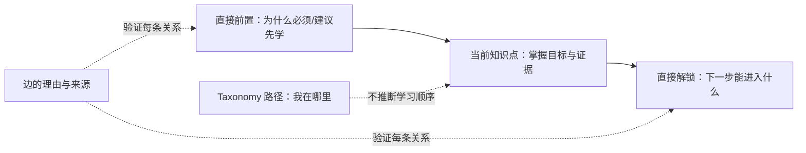

# Kebiao「学习脉络」核心决策体验实施计划

> **For agentic workers:** REQUIRED SUB-SKILL: Use `superpowers:executing-plans` to implement this plan task-by-task. Steps use checkbox (`- [ ]`) syntax for tracking.

**Goal:** 让用户在任何一个经审核知识点上，以两次交互内可靠回答「学会它前需要掌握什么、学会它后会解锁什么」，并在多父 taxonomy/DAG 中始终恢复自己的位置。

**Architecture:** 以 `knowledge_point + prerequisite + taxonomy_parent` 三个明确边界替代泛化全图。Taxonomy 只为搜索和位置服务，先修关系只用有方向、带理由和证据的局部 DAG 表达；用户看到的是“决策切片”，而不是全库网络。React Flow + Dagre 仅为桌面上的局部图提供增强渲染，语义 DOM、URL 状态和证据检查器是完整、可访问的主路径。

**Tech Stack:** 既有 React 18、Vite、CSS Modules、Motion、TypeScript `@curriculum/core`、Ajv/Node 构建校验、Playwright/axe/Storybook；已安装的 `@xyflow/react` 与 `@dagrejs/dagre` 延迟加载。

## 本计划的核心判断

当前“知识图谱散而无意义”的根因不是节点样式，而是把三种不等价的关系放在同一个视觉容器中：

| 关系 | 回答的问题 | 可否称作先修 | 在新体验中的位置 |
|---|---|---:|---|
| `taxonomy_parent` | 我属于哪里、还有哪些同级/子级？ | 否 | 搜索、面包屑、Miller Columns |
| `progression` | 不同学段如何进阶？ | 否 | 独立“学段进阶”Lens |
| `prerequisite` | 此知识点前必须/建议掌握什么？会解锁什么？ | 仅在已审核时 | 默认学习脉络 |

所以首版不追求“一张完整地图”。它必须在每一个焦点节点建立可追问的学习决策：



## 已有基础与真实缺口（2026-07-13）

已完成或在当前 feature branch 中可复用：领域 ADR/文案契约、JSON schemas 与 fixture 校验、方向严格的 core selector、URL/feature flag、搜索与 Miller Columns、工作台壳层、React Flow/Dagre 局部 renderer、40 节点上限及基准脚本。

仍未完成且不能被视觉原型掩盖：

1. 生产数据中仍为 **0 条已验证 prerequisite**。现有 2,079 节点 / 6,373 条旧图关系不能回答先修问题；`progression`、taxonomy 和相邻标准均不可改称 prerequisite。
2. Workspace 尚未接入真实 route/data loader/标准详情入口，因此主站用户不能稳定进入该体验。
3. Inspector 仍只是审核状态占位，尚未成为“点一条边就能看到理由、证据、标准对齐”的决策面板。
4. React Flow 视觉层当前被 `aria-hidden`，而 DOM fallback 没有逐边关系清单；两条路径尚未达到完全等价。
5. 只用 fixture 覆盖了 diamond、多父和高出度；尚未有专家批准的数学·图形与几何 golden anchors。

## 全局约束

- 用户可见名称固定为 **学习脉络**；副标题固定为 **先掌握什么 · 接下来解锁什么**。
- 不改变 kebiao 原有标准正文、列表与详情信息组织；只新增/替换关系探索的视觉和交互层。
- `unlocks` 必须由 `prerequisite` 出边反向派生，禁止独立存储和双向不一致。
- 生产 loader 只消费 `approved` 节点和边；`candidate`、机器候选、`disputed`、`retired` 一律不可呈现为事实。
- `reviewed + 0` 必须显示“已审核范围内的起点/终点”；`not_reviewed` 必须显示“当前尚无经证实的关系”。两者不能混同。
- 默认仅显示 1 跳、最多 40 个节点；用户主动展开到 2 跳时最多 60 节点 / 80 边。超出部分显示准确数量和可点击列表，不能静默丢弃或自动选择一支。
- 不使用 force layout、全屏 3D 球、无限缩放全量图、持续漂浮/流动虚线动画，或把数量统计当作主要价值。
- `prefers-reduced-motion` 下所有过渡即时完成；Canvas/SVG 失败时 DOM 路径仍能完成同一任务。
- 新功能保持 `learning-map` 独立 flag 且 production default-off，直到 Gate A/B/C 同时通过。

## 外部项目采用与拒绝矩阵

| 项目 | 采用的思想/能力 | kebiao 中的具体落点 | 是否下载/引入 | 禁止项 |
|---|---|---|---|---|
| [withmarbleapp/os-taxonomy](https://github.com/withmarbleapp/os-taxonomy) | 微知识点、`hard/soft` 依赖、每条边 reason、掌握证据、标准对齐、manifest 校验 | 采用其“关系是可解释数据”的模型，映射为 `required/recommended + rationale + evidenceRefs` | 不下载数据、不引入代码 | 不复制数据/文本/3D 图；其数据库 ODbL、文本 CC BY-SA，不能混入 kebiao 数据库 |
| [xyflow/xyflow](https://github.com/xyflow/xyflow) | 只读的、可定制节点边、viewport 与焦点交互 | `ReactFlowLearningDag.jsx` 仅渲染 <=60 的局部有向 DAG，desktop enhancement | 已作为 MIT 依赖 `@xyflow/react` | 不开启拖拽建边、编辑、删除、全库 minimap |
| [dagrejs/dagre](https://github.com/dagrejs/dagre) | 有向图的稳定 layered layout | `layoutLearningDag.js` 只决定几何位置，业务顺序仍由 selector 决定 | 已作为 MIT 依赖 `@dagrejs/dagre` | 不让 layout 邻接关系生成任何先修边 |
| [miller-columns](https://github.com/brettz9/miller-columns) | 键盘左右键、breadcrumb、保留多层可见路径 | 用作可访问行为清单，完善既有 `TaxonomyColumnNavigator` | 不引入；已有 React 实现更可控 | 不引入 jQuery / 自动改写 DOM 的插件 |
| [antvis/G6](https://github.com/antvis/G6) | 了解大图的 layout/interaction 范围 | 仅作“若未来需要通用图分析”的候选基准 | 不引入首版 | 不以通用 graph engine 取代任务型学习界面 |
| [react-force-graph](https://github.com/vasturiano/react-force-graph) | 反例：适合探索网络而非教学依赖 | 用于明确拒绝 force-directed 方案 | 不引入 | 不显示不稳定、不可解释的力导向全量网络 |

这套取舍遵循 Marble 数据集对有向、带理由的 prerequisite 与标准对齐的定义；其 README 也明确将“反向边”作为 unlock 的来源。[Marble Skill Taxonomy](https://github.com/withmarbleapp/os-taxonomy) React Flow 是可自定义 node-based UI 的 MIT 库，[xyflow/xyflow](https://github.com/xyflow/xyflow)；Dagre 专注 client-side 的有向图布局，[dagrejs/dagre](https://github.com/dagrejs/dagre)。G6 的定位则是广义图可视化与分析引擎，[antvis/G6](https://github.com/antvis/G6)，并不适合作为首版用户任务模型。

## 目标交互与状态模型

### 桌面

```text
┌───────────────────────────────────────────────────────────────────────────────┐
│ 搜索知识点   数学 / 图形与几何 / 空间观念         另一条分类路径 (1)          │
├───────────────────┬───────────────────────────────────┬──────────────────────┤
│ 定位              │ 学习决策                            │ 关系依据             │
│ 学科 > 领域 >…    │ 需要先掌握 ← 当前 → 将会解锁        │ 选中关系：A → B       │
│ 同级/子级数量     │ 必须 / 建议；只显示直接关系          │ 为什么、证据、标准     │
│ 搜索可跳转         │ 展开第 2 层 / 还有 N 项              │ 返回节点说明           │
└───────────────────┴───────────────────────────────────┴──────────────────────┘
```

### 移动端

`当前位置（sticky） → 当前知识点 → 需要先掌握 → 将会解锁 → 关系依据 → 分类导航抽屉`。不显示缩小的画布；显示同源、有方向的语义列表。

### 可观察状态

| 状态 | 可见答案 |
|---|---|
| 入边已审核且为空 | 这是当前已审核学习范围内的起点。 |
| 入边未审核 | 当前尚无经证实的先修关系。 |
| 出边已审核且为空 | 这是当前已审核学习范围内的终点。 |
| 出边未审核 | 当前尚无经证实的后续解锁。 |
| 边已选中 | `A 是 B 的必要/建议前置`，理由、证据、标准对齐可读。 |
| 多父 taxonomy | 面包屑显示当前 path；“另有 N 条分类路径”可切换。 |
| 分支超过限制 | “还有 N 个前置项/解锁项”，提供同方向可搜索列表。 |

## 文件职责

| 路径 | 责任 |
|---|---|
| `packages/curriculum-core/src/types.ts` | 强类型关系、证据、局部拓扑和 inspector selection。 |
| `packages/curriculum-core/src/knowledge-graph.ts` | 只读索引、方向 selector、稳定排序、截断和 relation lookup。 |
| `src/data/knowledgeGraphLoader.js` | 拉取 manifest、拒绝非 approved 数据、构建内存 dataset。 |
| `src/features/learning-map/LearningMapController.js` | 单一交互状态机：焦点、上下文、深度、已选节点/边。 |
| `src/features/learning-map/LearningDecisionPanel.jsx` | 当前/前置/解锁的语义主路径与“展开”动作。 |
| `src/features/learning-map/RelationshipInspector.jsx` | 边优先、节点次之的解释与证据展示。 |
| `src/features/learning-map/LearningDagPanel.jsx` | desktop renderer gate、DOM fallback、节点/边数量预算。 |
| `src/features/learning-map/TaxonomyColumnNavigator.jsx` | 搜索后的 context path 恢复、列导航和键盘 roving focus。 |
| `src/features/learning-map/learningMapRoute.jsx` | 真实入口：flag、loader、URL push/replace/popstate。 |
| `tests/fixtures/learning-map/*.json` | chain/diamond/multi-parent/high-degree/empty/golden anchor 的可读 fixture。 |
| `scripts/validate-learning-map-*.mjs` | 语义、交互、布局、bundle、数据与可访问性发布门。 |

---

## 实施任务

### Task 0：冻结本轮范围并完成现有局部 DAG WIP

**Files:**
- Modify: `packages/curriculum-core/src/{types.ts,knowledge-graph.ts}`
- Modify: `scripts/validate-learning-map-interaction-contract.mjs`
- Modify: `src/features/learning-map/{LearningDagPanel.jsx,LearningDagPanel.module.css,ReactFlowLearningDag.jsx,LearningNode.jsx,LearningEdge.jsx,learningDagRendererDecision.js}`
- Test: `tests/fixtures/learning-map/high-degree.json`

**Interfaces:**

```ts
type TopologicalLayers = {
  prerequisiteLayers: KnowledgePoint[][]
  unlockLayers: KnowledgePoint[][]
  edges: PrerequisiteEdge[]
  visibleNodeCount: number
  hiddenNodeCount: number
}
```

- [ ] **Step 1: 固化局部图约束的失败测试。**

```ts
assert.equal(topology.visibleNodeCount, 40)
assert.equal(topology.hiddenNodeCount, 1)
assert.deepEqual(
  topology.edges.map(edge => [edge.source, edge.target]),
  [['kp:b', 'kp:d'], ['kp:c', 'kp:d']]
)
```

- [ ] **Step 2: 实现“只保留实际 verified edge”的截断。** `buildTopologicalLayers` 先取有向层、后按 `maxVisibleNodes` 裁剪、最后只保留两个可见端点都存在的 `PrerequisiteEdge`；不得按层相邻补边。

- [ ] **Step 3: 运行最小验证。**

```bash
npm run core:test
npm --workspace @curriculum/core run typecheck
npm run validate:learning-map-interaction
npm run validate:learning-map-layout
npm run benchmark:learning-map
```

Expected: interaction/layout 全部通过，benchmark p95 < 100ms。

- [ ] **Step 4: 提交。**

```bash
git add packages/curriculum-core/src/{types.ts,knowledge-graph.ts} scripts/validate-learning-map-interaction-contract.mjs src/features/learning-map/{LearningDagPanel.jsx,LearningDagPanel.module.css,ReactFlowLearningDag.jsx,LearningNode.jsx,LearningEdge.jsx,learningDagRendererDecision.js}
git commit -m "feat(learning-map): render bounded focused dag"
```

### Task 1：把“图”改为“学习决策面板”

**Files:**
- Create: `src/features/learning-map/LearningDecisionPanel.jsx`
- Create: `src/features/learning-map/LearningDecisionPanel.module.css`
- Modify: `src/features/learning-map/LearningMapWorkspace.jsx`
- Modify: `src/features/learning-map/learningMapCopy.js`
- Test: `src/stories/FoundationStates.stories.jsx`

**Consumes:** `snapshot.context.prerequisites`, `snapshot.context.focus`, `snapshot.context.unlocks`, `snapshot.topology.hiddenNodeCount`.

**Produces:** `onSelectNode(nodeId)`、`onSetDepths({ prerequisiteDepth, unlockDepth })` 与可读的三段语义结构。

- [ ] **Step 1: 写 Storybook inspected states。** 除现有 loading/error/diamond 外，新增 `required + recommended`、reviewed-empty、not-reviewed、hidden-branches 四个展示状态。
- [ ] **Step 2: 写断言。** `validate-learning-map-interaction-contract.mjs` 校验已审核空入边不会写成“无需先修”，未审核不会写成“起点”；`required` 永远先于 `recommended`。
- [ ] **Step 3: 实现主路径。** 使用 `<section aria-labelledby>` 和 `<ol>`，顺序固定为 `需要先掌握`、`当前知识点`、`将会解锁`。每个关系项显示必要度文字；“展开第 2 层”只调用 `controller.setDepths`。
- [ ] **Step 4: 让 Workspace 将中间区域替换为该面板，DAG 只作为 desktop augmentation。** 使用户即使不看箭头也能完成任务。
- [ ] **Step 5: 验证并提交。**

```bash
npm run validate:learning-map-copy
npm run validate:learning-map-interaction
npm run build-storybook
git add src/features/learning-map/LearningDecisionPanel.* src/features/learning-map/{LearningMapWorkspace.jsx,learningMapCopy.js} src/stories/FoundationStates.stories.jsx scripts/validate-learning-map-interaction-contract.mjs
git commit -m "feat(learning-map): make prerequisite decisions the primary view"
```

### Task 2：实现真正可解释的边/节点 Inspector

**Files:**
- Create: `src/features/learning-map/RelationshipInspector.jsx`
- Create: `src/features/learning-map/RelationshipInspector.module.css`
- Modify: `src/features/learning-map/LearningMapController.js`
- Modify: `packages/curriculum-core/src/{types.ts,knowledge-graph.ts}`
- Modify: `src/features/learning-map/LearningMapWorkspace.jsx`
- Test: `scripts/validate-learning-map-interaction-contract.mjs`

**Interfaces:**

```ts
type InspectorSelection =
  | { kind: 'relationship'; edge: PrerequisiteEdge; source: KnowledgePoint; target: KnowledgePoint; evidence: Evidence[] }
  | { kind: 'knowledge_point'; point: KnowledgePoint }
  | undefined

getInspectorSelection(index, selectedNodeId, selectedRelationshipId?): InspectorSelection
```

- [ ] **Step 1: 写失败测试。** 选中 `pre:kp:b:kp:d` 时必须给出 `source=B`、`target=D`、`rationale`、所有 `evidenceRefs`；选中节点时必须清空旧边选择。
- [ ] **Step 2: 在 core 中做 relation/evidence join。** 缺失 evidenceRef 必须在构建 validator 失败，不能在浏览器静默省略。
- [ ] **Step 3: 实现 Inspector。** 边选中时首行固定为“B 是 D 的必要/建议前置”；显示为什么相关、证据原文/定位、课程标准对齐。节点选中时显示掌握目标与来源，不暴露内部 reviewer 或机器候选细节。
- [ ] **Step 4: 把 `LearningEdge`、DOM 关系项及 React Flow edge 的选择统一接到 `controller.selectRelationship`。**
- [ ] **Step 5: 验证并提交。**

```bash
npm run validate:knowledge-graph
npm run validate:learning-map-interaction
npm run lint:styles
git add packages/curriculum-core/src/{types.ts,knowledge-graph.ts} src/features/learning-map/{RelationshipInspector.jsx,RelationshipInspector.module.css,LearningMapController.js,LearningMapWorkspace.jsx,LearningEdge.jsx,LearningMapFallbackList.jsx} scripts/validate-learning-map-interaction-contract.mjs
git commit -m "feat(learning-map): explain selected prerequisite evidence"
```

### Task 3：使 DOM、React Flow 与读屏语义等价

**Files:**
- Modify: `src/features/learning-map/{LearningDagPanel.jsx,ReactFlowLearningDag.jsx,LearningMapFallbackList.jsx,LearningNode.jsx,LearningEdge.jsx}`
- Modify: `src/features/learning-map/LearningDagPanel.module.css`
- Modify: `tests/e2e/a11y.spec.js`
- Create: `tests/e2e/learning-map-accessibility.spec.js`

- [ ] **Step 1: 写失败的浏览器测试。** 键盘用户从页面主入口能顺序聚焦“当前 → 前置 → 解锁 → 关系依据”；每条边在语义列表中的 accessible name 为 `必要/建议：A → B，已验证关系`。
- [ ] **Step 2: 保留一个权威语义路径。** 当 visual React Flow 展示时，它只能作为 `aria-hidden` 的装饰层；`LearningMapFallbackList` 必须保留可见或 sr-only 的 `<ol aria-label="已验证关系">`，并列出逐边按钮。移动端只渲染该语义路径。
- [ ] **Step 3: 去除重复焦点。** React Flow 内按钮不再和 fallback 同时暴露给辅助技术；点击视觉节点/边仍同步 controller。
- [ ] **Step 4: 添加降级阈值。** 超过 60 节点/80 边不加载 React Flow，自动显示含“还有 N 项”的 DOM 列表；未加载 library 时不报错。
- [ ] **Step 5: 验证并提交。**

```bash
npm run test:a11y
npx playwright test tests/e2e/learning-map-accessibility.spec.js
npm run build-storybook
git add src/features/learning-map/{LearningDagPanel.jsx,ReactFlowLearningDag.jsx,LearningMapFallbackList.jsx,LearningNode.jsx,LearningEdge.jsx,LearningDagPanel.module.css} tests/e2e/{a11y.spec.js,learning-map-accessibility.spec.js}
git commit -m "fix(learning-map): make graph semantics accessible without canvas"
```

### Task 4：让复杂 taxonomy 的“持续定位”成为一等功能

**Files:**
- Modify: `packages/curriculum-core/src/knowledge-graph.ts`
- Modify: `src/features/learning-map/{LearningMapController.js,TaxonomyColumnNavigator.jsx,TaxonomyColumnNavigator.module.css,PersistentLocationBar.jsx,TaxonomyContextSwitcher.jsx}`
- Modify: `scripts/validate-learning-map-interaction-contract.mjs`
- Test: `tests/fixtures/learning-map/multi-parent.json`

- [ ] **Step 1: 为多父 fixture 写稳定路径测试。** 当 URL 提供合法 `contextPath` 时完全恢复；没有 URL 时按 root 距离、taxonomy `order`、label、ID 打破平局；不能按 JSON 第一个父节点决定。
- [ ] **Step 2: 实现 roving tabindex 键盘导航。** `↑/↓` 同列移动，`→` 打开子列，`←` 回到父列，`Enter/Space` 选择；每列只有一个 tab stop，焦点进入时滚动到当前项。
- [ ] **Step 3: 控制列宽与深度。** 桌面最多展示三列并把活跃列固定在中间；更深层级折叠为 breadcrumb，不让列越来越窄。移动端使用单列 drill-down/抽屉、显式“返回上一级”。
- [ ] **Step 4: 搜索结果必须携带可恢复 `taxonomyPath`。** 点击后同时更新 focus 与 path，不能只更新 focus。
- [ ] **Step 5: 验证并提交。**

```bash
npm run core:test
npm run validate:learning-map-interaction
npx playwright test tests/e2e/learning-map-accessibility.spec.js
git add packages/curriculum-core/src/knowledge-graph.ts src/features/learning-map/{LearningMapController.js,TaxonomyColumnNavigator.jsx,TaxonomyColumnNavigator.module.css,PersistentLocationBar.jsx,TaxonomyContextSwitcher.jsx} scripts/validate-learning-map-interaction-contract.mjs tests/fixtures/learning-map/multi-parent.json
git commit -m "feat(learning-map): preserve taxonomy context across paths"
```

### Task 5：接入真实 route、loader、标准详情入口和浏览器历史

**Files:**
- Create: `src/features/learning-map/learningMapRoute.jsx`
- Modify: `src/data/knowledgeGraphLoader.js`
- Modify: `src/data/query.js`
- Modify: `src/config/learningMapFlags.js`
- Modify: `src/pages/StandardDetailPage.jsx`
- Modify: `src/App.jsx`
- Test: `tests/e2e/learning-map-route.spec.js`

**Route contract:**

```text
?view=learning-map
&selectedNode=kp:math:geometry:spatial-concept
&contextPath=topic:math,topic:math:geometry,kp:math:geometry:spatial-concept
&prerequisiteDepth=1
&unlockDepth=1
&necessity=required,recommended
```

- [ ] **Step 1: 写 route contract 测试。** `StandardDetailPage` 上的入口应产生下列 URL；选择节点/切换 taxonomy path 用 `pushState`；改深度或 inspector choice 用 `replaceState`；刷新和 back/forward 完整恢复；未知参数与 `utm_*` 保留。
- [ ] **Step 2: 实现 feature-gated lazy route。** 只有 `resolveLearningMapFlag(surface, search).enabled` 且 loader 得到 manifest 时动态 `import()` workspace；否则保持原信息页与旧图入口不变。
- [ ] **Step 3: 在标准详情增加真实入口。** 只对有 approved `standardCodes` mapping 的知识点显示“查看学习脉络”；无映射时不显示假链接。
- [ ] **Step 4: 显式处理 loader 状态。** manifest/version/hash 错误显示可重试错误；无批准数据展示空状态，不偷偷 fallback 到旧 relationship graph。
- [ ] **Step 5: 验证 lazy bundle 与行为并提交。**

```bash
npm run validate:learning-map-rollout
npx playwright test tests/e2e/learning-map-route.spec.js
npm run check:bundle
git add src/features/learning-map/learningMapRoute.jsx src/data/{knowledgeGraphLoader.js,query.js} src/config/learningMapFlags.js src/pages/StandardDetailPage.jsx src/App.jsx tests/e2e/learning-map-route.spec.js
git commit -m "feat(learning-map): add flagged route and standard entry"
```

### Task 6：完成首个可信数据切片，而非伪造全量答案

**Files:**
- Create: `docs/data/reviews/knowledge_graph/math_geometry_review_decisions.json`
- Create: `docs/data/reviews/knowledge_graph/math_geometry_signoff.md`
- Modify/Create: `public/data/knowledge_graph/{manifest.json,nodes_by_subject/math.json,taxonomy_nodes.json,prerequisite_edges.json,taxonomy_edges.json,evidence.json,indexes/*}`
- Modify: `scripts/{build-knowledge-graph-indexes.mjs,validate-knowledge-graph.mjs,audit-knowledge-graph-coverage.mjs}` as required by final approved file shape
- Create: `tests/fixtures/learning-map/math-geometry-golden.json`

- [ ] **Step 1: 生成只读 review packet。**

```bash
npm run build:knowledge-graph-review-packet
```

Expected: 候选只写入 `generated/`，不写入 public manifest。

- [ ] **Step 2: 由被授权的课程领域专家填写 decisions 并签字。** 每个 approved edge 必须包含 source、target、`required|recommended`、rationale、至少一个 evidenceRef、confidence、review metadata。此步骤不得由开发代理假造。
- [ ] **Step 3: 固化至少 30–60 个数学·图形与几何知识点与 3 个 golden anchors。** Golden fixture 需断言每个 anchor 的直接前置、直接解锁、边理由和 expected taxonomy path。
- [ ] **Step 4: 构建 public index 并做完整验证。**

```bash
npm run build:knowledge-graph
npm run validate:knowledge-graph-loader
npm run audit:knowledge-graph
```

Expected: 0 cycle/self-loop/duplicate/dangling endpoint；100% approved edge 有理由与证据；任何候选数据均未入 public。

- [ ] **Step 5: 提交且仅提交已经签字批准的数据。**

```bash
git add docs/data/reviews/knowledge_graph/math_geometry_{review_decisions.json,signoff.md} public/data/knowledge_graph tests/fixtures/learning-map/math-geometry-golden.json scripts/{build-knowledge-graph-indexes.mjs,validate-knowledge-graph.mjs,audit-knowledge-graph-coverage.mjs}
git commit -m "data(learning-map): publish reviewed math geometry pilot"
```

### Task 7：将局部学习路径做出克制、可感知的质感

**Files:**
- Modify: `src/features/learning-map/{LearningMapWorkspace.module.css,LearningDagPanel.module.css,TaxonomyColumnNavigator.module.css,RelationshipInspector.module.css}`
- Modify: `src/features/learning-map/{LearningMapWorkspace.jsx,TaxonomyColumnNavigator.jsx,RelationshipInspector.jsx}`
- Modify: `scripts/validate-motion-contract.mjs`
- Test: `tests/e2e/learning-map-visual.spec.js`

**Motion contract:** taxonomy 前进/后退 `240ms` transform+opacity；焦点变化一次性 `420ms` pulse；Inspector `180ms` enter/exit；`reduced-motion` 下均为 `0ms`。不得采用 ScrollTrigger、循环动画或 layout-shifting height animation。

- [ ] **Step 1: 写视觉/动效失败测试。** 390×844、768、1440、200% zoom 无横向溢出；`prefers-reduced-motion` 无 CSS animation/transition；focus ring 颜色对比可见。
- [ ] **Step 2: 先调整 hierarchy 而非添加装饰。** 当前知识点拥有唯一最强 contrast/elevation；required 实线 + 文本、recommended 虚线 + 文本；taxonomy 与计数退到第三层级。
- [ ] **Step 3: 用 Motion 的 layout transition 实现路径转场。** 只对列、Inspector 和 focus card 使用 transform/opacity，所有 click/keyboard 焦点在动画开始时同步更新。
- [ ] **Step 4: 验证并提交。**

```bash
npm run lint:styles
npm run validate:motion-contract
npx playwright test tests/e2e/learning-map-visual.spec.js
git add src/features/learning-map/*.{jsx,css} scripts/validate-motion-contract.mjs tests/e2e/learning-map-visual.spec.js
git commit -m "feat(learning-map): polish focused learning interactions"
```

### Task 8：端到端验收、无障碍与发布门

**Files:**
- Modify: `tests/e2e/{core-flows.spec.js,a11y.spec.js,responsive.spec.js,feature-flags.spec.js}`
- Create: `docs/qa/LEARNING_MAP_RELEASE_CHECKLIST.md`
- Modify: `scripts/{check-bundle-budget.mjs,validate-learning-map-rollout-contract.mjs}`

- [ ] **Step 1: 编写三个 user-journey e2e。**

```text
1. 搜索“空间观念” -> 两次交互内读到直接前置与解锁 -> 点边读到理由与证据。
2. 从标准详情进入 -> 刷新 -> 浏览器后退/前进 -> focus、path、depth 保持。
3. 多父节点切换 context path -> 箭头方向不变 -> taxonomy 位置更新。
```

- [ ] **Step 2: 运行自动化质量门。**

```bash
npm run validate:learning-map-copy
npm run validate:knowledge-graph
npm run validate:learning-map-interaction
npm run validate:learning-map-layout
npm run validate:learning-map-rollout
npm run core:test
npm run typecheck
npm run test:e2e
npm run test:a11y
npm run check:bundle
```

Expected: axe 无 critical/serious；主包不含 React Flow/Dagre，learning-map route chunk 才含它们。

- [ ] **Step 3: 执行人工辅助技术验收。** VoiceOver（macOS Safari）与 NVDA（Windows 浏览器）各走完 Task 8 Step 1 的三个任务；记录结果、版本、失败截图与修复链接在 release checklist。
- [ ] **Step 4: 运行发布矩阵。** `default-off → 5% → 20% → 50% → 100% cycle 1 → 100% cycle 2`；每一档由自动化 Gate 通过晋级，不要求 48 小时观察窗口。
- [ ] **Step 5: 提交。**

```bash
git add tests/e2e docs/qa/LEARNING_MAP_RELEASE_CHECKLIST.md scripts/{check-bundle-budget.mjs,validate-learning-map-rollout-contract.mjs}
git commit -m "test(learning-map): add release readiness gates"
```

## Gate 与停止条件

| Gate | 必须满足 | 未通过时的行为 |
|---|---|---|
| A：数据真实 | 试点有专家签字的 approved 边、golden anchors、完整 validator | 保持 feature flag off；只允许 fixture/内部原型 |
| B：任务完成 | 两次交互内可读直接前置/解锁；path/URL 稳定；无散乱全图默认入口 | 不接入标准详情主入口 |
| C：质量 | DOM 等价、axe、VoiceOver/NVDA、视口、reduced-motion、bundle、性能通过 | 不提高 rollout 比例 |
| D：发布 | 独立 flag 与旧 UI fallback、数据回滚、两个自动化成功 100% 发布周期 | 不退役旧图 |

## 计划自检

- 语义边界：Task 0/1/2/6 均保证 taxonomy、progression、相邻标准不能伪装成 prerequisite。
- “前置/解锁”问题：Task 1/2/6 给出用户答案、解释与可信数据来源。
- 复杂定位：Task 4/5 负责多父 path、搜索、键盘、URL 与历史恢复。
- “散”的根治：Task 0/1/3 强制局部、方向、边证据、显示上限和 DOM-first；没有任何任务把全量网络美化后重新设为默认。
- 可行性：任务使用当前仓库已存在的 scripts/fixtures/components；真实入口明确落在 `src/pages/StandardDetailPage.jsx` 与 `src/App.jsx`，避免猜测宿主文件。

## 推荐执行顺序

先完成 **Task 0 → Task 1 → Task 2 → Task 3 → Task 4 → Task 5**，它们可在没有生产 prerequisite 数据时通过 fixtures 完整验收。**Task 6 是唯一需要课程专家外部授权的门槛**；其余代码不可绕过该门槛自行声称用户已获得真实先修答案。随后完成 Task 7 与 Task 8，再开启 rollout。
