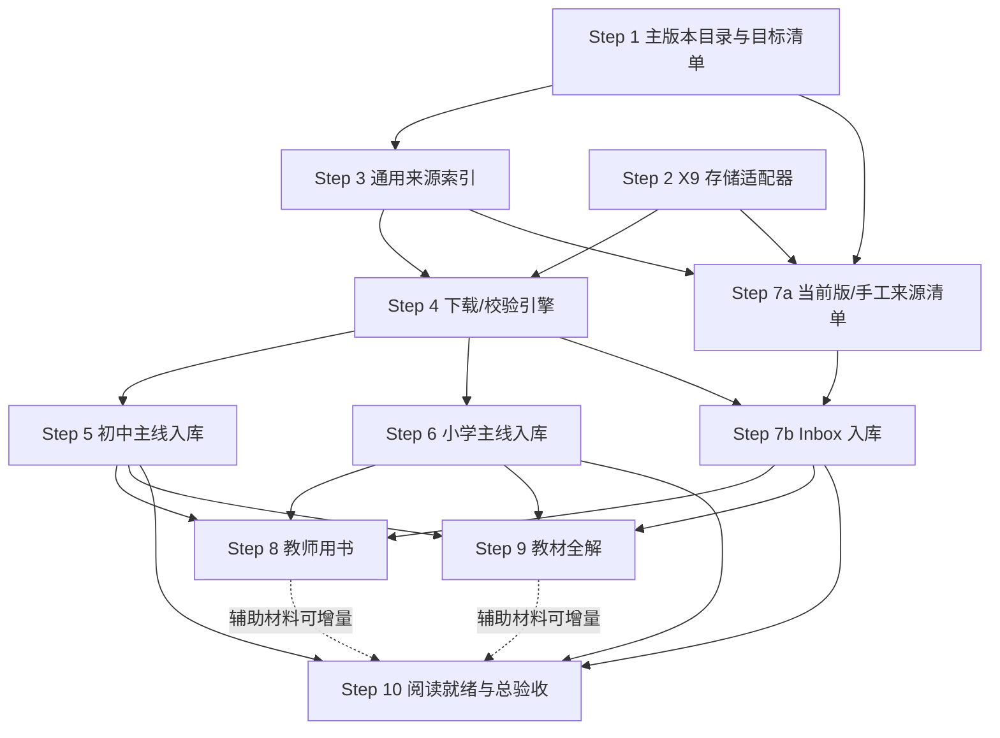

# 小学—初中主版本教材资料库实施蓝图

> 状态：Reviewed blueprint；尚未开始下载或实现
> 制定日期：2026-07-16
> 项目：`curriculum-standards-breakdown`
> 数据盘：`/Volumes/X9 Pro`
> 使用方式：个人、本地、默认不公开分发
> 目标：在 X9 Pro 上建成一套可被当前项目稳定读取的“小学 + 初中主版本”教材资料库，并逐步补齐教师用书和教材全解。
> 审查：已完成独立逆向审查；1 个 Critical 和全部 Major 已并入本版，核心修正是单写者日志架构、当前/旧源数量拆分和范围决策门。

---

## 1. 最终目标

这不是“把所有版本全部下载下来”，而是建立一套**版本明确、文件完整、可以持续增量更新**的主版本资料库：

1. 六三学制，小学一年级至初中九年级；
2. 国家统编学科只收统编版；
3. 非统编学科只选一套项目基准版；
4. 优先收依据 2022 年版课标修订、2024—2026 分批启用的当前版；
5. 旧版只作回退，不能和当前版混为一套；
6. 学生教材完成后，再按具体教材版本配教师用书；
7. 教材全解只先收一个系列，不同时铺开多个同类品牌；
8. PDF、OCR 和缩略图放在 X9 Pro，Git 只保存代码、书目、哈希和覆盖报告。

### 完成定义

核心完成不是“目录里有很多 PDF”，而是：

```text
目标书目已识别
→ 文件已获取
→ PDF 可打开且结构完整
→ SHA-256、页数、来源和版次已记录
→ 当前版/旧版状态明确
→ 可被阅读器按稳定 asset_id 打开
```

教师用书和教材全解还必须精确关联到对应 `edition_id`，不能只凭“人教版”“七年级”这类宽标签自动配对。

---

## 2. 已确认的项目与设备事实

### 仓库

- 当前分支：`main`；远端 GitHub 和 `gh` 登录可用。
- 工作区有一个与本计划无关的用户文件：`marketing/wechat-launch-article.md`，所有实施步骤都必须保留，不得覆盖或清理。
- `generated/` 已在 `.gitignore` 中，适合保存本地生成清单和缓存，但大文件最终应放 X9 Pro。
- `generated/external/ChinaTextbook` 是 blobless/no-checkout partial clone：
  - commit：`5a80345f2043ba6f8db8d7be9cf3db82725ff1f7`
  - 当前体积约 1.1 GiB；
  - 不得在内部磁盘执行完整 checkout。
- `generated/textbook_evidence/pdf_cache` 当前约 126 个文件、2.02 GiB。
- 当前缓存中有约 22 本可映射到初中基准册位的候选文件：数学 6、地理 4、生物 4、物理 3、化学 2、体育 3。它们已通过基础 PDF 检查，但尚未全部完成当前版书目核验；应先导入复用，再分别记录传输、结构和版本状态。
- 已有能力：
  - `index_china_textbook.js`：Git tree 索引；
  - `prefetch_h4g_work_item_pdfs.js`：按 evidence ID 下载、`.part` 续传、固定 commit、外部 `--cache-dir`；
  - `build_textbook_unit_index.js`：文本抽取、OCR fallback、TOC 和单元页码；
  - 现有教材证据匹配、审计和人工发布门禁。
- 当前缺口：
  - `index_china_textbook.js` 只真正支持初中，年级仅 7–9；
  - 小学路径通常只有 4 层，会被 `parts.length < 5` 丢弃；
  - 没有主版本 profile、通用资产 manifest、SHA-256/qpdf 审计和外部盘 guard；
  - 信息科技、劳动不在当前 ChinaTextbook 小学/初中主线中。
- 内部系统盘剩余空间只有约 11–13 GiB，且会随运行变化；所有批次都必须实时检查，不能把该数字当常量。

### X9 Pro

- 挂载点：`/Volumes/X9 Pro`
- 文件系统：ExFAT
- 当前可用空间：约 503 GiB（`diskutil` 的十进制口径约 540 GB）
- Allocation block：256 KiB

由此带来的设计约束：

- 不依赖 Unix 软链接、硬链接、owner/mode；
- 不在 X9 Pro 上制造“每页一个小 JSON”的海量小文件；
- PDF 只物理存一份，通过 manifest 建多个逻辑引用；
- 脚本必须验证挂载点、卷标和 sentinel；X9 未挂载时必须失败，不能静默写入内部磁盘上的同名目录；
- `.part → final` 必须在同一卷内 rename，但 ExFAT 无 journal，rename 只解决命名切换，不代表断电后一定持久；写入后仍需 flush/fsync（能力允许时）、重新打开并校验，启动时执行恢复审计；
- 文件展示名与物理路径分离，物理文件用 ASCII SHA-256 路径。
- 下载、合并、qpdf 重写、OCR 和工具 cache 的临时目录统一指向 X9 `staging/tmp`；X9 guard 失败时禁止退回内部 `generated/.../pdf_cache` 或系统临时目录。

---

## 3. 版本选择政策

教育部明确的义务教育国家统编教材是道德与法治、语文、历史三科。其余学科实行“一纲多本”，没有可靠公开的全国市场份额数据。因此下面必须区分：

- `national_unified`：国家统编；
- `project_baseline`：本项目选定的一套工程基准，不宣称全国占有率第一；
- `provisional_baseline`：暂定，需核对当前目录和完整册次后才能锁定。

### 3.1 锁定的基准矩阵

| 学科 | 小学 | 预计册数 | 初中 | 预计册数 | 选择性质 |
|---|---|---:|---|---:|---|
| 语文 | 教育部统编、人教社出版 | 12 | 教育部统编、人教社出版 | 6 | `national_unified` |
| 道德与法治 | 教育部统编、人教社出版 | 12 | 教育部统编、人教社出版 | 6 | `national_unified` |
| 历史 | — | 0 | 教育部统编、人教社出版 | 6 | `national_unified` |
| 数学 | 人教版 | 12 | 人教版 | 6 | `project_baseline` |
| 英语 | 人教版 PEP，三年级起点 | 8 | 人教版 | 6 | `project_baseline`；当前版九年级为上下册，不收一年级起点版 |
| 科学 | 教科版、教育科学出版社 | 12 | 主流六三制不设综合科学教材 | 0 | `project_baseline` |
| 地理 | — | 0 | 人教版 | 4 | `project_baseline` |
| 生物学 | — | 0 | 人教版 | 4 | `project_baseline` |
| 物理 | — | 0 | 人教版：八上、八下、九全一册 | 3 | `project_baseline` |
| 化学 | — | 0 | 人教版：九上、九下 | 2 | `project_baseline` |
| 体育与健康 | 人教版当前学生用书，一至六年级各全一册 | 6 | 人教版，七至九年级各全一册 | 3 | `project_baseline`；旧源的 1–2、3–4、5–6 年级三册是旧版学生合册，只能作 `stale_fallback` |
| 音乐 | 人音版简谱 | 12 | 人音版简谱 | 6 | `project_baseline` |
| 美术 | 人美版 | 12 | 人美版 | 6 | `project_baseline` |
| 信息科技 | 暂定教科版，范围仅三至六年级 | 待目录确认 | 暂定教科版，范围仅七至八年级 | 待目录确认 | `provisional_baseline`；2022 课程方案范围为三至八年级，不含九年级 |
| 劳动 | 暂不指定 | 待定 | 暂不指定 | 待定 | 地区差异大，单独做决策门 |
| 综合实践活动 | 不设全国统一学生教材基准 | 0 | 不设全国统一学生教材基准 | 0 | `non_textbook_course`；保留课程范围记录，地区材料以后按需加入 |

补充资料：初中人教版配套地理图册 4 册，列为 `student_companion`，不计入核心教材完成率。

### 3.2 必须分开的三种数量口径

不能再用一个“140 本”同时表示来源规模和当前版完成目标：

```text
current_target_count（当前版核心册位）
  = 小学 86 + 初中 58 = 144 本

legacy_source_locatable_count（ChinaTextbook 旧源可定位候选）
  ≈ 140 本，但其中可能有旧版或 resource_type 误分，不能直接算完成

transfer_checked_cache_count（现有缓存候选）
  = 22 本；只代表文件可复用，不代表 current_confirmed
```

另有初中人教版地理图册 4 本，作为 `student_companion` 单独计数。信息科技覆盖三至八年级，劳动覆盖一至九年级；二者的物理册数只有在 Step 1 选定具体完整系列后才能锁定。综合实践活动保留 `non_textbook_course` 证据，不用随意找一套地方材料冒充全国基准。因此最终口径写作“144 本核心 + 4 本图册 + 已决策的信息科技/劳动系列”，不再用未经目录核验的总数估计。

### 3.3 新旧版规则

2024 年起，新修订三科统编教材从小学一年级和初中七年级开始使用；教育部公布的替换节奏为 2026 年义务教育全部年级完成替换。因此：

- `curriculum_revision=2022` 和 `legacy_revision` 必须分别保存；
- 目标完成率只计算当前版；
- ChinaTextbook 中没有可确认修订年份的文件先标记 `revision_unknown`；
- 只有旧版时，可以保留并可阅读，但状态必须是 `stale_fallback`；
- 新版到达时新增 `Edition/Asset`，不能覆盖旧文件。

---

## 4. 存储布局

### 4.1 X9 Pro：二进制和派生资产

```text
/Volumes/X9 Pro/kebiao-library/
├── .kebiao-library-root.json       # sentinel：library_id、schema、volume UUID
├── inbox/                           # 用户手动下载、购买或扫描后投入
├── staging/
│   ├── downloads/                   # .part 和待校验文件
│   ├── fragments/                   # PDF 分片
│   └── tmp/                         # qpdf/OCR/解压等所有重型临时文件
├── objects/
│   └── sha256/ab/<64-char-hash>.pdf # 不可变原件，实际只存一份
├── derived/
│   └── <asset_id>/
│       ├── cover.webp
│       ├── toc.json
│       ├── text.jsonl.gz
│       └── viewer.pdf               # 仅在需要线性化时生成
├── quarantine/                      # 损坏、加密、缺片、版本冲突
├── exports/                         # 阅读器需要的受控导出
├── state/
│   ├── writer.lease                 # 全库单写者租约，原子独占创建
│   ├── generations/<generation_id>/ # 不可变 manifest/coverage/COMMIT 快照
│   ├── runs/<run_id>/               # 每批不可变 plan 与 append-only events/result
│   └── audits/                       # 可从 objects 重建的审计快照
└── logs/                             # 下载/校验运行日志
```

不要长期预生成所有页面高清 PNG。ExFAT 的 256 KiB allocation block 会让大量小文件浪费空间；页面级结构优先合并为每本一个 `.jsonl.gz`，缩略图按需生成或按书打包。

### 4.2 Git 项目：代码和小型主数据

```text
data/textbooks/catalog/
├── baseline_profile.json
├── expected_editions.jsonl
├── source_registry.json
├── baseline_source_lock.json        # 精确 source commit/path/git object
└── manual_overrides.json

data/textbooks/library-state/
├── CURRENT.json                     # 唯一权威 generation 指针，最后更新
└── generations/<generation_id>/
    ├── asset_registry.lock.jsonl     # tracked：edition↔hash↔source↔验证状态
    ├── coverage.snapshot.json        # tracked：无本机路径的验收快照
    └── COMMIT.json                   # generation/hash/schema 完整性描述

generated/textbook_library/
├── source_inventory.json
├── asset_manifest.jsonl             # 从 CURRENT generation 投影，可删除重建
├── coverage.json
├── coverage.md
└── runs/

scripts/textbooks/
├── library_storage.js
├── build_baseline_catalog.js
├── build_textbook_source_inventory.js
├── plan_textbook_downloads.js
├── download_textbook_assets.js
├── import_textbook_inbox.js
├── reconcile_textbook_library.js
└── audit_textbook_library.js
```

`.env.local`：

```text
TEXTBOOK_LIBRARY_ROOT=/Volumes/X9 Pro/kebiao-library
```

`.env.local` 不提交，也不会假设 npm/Node 自动读取它。所有命令统一通过一个明确的 dotenv/bootstrap loader（或经验证可用的 `node --env-file-if-exists=.env.local`）加载；环境变量未设、无效或指向内部盘时必须 fail closed。tracked 配置只保存预期卷标、sentinel schema 和最低可用空间，不保存用户 token。

`generated/` 只是可重建的工作输出。真正的最小恢复锚点是 tracked `library-state/CURRENT.json` 与其指向的不可变 generation bundle；它们不含 X9 绝对路径。无法重新下载的购买/扫描文件还必须在第二介质做备份，X9 的 runtime state 与 object 本身不能互为独立备份。

---

## 5. 全局不变量

每一步都必须保持：

1. 不修改或清理用户现有未跟踪文件；
2. 不把 PDF、扫描件、OCR 大文件提交 Git；
3. X9 未挂载或 sentinel 不匹配时，任何写任务立即失败；
4. 原始 PDF 一经进入 `objects/sha256` 不再原位修改；
5. 同一个 SHA-256 只保存一个物理文件；
6. 下载先写 `.part`，校验通过后才 rename；
7. 分片按数字后缀排序，缺任意一片不得合并为完整 PDF；
8. 每个 Asset 都有来源、获取时间、大小、SHA-256、页数和状态；
9. 当前版、旧版、版次未知不能混为同一个 Edition；
10. 非统编教材不得标记 `national_unified`；
11. 教师用书/教材全解只有在版本精确匹配后才进入已关联状态；
12. 下载、OCR、索引任务都必须可中断、可恢复、可重跑。
13. X9 generation 与项目 tracked generation 必须使用同一个 `generation_id` 和 COMMIT hash；单边丢失时可由 tracked bundle、per-run journal 和 object audit 重建；
14. 所有会写 X9 object、manifest、derived、registry 或 coverage 的任务必须先取得全库唯一 writer lease；同一时刻只能有一个 ingest/import/reconcile/derived writer；
15. 每个 run 只追加自己的 journal set，不直接覆盖 canonical 状态；reconcile 必须先在 X9 和项目侧各生成同一代不可变 generation，全部 flush 并交叉校验后，最后才原子更新唯一权威 `CURRENT.json` 指针。永不原位覆盖上一代；
16. 状态必须分开记录：`transfer_verified`、`pdf_structural_verified`、`bibliographic_verified`、`current_confirmed` 和 `viewer_ready`，不能用一个 `verified` 掩盖来源缺页或错版；
17. 信息科技、劳动和综合实践活动必须计入 `scope_decision_coverage`：前两者只有选定版本或用户显式 `deferred_with_reason` 才算范围决策完成；综合实践活动以有依据的 `non_textbook_course` 关闭范围。不能通过从 denominator 删除来制造 100%。

---

## 6. 依赖图与并行策略



只允许以下工作并行：

- Step 1 与 Step 2 的设计/测试可并行，但若都要改 `package.json`，必须使用独立 git worktree，按 Step 1 → Step 2 顺序合并，不能让多个 agent 在共享 cwd 切分支；
- Step 3 完成后，Step 4 的实现和 Step 7a 的手工来源清单可并行准备；
- Step 5 与 Step 6 只能并行生成只读书目、HEAD 尺寸和下载 plan；实际 `downloads:run` 必须串行取得 writer lease；
- Step 8 和 Step 9 可并行搜索、采购和制作 review packet，但 inbox ingest、关系 reconcile、derived 生成不能并发。

所有 npm script 注册集中在各步骤合并阶段串行完成。大文件下载不是 PR 分支动作；run ID 和结果 journal 留在 X9，只有小型 registry/coverage snapshot 进入 Git。

关键路径：`1 + 2 → 3 → 4 → 5/6 + 7a/7b → 10`。

---

## 7. 分步执行计划

## Step 1 — 锁定主版本目录与目标册次

**执行档位：** strongest；需要产品判断与书目准确性。
**依赖：** 无。
**建议分支：** `feat/textbook-baseline-catalog`
**主要文件：**

- `data/textbooks/catalog/baseline_profile.json`
- `data/textbooks/catalog/expected_editions.jsonl`
- `data/textbooks/catalog/source_registry.json`
- `scripts/textbooks/build_baseline_catalog.js`
- `scripts/textbooks/audit_baseline_catalog.js`
- `package.json`

### 冷启动说明

执行者不需要下载任何 PDF。本步只把本蓝图中的版本政策转成机器可读书目，并用教育部当前目录、国家平台和出版社目录确认每个年级/册次。重点是分清 `national_unified`、`project_baseline`、`provisional_baseline` 和 `stale_fallback`。

### 任务

1. 建立六三学制的 1–9 年级目标网格；排除小学五四、初中五四、高中、大学、俄语、日语、大字版和其他版本。
2. 录入上文锁定版本矩阵。
3. 将 2022 课标修订版设为目标版本；允许旧版占位，但不计完成率。
4. 单独登记 4 本初中地理图册为 `student_companion`。
5. 信息科技保留一条 `decision_required`：核对教科版当前完整系列后才锁定。
6. 劳动保留一条 `decision_required`：不得混合不同省份的单本。
7. 综合实践活动登记为 `non_textbook_course`，保存课程方案依据；不下载任意地方材料凑数。
8. 输出目标册数、按学段/学科的 coverage denominator。
9. 每条记录至少包含：

```text
work_id, edition_id, resource_type, stage, subject, grade,
volume, publisher, edition_name, selection_class,
curriculum_revision, revision_year, isbn, title, edition_statement,
impression, publication_date, official_catalog_ref, start_grade,
expected_status
```

`edition_statement` 与 `impression` 必须分开。只有“官方目录行证据 + 版权页/ISBN 证据”同时匹配，才能把某一文件标记为 `current_confirmed`；文件名、PDF 创建时间或单独一个出版年份都不够。

### 预期命令

```bash
npm run textbooks:catalog:build-baseline
npm run textbooks:catalog:audit-baseline
```

### 验收

- 当前版核心册位锁定为小学 86、初中 58、合计 144 本，地理图册 4 本；
- 单独输出 `current_target_count=144`、`legacy_source_locatable_count≈140`，二者不能相减后直接称为下载缺口；
- 信息科技和劳动的待决项单独计数，不被误报为已完成；
- 三科统编标记准确，其他学科没有 `national_unified`；
- 同一学段/学科/年级/册次没有两个 active baseline；
- `scope_decision_coverage` 明确显示信息科技、劳动当前为 `decision_required`，综合实践活动为有证据的 `non_textbook_course`；允许 Step 1 审计以 coverage < 100% 正常退出。只有范围被静默遗漏或状态非法时才失败；`selected/deferred_with_reason` 是 Step 10 的完成门，不是冷启动前置条件；
- 审计命令退出码为 0。

### 回滚

只回滚 catalog 文件和脚本；没有任何二进制资产需要删除。

---

## Step 2 — 建立 X9 Pro 存储适配器和防误写保护

**执行档位：** strongest；涉及外部盘安全。
**依赖：** 无。
**建议分支：** `feat/textbook-external-storage`
**主要文件：**

- `scripts/textbooks/library_storage.js`
- `scripts/textbooks/init_textbook_library.js`
- `scripts/textbooks/audit_textbook_storage.js`
- `scripts/textbooks/test_textbook_storage.js`
- `scripts/textbooks/load_textbook_env.js`
- `.env.example`
- `package.json`

### 冷启动说明

X9 Pro 为 ExFAT，挂载点包含空格，且拔盘后同名路径可能被误建到内部盘。本步要建立所有后续脚本共同使用的 storage adapter，任何脚本都不能自行拼接路径或在挂载缺失时创建根目录。

### 任务

1. 读取 `TEXTBOOK_LIBRARY_ROOT`，不把绝对路径硬编码到业务脚本。
2. `init` 只允许在已挂载外部卷上创建 sentinel 和目录树。
3. sentinel 保存：`library_id`、`schema_version`、`volume_name`、`volume_uuid`、`created_at`。
4. 每次写入前检查：
   - 根目录存在；
   - sentinel 匹配；
   - 路径真实位于 `/Volumes/X9 Pro` 对应 device；
   - 可用空间大于本批预计大小 + 20% + 10 GiB 安全余量。
5. doctor 同时实时检查内部系统盘余量；重型任务统一设置 `TMPDIR=<X9>/staging/tmp` 和工具 cache，批次前后记录 workspace、系统 tmp 与 X9 增量。
6. 实现全库 writer lease：用 `open(..., 'wx')` 原子独占创建 `state/writer.lease`，记录 host、pid、nonce、run_id、heartbeat；任何写任务都必须取得。lease 疑似过期时先运行 recovery audit，禁止自动抢锁。
7. 提供只读 `doctor` 和显式 `recover-writer-lease --expected-nonce ...`；只读计划生成无需 writer lease。
8. 提供统一环境加载器；测试环境变量 unset、空值、错误卷、内部目录和同名伪目录都 fail closed。
9. 路径 API 只返回 ASCII asset/source ID 路径；中文书名只在 manifest 中。
10. 明确不使用 symlink/hardlink；content-addressed object 只存一次。

### 预期命令

```bash
TEXTBOOK_LIBRARY_ROOT='/Volumes/X9 Pro/kebiao-library' \
  npm run textbooks:library:init

npm run textbooks:library:doctor -- --env-file .env.local
npm run textbooks:library:test
```

### 验收

- X9 挂载时 doctor 返回卷名、UUID、ExFAT、可用空间和 sentinel；
- 把环境变量临时指向不存在或内部目录时，写命令必须失败；
- 路径含空格时全部测试通过；
- 初始化可重复运行且不覆盖现有目录；
- 两个模拟 writer 同时启动时只有一个取得 lease；kill -9 模拟后，启动恢复能报告 stale lease、orphan object、单边/不完整 generation 和 `.part`，且不自动删除或抢锁；
- X9 根目录被改名、sentinel 不匹配或 env 未加载时，任务不会回退到内部 cache；
- 运行时 `TMPDIR` 和重型工具 cache 均指向 X9；
- 不修改 X9 上除 `kebiao-library` 之外的内容。

### 回滚

撤销代码即可。已创建但为空的库目录保留；不提供默认递归删除命令。

---

## Step 3 — 把 ChinaTextbook 索引器改成小学/初中通用来源索引

**执行档位：** strongest；路径解析和稳定 ID 会影响所有后续步骤。
**依赖：** Step 1。
**建议分支：** `feat/textbook-source-inventory`
**主要文件：**

- `scripts/textbooks/index_china_textbook.js`
- `scripts/textbooks/build_textbook_source_inventory.js`
- `scripts/textbooks/testdata/` 中的最小路径 fixture
- `data/textbooks/catalog/baseline_source_lock.json`
- `generated/textbook_library/source_inventory.json`
- `package.json`

### 冷启动说明

现有索引器假设初中路径至少五段，并只认识七至九年级；直接传 `--stage 小学` 会得到 0 条。本步不是下载，而是把仓库 Git tree 解析成统一来源记录，再与 Step 1 的 baseline 进行匹配。

### 任务

1. 支持小学 4 层路径和初中 5 层路径。
2. 年级解析扩展到一至九年级；支持“1至2年级”“三年级起点”“全一册”。
3. 支持 `--stages 小学,初中`，默认不包含五四、高中和大学。
4. 将直接 `.pdf`、根目录 `.pdf.N`、`_merge_folder/*.pdf.N` 统一归一为一个 source asset/group。
5. 记录连续分片列表和缺片状态；不在索引阶段拉取 blob size。
6. 加 `resource_type` 分类：`student_textbook`、`teacher_guide`、`student_companion`、`supplement`、`unknown`。
7. 用 `baseline_profile` 精确匹配目标版本，不用模糊“包含人教”选中多个版本。
8. 稳定 source ID 使用 source commit + normalized path/group；后续真实 Asset ID 使用 SHA-256。
9. 生成可提交的 source lock，精确锁定 commit、repository path、Git object 和目标 edition；下载器不得重新以 `master` 解析路径。
10. 输出：已有、分片、缺失、版本不明、非目标版本。
11. 对“体育与健康教师用书”“教师教学用书”等标题建立强制分类规则；同时把旧源明确名为“义务教育教科书”的 1–2、3–4、5–6 年级三册归为 `student_textbook/legacy_revision`，不得误归教师用书，也不得占用当前版六个单年级册位。

### 预期命令

```bash
npm run textbooks:inventory:china -- \
  --stages 小学,初中 \
  --profile data/textbooks/catalog/baseline_profile.json

npm run textbooks:inventory:audit
npm run textbooks:inventory:test
```

### 验收

- 小学不再是 0 条；
- 对 144 个当前版核心册位逐格输出 source match；ChinaTextbook 约 140 个旧源候选只作为 `legacy_source_locatable_count`，缺失/旧版/资源类型冲突分别报告；
- 当前版初中英语明确为 6 册，小学体育学生用书明确为 6 册；旧源不能用九年级全一册或三个跨年级学生合册填充当前册位；
- 每个分片组只形成一个逻辑 source asset；
- 无小学五四、初中五四、高中、大学条目进入下载计划；
- 信息科技、劳动仍明确显示 missing/decision_required；
- fixture 覆盖直接 PDF、两种分片路径、全一册和三年级起点。

### 回滚

旧索引输出不覆盖；先写新的 `generated/textbook_library` namespace。回滚代码不会影响现有 H4G evidence 产物。

---

## Step 4 — 建立 manifest 驱动的下载、合并、哈希和 PDF 校验引擎

**执行档位：** strongest；涉及断点续传、文件安全和不可变资产。
**依赖：** Step 2、Step 3。
**建议分支：** `feat/textbook-asset-ingestion`
**主要文件：**

- `scripts/textbooks/plan_textbook_downloads.js`
- `scripts/textbooks/download_textbook_assets.js`
- `scripts/textbooks/import_existing_pdf_cache.js`
- `scripts/textbooks/verify_textbook_asset.js`
- `scripts/textbooks/reconcile_textbook_library.js`
- `scripts/textbooks/recover_textbook_library.js`
- `scripts/textbooks/audit_textbook_library.js`
- `scripts/textbooks/test_textbook_ingestion.js`
- `generated/textbook_library/asset_manifest.jsonl`
- `package.json`

### 冷启动说明

复用 `prefetch_h4g_work_item_pdfs.js` 的固定 commit、`.part`、超时和 raw fallback 思路，但下载目标不再由 H4G worklist 驱动，而由 baseline + source inventory manifest 驱动。最终 PDF 进入 X9 content-addressed object store。

### 任务

1. 先生成不可变下载 plan；plan 中固定 source commit、source path、目标 edition、run ID 和每个文件/分片的预计字节数。
2. plan 阶段通过 Git metadata/API 或 HEAD 发现大小。未知大小时单文件成批，并按保守上限预留空间；每个文件/分片开始前再次检查。并发 worker 共享一个预留 byte budget，不能各自重复承诺同一段余量。
3. 默认批次上限：20 个逻辑 PDF 或 5 GiB，以先到者为准；默认网络并发 2，但整个 `downloads:run` 必须先取得全库 writer lease，禁止两个 run 并发执行。
4. 每个 run 只写自己的 journal 和最终 result；默认两个网络 worker 各写独立 `events.worker-<n>.jsonl`，每条完整 JSON line 由单 worker 串行 append 并 flush，协调器只写 `run.result.json`。也可改用单一串行 journal writer queue，但禁止两个 worker 直接并发 append 同一个文件。下载器不直接覆盖 canonical manifest、coverage 或 tracked registry。
5. 指数退避，可恢复 `.part`，单文件失败不终止整个批次；所有临时路径、curl/qpdf/OCR cache 和 `TMPDIR` 都在 X9。
6. 分片：
   - 确认编号从 1 连续；
   - 按数字排序流式合并；
   - 合并成功并校验后才清理 staging 分片；
   - 不执行仓库预编译程序。
7. 完整性检查：
   - `%PDF-` 和 `%%EOF`；
   - `qpdf --check`；
   - `pdfinfo` 页数；
   - SHA-256 和文件大小；
   - 对直接 Git blob，重新计算 Git blob object hash 并与 source lock 的 `git_object` 比对；
   - 对分片文件，逐片验证 Git object 后再合并；
   - 加密/密码状态。
8. qpdf 只有线性化 hint/warning 而结构正常时记录 warning，不误判 corrupt。
9. 进入 object store 的顺序固定为：同卷 staging 写完 → flush/fsync（支持时）→ source/object/hash/qpdf 校验 → rename 到 SHA-256 路径 → flush 父目录（支持时）→ 重新打开并重算 hash → append journal success。ExFAT 上不声称 rename 本身 crash-durable。
10. SHA-256 已存在时重验已有 object，只在本 run journal 增加逻辑引用，不复制第二份。
11. 损坏、缺片、加密、来源冲突进入 quarantine journal，不直接删除。
12. 实现 existing-cache import：复制到 X9 `.part`、重新计算 hash、校验后 rename；默认保留内部旧 cache。现有 22 本只先获得 `transfer_verified/pdf_structural_verified`，书目核验另行完成。
13. 单独的 `reconcile` 在取得 writer lease 后读取所有不可变 worker journals、object audit 和 `CURRENT` 指向的上一代，执行 generation 协议：
    1. 生成新的 `generation_id`；
    2. 在 X9 `state/generations/<id>/` 写不可变 manifest、coverage 和 COMMIT，flush 后重读校验；
    3. 在项目 `data/textbooks/library-state/generations/<id>/` 写不可变 registry、coverage 和同 hash/schema 的 COMMIT，flush 后重读校验；
    4. 确认两侧 generation 完整且 ID/COMMIT 一致；
    5. 最后才用 temp + flush + rename 更新项目侧唯一权威 `CURRENT.json`，并 flush 父目录（支持时）。
    任何一步失败，`CURRENT` 仍指向上一代；上一代目录永不原位覆盖。X9 不另设会与其竞争的权威 current 指针。
14. 启动恢复扫描 stale `.part`、orphan object、manifest 指向不存在 object、未归并成功 journal、单边/半成 generation 和 stale lease；只把“两侧均完整且 generation/COMMIT 一致”的代次视为可选 canonical。`CURRENT` 无效时默认只报告并回退读取最后完整代，修复指针需显式命令；不自动删除孤儿。
15. 书目与内容完整性另验：封面、版权页、目录末项、PDF 末页和页数合理性；状态分别写入 `transfer_verified`、`pdf_structural_verified`、`bibliographic_verified`、`current_confirmed`。
16. 生成每批 run report，可安全重跑；手工购买/扫描资产额外记录 `backup_status`，未做第二介质备份时给出告警。

### 预期命令

```bash
npm run textbooks:downloads:plan -- --scope junior --batch-size 20
npm run textbooks:downloads:run -- --plan generated/textbook_library/runs/<run>/plan.json
npm run textbooks:library:recover -- --dry-run
npm run textbooks:library:reconcile -- --run <run>
npm run textbooks:library:audit -- --run <run>
npm run textbooks:ingestion:test
```

### 验收

- 中断后重跑能从 `.part` 继续或安全重下；
- 分片 `.1/.2/.10` 数字顺序测试通过；
- 缺片时绝不产生 verified PDF；
- 同 hash 文件在 X9 只有一个 object；
- 每个 verified Asset 都有 hash、bytes、pages、source、edition、run ID；
- X9 拔盘/改 sentinel 后任务在写入前失败；
- 两个并发 `downloads:run` 中第二个因 writer lease 失败；并发 plan 仍可工作；
- kill -9、object rename 后 journal 未写、worker 写半行、X9 generation 完成但项目 generation 失败、两侧完成但 `CURRENT` 更新失败、`CURRENT` 更新后 X9 拔出等故障注入后，recovery/reconcile 不混用代次；指针切换前始终保留上一版 canonical；
- HEAD 无 `Content-Length` 时按单文件保守策略执行，磁盘预留不会被两个 worker 超卖；
- 同一 generation 的 registry/coverage snapshot 已写入 tracked 路径；`generated/` 删除后仍可从 `CURRENT` generation + X9 objects/journals 重建；
- 不更改现有 `public/data`。

### 回滚

代码可回滚；已验证 object 保留。manifest 回滚前先保存 run report，不删除已完成文件。提供 cleanup 时只能清理明确列出的过期 `.part`，并默认 dry-run。

---

## Step 5 — 完成初中主版本入库

**执行档位：** default；使用 Step 4 的稳定引擎。
**依赖：** Step 4。
**建议分支：** `data/junior-baseline-manifest`（只提交 tracked registry/coverage，不提交 PDF）

### 冷启动说明

初中优先，因为当前项目的教材证据管线集中在七至九年级，且内部 cache 有 22 本可复用候选。当前版核心册位是 58，不是旧源口径 57；这 22 本先做传输/结构复用，再逐本确认是否属于当前版。

### 批次顺序

1. J0a/J0b：校验并迁移现有 22 本候选缓存，按 20 + 2 两个 run 执行；
2. J1：统编语文、道德与法治、历史；
3. J2：人教英语及缺失文化课；
4. J3：人音简谱音乐、人美美术；
5. J4：4 本配套人教地理图册；
6. J5：当前版替换核验，旧版移为 `stale_fallback`。

### 任务

1. 对现有 cache 执行 SHA-256、qpdf、页数和版本抽查后导入 X9；不重新下载合格文件。
2. 每批最多 20 本/5 GiB。
3. 每本抽查：封面、版权页、目录、中间页、末页。
4. 版权页无法确认新版时标记 `revision_unknown`，不算当前版完成。
5. 维护 coverage：58 本当前版核心和 4 本图册分开计数。
6. 人教当前版英语锁定 6 册（七至九年级上下册）；旧版九年级全一册只能作为 `stale_fallback`。

### 预期命令

```bash
npm run textbooks:library:import-cache -- --scope junior-baseline
npm run textbooks:downloads:plan -- --scope junior-baseline --missing-only
npm run textbooks:downloads:run -- --plan <plan>
npm run textbooks:library:reconcile -- --run <run>
npm run textbooks:coverage -- --scope junior-baseline
```

### 验收

- 目标初中每一格都有 `current_confirmed` Asset，或有明确 `manual_required/missing_current`；
- 58 本核心的文件、页数、SHA-256 和分层验证状态完整；
- 4 本图册不抬高核心完成率；
- 现有 22 本缓存没有无谓重复下载；
- 旧版与当前版没有互相覆盖；
- 初中 baseline coverage 报告可由命令重复生成。

### 回滚

只撤销 catalog/manifest 指针；content-addressed object 保留。错误匹配移到 `unassigned`，不删除原件。

---

## Step 6 — 完成小学主版本入库

**执行档位：** default。
**依赖：** Step 4。
**建议分支：** `data/primary-baseline-manifest`（只提交 tracked registry/coverage）

### 冷启动说明

小学当前版核心册位是 86 本。现有索引器此前无法处理小学，所以必须在 Step 3 通过后执行。小学音乐、美术、科学彩页多，文件校验和页面抽查不能省略。

### 批次顺序

1. P1：统编语文 12；
2. P2：统编道德与法治 12；
3. P3：人教数学 12；
4. P4：PEP 三年级起点英语 8；
5. P5：教科版科学 12；
6. P6：人音简谱音乐 12；
7. P7：人美版美术 12；
8. P8：人教体育当前学生用书，一至六年级各全一册，共 6 册；
9. P9：当前版替换核验。

### 任务

1. 按批下载、合并和验证，不进行全仓 checkout。
2. 英语明确排除一年级起点、精通版和其他出版社版本。
3. 音乐只选人音简谱，不同时收五线谱和多个主编版本；profile 必须精确。
4. 美术只选锁定的人美系列，不因目录前缀相同选入第二套主编版。
5. 体育当前学生用书按一至六年级 6 册收集；旧源的 1–2、3–4、5–6 年级三册保留为 `student_textbook/stale_fallback`，不得复制或映射成 6 本当前学生教材。
6. 每本完成封面、版权页、目录、中间页、末页抽查。

### 预期命令

```bash
npm run textbooks:downloads:plan -- --scope primary-baseline --missing-only
npm run textbooks:downloads:run -- --plan <plan>
npm run textbooks:library:reconcile -- --run <run>
npm run textbooks:coverage -- --scope primary-baseline
```

### 验收

- 86 本小学当前核心目标已分别达到 `current_confirmed`，或有明确缺口；
- 三个旧版跨年级学生合册没有被复制或误算成六册当前学生教材；
- 没有一年级起点英语、其他数学/科学/艺术版本混入 active baseline；
- 当前版/旧版状态明确；
- 小学 baseline coverage 报告可重复生成。

### 回滚

同 Step 5；解除错误 Edition↔Asset 关系，不删除 verified object。

---

## Step 7a/7b — 建立当前官方文件清单与 Inbox 导入管线

**执行档位：** strongest；需要来源归并和版本判断。
**依赖：** Step 7a 依赖 Step 1、2、3，可与 Step 4 实现并行；Step 7b 必须依赖 Step 4 和 Step 7a。
**建议分支：** `feat/textbook-inbox-import`
**主要文件：**

- `scripts/textbooks/import_textbook_inbox.js`
- `scripts/textbooks/reconcile_textbook_edition.js`
- `data/textbooks/catalog/manual_overrides.json`
- `generated/textbook_library/manual_required.csv`

### 冷启动说明

ChinaTextbook 是历史来源，不保证包含 2022 课标修订后的完整当前版，也缺信息科技和劳动。7a 只建立来源/缺口清单，不写 object；7b 才复用 Step 4 的 writer lease、hash、qpdf、journal 和 reconcile 引擎，接收用户从国家平台、出版社、个人购买或扫描得到的本地文件。不在服务端共享用户登录 token。

### Step 7a：只读来源与缺口准备

1. 建立 `manual_required.csv`，区分：
   - 当前版未发现；
   - 需要用户登录下载；
   - 需要购买/扫描；
   - 只有旧版；
   - 信息科技/劳动版本尚待决。
2. 搜集官方目录行、出版社页面、ISBN 和预计册次；此阶段可并行，不触碰 X9 canonical 状态。
3. 信息科技严格按三至八年级核对一套完整系列；劳动只在确认一套完整六三制系列后接入，不混合多个省份。
4. 若暂不做某一学科，由用户显式记录 `deferred_with_reason`、复核日期和影响；不得从 scope 报告静默删除。

### Step 7b：单写者 Inbox 入库

1. 用户把文件放入 X9 `inbox/`；导入器不要求特殊文件名。
2. 导入任务取得 writer lease，先计算 hash、检查 PDF，再读取封面/版权页/metadata 生成候选 Edition，并只追加本 run journal。
3. 自动匹配只在学段、学科、年级、册次、出版社、ISBN/版次证据全部兼容时执行。
4. 有冲突时生成 review packet，不覆盖现有绑定。
5. 经人工决策后调用 Step 4 reconcile，更新 tracked registry 和 coverage。
6. 锁定信息科技或劳动系列时更新 baseline profile，并触发 denominator 版本变更审计。

### 预期命令

```bash
npm run textbooks:sources:build-manual-worklist
npm run textbooks:inbox:scan -- --read-only
npm run textbooks:inbox:import -- --reviewed-decisions <file>
npm run textbooks:library:reconcile -- --run <run>
npm run textbooks:coverage -- --current-only
```

### 验收

- 任意文件名的 PDF 可以安全进入候选流程；
- 无法确认版本的文件不自动成为 active baseline；
- 同 hash 不重复存储；
- 2022 课标当前版能替代 coverage 中的旧版，但旧版仍保留；
- Inbox import 无法在 Step 4 未完成时运行，且不能绕过 writer lease；
- 信息科技/劳动的版本决策、缺口、下一动作和 `scope_decision_coverage` 清楚。

### 回滚

撤销 Edition↔Asset 绑定和 decision 文件即可；原件仍按 hash 保留，可重新判定。

---

## Step 8 — 教师用书缺口清单、导入与教材配对

**执行档位：** strongest；配对错误会污染后续教参联动。
**依赖：** Step 5、Step 6 的 Edition 已稳定，且 Step 7b Inbox 引擎可用。
**建议分支：** `feat/teacher-guide-library`

### 冷启动说明

ChinaTextbook 中除上述三册旧学生合册外，另有少量标题明确为“教师用书”的小学体育资料，但不是这套主线的完整教参；初中教师用书基本为空。因此本步以出版社教师平台、用户本地购买/扫描和图书馆取得的文件为主。个人使用模式下不把版权作为 ingest 阻塞，但资料库仍保持 private/local。

### 任务

1. 为每个 active textbook Edition 生成 teacher-guide relation slot。
2. 优先级：
   - 统编语文、道德与法治、历史；
   - 数学、英语；
   - 小学科学和初中物理/化学/生物/地理；
   - 音乐、美术、体育；
   - 信息科技、劳动。
3. 第一轮现实目标：20–30 本，不要求一次补齐 144 个核心关系位。
4. 复用 Step 7b inbox；`resource_type=teacher_guide`。
5. 配对顺序：明确 ISBN/版权页 → 出版社+版次+年级册次 → TOC 人工确认。
6. 不允许只按“人教版七年级”自动配对。
7. 现有小学体育教师用书只用于跑通 UI/关系模型；版本不匹配时状态为 `unpaired_reference`。
8. 输出 teacher-guide gap report 和准确配对率。
9. 搜集/review packet 可与 Step 9 并行；实际 import 和 pairing reconcile 必须取得 writer lease 并串行执行。

### 预期命令

```bash
npm run textbooks:guides:build-worklist
npm run textbooks:inbox:scan -- --resource-type teacher_guide
npm run textbooks:inbox:import -- --reviewed-decisions <file>
npm run textbooks:library:reconcile -- --run <run>
npm run textbooks:guides:audit-pairings
```

### 验收

- 每本教参有独立 Edition/Asset；
- 每个 approved pairing 有目标教材 `edition_id` 和配对依据；
- 版本不确定的文件可入库但不进入已配对状态；
- 第一批 20–30 本通过抽查；
- 缺口报告按学科和优先级排序。

### 回滚

撤销关系边，不删除文件；错误教参可重新配到正确版本。

---

## Step 9 — 教材全解/商业教辅的单系列试点

**执行档位：** strongest；需要严格版本归一。
**依赖：** Step 5、Step 6，且 Step 7b Inbox 引擎可用。
**建议分支：** `feat/supplement-library`

### 冷启动说明

“教材全解”不是统一资源类型。第一轮不要把《教材全解》《教材帮》《教材完全解读》等多个系列混在一起。先选择用户最容易取得、版本信息最完整的一套系列。

### 任务

1. 第一批只覆盖：
   - 小学高年级语文、数学、英语；
   - 初中语文、数学、英语；
   - 初中物理、化学；
   - 有余力再加生物、地理、历史。
2. 第一轮建议 20–30 本；稳定后扩到 60–80 个教材关系位。
3. `resource_type=supplement`，必须记录品牌、系列、出版社、年份和对应教材版别。
4. 复用 inbox、hash、qpdf 和版本 review。
5. 只在封面/版权页/目录能确认对应教材时批准关联。
6. 不把教辅答案、教师用书和学生教材混为一个 resource type。
7. 搜集/review packet 可并行；实际 import、active-series 更新和关系 reconcile 必须取得 writer lease。

### 预期命令

```bash
npm run textbooks:supplements:build-worklist -- --series <selected-series>
npm run textbooks:inbox:scan -- --resource-type supplement
npm run textbooks:inbox:import -- --reviewed-decisions <file>
npm run textbooks:library:reconcile -- --run <run>
npm run textbooks:supplements:audit-pairings
```

### 验收

- 只存在一个 active 试点系列；
- 每本教辅都有品牌、年份、版别和目标教材 Edition；
- 无法确认版次的教辅保持 unpaired；
- 章节映射可以晚于入库，但 Edition 配对必须先通过。

### 回滚

撤销关系和 active-series 标记，原件保留。

---

## Step 10 — 生成阅读就绪资产、覆盖报告和项目接入契约

**执行档位：** strongest；连接资料库和现有产品。
**依赖：** Step 5、Step 6、Step 7b；Step 8/9 可增量加入。
**建议分支：** `feat/textbook-library-contract`

### 冷启动说明

本步不要求先做全量 OCR。目标是让网站能稳定列出书目、打开 PDF、恢复阅读位置，并让后续 TOC/OCR/课标关联有稳定资产 ID。

### 任务

1. 为每个 verified PDF 生成：
   - `asset_id`、对象路径和读取 URL/本地 API；
   - 封面；
   - 页数；
   - 原生 text-layer 可用性；
   - PDF outline/TOC 状态；
   - current/stale/unknown badge。
2. 需要时用 qpdf 生成线性化 `viewer.pdf`，不修改原件。
3. 只为无可靠文本层的高优先教材进入 OCR 队列；不在本阶段全量 OCR。
   所有 derived 写入同样取得 writer lease，`TMPDIR` 位于 X9。
4. 阅读器通过 `asset_id` 访问，不暴露 X9 绝对路径到前端数据。
5. 生成五种覆盖率：

```text
catalog_coverage
verified_file_coverage
current_revision_coverage
viewer_ready_coverage
scope_decision_coverage
```

6. 教师用书和教辅单独显示：文件覆盖率、准确配对率。
7. 与现有 `textbook_evidence_ids` 保持兼容，通过关系表连接 source evidence 与真实 Asset。
8. 建 smoke test：随机打开小学/初中、文本/扫描、直接/分片合并 PDF。
9. 本地文件服务支持 HTTP Range；测试正常 `206`、非法范围 `416`，以及下游/代理忽略 Range 返回 `200` 时阅读器仍能明确降级而不是静默空白。
10. 总验收前，信息科技和劳动必须已选定完整版本，或由用户显式标记 `deferred_with_reason`；综合实践活动必须保留 `non_textbook_course` 依据。未决或遗漏状态不允许报告“全学科范围 100%”。

### 预期命令

```bash
npm run textbooks:viewer:prepare -- --current-only
npm run textbooks:coverage -- --all
npm run textbooks:library:audit -- --strict
npm run textbooks:viewer:test
npm run core:test
npm run client:test
npm run api:test
npm run build
```

### 验收

- 核心教材覆盖报告中没有“下载完成但不可打开”的静默成功；
- active baseline 全部可通过稳定 asset ID 打开，或有明确缺口状态；
- 学生教材覆盖率与 `scope_decision_coverage` 同时展示；信息科技/劳动未决或综合实践活动无范围记录时，总状态不得为 complete；
- Range 正常、无效和被忽略三种路径的测试均通过；
- X9 绝对路径不进入公开前端 JSON；
- 原件、viewer 衍生文件、OCR 产物身份分离；
- 教师用书/教辅未配对内容不会显示成对应教材的权威材料；
- 现有测试和 build 通过。

### 回滚

删除/回滚小型 viewer manifest 和 API 适配即可；原件和既有教材证据数据不动。

---

## 8. 执行节奏

### 里程碑 1：基础设施与初中样板（目标约第 1 周）

- Step 1：锁定书目；
- Step 2：初始化 X9 库；
- Step 3：修复小学/初中索引；
- Step 4：完成 downloader/verifier；
- Step 5 J0：迁移现有 22 本初中缓存；
- 再下载一个 20 本初中批次。

### 里程碑 2：初中旧源可定位集与当前版缺口（目标约第 2 周）

- 对初中 58 个当前版核心册位和 4 本图册逐格完成“已确认/旧版/缺失”判定；
- 下载并验证可取得项，不以时间表强行把缺口报成完成；
- 跑当前版/旧版核验；
- 启动小学统编语文/道法和人教数学；
- 建 `manual_required` 缺口清单。

### 里程碑 3：小学核心与当前版缺口（目标约第 3 周）

- PEP 英语、教科科学、人音音乐、人美美术、人教体育；
- 对小学 86 个当前版核心册位逐格完成判定并尽量补齐；
- 确认信息科技基准系列。

### 里程碑 4：补当前版与辅助材料样板（目标约第 4 周起）

- 通过 inbox 补 2022 课标当前版；
- 锁定信息科技；
- 劳动保持单独决策门或选定一套完整系列；
- 获取并配对第一批 20–30 本教师用书；
- 获取并配对第一批 20–30 本教材全解；
- 生成阅读就绪资产和覆盖报告。

该时间只是顺序目标，不是交付承诺。每个里程碑以验收门为准；当前版需要用户登录、购买或扫描时，记录缺口而不伪造完成。辅助材料不阻塞已经验证的学生教材和阅读器样板。

---

## 9. 数据与质量验收表

每个教材批次必须满足：

- [ ] 计划中的每册都有 `expected_editions` 记录；
- [ ] 100% 已下载文件有 SHA-256、大小、页数、来源和获取时间；
- [ ] 100% verified 文件通过 PDF header/EOF 和 qpdf 结构检查；
- [ ] `transfer_verified`、`pdf_structural_verified`、`bibliographic_verified`、`current_confirmed` 独立记录；
- [ ] 分片编号连续并按数字顺序合并；
- [ ] 封面、版权页、目录、中间页、末页已抽查；
- [ ] TOC 末项、PDF 末页和合理页数相互吻合；仅“与来源字节一致”不冒充“教材内容完整”；
- [ ] 出版社、学段、学科、年级和册次已识别；
- [ ] 当前版、旧版、版次未知状态明确；
- [ ] 相同 hash 没有重复物理文件；
- [ ] X9 路径未泄漏进公开数据；
- [ ] coverage 已重新生成；
- [ ] `scope_decision_coverage` 包含信息科技、劳动与综合实践活动，未决项没有被静默移出 denominator；
- [ ] `CURRENT` 指向的 canonical generation 可由 tracked bundle、run journal set 与 object audit 重建；
- [ ] 本批持有唯一 writer lease，未发生并发 reconcile；
- [ ] 每个失败项有 `failure_reason` 和下一动作。

教师用书/教材全解增加：

- [ ] 已记录目标教材 `edition_id`；
- [ ] 有 ISBN/版权页/目录或人工复核证据；
- [ ] 无法确认版本时未自动批准关联；
- [ ] 教师用书和学生教辅 resource type 没有混淆。

---

## 10. 风险与反模式

禁止以下做法：

1. 在当前内部盘完整 checkout ChinaTextbook；内部余量只有约 11–13 GiB 且会变化，容易直接打满。
2. 把 PDF 提交 Git 或 Git LFS，导致仓库复制、CI 和部署成本失控。
3. X9 未挂载时自动创建 `/Volumes/X9 Pro/...` 同名目录并写到内部盘。
4. 在 ExFAT 上依赖 symlink、hardlink、权限位或区分大小写的文件名。
5. 用中文长文件名作为物理主键；显示名与 object path 必须分离。
6. 每页一个 JSON/PNG，无上限地产生小文件。
7. 把“人教版”写成“国家统编”；只有三科统编能这样标记。
8. 用文件名猜当前版并覆盖旧版。
9. 同时下载所有版本，偏离主版本范围。
10. 分片按字符串排序，把 `.10` 放在 `.2` 前。
11. 下载后只检查扩展名，不做 hash、页数和 qpdf。
12. 先全量 OCR，再检查书目和版本；这会把计算花在错误/旧版上。
13. 教参/教材全解只凭学科年级自动关联。
14. 在公共服务器保存个人平台 token；登录或购买资料只通过用户本地 inbox 导入。
15. 因某一本失败而重跑整个批次；每个任务必须幂等、可恢复。
16. 并发运行两个 ingest/import/reconcile，或让每个 run 直接重写共享 manifest/coverage。
17. 把 ExFAT rename 当成断电持久化保证，不做 flush、重开校验和启动恢复。
18. 认为 X9 runtime manifest 与同盘 object 是两份备份，或把被 `.gitignore` 忽略的 `generated/` 当成 Git 恢复锚点。
19. 假设 npm 会自动加载 `.env.local`，或在 root 无效时回退内部 cache。
20. 在不知道 Content-Length 时仍按 20 文件/5 GiB 并发下载且不预留共享空间预算。

---

## 11. Plan Mutation Protocol

执行中允许修改本计划，但必须显式记录：

### 插入步骤

当发现“信息科技当前系列不完整”“劳动需要确定地区”等新依赖时，在相邻步骤间插入 `Step N.a`，说明：

- 触发证据；
- 为什么原步骤不能安全继续；
- 新输出；
- 后续依赖如何变化。

### 更换基准版本

更换非统编版本时：

1. baseline profile 版本号 +1；
2. 旧基准 Edition 不删除，改为 inactive；
3. 重算 coverage denominator；
4. 已获取 PDF 保留；
5. 教师用书/教辅 pairing 进入重新审核。

### 外置盘重格式化或迁移

卷 UUID 改变时不得手工改 sentinel 后直接继续。先在只读模式核验全部 object hash 与 tracked registry，生成 migration report，由用户确认新卷，再创建新 sentinel；旧 UUID、迁移时间和审计结果必须保留。

### 暂停/跳过

资源无法取得时可标记 `manual_required` 或 `deferred`，但不得把缺口从 denominator 静默删除。

### 放弃步骤

必须保留最后一份 run report、已验证 hash 和未完成项；不得以“重新开始”为由删除 X9 原件。

---

## 12. 第一批实际执行建议

计划批准后，第一个执行批次不应直接下载 144 本。建议：

1. 完成 Step 1–4；
2. 先把当前 cache 中 22 本初中候选按 20 + 2 两个 run 迁移到 X9，只授予传输/结构状态；
3. 再获取初中统编语文、道德与法治、历史各年级第一批，控制在 20 本以内；
4. 完成 qpdf、hash、版次抽查和 coverage；
5. 只有该批全部通过，才继续余下初中和小学。

这样第一周即可验证：

- X9 写入保护；
- 现有缓存复用；
- 直接 PDF 与分片合并；
- 当前版/旧版区分；
- 书目 → Asset → 阅读器的完整链路。

---

## 13. 蓝图完成后的最终产物

```text
X9 Pro
└── kebiao-library
    ├── 144 个当前版核心教材册位对应的文件或明确缺口
    ├── 4 本初中地理图册
    ├── 经用户决策的一套信息科技与劳动系列（或显式 deferred 记录）
    ├── 综合实践活动的 non_textbook_course 范围记录
    ├── 第一批 20–30 本教师用书
    ├── 第一批 20–30 本教材全解
    └── 可增量生成的文本、目录、封面和 viewer 资产

Git 项目
├── 可审计的主版本目录
├── tracked asset registry 与 coverage snapshot
├── 稳定的外部盘存储适配器
├── 可恢复下载、分片合并和校验工具
├── inbox 导入和版本复核流程
├── 教材—教师用书—教辅关系表
├── 覆盖报告
└── 阅读器使用的稳定 Asset API/manifest
```

最重要的结果不是“X9 里多了若干 GB”，而是以后新增一本书只需要走同一条稳定管线，不会再次依赖人工改文件名、猜版本或重做索引。

---

## 14. 关键依据

- [教育部《2024 年义务教育国家课程教学用书目录（根据 2022 年版课程标准修订）》](https://www.moe.gov.cn/srcsite/A26/s8001/202408/W020250418502592948423.pdf)
- [教育部：2024—2026 年新修订三科统编教材替换节奏](https://www.moe.gov.cn/jyb_xwfb/s5147/202408/t20240828_1147579.html)
- [教育部《义务教育课程方案和课程标准（2022 年版）》](https://www.moe.gov.cn/srcsite/A26/s8001/202204/t20220420_619921.html)
- [人教社：人教版义务教育英语（七至九年级）新教材介绍](https://www.pep.com.cn/xw/zt/hd/12/xjcjs/cz/202510/t20251024_2004130.html)
- [景德镇市教育局：2024 年人教版小学体育与健康学生用书为一至六年级各全一册](https://jdz.gov.cn/zwgk/fdzdgknr/zdlyxxgk/shgysyyzdmsly/jyxx/t998587.shtml)
- [TapXWorld/ChinaTextbook](https://github.com/TapXWorld/ChinaTextbook)
