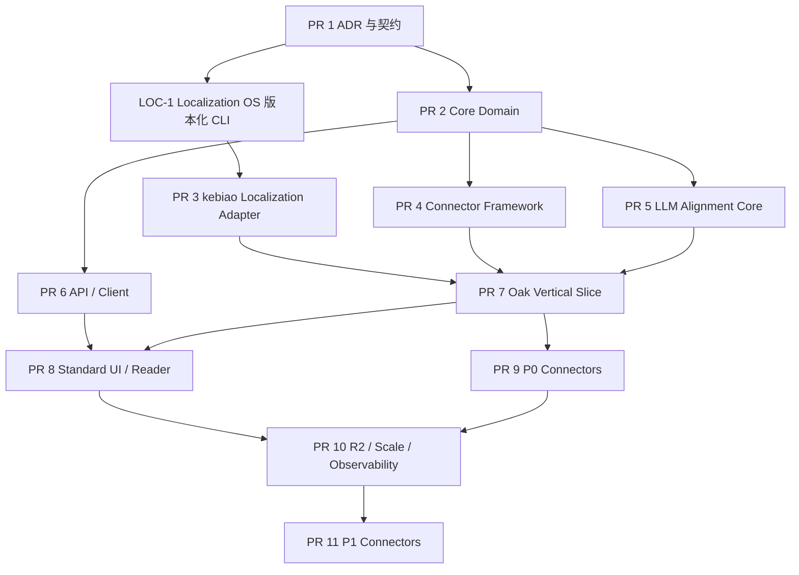

# 以课标为中心的简体中文 Learning Resources 全流程蓝图

> 状态：首批已实施并达到发布资格；完整流水线、七个 P0 来源、API / SDK / 页面已交付
> 制定日期：2026-07-23
> 首批发布：`lrg_20260723125753_1958e36c`；82 条简体中文内容、67 个资源、13 条课标细粒度关联
> 项目：`curriculum-standards-breakdown` / kebiao.org
> 公开语言：仅 `zh-Hans-CN`
> 公开交付：结构化纯文本优先，不以 PDF 为产品形态
> 审核政策：不设置逐条人工审核或人工发布步骤；保留自动许可、契约、语言、证据和一致性硬校验

---

## 0. 首批实施结果

- 已接入第一梯队全部七个来源：Oak、Book Dash、African Storybook、Siyavula、CS Unplugged、MDN 中文网、Raspberry Pi Learning。
- 已建立六实体 canonical model、来源注册表、许可决策、不可变 generation、自动翻译与 QA、LLM 关联、独立 critic、发布资格审计和原子切换。
- 当前公开 generation 包含 139 个上游资源、536 个片段、82 条通过质量门的简体中文内容；67 个不同资源可公开阅读。
- 七个来源均至少有一条可公开简体中文内容；分布为 MDN 30、Siyavula 12、African Storybook 10、Book Dash 10、CS Unplugged 10、Raspberry Pi Learning 8、Oak 2。
- 已发布 13 条具体课标关联，覆盖七个来源；每条关系均绑定真实 `learning_component_id`、当前中文译文版本与逐字证据。
- 已完成标准 → 资源和资源 → 标准的双向 API、SDK、静态投影、资源馆、结构化阅读页、fragment 深链与标准详情页资源区。
- 2 条 Raspberry Pi 扩展翻译未通过自动 QA，已进入隔离且未进入公开投影；发布资格审计错误数为 0。

## 1. 决策结论

这个方向可行，而且比继续把教材馆做大更符合 kebiao 的长期定位。

核心关系应调整为：

```text
课程标准 Standard
  └─ 可教学小能力 LearningComponent
       └─ 多种教学作用的 LearningResource
            ├─ 解释
            ├─ 示例
            ├─ 探究
            ├─ 练习
            ├─ 评价
            ├─ 补救
            ├─ 拓展
            └─ 教师支持
```

教材不是消失，而是通过 adapter 成为 `LearningResource` 的一种。教材仍保留版次、单元、页码和原书证据；开放课程、活动、故事、例题、法规、词典条目等不再被迫伪装成教材。

公开产品不展示来源 PDF 的复刻页，而展示经过结构化、简体中文化和课标关联后的可读内容。PDF、DOCX、EPUB 或网页只是上游载体；它们是否长期保留由来源的可重建性决定，不进入公开契约。

### 1.1 必须保留的现有基础

- 9 个学科、2025 条原子化课标和统一编码不改写。
- `official_text`、来源字段和课标正文 hash 仍是事实层。
- `learning_components` 继续作为教学资源关联的最小目标。
- 现有教材 `curriculum_alignments` 和 L1–L5 证据等级继续服务教材，不扩成通用资源关系。
- 现有 LLM 教材对齐器的稳定输入 hash、结构化输出、逐字引文、真实 component ID、断点续跑和审计机制应泛化复用。

### 1.2 新的不变量

1. 所有公开标题、摘要、正文、提示和理由必须是简体中文。
2. 公开 locale 固定为 `zh-Hans-CN`；代码、公式、URL、专名缩写可按 allowlist 保留拉丁字符。
3. 原文与简体中文译文必须分层保存，不能用译文覆盖原始证据。
4. 资源必须先关联 `learning_component_id`，再由 component 反向归属 Standard。
5. 资源更新不能迫使 2025 个 capability graph sidecar 全量重建。
6. 通用资源不能使用教材专属的 `edition_id`、PDF 页、印刷页或 bbox 契约。
7. 任何自动关联都必须保存当前译文中的逐字证据和 source/localized hash。
8. 不设置人工批准流程；未通过机器硬校验的记录进入 quarantine，不进入公开投影。
9. 翻译属于改作。内部可保留更多来源，但公开简中译文必须通过逐项许可决策。
10. 纯文本化后如果资源失去关键图、地图、乐谱或操作材料，必须显式标记 `visual_dependency=required`，不能伪装成完整资源。

### 1.3 v1 明确不做

- 不把所有上游 PDF 搬到网站。
- 不先建设图片、视频、音频、地图、乐谱或互动模拟播放器。
- 不把 foreign grade 与中国年级直接等同。
- 不把 foreign curriculum alignment 当成中国课标映射。
- 不把相同主题或相同年级视为语义关联。
- 不一次接入所有 OER 来源。
- 不在 v1 引入第二套图数据库、CMS 或搜索基础设施。
- 不把本地 Curriculum Localization OS 的 PDF/bbox/render 代码带入 kebiao。

---

## 2. 目标用户体验

### 2.1 从 Standard 出发

标准详情页现有“教学资源即将上线”占位区替换为真实资源区：

- 默认按 `解释 / 示例 / 探究 / 练习 / 评价 / 补救 / 拓展 / 教师支持` 分组。
- 可按 learning component 筛选。
- 每张卡显示简体中文标题、用途、适用年级、预计用时、来源和许可。
- 显示“为什么与该 component 相关”和一段逐字证据。
- 点击直接进入对应 fragment，而不是资源首页或 PDF 第一页。
- 同一资源对多个 component 的重复关系在展示层合并，不重复铺卡。

### 2.2 纯文本资源阅读器

资源页不是通用 PDF viewer，而是结构化文章阅读器：

- 左侧或移动端抽屉显示目录。
- 正文支持标题、段落、列表、表格、公式、代码、活动步骤、例题、问题、选项、答案、提示框、引用和术语。
- 支持字号、行宽、专注模式、打印友好、复制和深链。
- 从某条 Standard 进入时，高亮直接构成对齐证据的 fragment。
- 右侧或页尾反向显示关联 Standard、learning components 和教学作用。
- 来源、作者、原始链接、许可、改编/翻译声明始终可见。
- `visual_dependency=required` 时，在正文相应位置显示明确缺件提示。

### 2.3 从资源反向进入课标

每个资源和 fragment 都必须支持：

```text
Resource
  → 对应 Standards
  → 对应 Learning Components
  → 关系类型
  → 逐字证据
  → 机器关联方法与版本
```

正向和反向不是两套数据，由同一 canonical alignment 投影生成。

---

## 3. 总体架构


### 3.1 仓库边界

#### kebiao 主仓库负责

- 来源登记与 connector。
- 稳定 ID、版本、hash 和 lineage。
- 许可与公开决策。
- 结构化纯文本模型。
- 简中任务导出和结果导入。
- 课标候选召回、component 级 LLM 关联和独立确定性证据校验。
- 自动质量门、公开索引、API、SDK 和 UI。

#### Curriculum Localization OS 负责

- 英文 → 简体中文翻译。
- 繁体中文 → 简体中文和大陆教育术语本地化。
- glossary、translation memory、provider cache。
- 结构、编号、公式、数字、URL 和代码守恒检查。
- 原文—译文语义一致性检查。
- 输出版本化 `LocalizedVariant` JSONL。

#### 明确禁止

- Localization OS 不抓取来源、不判断许可、不生成 kebiao ID、不关联课标。
- kebiao 不读取 Localization OS 内部工作目录。
- 两个仓库不共享可变数据库，只交换带 schema version 的 JSONL artifact。
- kebiao 的前端构建不依赖 Python 运行时。

---

## 4. 通用数据模型

建议新增独立模块：

```text
packages/curriculum-core/src/learning-resources/
├── types.ts
├── schemas.ts
├── ids.ts
├── license.ts
├── indexes.ts
└── repository.ts
```

### 4.1 `SourceSnapshot`

记录“本次究竟从哪里、取到了什么”：

```text
snapshot_id
source_id
upstream_id
canonical_url
retrieved_at
source_revision
etag / last_modified / git_commit
media_type
payload_hash
extractor_name
extractor_version
retention_policy
upstream_status
```

`retention_policy`：

- `metadata_only`：仅限内容寻址且能按不可变 commit/revision 重建的 Git/API 来源。
- `retain_canonical_text`：保存原始 JSON/HTML/Markdown/Wikitext。
- `ephemeral_binary`：PDF/DOCX/EPUB 只保留到抽取和验收完成。
- `retain_private_binary`：上游不稳定或不可重下时，仅在 X9/R2 private 保留。

### 4.2 `LearningResource`

```text
resource_id
source_id
upstream_id
resource_version_id
canonical_url
resource_type
audience
source_language
title_source
title_zh
description_zh
source_curriculum
source_subject
source_grade_range
mapped_subject_slugs[]
mapped_china_stage
mapped_china_grade_scope
mapping_method / mapping_version / mapping_status
estimated_minutes
pedagogical_roles[]
safety_profile
rights_profile_id
attribution
source_revision
source_hash
delivery_mode=structured_text
visual_dependency
publication_status
```

`resource_type` 初始枚举：

```text
lesson | explanation | worked_example | activity
practice_set | assessment | story | primary_source
reference | teacher_guide | glossary_entry | dataset
```

`safety_profile` 保存 `risk_level`、年龄限制、材料、成人监督、原始安全警告及其 block IDs。
化学实验、电气、工具、运动、健康或户外活动若无法保留原始安全条件，自动 quarantine；
不能因“只展示文本”而删除安全警告。

### 4.3 `ResourceFragment`

Fragment 是翻译、对齐和深链的最小内容单元：

```text
fragment_id
resource_id
upstream_fragment_id
parent_fragment_id
fragment_type
order
breadcrumb[]
source_text
source_text_hash
source_locator
blocks[]
visual_dependency
rights_profile_id
attribution_id
license_scope
third_party_exception_refs[]
```

每个 block 必须有稳定 `source_block_id`、自己的 source hash、来源定位和可选的
`rights_profile_id / attribution_id / third_party_exception_refs`。公开 block 初始类型：

```text
heading | paragraph | ordered_list | unordered_list
table | formula | code | quotation | callout
worked_example | activity_step | question | choice
answer | explanation | glossary | citation
```

不能把上游 HTML/CSS 直接传给前端。connector 或 extractor 必须输出受控 block；前端只渲染白名单类型。

### 4.4 `LocalizedVariant`

```text
variant_id
variant_version_id
fragment_id
source_text_hash
target_locale=zh-Hans-CN
target_blocks[]
target_text_hash
translation_method
model_version
prompt_version
glossary_version
translation_memory_version
opencc_config
derived_license_id
qa_status
qa_findings[]
```

每个 target block 必须保存：

```text
target_block_id
source_block_ids[]
mapping_mode=one_to_one|split|merge
target_block_hash
canonical_plain_text
```

这样才可以自动检查漏段、错并段和翻译后证据漂移。

### 4.5 `LearningResourceAlignment`

通用资源关系必须与教材 `curriculum_alignments` 分开：

```text
alignment_id
standard_code
learning_component_ids[]
resource_id
fragment_id
relation_type
pedagogical_role
source_evidence_quote
evidence_quote_zh
rationale_zh
source_block_ids[]
target_block_ids[]
source_text_hash
target_text_hash
variant_version_id
source_standard_hash
capability_graph_schema_version
capability_graph_method
learning_component_set_hash
model_version
prompt_version
input_hash
critic_version
review_status=machine_checked
publication_status
alignment_version_id
```

`relation_type` 复用现有严格语义：

```text
supports | practices | assesses | mentions | contextualizes
```

`pedagogical_role` 描述教师如何使用资源：

```text
explain | model | explore | practice
assess | remediate | extend | teacher_support
```

不要使用 `teaches`，除非来源自身有明确官方 crosswalk。

### 4.6 稳定 ID

```text
resource_id
  = lr_ + sha256(source_id + upstream_id)[0:24]

resource_version_id
  = lrv_ + sha256(resource_id + canonical_source_payload)[0:24]

fragment_id
  = lrf_ + sha256(resource_id + upstream_fragment_id_or_semantic_path)[0:24]

variant_id
  = lrz_ + sha256(fragment_id + target_locale)[0:24]

variant_version_id
  = lrzv_ + sha256(
      variant_id + source_text_hash + canonical_target_blocks_hash +
      provider + model + prompt + glossary + translation_memory +
      opencc_config + pipeline_version + schema_version
    )[0:24]

alignment_id
  = lra_ + sha256(
      standard_code + sorted(component_ids) + fragment_id +
      relation_type + pedagogical_role
    )[0:24]

alignment_version_id
  = lrav_ + sha256(
      alignment_id + variant_version_id + source_standard_hash +
      capability_graph_schema_version + capability_graph_method +
      learning_component_set_hash + aligner_model + aligner_prompt +
      critic_model + critic_prompt + input_hash
    )[0:24]
```

Identity 与 version 必须分离。随机模型即使输入相同也可能输出不同正文，因此
`variant_version_id` 必须包含 canonical 输出 hash 和全部 producer 版本；
`alignment_version_id` 必须锚定当前 component set。内容 hash 是版本，不是长期身份。
没有官方 ID 的来源使用稳定路径/书名—版本等 canonical key 作为 upstream ID；
不能让一次运行的顺序生成 ID。

所有 hash 输入先经过同一 canonical JSON 规则：Unicode NFC、LF 换行、字段排序、
数组的语义排序规则和时间/运行目录等非语义字段剔除。若上游 fragment path 被改名，
用 `aliases[] / supersedes / tombstone / redirect_to_fragment_id` 保住旧深链；不能把历史
fragment 静默删除。

---

## 5. 许可与公开策略

代码许可证和资源内容许可证必须分开保存。GitHub 仓库标注 MIT，不代表仓库内课程正文也是 MIT。

### 5.1 自动 rights decision

| 来源条款 | 内部摄取 | 公开简中译文 | 决策 |
|---|---:|---:|---|
| Public Domain / CC0 | 是 | 是 | `publish_translation` |
| CC BY / OGL | 是 | 是，保留署名和变更声明 | `publish_translation` |
| CC BY-SA | 是 | 是，衍生版本保持兼容 SA | `publish_translation_share_alike` |
| CC BY-NC / BY-NC-SA | 是 | kebiao.org 默认不发布；只有显式非商业 deployment profile 才可发布 | `private_or_noncommercial` |
| CC BY-ND / BY-NC-ND | 是 | 否，翻译是改作 | `link_only` |
| All Rights Reserved / Unknown | 可作为个人内部来源 | 否 | `private_only` |
| 混合许可/第三方例外 | 逐 fragment/asset 判断 | 只发布被明确覆盖部分 | `item_level_decision` |

即使当前主要给个人使用，也应现在建立这一层。它不会阻止内部处理，却避免未来公开网站或商业化时重新清洗全部数据。

Rights gate 分两次执行：

1. fetch 前做 source access preflight，判断是否允许自动取得和内部保存；
2. structure extraction 后，逐 resource、fragment、block 和 asset 解析实际许可与第三方例外，
   再决定是否允许翻译和公开。

`deployment_rights_mode` 必须写入 generation，取值固定为
`public_commercial | public_noncommercial | private`。不能依赖当前域名、环境变量或“暂时个人用”
来隐式决定 NC 内容能否发布。

### 5.2 `RightsProfile` 最低字段

```text
license_id
license_url
rights_holder
creators[]
attribution_text
derivatives_allowed
commercial_use_allowed
share_alike_required
source_notice
third_party_exceptions[]
public_decision
decision_reason
checked_at
policy_version
```

每个 `LocalizedVariant` 还必须绑定：

```text
rights_decision_id
output_license_id / output_license_url / output_license_version
adaptation_notice
attribution_snapshot_hash
derived_license_id
```

系统维护显式的 license compatibility matrix，分别处理 CC BY-SA 2.5、CC BY-SA 4.0、
OGL 和其他版本；不能只靠 `share_alike_required=true`。未知或不兼容组合进入 quarantine。

公开页面自动生成：

```text
改编/翻译自 {title}，作者 {creators}，来源 {url}，
依据 {license} 使用。简体中文翻译与结构化整理由 kebiao 完成。
```

---

## 6. 全部简体中文的处理链

### 6.1 语言路由

```text
已是 zh-Hans
  → 标点、术语、年级表达规范化

zh-Hant / zh-TW
  → OpenCC tw2sp
  → 台湾/港澳教育术语本地化
  → LLM 语义忠实度与表达修复

English / other
  → 保护公式、代码、URL、编号和引用
  → 按 block 翻译
  → 学科 glossary + translation memory
  → 独立 LLM critic
  → 简体中文与结构守恒审计
```

v1 的 `localization_mode=faithful_translation`：只做语言、标点和明确的教育术语规范化，
不替换外国人名、案例、事实、货币、计量、课程声明或文化背景。真正的中国情境改编必须生成
独立 `adapted_variant`、新的改作声明和版本，不能混在翻译任务里。

### 6.2 简体中文不是只做 OpenCC

台湾来源至少需要处理：

```text
國小 → 小学
國中 → 初中
資訊科技 → 信息科技
常態分配 → 正态分布
質量（quality 语境）→ 质量
質量（mass 语境）→ 质量，但须由学科上下文确认
```

术语表按学科和学段版本化，不能继续使用一个全局小词表。

### 6.3 自动语言质量门

- `target_locale` 必须是 `zh-Hans-CN`。
- 对公开文本再次执行同一 OpenCC 配置，结果必须幂等。
- 不得存在未解释的完整英文段落。
- 英文残留只允许公式、代码、URL、计量单位、规范缩写和专名 allowlist。
- 标题、题号、选项、答案、引用、数字、公式、URL 和表格行列必须守恒。
- 每个 source block 必须能映射到 target block；不能静默漏段。
- LLM critic 必须判断无增写、无删减关键条件、无中国课程语境误植。
- 译文变化后，旧 alignment 自动失效并重建。

---

## 7. 课标关联策略

### 7.1 候选召回

先用现有确定性检索能力，不急于引入向量库：

1. 已完成映射的 `mapped_subject_slugs` 硬过滤；未完成映射时使用 source subject + 宽学科候选，
   不覆盖 provenance。
2. 只有 `mapping_status=verified` 的中国学段/年级映射才作硬过滤。foreign grade
   未验证时只做 broad-stage recall，由裁决器检查适龄性，不能先伪造中国年级再过滤。
3. resource type 与 pedagogical role 过滤。
4. 简体中文标题、breadcrumb、正文与标准/component 字段的加权词项召回。
5. 每个 fragment 只把小规模真实候选交给 LLM。

只有离线评测证明 Recall@K 明显改善后，再加入 BGE-M3/FlagEmbedding 作为可插拔召回信号；embedding 不能绕过学科、学段、许可和真实 ID 约束。

### 7.2 LLM 语义裁决

从现有教材对齐器抽取通用契约：

- 每个候选必须返回 `accept / reject / abstain`。
- LLM 只能选择输入中真实存在的 Standard 和 component ID。
- accept 必须选择一个 fragment、连续逐字 `source_evidence_quote` 和连续逐字
  `evidence_quote_zh`；两者通过 block mapping 指向同一语义证据。
- 单一 quote 必须足以支持被选中的全部 components。
- 共享泛词、背景主题、相邻知识、仅有答案都不能单独 accept。
- relation type 由 fragment 正在执行的功能决定，不由课标措辞猜测。
- 不生成未经校准的 confidence/score。
- 保存 provider、model、prompt、schema、input hash 和 token/cost。
- workset 必须保存当前 `capability_graph_schema_version`、`capability_graph_method`
  和 `learning_component_set_hash`；任一变化时旧关系全部 stale。

### 7.3 独立 LLM critic

不采用人工发布门，改用第二个独立裁决步骤：

- 检查对象、动作、条件和范围是否被完整覆盖。
- 检查中国学段是否合理。
- 检查译文是否改变了原文的教学要求。
- 检查 source quote → target quote → learning component 的跨语种蕴含。
- 检查 relation type 与 pedagogical role。
- 检查是否存在更具体、可支配的候选，去掉宽泛重复关系。
- 输出 `confirm / reject / abstain`，不得重写第一阶段理由。

aligner 与 critic 使用不同 model ID 和独立 prompt/version；组合本身写入评测矩阵。
只有 aligner accept、critic confirm，且该 source×subject×relation×model/prompt 组合
具备自动发布资格，才进入 public projection。其他结果保留在 run artifact，便于重跑，
但不要求人工处理。

### 7.4 自动发布资格与 generation promotion

没有逐条人工发布门，但也不能让未校准模型组合直接公开。建立 machine-readable
`publication_eligibility_matrix.json`，key 至少包含：

```text
source_id
subject_slug
relation_type
retrieval_version
aligner_model + prompt_version
critic_model + prompt_version
```

每个组合先在冻结的 positive/negative/abstain 回归集上达到：

- quote、ID、hash 和许可契约通过率 100%；
- retrieval Recall@12 ≥ 0.95；
- accepted precision ≥ 0.95，且 95% Wilson lower bound ≥ 0.85；
- critical false positive = 0；
- 相关案例上的 abstain rate ≤ 0.70；
- 至少 50 个裁决案例且至少 15 个预期 accept。

模型、prompt、glossary、retrieval 或 component graph 变化后，该组合回到 `shadow`。
generation promotion 状态机：

```text
built → evaluated → eligible → current
```

未达阈值、覆盖异常跳变或与上一代关系 diff 超过该组合既定预算时自动 quarantine，
继续保留上一代 CURRENT。这是一次性/回归机器校准，不是 production item 人工审核。

### 7.5 重复关系规范化

canonical key：

```text
standard_code
+ sorted(learning_component_ids)
+ resource_id
+ fragment_id
+ relation_type
+ pedagogical_role
```

若同一证据由多个 run 重复发现，只保留当前 source/translation/prompt hash 对应的一条 canonical relation；展示层再按 resource 合并 components。

---

## 8. 首梯队来源与接入顺序

### 8.1 P0：优先跑通

| 来源 | 主要价值 | 接入格式 | 简中路径 | 关键限制 | 难度 |
|---|---|---|---|---|---:|
| [Oak Curriculum API](https://open-api.thenational.academy/bulk-download) | 全学段多学科、lesson、quiz、misconception、prior knowledge、transcript | bulk JSON/API | 英译简中 | OGL；逐课保存 attribution 与第三方例外 | 低 |
| [Siyavula](https://www.siyavula.com/read) | 初中数学、科学长文本和例题 | 无品牌 EPUB/XHTML | 英译简中 | 只收 CC BY 版本；排除 BY-ND 品牌版 | 低 |
| [Book Dash](https://github.com/bookdash/bookdash-books) | 儿童阅读故事 | Git Markdown + YAML | 英译简中 | CC BY 4.0；保留作者/插画/译者 | 很低 |
| [African Storybook](https://github.com/global-asp/asp-source) | 分级故事、跨语言文本 | Git Markdown | 英译简中 | 每篇单独 CC BY 或 BY-NC | 很低 |
| [CS Unplugged](https://github.com/uccser/cs-unplugged) | 信息科技活动、学习目标、教学步骤 | Markdown/YAML/VTT | 优先已有 `zh_Hans`，再规范化 | 正文 CC BY-SA；第三方文件另查 | 低 |
| [MDN 中文内容](https://github.com/mdn/translated-content) | 初中信息科技拓展、Web 基础 | Markdown + front matter | 已有 `zh-CN`，做术语审计 | 正文 CC BY-SA 2.5，代码通常 CC0 | 很低 |
| [Raspberry Pi Learning](https://github.com/raspberrypilearning) | 项目式信息科技活动 | 每项目 Git Markdown/YAML | 英译简中 | 逐仓读取 `LICENCE.md` | 低 |

### 8.2 P1：P0 稳定后接入

| 来源 | 原因 |
|---|---|
| [台湾教育大市集](https://market.cloud.edu.tw/developzone/) | API 与 TW LOM 很好，但要申请 key，附件格式和逐项许可高度异构；只收允许改作的 CC BY/BY-SA。 |
| [OpenSciEd](https://openscied.org/curriculum/) | 科学资源质量高；初中多为 CC BY 4.0，但缺少统一内容 API，常见 Google/Office/PDF 文件。 |
| [Open Up Resources](https://access.openupresources.org/curricula) | 数学/ELA 丰富；正文与 assessment/品牌/图片许可不同，必须做 item-level filter。 |
| [StoryWeaver](https://open.storyweaver.org.in/) | story UUID 与开放后端结构很好，但生产站自动访问可能被 Cloudflare 拦截，应优先申请 bulk/API 或复用公开 chef。 |
| [中文维基文库](https://zh.wikisource.org/) | 语文、历史与道德法治价值高，但页面级公版/许可、模板清洗和 revision 处理比 P0 复杂。 |
| [全国法律法规数据库](https://flk.npc.gov.cn/) | 权威简中正文适合道德与法治，但须先重新验证 2025 改版后的端点、访问方式和数据库编排边界。 |
| Appropedia / Wikibooks | MediaWiki 接入稳定，但模板清洗、语境改写和 mixed assets 复杂。 |

### 8.3 Micro-resource 实验批次

以下数据技术上容易接入，但不是完整 lesson/activity，不计入首阶段
`standards_with_any_resource_rate`，单独报告 micro-resource coverage：

| 来源 | 用途 | 限制 |
|---|---|---|
| [CC-CEDICT](https://cc-cedict.org/editor/editor.php?handler=Download) | 词汇、拼音、释义 | CC BY-SA 4.0；不能把词典命中当成能力达成 |
| [Tatoeba](https://tatoeba.org/downloads) | 例句与翻译关系 | 句子与音频许可分开；v1 不收音频 |
| [Hanzi Writer Data](https://hanziwriter.org/docs.html) | 未来汉字笔画互动 | 纯文本模式教学价值有限，等互动组件后再公开 |

### 8.4 P2：延后

- NASA、USGS、NOAA：只在需要具体科学解释/活动时做精选 adapter，不做全站 crawler。
- Smithsonian、The Met、Library of Congress：核心价值是图像与文物，纯文本阶段价值折损。
- Wikimedia Commons、Openverse：适合素材发现，不是文本学习资源主体。
- Mutopia、OpenScore：需要乐谱渲染器后再接。

### 8.5 推荐纵向样本顺序

1. Oak：验证 JSON → 英译简中 → component 对齐 → API/UI。
2. Book Dash + African Storybook：验证 Git Markdown、分页故事和逐篇许可。
3. Siyavula：验证 EPUB、长文、表格与公式。
4. CS Unplugged + MDN：验证已有简中、Git 增量同步和 ShareAlike。
5. 再进入台湾教育大市集、OpenSciEd、Open Up、StoryWeaver。
6. 法规 + Wikisource：验证中文权威正文、revision 和 citation。
7. 最后单独试验 CC-CEDICT、Tatoeba 和 Hanzi micro-resources。

---

## 9. 开源项目选型

### 9.1 建议成为核心依赖

| 项目 | 用途 | 许可证 | 决策 |
|---|---|---|---|
| [docling-project/docling](https://github.com/docling-project/docling) | DOCX/EPUB/PDF/HTML 等统一结构化抽取和 provenance | MIT | 默认文档 extractor；PDF 只是 fallback |
| [adbar/trafilatura](https://github.com/adbar/trafilatura) | 网页主体文本和 metadata 抽取 | Apache-2.0 | HTML connector 默认 helper |
| [BYVoid/OpenCC](https://github.com/BYVoid/OpenCC) | 繁体到简体及台湾短语转换 | Apache-2.0 | 简中流水线必选 |
| [ekzhu/datasketch](https://github.com/ekzhu/datasketch) | MinHash/LSH 近重复检测 | MIT | 规模化阶段启用 |
| [KaTeX](https://github.com/KaTeX/KaTeX) | 安全渲染保留下来的 LaTeX 公式 | MIT | 数学/科学资源进入 UI 时启用 |
| 现有 Ajv/Zod | JSON Schema 与运行时契约 | 已在项目内 | 继续使用 |
| 现有 Promptfoo/eval harness | 翻译与 LLM 对齐回归 | 已在项目内 | 继续使用 |

### 9.2 参考架构，不直接整体引入

| 项目 | 借鉴点 |
|---|---|
| [learningequality/ricecooker](https://github.com/learningequality/ricecooker) | connector → channel tree → stable IDs → validation 的插件式架构 |
| [oaknational/oak-open-curriculum-ecosystem](https://github.com/oaknational/oak-open-curriculum-ecosystem) | OpenAPI codegen、typed SDK、hybrid search、知识图谱和 attribution |
| [WordPress/openverse-catalog](https://github.com/WordPress/openverse-catalog) | provider adapter、license metadata、增量 catalog |
| [opensalt/opensalt](https://github.com/opensalt/opensalt) | 稳定标准 ID、CASE 关系和正反索引 |
| `oer-mcp` / `standardgraph` | OER chunk、license partition 和跨标准候选召回；不把其课程内容当中国课标真值 |
| [twang2218/law-datasets](https://github.com/twang2218/law-datasets) | 法规列表、详情、DOCX/HTML 文本化；必须重新验证 2025 改版后的官方端点 |

### 9.3 条件启用

| 项目 | 条件 |
|---|---|
| [FlagOpen/FlagEmbedding](https://github.com/FlagOpen/FlagEmbedding) / BGE-M3 | 只有离线 eval 证明 candidate recall 显著优于现有确定性检索才启用 |
| [PaddleOCR](https://github.com/PaddlePaddle/PaddleOCR) | P1 中只剩扫描件且文本价值足够时 |
| [MinerU](https://github.com/opendatalab/MinerU) | 复杂中文 PDF 最后 fallback；先单独复核其许可证与运维成本 |
| [Unstructured](https://github.com/Unstructured-IO/unstructured) | Docling 对特定格式失败且 fixture 证明更可靠时 |
| [Scrapy](https://github.com/scrapy/scrapy) | 无 API、无 Git、无 feed，且站点条款允许时 |
| [Pagefind](https://github.com/Pagefind/pagefind) | 资源库需要独立简中全文检索且现有搜索无法满足时；它不是课标语义关联器 |

### 9.4 已评估但首版不引入

| 项目/方案 | 暂不引入的原因 |
|---|---|
| [dlt](https://github.com/dlt-hub/dlt) | API 增量能力很好，但当前主仓库是 Node，首批 connector 仍需大量来源专用规范化；先用小型 adapter，来源数量显著增长后再评估 |
| [DVC](https://github.com/treeverse/dvc) | 与项目现有 immutable generation + R2/CURRENT 形成第二套版本真值；首版只保留一套 generation 机制 |
| [Instructor](https://github.com/567-labs/instructor) | 项目已有 Responses Structured Outputs + Ajv 的严格 LLM 契约，不再增加第二套结构输出框架 |
| unified/remark/rehype/MDX runtime | canonical blocks 直接由白名单 React renderer 呈现更安全；不编译外部来源提供的任意 MDX |
| Qdrant/OpenSearch/Milvus/Meilisearch | 需要在线服务或引入额外许可/运维；2025 条课标和首批静态 sidecar 不需要 |

不要同时为同一格式引入多个默认 parser。默认链为：

```text
API/Git native structure
→ Trafilatura（HTML）
→ Docling（DOCX/EPUB/复杂文档）
→ PaddleOCR/MinerU（扫描 fallback）
```

---

## 10. 存储与公开投影

### 10.1 Git 中保存

```text
data/learning-resources/
├── schemas/
├── source_registry.json
├── license_registry.json
├── policies/
│   ├── language_policy.json
│   ├── license_policy.json
│   ├── subject_mapping.json
│   └── grade_mapping.json
└── library-state/
    ├── CURRENT.json
    └── generations/<generation_id>/
        ├── catalog.lock.jsonl
        ├── alignment.lock.jsonl
        ├── coverage.snapshot.json
        └── COMMIT.json
```

### 10.2 X9 / R2 保存

```text
learning-resources/
├── snapshots/<source>/<version>/
├── normalized/resources/
├── normalized/fragments/
├── localized/zh-Hans-CN/
├── alignment-runs/
├── quarantine/
└── generations/<generation_id>/
```

- X9 作为批处理工作区和可选私有归档。
- R2 保存公开 resource body 和需要跨设备读取的 immutable generation。
- R2 credentials 只放环境变量/secret，不进入 Git 或 run artifact。
- 原始 PDF 不进入公开 bucket；如需保留，使用 private prefix 或仅留 X9。
- 对可变 API/网页至少保留原始 response payload、关键 headers、payload hash 和 extractor
  version；仅保存 URL/metadata 不足以重建。

### 10.3 public sidecar

```text
public/data/learning-resources/
├── manifest.json
├── catalog/index.json
├── by-standard/<standard_code>.json
├── by-resource/<resource_id>.json
└── coverage.json
```

资源正文增长后：

```text
R2 public content-addressed body
  /learning-resources/<generation_id>/resources/<resource_version_id>-<body_hash>.json

Git/Vercel lightweight index
  /public/data/learning-resources/by-standard/<code>.json
```

标准页只懒加载 `by-standard`；点击资源后再取 body。不能把资源数组写回 2025 条 Standard 基础记录或 capability graph sidecar。

每个 index/body locator 必须同时携带 `generation_id`、`resource_version_id`、body hash 和
ETag。客户端从 index 读取 immutable body URL，不能再去查 R2 上的 mutable CURRENT，
从而避免 Git index 与 R2 body 跨代错配。

### 10.4 Generation、撤稿和 purge

storage-neutral generation 语义必须在 Core PR 建立，而不是等接 R2：

```text
built → evaluated → eligible → current
```

发布顺序：

```text
生成 immutable generation
→ 上传并逐对象校验
→ 生成指向精确 generation/body hash 的 index
→ 部署并 smoke test
→ 最后可选更新 CURRENT
```

`scripts/build-public-data.mjs` 当前会重建/清空 `public/data`，所以 Core PR 必须将
learning-resources 正式接入顶层 build、manifest、data_version 和 validator；不能依赖一个
独立脚本生成稍后会被删除的目录。

撤稿不是覆盖 immutable 对象。Resource/Fragment 增加
`revoked_at / revocation_reason / tombstone / replacement_id`，同时维护 denylist。公开撤稿流程：

```text
生成不含撤稿内容的新 generation
→ 发布 tombstone/redirect
→ 切换 index
→ 删除不再允许保留的 R2 对象
→ purge CDN/cache
→ smoke test 旧深链不再返回正文
```

`visual_dependency=required` 的 fragment 默认不能以“完整资源”公开；只能明确标为
`excerpt_incomplete` 或 link-only，直到必要视觉材料也能合规交付。

---

## 11. API 与客户端

建议新增：

```text
GET /api/v1/learning-resources
GET /api/v1/learning-resources/:resource_id
GET /api/v1/learning-resources/:resource_id/fragments/:fragment_id
GET /api/v1/learning-resources/:resource_id/standards

GET /api/v1/standards/:code/learning-resources
GET /api/v1/standards/:code/learning-resources?component_id=...
GET /api/v1/standards/:code/learning-resources?role=practice
```

要求：

- 独立 `FileLearningResourceRepository`，通过 app dependency injection 接入。
- `packages/curriculum-client` 同步增加 typed methods。
- OpenAPI 声明分页、排序、过滤、缓存和错误。
- 正反向 API 由 canonical alignment 派生，数量必须对称。
- resource body 使用 ETag/content hash。
- 标准初始接口和前端首包不能因资源数量增长而膨胀。
- API 只返回 `PublicResourceProjection`，不能把 `title_source` 或内部原文误投影到前台。

所有公开可翻译字段统一使用：

```text
LocalizedText {
  locale=zh-Hans-CN
  text
  text_hash
  qa_status
  variant_version_id
}
```

包括 title、description、breadcrumb、body、rationale、notice 和 UI 可见 attribution。
原作者名、作品原名、法定署名只有以
`verbatim_legal | proper_name | code_or_formula` 明确标记时才可例外，并在 UI 标注“原文”。
标题和摘要要么是固定 metadata fragments，要么属于 `LocalizedResourceMetadata`；
不得绕过本地化的 source hash、model、glossary、许可和 QA lineage。

---

## 12. UI 文件规划

建议保持现有 feature boundary：

```text
src/features/learning-resources/
├── StandardResourceSection.jsx
├── ResourceRoleTabs.jsx
├── ResourceCard.jsx
├── ResourceEvidenceDrawer.jsx
├── ResourceProvenance.jsx
├── ResourceArticle.jsx
├── ResourceBlockRenderer.jsx
└── learningResourceApi.js

src/pages/
├── LearningResourceLibraryPage.jsx
└── LearningResourceDetailPage.jsx
```

第一版不需要第三个“reader”路由；详情页本身就是纯文本阅读器。只有当教师编辑、批注或课堂投屏需求出现时，再拆分阅读模式。

设计要求：

- 与 StandardDetailPage 的现有视觉系统一致，不创建平行设计语言。
- 桌面端正文最佳行宽约 68–76 个汉字，移动端单栏。
- role tabs 可键盘操作并有无 JavaScript/读屏 fallback。
- evidence drawer 显示 component、逐字证据和关联理由。
- 来源/许可不可折叠到用户难以发现的位置。
- 公式和表格必须在窄屏可用。
- 所有资源异步加载都有 loading、empty、error、stale 状态。
- 新路由必须同步更新 `src/App.jsx`、`src/config/uiV2Flags.js`、
  `scripts/validate-design-contract.mjs`、UI rollback contract、route telemetry 和 E2E。
  当前 validator 固定 route keys/count；若不更新这些契约，新增页面会直接让 CI 失败。
- API/UI 初次上线均由独立 feature flag 隔离；关闭 flag 后 Standard 页回到明确的空状态，
  旧 API 和教材功能不受影响。

---

## 13. 自动质量、评测和观测

### 13.1 契约与可重建性

- JSON Schema、Zod、Pydantic fixtures 跨语言一致。
- 相同 canonical 输入得到相同 identity；随机模型输出变化时必须产生新的 version/revision ID，
  不得覆盖同一 version。
- resource、fragment、variant、alignment 无孤儿。
- source hash 改变后旧 variant 和 alignment 自动过期。
- component graph schema/method/set hash 改变后旧 alignment 自动过期。
- 每个 generation 有 immutable manifest 和唯一 CURRENT 指针。
- connector 重跑不制造重复资源。

### 13.2 许可

- 100% 公开资源有 machine-readable license、source URL 和 attribution。
- 100% 公开 variant 有具体 output license、rights decision、adaptation notice 和
  attribution snapshot hash。
- ND、unknown 和 mixed-rights 未决内容不会生成公开译文。
- ShareAlike 输出携带兼容许可。
- 第三方例外不会被父资源许可证静默覆盖。

### 13.3 简体中文

- 100% 公开 variant 是 `zh-Hans-CN`。
- OpenCC 幂等率 100%。
- 未解释英文段落为 0。
- 数字、公式、URL、题号、选项和表格结构守恒。
- 每学科建立冻结 translation regression fixture。
- 本地化失败率、重试率、每千字成本和 cache hit rate 可观测。

### 13.4 Alignment

- 100% alignment 指向真实 Standard、component、resource 和 fragment。
- 100% `source_evidence_quote` 和 `evidence_quote_zh` 分别是当前 source/target block 的逐字子串。
- 100% source/target quote 通过 block mapping 和跨语种蕴含 critic。
- source/target/standard hash 和 model/prompt/input hash 完整。
- 同一 canonical key 无重复关系。
- accept/reject/abstain 冻结 eval 覆盖九学科。
- 不因同主题、同年级或 foreign standard link 自动 accept。
- 报告 component coverage，不只报告 Standard 有无资源。

### 13.5 教学完整性与安全

- `visual_dependency=required` 不进入完整资源列表。
- 活动的材料、步骤、警告、年龄和成人监督字段必须完整。
- 原文有安全警告而简中 variant 丢失时，构建失败。
- 法律、健康和实验性内容显示来源日期/版本，不让 LLM 生成额外权威声明。
- `risk_level=high` 默认仅 `teacher_support`，除非来源自身明确面向对应年龄学生。

### 13.6 产品指标

建议首要看：

```text
standards_with_any_resource_rate
components_with_any_resource_rate
components_with_explanation_rate
components_with_practice_rate
components_with_assessment_rate
role_diversity_per_standard
resources_with_reverse_alignment_rate
alignment_abstain_rate
localization_failure_rate
license_block_rate
stale_source_rate
```

不要把“抓取资源总数”当成功指标。

### 13.7 性能预算

- Standard 首屏不加载 resource body。
- 单个 `by-standard` sidecar 超过 128 KiB 时分页。
- resource body 按 fragment 或 content-addressed JSON 懒加载。
- 前端初始 JS bundle 不因阅读器增加重型 PDF/OCR 依赖。
- R2 响应带长期 immutable cache；index 用短 cache + ETag。

---

## 14. 实施所用 skills

### 已用于本蓝图

- `agent-reach`：GitHub/网页项目、API、格式和许可证检索。
- `ecc:blueprint`：冷启动实施包、依赖图、验收与逆向审查。
- `architecture-review`：主仓库、教材模块和本地翻译系统的边界审查。

### 实施阶段建议

| 工作包 | Skill |
|---|---|
| connector 与 API | `ecc:api-connector-builder`、`ecc:data-scraper-agent` |
| 数据/领域契约 | `api-contract-review`、`architecture-review` |
| LLM 翻译和关联成本 | `ecc:cost-aware-llm-pipeline` |
| 数据质量与覆盖 | `data-analytics:analyze-data-quality` |
| React 页面与阅读器 | `build-web-apps:react-best-practices` |
| E2E 与前端调试 | `build-web-apps:frontend-testing-debugging` |
| R2 generation/部署 | `cloudflare:cloudflare`、`cloudflare:wrangler` |
| PR、检查和合并 | `ecc:github-ops` |

每个实施工作包开始时再读取对应 `SKILL.md`；本蓝图不预先假定其命令或模板。

---

## 15. 依赖图与并行工作



契约 PR 合并后可并行：

- A：Localization OS 的 LOC-1 与简中 QA；它是另一个版本化仓库工作包，不与 kebiao PR 混合。
- B：Learning Resource Core 与 connector harness。
- C：LLM alignment 泛化与 eval。
- D：API/client 和 UI fixture 开发。
- E：许可、生成、R2 和数据质量审计。

真实上游大批量抓取、翻译和 apply 仍必须按 generation 串行 reconcile，不能让多个 writer 同时更新 CURRENT。

每个下方 PR 执行前都必须在 PR 描述中补齐五项冷启动信息：

```text
Prerequisites
Exact immutable inputs
Commands
Observable outputs
Rollback
```

共同回滚原则：API/UI 先受 feature flag 隔离；schema 至少保留上一代 reader；
connector 可按 `source_id` 单独撤销；generation 只有通过 promotion state machine 才能切 CURRENT。

### 15.1 冷启动、可观察输出与回滚矩阵

| 工作包 | 首个不可变输入 | 可观察输出 | 最小回滚路径 |
|---|---|---|---|
| PR 1 | 现有课标、教材和 public-data 契约的 commit SHA | canonical schemas、policy fixtures、ADR | 删除尚未被生产数据引用的新 domain；旧契约完全不变 |
| PR 2 | PR 1 schema digest + 固定 fixture generation | 可重建的 sidecars、manifest、COMMIT/CURRENT 测试 | 切回上一 schema reader 与上一 CURRENT；feature flag 不暴露新索引 |
| LOC-1 | PR 1 canonical schema + 固定 JSONL fixture | 可 pin 的 producer tag/commit、lockfile、artifact digest | kebiao 继续 pin 上一个兼容 producer；不覆盖旧 variant version |
| PR 3 | LOC-1 tag/commit + schema/artifact digest | 通过 consumer contract 的 localized variants | pin 回上一 producer/consumer 组合；拒绝不兼容 artifact |
| PR 4 | source registry fixture + frozen upstream response | snapshot、rights decision、localization queue | 按 `source_id` disable/denylist，并产生 tombstone；不改其他来源 |
| PR 5 | 当前 variant version + capability graph/version fixture | evaluated alignment generation、diff/cost/eval report | 恢复上一 eligible model/prompt/retrieval 组合与上一 CURRENT |
| PR 6 | 固定 public projection generation | OpenAPI、SDK fixture、五个只读端点 | 关闭 API feature flag；旧 API、课标和教材端点保持可用 |
| PR 7 | Oak 固定 bulk snapshot；无 key 时用 Book Dash 固定 commit | 第一个 shadow → eligible 的端到端 generation | 不 promotion shadow generation；删除该来源公开投影并保留上代 CURRENT |
| PR 8 | PR 6 fixture API + 一个 eligible generation | Standard 资源区、详情阅读页、E2E/无障碍报告 | 关闭 UI flag；路由表和 Standard 占位态按 rollback contract 恢复 |
| PR 9 | 每个 P0 来源自己的 commit/revision/response fixture | 独立 source generation、coverage 与 rights report | 单来源 denylist/tombstone；其他 connector 与 CURRENT 不受影响 |
| PR 10 | PR 2 的 storage-neutral immutable generation | R2 object manifest、上传校验、cache/CORS 报告 | storage adapter 切回本地/上一 generation；CURRENT 不指向半上传内容 |
| PR 11 | 每个 P1 来源独立冻结样本 | 20–50 条 shadow vertical sample 与 source report | 与 PR 9 相同，按 `source_id` 撤销且不连带回滚核心 |

“一键回滚”必须落实为版本化指针、feature flag 或 source denylist 的确定性命令；
不得把“重新部署旧代码”当作唯一回滚方案。所有将要 promotion 的命令都先支持
`--dry-run` 并输出待切换 generation、对象数、关系 diff 和许可统计。

---

## 16. PR 级执行计划

## PR 1 — ADR、范围与机器可读契约

**目标：** 冻结教材与通用资源的边界、公开语言、许可决策和 no-human-gate 政策。

**主要文件：**

- `docs/adr/learning-resource-domain.md`
- `docs/data/LEARNING_RESOURCE_CONTRACT.md`
- `data/learning-resources/schemas/*.schema.json`
- `data/learning-resources/policies/*.json`

**任务：**

1. 定义六个实体、ID、版本与 hash。
2. 定义 block 白名单、resource type、role 和 relation type。
3. 定义 public/private/link-only rights decision。
4. 定义 `zh-Hans-CN` 和英文 allowlist。
5. 定义 source change → localization/alignment invalidation。
6. 明确不修改现有 textbook contracts。

**验证：**

```bash
npm run learning-resources:contracts:test
npm run validate:data-contract
```

**完成条件：**

- 同一 fixture 先通过 canonical JSON Schema 和 Zod；Pydantic parity 由 LOC-1 完成，
  避免 PR 1 依赖尚不存在的 Python 包。
- ID fixture 可确定性复跑。
- ND/unknown fixture fail closed。

## PR 2 — Learning Resource Core

**目标：** 在没有真实来源的情况下建成领域层、repository 和索引。

**主要文件：**

- `packages/curriculum-core/src/learning-resources/*`
- `packages/curriculum-core/test/learning-resources.test.ts`
- `scripts/learning-resources/build-public-data.mjs`
- `scripts/learning-resources/audit-public-data.mjs`
- `scripts/build-public-data.mjs`
- `scripts/validate-public-data.mjs`
- `public/data/manifest.json`
- `tests/learning_resource_contract.test.mjs`

**任务：**

1. 实现 stable IDs、schema 和 repositories。
2. 生成 `by-standard`、`by-resource` 和 catalog。
3. 实现 canonical relation dedupe。
4. 实现 source/version stale detection。
5. 用小型 fixture 验证教材 adapter 可投影为 LearningResource，但不反写教材模型。
6. 建立 storage-neutral immutable generation、COMMIT、promotion state 和 CURRENT 语义。
7. 将新数据正式接入顶层 public build、manifest、data_version 和 validator，验证
   `build-public-data` 清理后能从选定 generation 完整重建。
8. 实现 fragment alias/tombstone 和上一代 schema reader。

**完成条件：**

- 正反索引对称。
- 无孤儿、重复或失效关系。
- public index 可懒加载。
- 连续两次顶层 public build 不会删除 learning-resource sidecar。
- generation/index/body hash 不一致时拒绝切换 CURRENT。

## LOC-1 — Localization OS 版本化资源翻译 CLI（独立仓库工作包）

**目标：** 先把当前尚无首个 commit 的本地 pipeline 变成可 pin、可测试、无 PDF
依赖的片段翻译 producer。这不是 kebiao PR，必须在独立仓库/commit 中完成和回滚。

**Localization OS 侧文件：**

- `pyproject.toml`
- lockfile
- `src/curriculum_localization_os/resource_localization.py`
- `src/curriculum_localization_os/resource_contracts.py`
- `tests/test_resource_localization.py`

**任务：**

1. 初始化可追溯 Git 历史，提交 `pyproject.toml` 和 lockfile。
2. 新 CLI 只读 JSONL、只写 JSONL。
3. 删除 bbox、must-fit、render 和 lesson 推断依赖。
4. 增加 OpenCC `tw2sp`、学科 glossary 和 residual language QA。
5. 加入 immutable token 保护和结构守恒。
6. Pydantic 必须消费 PR 1 的 canonical JSON Schema，并通过同一 fixture。
7. JSONL envelope 增加 `schema_version`、`producer_version`、
   `min_consumer_version`、producer commit 和 schema digest。
8. 发布可 pin 的 tag/commit 和 compatibility/rollback matrix。

**完成条件：**

- 英文、繁体、已有简中三类 fixture 全部通过。
- identity 稳定；输出变化产生新的 `variant_version_id`，不覆盖旧 version。
- 故意漏段、改公式和残留英文的 fixture 被拒绝。
- 任意干净环境可从 lockfile 运行，不引用本机绝对 Node/Chrome/runtime 路径。

## PR 3 — kebiao Localization Consumer Adapter

**目标：** kebiao 只消费 LOC-1 发布的版本化 JSONL artifact，不依赖其内部目录。

**主要文件：**

- `scripts/learning-resources/export-localization-batch.mjs`
- `scripts/learning-resources/import-localized-variants.mjs`
- `tests/learning_resource_localization_contract.test.mjs`
- `.env.example`

**任务：**

1. pin `localization_os_commit/tag + schema_digest + min_consumer_version`。
2. 导出带 generation/source/block/rights 的 localization batch。
3. 导入前验证 producer、schema、双语 block mapping、output license 和全部 hash。
4. CI 使用冻结 artifact fixture，不引用用户本机路径。
5. 本地执行器仅通过显式命令/环境配置运行；缺失时允许生成 batch 后停下，不污染 canonical 状态。
6. 保存 producer compatibility matrix；不兼容版本 fail closed。

**完成条件：**

- LOC-1 artifact 可在 kebiao 干净 checkout 中通过 consumer contract test。
- producer/consumer schema 不兼容会被拒绝。
- 回滚到上一 producer version 时仍可读取上一代 artifact。

## PR 4 — Connector Framework、Source Registry 与 Rights Gate

**目标：** 让每个来源只实现 fetch/normalize adapter，不碰课标和 UI。

**主要文件：**

- `scripts/learning-resources/connectors/base.mjs`
- `scripts/learning-resources/ingest.mjs`
- `scripts/learning-resources/normalize.mjs`
- `scripts/learning-resources/lib/rights.mjs`
- `data/learning-resources/source_registry.json`
- `tests/fixtures/learning-resources/connectors/*`

**任务：**

1. 定义统一 connector contract；首批实现 API、Git 与 EPUB/XHTML/HTML adapter，
   MediaWiki/DOCX 作为同一接口下的 PR 11 插件，不为 P0 提前实现。
2. 实现 pagination、retry/backoff、ETag、Git commit 和 resume。
3. 每个 connector 输出相同 SourceSnapshot。
4. extractor 只输出受控 blocks。
5. fetch 前做 source access preflight；extract 后逐 resource/fragment/block/asset 做第二次
   rights resolution，再生成 localization queue。
6. 每个 connector 用冻结 fixture 测上游删改、分页和重复。
7. 实现 upstream delete/unavailable tombstone，而不是静默物理删除历史资源。

**完成条件：**

- 重跑无重复。
- 上游 schema 改变会显式失败。
- 许可缺失不会进入 localization queue。

## PR 5 — 通用 LLM Component Alignment

**目标：** 泛化教材 LLM 对齐器，不复制一套放宽版逻辑。

**主要文件：**

- `scripts/learning-resources/llm_resource_alignment_contract.mjs`
- `scripts/learning-resources/build-alignment-workset.mjs`
- `scripts/learning-resources/run-llm-alignments.mjs`
- `scripts/learning-resources/run-alignment-critic.mjs`
- `scripts/learning-resources/apply-alignments.mjs`
- `scripts/learning-resources/audit-alignments.mjs`
- `scripts/learning-resources/evaluate-alignments.mjs`
- `evals/learning-resources/*`

**任务：**

1. 抽取现有教材对齐器的公共 validator/hash/provider 逻辑。
2. 以 fragment 替换 textbook page evidence。
3. 保存 source 与简中两套逐字引文、block IDs、双向 block mapping 和各自文本 hash。
4. 建立 accept/reject/abstain 结构化输出。
5. 增加独立 critic；aligner 与 critic 使用独立 prompt/version 和不同 model ID，
   组合完整写入 artifact 与 eligibility key，不能把同一次模型调用当“双重检查”。
6. 强制逐字证据和 component ID 白名单。
7. 先建立跨学科 contract/反例 fixtures；每个 source×subject 只有积累到资格门要求的
   冻结样本量后才允许该组合 promotion，不以空洞的“九学科已覆盖”替代校准。
8. workset 与 relation 保存 `capability_graph_schema_version`、
   `capability_graph_method` 和 `learning_component_set_hash`。
9. 实现 `publication_eligibility_matrix.json`、generation 级 eval/diff/cost report，
   以及 `built → evaluated → eligible → current` 状态机。

**完成条件：**

- source/target 任一逐字 evidence、block mapping、真实 component ID 或 hash 缺失时
  accept 无法 apply。
- 翻译、Standard 或 component graph 的 schema/method/component set 变化会使关系 stale。
- 同主题宽泛误配 fixture 被 reject/abstain。
- 未校准组合只生成 shadow candidate；只有达到第 7.4 节机器阈值的组合才可进入
  eligible generation，不需要逐条人工批准。

## PR 6 — API、OpenAPI 与 SDK

**目标：** 先用 fixture 提供稳定消费契约。

**主要文件：**

- `api/v1/[...path].ts`
- `docs/api/openapi.yaml`
- `packages/curriculum-client/src/index.ts`
- `packages/curriculum-client/test/client.test.ts`
- `scripts/smoke-api.ts`

**任务：**

1. 注入独立 LearningResourceRepository。
2. 实现五个 resource/standard 端点。
3. 加分页、role/component filter、ETag。
4. SDK 增加 typed methods。
5. 错误区分 not-found、stale-generation 和 body-unavailable。
6. 所有响应先经过 `PublicResourceProjection` 与 `LocalizedText` validator，内部原文、
   source title/summary、私有 rights 字段不能泄漏。
7. generation/index/body digest 不一致时 fail closed；API 和 UI 使用同一显式 generation。
8. 由独立 feature flag 隔离新端点，并保留上一代 schema reader。

**完成条件：**

- 正反向查询数量一致。
- OpenAPI lint、client tests 和 smoke API 通过。
- 无资源时返回明确空集合，不返回 500。
- 所有可见 title、summary、body、rationale 和 notice 都能追到 `variant_version_id`；
  关闭 flag 后旧 API 契约完全不受影响。

## PR 7 — Oak 第一条纵向样本

**目标：** 用最结构化来源验证整个真实链路。

**任务：**

1. 申请/配置 Oak API key，只通过 secret 注入；若实施时 key 尚不可用，不阻塞核心链路，
   改用 Book Dash 的固定 Git commit 做同一 vertical slice，Oak 保持 shadow backlog。
2. 下载一个学段×学科 bulk JSON。
3. 抽取 lesson、prior knowledge、misconceptions、quiz、transcript。
4. 做 rights/attribution item-level 保存。
5. 生成 localization batch 和简中 variants。
6. 执行 alignment + critic。
7. 先构建不可公开的 shadow generation，运行该 source×subject 组合的 eligibility eval；
   通过后才 promotion，未通过时公开站继续使用上一代 CURRENT。
8. 输出 source、translation、alignment、rights、coverage、cost 和 generation diff 报告。

**建议首样本：**

- 初中数学或科学；
- 20–50 个 lessons；
- 覆盖 explain、practice、assess 至少三种 role。

**完成条件：**

- 从上游 ID 能追到公开 fragment。
- 从 Standard 能进 fragment，再反向返回同一 Standard。
- 资源标题、正文、理由和 UI 文案均为简体中文。
- 在 Oak key 缺失时，Book Dash fallback 也必须证明同一契约、回滚和 promotion 路径；
  不得为两个来源写两套领域模型。

## PR 8 — Standard 资源区与纯文本阅读器

**目标：** 替换 StandardDetailPage 的占位内容。

**主要文件：**

- `src/App.jsx`
- `src/config/uiV2Flags.js`
- `src/features/learning-resources/*`
- `src/pages/LearningResourceDetailPage.jsx`
- `scripts/validate-design-contract.mjs`
- UI rollback contract、route telemetry 与 E2E fixtures

**任务：**

1. 实现 StandardResourceSection 和 role tabs。
2. 实现 component filter、evidence drawer 和 provenance。
3. 实现资源详情/阅读页和 block renderer。
4. 加 fragment deep link 和 evidence highlight。
5. 加移动端目录、键盘、读屏和打印。
6. 保持标准页初始包体不增长。
7. 更新 route key/count、导航、design validator、telemetry 和 rollback contract。
8. 用独立 UI feature flag 上线；关闭时恢复明确占位态，不破坏教材区。

**验证：**

```bash
npm run test
npm run build
npm run test:e2e
npm run test:a11y
```

**完成条件：**

- Standard → fragment → Standard 深链往返。
- 手机、键盘、forced-colors 和屏幕阅读器路径可用。
- 没有 PDF viewer 依赖进入该页面。
- 关闭 flag 后所有新增路由不可达、旧 Standard/教材页面仍通过回归测试。

## PR 9 — P0 Connectors 扩展

Oak 已由 PR 7 完成；其余六个 P0 来源每个单独 PR，允许并行：

```text
bookdash
african-storybook
siyavula
cs-unplugged
mdn
raspberry-pi-learning
```

每个 PR 必须附：

- source registry 条目；
- 许可 fixture；
- stable ID fixture；
- parser/connector fixture；
- 至少一个简中输出 fixture；
- alignment dry-run；
- source-specific attribution；
- 增量更新与删除策略。

不能用一个“大 connector PR”同时加入多个来源。

CC-CEDICT、Tatoeba 和 Hanzi Writer 属于独立 micro-resource 实验批次，不计入 PR 9
或首阶段课标资源覆盖率；中文维基文库与法规来源在 PR 11 才进入。

## PR 10 — R2、规模化与观测

**目标：** 资源正文离开 Vercel/Git 大包，索引仍保持可审计。

**任务：**

1. 为 PR 2 已验证的 storage-neutral generation 增加 R2 storage adapter，不重新定义
   ID、manifest、COMMIT、promotion 或 CURRENT 语义。
2. content-addressed resource bodies 上传 R2；上传后逐对象校验 size/hash，再允许
   现有 promotion state machine 切 CURRENT。
3. Git 只保留 lock manifest、轻索引和 coverage。
4. 加 source drift、stale、license、translation、alignment 和成本报告。
5. 加失败重试和 quarantine 管理。
6. 验证 R2 CORS、cache、ETag、CDN purge、revocation 和回滚。
7. 验证 API index 引用的是不可变 generation URL，而不是直接读取 R2 mutable CURRENT。

**完成条件：**

- 上一代 generation 可一键回滚。
- 上传中断不会更新 CURRENT。
- 没有 secret 或原始私有资产进入 public bucket/Git。

## PR 11 — P1 Connectors

按以下顺序：

1. 台湾教育大市集；
2. OpenSciEd；
3. Open Up Resources；
4. StoryWeaver；
5. 中文维基文库；
6. 全国法律法规数据库；
7. Appropedia/Wikibooks 精选内容。

每个来源先做 20–50 条 vertical sample，再扩大。登录、Drive 或附件格式问题不能阻塞已经稳定的 P0 pipeline。

---

## 17. 发布批次与退出标准

### Milestone A — 契约完成

- PR 1–4 与外部 LOC-1 完成。
- fixture 可生成简中 resource + fragment + variant。
- 尚不要求真实公开资源。

### Milestone B — 真实纵向链路

- PR 5–8 完成。
- 一个 Oak 样本从源头跑到 Standard 页；若 Oak key 仍未就绪，则使用 Book Dash
  固定 commit 完成等价链路，并把 Oak 保留为待解锁的同契约 connector。
- 无人工批准步骤。
- 机器硬校验、深链和反向关系全部通过。

### Milestone C — P0 资源面

- P0 七个来源的独立 connector 都有冻结 fixture、rights 决策、简中样本、增量更新和
  单来源回滚；至少覆盖 JSON/API、Git Markdown/YAML/VTT 与 EPUB/XHTML。
- MediaWiki、中文权威正文和原子 TSV/JSON 分别留给 P1 与 micro-resource 实验，
  不为了格式数量提前扩大范围。
- 九学科都允许保持诚实 gap，不用弱匹配凑覆盖率。
- 公开内容 100% 简体中文。

### Milestone D — 规模化

- R2 generation、增量同步和回滚稳定。
- coverage 以 component × role 报告。
- 成本与失败率有预算和告警。
- 才开始 P1。

---

## 18. 主要风险与预案

| 风险 | 预案 |
|---|---|
| 把开放资源继续塞进教材模型 | 新建独立 domain；教材只做 adapter |
| 译文覆盖原文后无法追证 | 原文、简中 variant、alignment 三层 hash |
| 纯文本抽取丢图后内容失真 | `visual_dependency` + incomplete 状态 |
| Taiwan 简转后仍是台湾教学表达 | OpenCC 后再做分学科 locale glossary |
| 翻译仓库不稳定成为生产单点 | 先版本化、锁依赖、抽薄 CLI、契约测试 |
| 外国年级误映射中国课标 | grade 只作候选范围；LLM 检查对象/动作/条件 |
| LLM 为覆盖率制造宽泛关系 | accept/reject/abstain、逐字证据、独立 critic、dominance 去重 |
| 全量资源让 Git/Vercel 膨胀 | R2 body + Git sidecar index |
| 上游内容无稳定 ID | canonical key 保身份、content hash 保版本 |
| 同一开放资源有 mixed license | rights decision 下沉到 fragment/asset |
| ShareAlike/NC 被未来商业化破坏 | machine-readable rights profile 和 public decision |
| 多 connector 同时写坏 canonical 状态 | immutable run + 单 writer reconcile + CURRENT 最后切换 |
| 引入过多 parser/向量依赖 | 明确默认链；新依赖必须用 fixture/eval 证明增益 |

---

## 19. 最推荐的下一步

不要先批量抓资源。

第一步应执行 **PR 1：ADR + 六实体契约 + rights/language policies**。它决定后续每个 connector、翻译任务、LLM 关联、API 和 UI 的共同边界。PR 1 合并后，Localization CLI、Core Domain、Alignment 和 UI fixture 才能真正并行。

随后用 Oak 初中数学或科学做第一条真实纵向样本。它的数据已经是 JSON，能把工作集中在真正重要的问题：简体中文本地化、learning component 级关联、证据、API 和阅读体验，而不是先被 PDF/OCR 拖住。

---

## 20. 计划变更协议

实施中若发现上游 API、许可或本地 pipeline 与本蓝图假设不符：

1. 不静默修改数据语义。
2. 在本文件对应 PR 小节记录 `Assumption changed`。
3. 更新 ADR、schema version 和 fixture。
4. 对已生成 variant/alignment 执行 stale 标记。
5. 只有契约更新合并后，connector 才继续扩大抓取。

本蓝图的成功不是“资源很多”，而是每一条公开资源都能从：

```text
Standard
→ Learning Component
→ Alignment
→ Simplified-Chinese Fragment
→ Source Snapshot
→ Rights + Version + Hash
```

完整往返。
